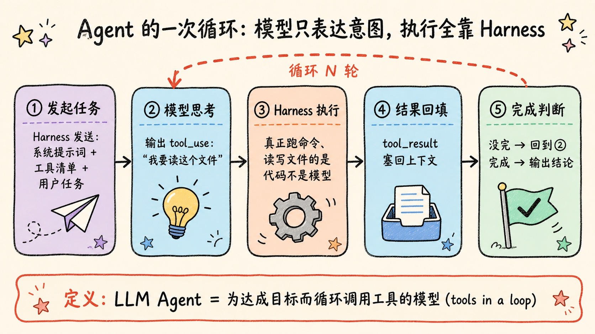
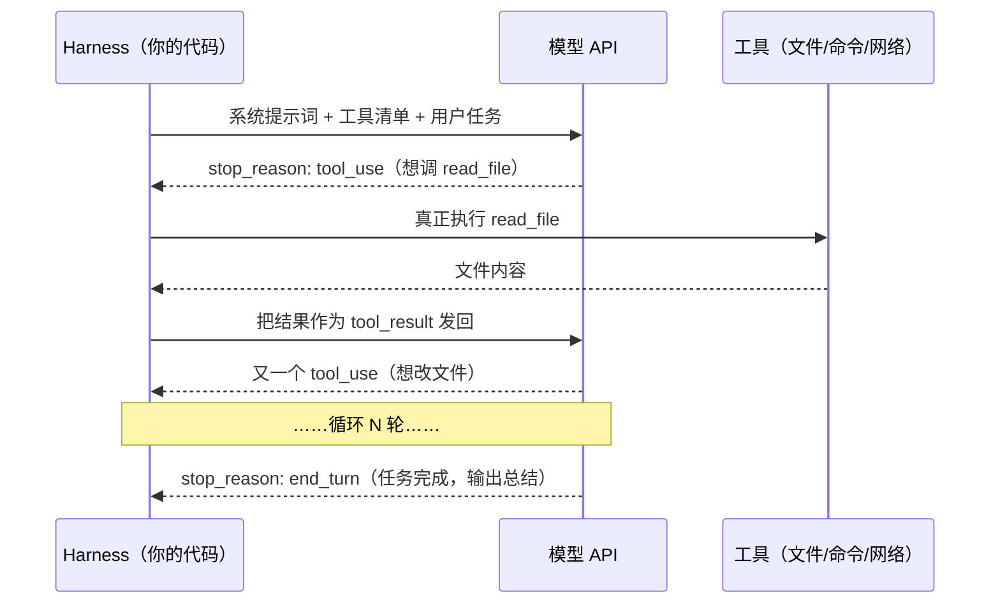
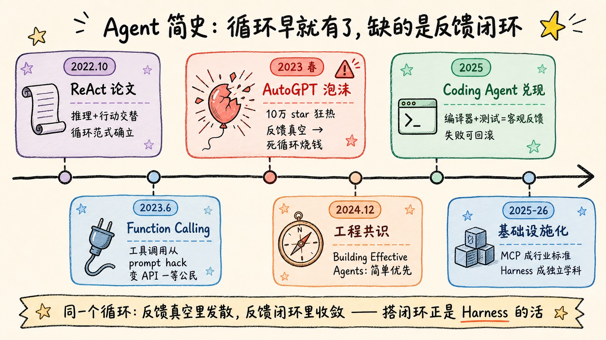
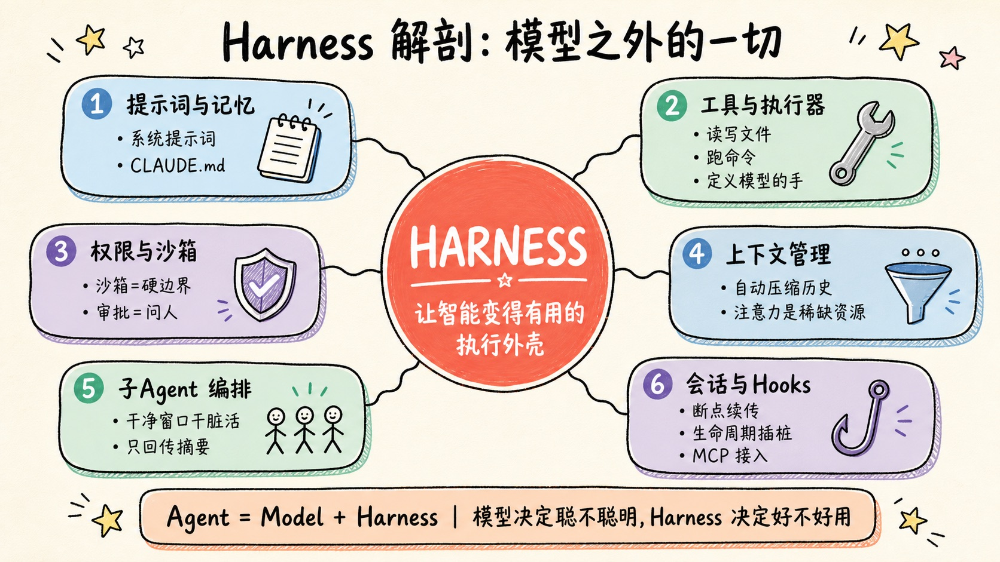
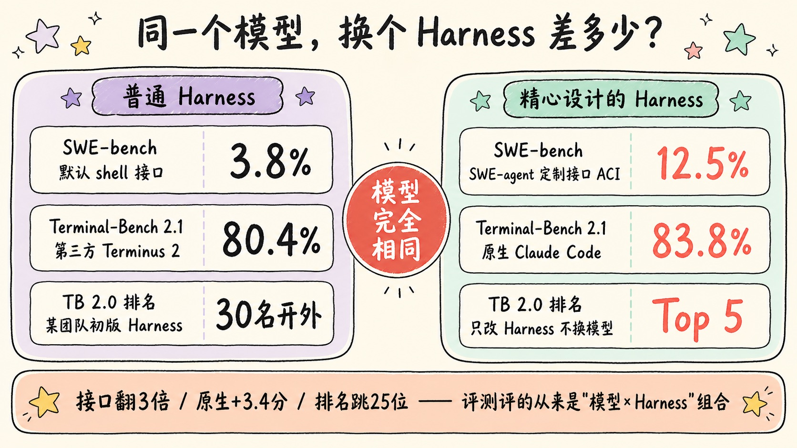
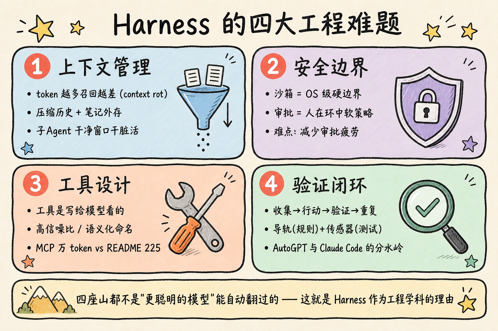
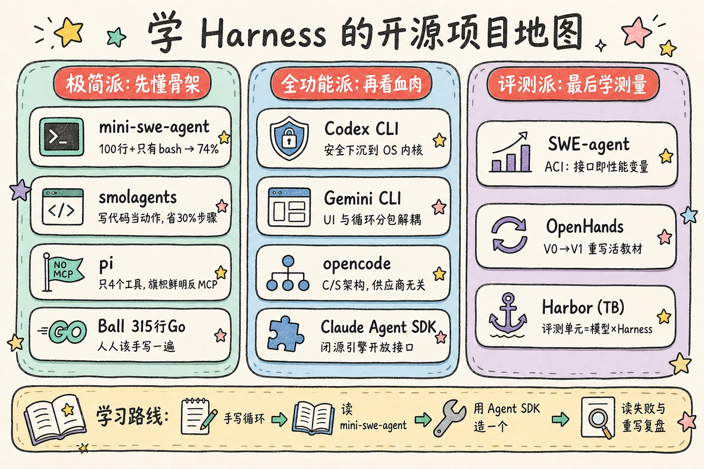

> Agent 的循环三年前就有了，模型也一直在变强，真正把「能跑的 demo」变成「能干活的产品」的，是夹在两者中间、最容易被忽视的那层工程外壳——**Harness**。

---

## 先讲结论

1. **Agent 本质很简单**：一个 LLM 带着工具跑循环（tools in a loop）。Thorsten Ball 用 315 行 Go 代码就写出了一个能改代码的 agent，mini-swe-agent 用约 100 行 Python + 一个 bash 工具就在 SWE-bench Verified 上拿了 74% 以上。裸循环没有护城河。
2. **Harness 是模型之外的一切**：系统提示词、工具执行、权限与沙箱、上下文管理、子 agent、会话恢复……模型提供智能，Harness 决定这份智能能否安全、持续、高效地落在真实世界里。
3. **换 Harness 的影响是可量化的**：同一个模型，SWE-agent 的接口设计让解题率从 3.8% 提到 12.5%；Terminal-Bench 排行榜干脆把「模型 × Harness」当作评测单元。模型和 Harness 正在互相塑造、协同进化。

这篇文章是我博客 Agent 系列的第三篇：第一篇[《如何理解并打造属于你的 AI 智能体》](/posts/ai-agent-guide/)讲 Agent 是什么、怎么搭；第二篇[《智能体时代的软件开发范式》](/posts/agent-native-software/)讲范式迁移。这一篇补上中间缺的那块拼图：**让 Agent 真正能干活的那层壳**。

---

## 一、Agent：一个吵了三年才定清楚的词

"Agent" 这个词曾经混乱到什么程度？Simon Willison（Django 联合创造者、著名技术博主）一度公开拒绝使用它，还在 Twitter 上众筹到了 **211 个互不相同的定义**，归类后发现足足有 13 派，彼此不可调和。

转机出现在 2025 年。Anthropic 工程师 Hannah Moran 在一次开发者活动上给出了一个让 Willison 终于满意的说法，他随后将其提炼为自己的正式定义：

> **"An LLM agent runs tools in a loop to achieve a goal."**
> （LLM Agent 就是为达成目标而循环调用工具的语言模型。）—— Simon Willison, 2025-09

这个定义好在每个词都有着落：

| 关键词 | 含义 | 缺了会怎样 |
|--------|------|-----------|
| **LLM** | 提供推理和决策能力 | 只是普通自动化脚本 |
| **tools** | 读文件、跑命令、搜网页……与外界交互的手 | 只是聊天机器人 |
| **loop** | 行动 → 观察结果 → 再行动，直到完成 | 只是单次函数调用 |
| **goal** | 有明确的完成判据，自己决定何时停 | 只是死循环 |

Anthropic 在《Building Effective Agents》（2024 年 12 月，这个领域的「原典」）里做了一个更工程化的切分：把所有 LLM 自主系统统称 agentic systems，其下分两类——**Workflow** 是让 LLM 沿着你预先写死的代码路径走（提示链、路由、并行、编排者-工人、评估者-优化者五种可组合模式）；**Agent** 则是让 LLM 自己动态决定流程和工具用法。该文最反直觉也最有价值的建议是：**从最简单的方案开始，绝大多数场景 Workflow 就够了，确实需要灵活性再上 Agent**。



### 循环里到底发生了什么

别被「智能体」这个玄乎的翻译唬住，API 层面的机械过程朴素得惊人。LLM 本身是个**无状态的文本函数**——它不会执行任何操作，只会在输出里"表达意图"：



注意图里的主语：解析模型意图的、真正执行工具的、维护对话状态的、决定循环何时继续何时终止的——**全是"你的代码"**。模型只负责在每一轮里回答"下一步该干什么"。这个"你的代码"，就是本文的主角 Harness。这里先按下不表，第四节展开。

---

## 二、一段历史：循环早就有了，为什么 2025 年才真正能用

理解 Harness 为什么重要，最好的方式是回看这条时间线——你会发现**循环从来不是瓶颈**。



**2022 年 10 月，ReAct 论文**（Princeton + Google Brain）。学术界证明了让 LLM 交替生成"推理"和"行动"（Thought → Action → Observation）比单纯推理或单纯行动都强：接上 Wikipedia API 后显著缓解幻觉，在 ALFWorld 任务上成功率绝对提升 34%。「推理与行动交替循环」这个范式从此确立。

**2023 年 6 月，OpenAI 上线 function calling**。在此之前调工具靠 prompt hack——求模型按格式输出、再用正则去捞；此后模型被专门微调过，能稳定输出符合函数签名的 JSON。工具调用从民间偏方变成 API 一等公民。

**2023 年春天，AutoGPT / BabyAGI 泡沫**。AutoGPT 数月内冲破 10 万 GitHub star，人人都在转发"给它一个目标它自己创业"的 demo。但用过的人都知道结局：**陷入死循环原地打转、错一步后面步步错、任务列表自我繁殖停不下来、不按 Ctrl+C 就烧光 API 余额**。事后复盘，失败原因有两个：模型能力没过阈值；更关键的是**没有客观反馈信号**——没有编译器、没有测试，模型全靠自我评价，越评越自信，越自信越错。

**2024 年 12 月，《Building Effective Agents》**。行业冷静下来，工程共识形成：简单优先、Workflow 优先、可验证优先。

**2025 年，Coding Agent 兑现**。Claude Code、Codex CLI 这批终端编码 agent 真正进入日常生产。为什么偏偏是写代码这个场景先跑通？因为它天然满足 Agent 成立的全部条件：

- **动作空间明确**：读写文件、跑命令，就这些；
- **反馈信号客观**：编译器报错、测试红绿、lint 警告——不需要模型自我评价，世界会告诉它对不对；
- **失败可回滚**：有 git，改砸了就 revert。

AutoGPT 缺的恰恰是这三样。同一个循环，放在「反馈真空」里就发散，放在「反馈闭环」里就收敛。**而搭建反馈闭环，正是 Harness 的活儿。**

**2025–2026 年，基础设施化**。MCP（Model Context Protocol）从 Anthropic 的开源项目变成行业事实标准（OpenAI 2025 年 3 月跟进支持，后捐给 Linux Foundation 旗下基金会）；Claude Code SDK 更名 Claude Agent SDK，把驱动 Claude Code 的那套 Harness 开放成通用平台。行业开始把 Harness 当成独立的工程学科来讨论——OpenAI 和 Thoughtworks 的技术雷达都出现了 "Harness Engineering" 这个词。

---

## 三、300 行代码写一个 Agent：亲手拆掉神秘感

2025 年 4 月，Thorsten Ball（《用 Go 写解释器》作者，时任 Sourcegraph 的 Amp 团队工程师）发表了一篇后来被引爆的文章《How to Build an Agent》：**315 行 Go 代码、3 个工具（读文件、列目录、改文件），就得到一个能真正编辑代码的 agent**。他的结论毫不客气——这里没有护城河，需要的只是一个 LLM、一个循环、足够的 token，剩下全是普通的工程活。

用 Python 伪代码表达，最小 Agent 循环长这样（结构上和 Claude Code 没有本质区别）：

```python
# 一个最小可用的 coding agent，任何 LLM API 均可套用
messages = [{"role": "user", "content": task}]

while True:
    resp = llm(
        system="你是编程助手，通过工具完成任务",
        tools=[read_file, list_files, edit_file, run_bash],   # 工具清单（含 JSON Schema）
        messages=messages,
    )
    if resp.stop_reason != "tool_use":
        break                                # 模型不再要工具 → 任务结束

    for call in resp.tool_calls:
        result = execute(call.name, call.args)   # 真正干活的是这行
        messages.append(tool_result(call.id, result))
```

这段代码值得每个想学 Agent 的人亲手写一遍——写完你会获得两个层面的祛魅：

**第一层祛魅：Agent 不神秘。** 循环、分支、字符串拼接，没了。所谓"智能体自主行动"，机械本质是模型每轮输出一个 JSON，你的代码照着执行再把结果塞回去。

**第二层祛魅之后的敬畏：从「能跑」到「好用」隔着一道鸿沟。** 拿这 30 行去干真活，问题立刻扑面而来——

- 模型要 `rm -rf` 你敢直接执行吗？（权限与沙箱）
- 跑了 50 轮，上下文塞满了工具输出，模型开始忘记最初的任务怎么办？（上下文管理）
- 任务跑一半断网了，重来一遍吗？（会话持久化）
- 工具报错了是重试、绕路还是问人？（错误恢复）
- 怎么知道它改完的代码是对的？（验证闭环）

回答这些问题的代码，量级是这 30 行的百倍千倍——**这些代码的总和，就叫 Harness**。

> 顺带一提这条故事线的讽刺弧光：Ball 那篇宣告「循环没有护城河」的文章发表一年后，全行业得出的共识恰恰是——护城河就在他那 315 行**没有写**的部分里。

有个开源项目把这条「极简 vs 深水区」的边界卡得极其精准，值得专门一提：Princeton SWE-agent 团队的 **mini-swe-agent**。约 100 行 Python，**唯一的工具是 bash**，甚至不用模型的 tool-calling 接口（纯文本解析动作），每个动作用独立的 `subprocess.run` 执行（无状态 shell），消息历史只追加不修改——就这么个东西，在 SWE-bench Verified 上做到了 **74% 以上**。它的定位是「基线系统」：把模型的裸能力和 Harness 的贡献剥离开来测量。它证明了强模型配极简 Harness 的下限已经很高；而它和全功能 Harness 之间的分差，恰好就是 Harness 价值的量化标尺。

---

## 四、Harness：模型之外的一切

现在正式给出定义。LangChain 在《The Anatomy of an Agent Harness》（2026 年 3 月）里的表述最干净利落，意译过来是：

> **Harness 是「除了模型本身之外的所有代码、配置和执行逻辑」。模型提供智能，Harness 负责让这份智能变得有用。**

业界现在流行一个公式：**Agent = Model + Harness**。微软的 Agent Framework 文档（2026 年已经直接内置了名为 `HarnessAgent` 的类）说得更具体：Harness 驱动整个循环——调模型、执行模型要求的工具、管理对话历史让模型不超上下文限制、在行动前套用审批与安全策略、推着任务走向完成。

### 这个词从哪来的

Harness 本义是**马具、挽具**——把马套进马车的那套装置。马有力气，但没有挽具，马力变不成拉力。软件圈更近的来源是 **test harness**（测试挂具）：包住被测代码、喂输入、收输出、断言结果的那套框架。两个词源指向同一个隐喻：**被包住的核心（马 / 被测代码 / 模型）提供原始能力，包住它的装置负责把能力对准目标、变成产出。**

中文语境我见过「执行框架」「脚手架」「驾驭层」几种译法，都不算贴切（顺带一说，「脚手架」这个词我在[《代码里的脚手架》](/posts/scaffolding-in-code/)里写过另一层意思——那种搭完要拆的临时代码；而 Harness 恰恰是**不拆的、常驻的**那层）。本文遵循博客一贯规范，直接用英文原词。

### 顺手澄清三个近义词

| 术语 | 侧重 | 典型语境 |
|------|------|---------|
| **Harness** | 执行层：跑循环、执行工具、决定何时停 | Claude Code、Codex CLI 这类产品 |
| **Scaffold** | 行为定义层：系统提示词、工具描述、输出解析 | SWE-bench 时代的学术用语（"agent scaffolding"） |
| **Agent Framework** | 给开发者造 Harness 用的库 | LangChain、Claude Agent SDK、MS Agent Framework |

实践中 Harness 和 Scaffold 大多混用（Hugging Face 的术语表做过上面这种细分：scaffold 偏「定义行为」，harness 偏「执行行为」），基准测试社区偏爱 scaffold，工业界自 Claude Code / Codex 流行后基本统一说 harness。看文章时知道它们指的是同一坨东西就行。

### 解剖：Harness 里到底有什么

把 Claude Agent SDK 的能力清单、微软 HarnessAgent 的组件包、LangChain 的解剖文对照着读，会发现三家列的东西高度一致。我把它们合并成一张图和一张表：



| 组件 | 干什么 | 以 Claude Code 为例 |
|------|--------|---------------------|
| **系统提示词 + 记忆文件** | 定义身份、规范、项目约定 | 内置提示词 + `CLAUDE.md` / `AGENTS.md` |
| **工具集与执行器** | 定义模型有哪些手，并真正执行 | Read / Edit / Bash / Glob / WebFetch…… |
| **循环控制** | 何时继续、何时停、失败重试 | 模型输出 `end_turn` 前持续执行 |
| **权限系统** | 哪些操作自动放行、哪些要问人 | allow/deny 规则、permission modes |
| **沙箱** | 技术性硬边界，防出圈 | macOS Seatbelt / Linux bubblewrap |
| **上下文管理** | 窗口逼近上限时压缩历史 | 自动 compaction、`/compact`、`/context` |
| **子 Agent** | 用干净上下文做子任务，只回传摘要 | Task/Agent 工具、subagents |
| **Hooks** | 在生命周期关键点插入自定义代码 | PreToolUse / PostToolUse hooks |
| **MCP 客户端** | 标准化接入外部工具 | `claude mcp add ...` |
| **会话管理** | 断点续传、分叉、回放 | `--resume`、session 持久化 |

一个有意思的观察角度：**你每天用 Claude Code 时抱怨或惊喜的那些点，几乎全是 Harness 层的，而不是模型层的**。「它每次都先问我能不能跑命令好烦」是权限系统；「上下文快满了它自动总结了一下」是 compaction；「它派了三个子任务并行去搜代码」是子 agent 编排。模型决定聪不聪明，Harness 决定好不好用。

Anthropic 的工程博客把 Harness 的设计哲学浓缩成一句话，意译过来是：**给你的 Agent 一台计算机，让它像人一样工作**。文件系统就是它的长期记忆，bash 就是它的万能手，编译器和测试就是它的现实检验。这也解释了为什么 2025 年之后的主流 Harness 长得越来越像「一个受控的终端环境」，而不是 2023 年流行的「向量数据库 + 规划器 + 记忆模块」那种乐高积木——AutoGPT 团队自己后来也把向量数据库从记忆方案里移除了，本地文件就够。

---

## 五、证据：同一个模型，换个 Harness 能差多少

「Harness 很重要」不能只是嘴上说说，好在这件事**可以量化**。



**证据一：SWE-agent 论文（NeurIPS 2024）——3.8% 到 12.5%。** Princeton 团队提出 ACI（Agent-Computer Interface，Agent-计算机接口）概念：**Agent 需要的界面和人类不一样**。人类用 vim 滚屏看文件很舒服，模型需要的是「一次 100 行的窗口 + 明确的行号」；人类能从 3000 行 grep 输出里扫到重点，模型会被淹死，需要输出精简的专用搜索；模型编辑文件容易改错行，编辑命令就该内置 lint 即时反馈。仅凭这套接口设计，GPT-4 Turbo 在 SWE-bench 上的解题率从此前最好的 3.8% 提到 12.5%——**3 倍多，模型一个字没动**。

**证据二：Terminal-Bench——直接把 Harness 当一等公民变量。** 这个基准（评测 agent 在真实终端环境里完成任务的能力）的排行榜条目不是模型，而是 **(Harness, 模型) 二元组**。官方明说：同一个模型配不同 Harness，得分就是不同的。2026 年中的 2.1 版榜单快照很说明问题：

| Harness + 模型 | 得分 |
|----------------|------|
| Claude Code + Claude 5 Fable | 83.8% |
| Codex CLI + GPT-5.5 | 83.1% |
| Terminus 2 + Claude 5 Fable | 80.4% |

同一个 Claude 5 Fable，从自家 Claude Code 换到第三方 Terminus 2，掉 3.4 个百分点。前端工程师 Addy Osmani 还记录过一个更夸张的案例：一支队伍在 Terminal-Bench 2.0 上从 30 名开外冲进前 5，**模型完全没换，只改了 Harness**。

**证据三（也是最深的一层）：模型和 Harness 在协同进化。** 注意上面榜单里一个细节：两家的模型都是在**自家 Harness** 里得分最高。这不是巧合。Nicolas Bustamante 在《Model-Harness Fit》里点破了机制，意译过来是：**模型的后训练（post-training）是对着 Harness 做的，不只是对着 API**——Claude 的强化学习环境里就有 Claude Code 的工具集，模型学会的不是抽象的「调用工具」，而是具体的「在这套工具、这种提示词、这类反馈下干活」。把模型从原生 Harness 里拔出来，就会损失一部分拿不回来的性能。

反方向同样成立：Harness 也在追着模型改。据 YC 播客访谈的转述，Claude Code 创造者 Boris Cherny 的团队在某代新模型发布后，删掉了系统提示词的 80% 以上——因为新模型不需要那些手把手的叮嘱了，留着反而碍事。每一代模型的行为都不同，Harness 得跟着重新校准。

> 公允起见记一笔反方观点：Thorsten Ball 认为这个循环的因果起点在模型侧——是 Claude 3.5 那一代突然变强的工具调用能力和「主动想干活」的倾向引爆了 agent 时代（他用了个德语词 Urknall，宇宙大爆炸），Harness 是跟上来的。我的理解是两边都对：**点火靠模型，续航靠 Harness，现在两者已经进入互相塑造的螺旋**。

对我们普通使用者，这一节的实用推论有三条：

1. **评测「某某模型好不好用」时，你评的其实是「模型 × Harness」的组合**，别把 Harness 的锅扣给模型，反之亦然；
2. **优先在模型的原生 Harness 里用它**（Claude 配 Claude Code，GPT 配 Codex CLI），跨着用要接受折损；
3. **看排行榜先看 Harness 列**，只报模型名的评测结论要打折听。

---

## 六、Harness 的四大工程难题

如果说第三节的 30 行代码是「能跑」，那从「能跑」到「能用」要翻四座山。这也是各家 Harness 真正拉开差距的地方。



### 难题一：上下文管理——最稀缺的资源不是算力，是注意力

Anthropic 在《Effective Context Engineering for AI Agents》里给这个问题定了性：上下文窗口不是越大越随便用——token 越多，模型对其中每条信息的召回精度越低（业内称 **context rot**，上下文腐蚀）；注意力机制的成对计算意味着存在一个「注意力预算」，每塞进一个 token 都在消耗它。所以目标不是塞满，而是**找到能最大化目标达成概率的最小高信号 token 集**。

一个长任务跑下来，Harness 在上下文上的操作贯穿始终，主流手段四种：

- **Compaction（压实）**：窗口逼近上限时，把历史总结成摘要——保留架构决策和未解的 bug，扔掉那些已经没用的工具输出。Claude Code 的自动 compaction 就是这个。
- **结构化笔记**：把记忆写到上下文**之外**的文件里（`NOTES.md`、todo list），要用再读回来。
- **子 Agent**：让子 agent 用全新的干净窗口去干探索性脏活（比如全库搜索），只把浓缩结论带回主窗口。Anthropic 自家的多 agent 研究系统靠这招在内部评测上比单 agent 提升 90%——代价是 token 消耗约为普通聊天的 15 倍。
- **按需检索**：不预载数据，只在上下文里留轻量标识符（文件路径、查询语句），运行时用工具现查。「文件系统就是无限外存，上下文只放工作集」——是不是很像操作系统的虚拟内存？

### 难题二：安全边界——沙箱管硬的，审批管软的

模型要执行 `rm -rf`、要 `git push --force`、要访问陌生域名，Harness 怎么办？成熟方案全都是**双层设计**：

- **沙箱 = 技术硬边界**。Claude Code 在 macOS 上用系统自带的 Seatbelt 框架、Linux 上用 bubblewrap + 网络代理；Codex CLI 同样是 macOS Seatbelt + Linux 内核级机制。默认只能写工作目录、网络走域名白名单，是 OS 层强制的，模型「说服」不了它。
- **审批 = 人在环中的软策略**。出圈操作（新域名、危险命令、白名单外的写入）触发询问，用户可以放行一次、永久放行或拒绝。

OpenAI 的 Codex 文档有句话把分工讲得很清楚，意译过来是：**沙箱定义技术边界；审批策略决定 Agent 在越界之前，何时必须停下来问人**。好 Harness 的功力体现在减少「审批疲劳」——问得太多用户会烦到无脑点 yes（等于没问），问得太少又危险。Claude Code 甚至做了凭证掩码：沙箱里的命令看到的是占位符，真实密钥只在代理层对白名单主机替换注入，模型全程摸不到真值。

### 难题三：工具设计——工具是写给模型看的，不是写给人看的

Anthropic 的《Writing Effective Tools for Agents》提出了一个别扭但深刻的视角：传统软件接口是**确定性系统之间的契约**，而工具是**确定性系统与非确定性 Agent 之间的新型契约**——同样的输入，模型可能不调用、调错、或理解错你的工具。所以写工具更像写 prompt：

- 覆盖高价值工作流，而不是给每个 API endpoint 都包一层（工具越多效果未必越好）；
- 返回高信噪比内容：语义化命名（`name` 优于 `uuid`）、分页、截断；
- 工具描述值得像打磨 prompt 一样打磨——一句话的措辞差异可能带来巨大的行为差异。

这个领域还有场值得围观的路线之争。**MCP 派**（goose 是代表，扩展系统整个就是 MCP）主张标准协议接万物；**反 MCP 派**的代表 Mario Zechner（libGDX 作者，独立打造了 agent 工具箱 pi）写过一篇《What if you don't need MCP at all?》，算了一笔账：一个常驻的 MCP server 光工具定义就吃掉 1.3 万~1.8 万 token 的上下文，而他用「README + 现成 CLI 脚本」达到同样效果只花约 225 个 token，且按需加载。Simon Willison 也持类似立场：与其接 MCP，不如写好 `AGENTS.md` 文档、依赖模型本来就会用的 CLI 工具。我的看法：MCP 赢在标准化和生态（远程服务、鉴权、非技术用户），README+CLI 赢在 token 效率和透明度，coding 场景后者常常够用——这恰好又呼应了整个领域「简单优先」的元规律。

### 难题四：验证闭环——Agent 的可靠性来自「能自查」

Claude Agent SDK 把 agent 循环归纳为四拍：**收集上下文 → 采取行动 → 验证工作 → 重复**。第三拍最容易被业余 Harness 省略，而它恰恰是 AutoGPT 与 Claude Code 的分水岭（回看第二节：反馈真空 vs 反馈闭环）。

Thoughtworks 的 Birgitta Böckeler 给验证体系做过一个漂亮的分类——**前馈的「导轨」+ 反馈的「传感器」**：导轨是写在前面的规则、文档、架构约束，引导模型少犯错；传感器是 linter、类型检查、测试、AI 审查器，在犯错后立刻报警。OpenAI 内部一个团队的实验（据其 Harness Engineering 博文及转述，数字未经独立核实）把这套东西推到极致：约 5 个月、约 100 万行 beta 产品代码零手写，3 名工程师人均日合 3.5 个 PR——他们的经验总结几乎全是 Harness 工程：`AGENTS.md` 保持 100 行以内当目录用、架构分层靠自定义 linter 和结构化测试**机械强制**（而非 code review 口头约定）、UI 改动让 agent 自己开浏览器验证。人类的角色浓缩成一句话：**人类掌舵，Agent 执行**。

> 这四大难题有个共同点：都不是「更聪明的模型」能自动解决的。模型再强，也替代不了沙箱的硬边界、替代不了测试的客观反馈、替代不了上下文窗口的物理限制。这就是 Harness 作为独立工程学科存在的理由。

---

## 七、开源项目地图：学 Harness 该读什么代码

Harness 的知识大多不在论文里，而在开源代码里。下面这张图谱是我按「设计哲学」整理的（star 数为 2026 年 8 月初的约数，可能变动；重点看每个项目教你的那一课）：



### 极简派：先懂骨架

| 项目 | 语言/规模 | ~Stars | 一句话 Harness 课 |
|------|----------|--------|------------------|
| [mini-swe-agent](https://github.com/SWE-agent/mini-swe-agent) | Python，~100 行 | 6k | 只给 bash 也能上 74%（SWE-bench Verified）；无状态 shell + 只追加的线性历史 = 天然可调试、可复现 |
| [smolagents](https://github.com/huggingface/smolagents)（Hugging Face） | Python，核心 ~1000 行 | 29k | 让模型**写代码作为动作**而非 JSON 工具调用——一段代码能组合多个工具+控制流，官方称平均减少约 30% 步骤 |
| [pi](https://github.com/earendil-works/pi)（Mario Zechner） | TypeScript | 85k | 只内置 4 个工具，其余靠扩展；旗帜鲜明不做 MCP，用 README+CLI 省上下文 |
| Thorsten Ball 的 [How to Build an Agent](https://ampcode.com/notes/how-to-build-an-agent) | Go，315 行 | —（文章） | 循环本身没有护城河——这是每个人都该亲手写一遍的「Hello World」 |

### 全功能派：再看血肉

| 项目 | 语言 | ~Stars | 一句话 Harness 课 |
|------|------|--------|------------------|
| [Codex CLI](https://github.com/openai/codex)（OpenAI） | Rust | 104k | 安全边界下沉到 OS 内核：macOS Seatbelt / Linux 内核级隔离，默认禁网 |
| [Gemini CLI](https://github.com/google-gemini/gemini-cli)（Google） | TypeScript | 106k | `packages/cli`（交互层）与 `packages/core`（循环+工具调度）分包——UI 与 Harness 解耦的清晰教材 |
| [opencode](https://github.com/anomalyco/opencode) | TypeScript | 194k | client/server 架构：TUI 只是客户端之一；对接数十家模型商，证明 Harness 可与供应商彻底解耦 |
| [goose](https://github.com/block/goose)（Block） | Rust | 52k | MCP 原生：扩展系统就是 MCP，Harness 本体退化为「MCP 客户端 + 循环」 |
| [Cline](https://github.com/cline/cline) | TypeScript | 66k | Plan/Act 双模式（先只读规划再动手）+ 每步审批——「权限即产品」的代表 |
| [Claude Agent SDK](https://github.com/anthropics/claude-agent-sdk-python)（Anthropic） | Python/TS | 8k | Claude Code 本体闭源，但把它的 Harness（工具、权限、子 agent、hooks、MCP）开放成可编程平台——「闭源引擎、开源接口」 |

### 研究与评测派：最后学测量

| 项目 | 语言 | ~Stars | 一句话 Harness 课 |
|------|------|--------|------------------|
| [SWE-agent](https://github.com/SWE-agent/SWE-agent)（Princeton） | Python | 20k | ACI 概念出处：接口设计本身就是性能变量（3.8%→12.5%） |
| [OpenHands](https://github.com/All-Hands-AI/OpenHands)（前 OpenDevin） | TS/Python | 83k | 架构演化的活教材：V0 的 pub/sub 事件流因难调试被 V1 推翻，改为同步执行 + 事件溯源，官方称系统级故障降 61% |
| [Harbor / Terminal-Bench](https://github.com/harbor-framework/harbor) | Python | 4k | 把 (Harness, 模型) 当评测单元；想理解「Harness 影响可量化」，读它的任务与计分设计 |

### 三条「考古」备注（帮你避开过时资料）

- **Roo Code 已于 2026 年 5 月归档**（Cline 的分叉，约 24k star 定格），团队转向云端 agent——可视为「IDE 插件形态退潮」的注脚；
- **Aider**（48k star，repo map 和多种 edit format 的开创者）2026 年年中起提交明显放缓，但它「用自建 benchmark 驱动每个 Harness 决策」的实验文化仍然是典范；
- 一批项目在 2026 年迁移过：sst/opencode → anomalyco/opencode，badlogic/pi-mono → earendil-works/pi，terminal-bench 团队重组为 harbor-framework。搜旧文时注意重定向。

---

## 八、动手路线：五步从用户变成理解者

供想系统学习的你（和未来的我自己）参考，按序渐进：

**第一步：手写最小循环（一个下午）。** 照着 Thorsten Ball 的文章，用你熟悉的语言写一个 3 工具 agent。不要复制粘贴，一行行自己敲——祛魅效果最好的一步。

**第二步：读 mini-swe-agent 源码（一个晚上）。** 100 行，读完你会明白「无状态 shell」「线性历史」这些设计决策为什么让系统好调试。对照着想：它砍掉了什么？砍掉的东西里哪些是你需要的？

**第三步：带着 X 光眼用日常工具（持续）。** 下次用 Claude Code 时换个视角：`/context` 看看上下文里都装了什么、compaction 什么时候触发、权限询问的粒度怎么设计、子 agent 何时被派出。你在用的就是业界最强 Harness 之一，它本身就是教材。我在[《Claude Code + Codex 协作开发心得》](/posts/claude-code-codex-workflow/)里写过的双 agent 工作流，本质上就是在利用两个 Harness 的不同长处。

**第四步：用 Claude Agent SDK 造一个自己的 agent（一个周末）。** 站在成熟 Harness 上定制：自定义工具、hooks、子 agent。体会「拿到一套现成的循环+权限+上下文管理」比第一步的裸循环省了多少事——省掉的部分就是 Harness 的价值。

**第五步：读一篇失败复盘 + 一篇成功复盘。** 失败读 AutoGPT 的历史（反馈真空里循环如何发散），成功读 OpenHands V0→V1 的重写记录（事件流架构为何被推翻）。Harness 设计的品味，一半来自看别人踩坑。

---

## 总结

1. **Agent = 模型带着工具跑循环**，定义已经收敛（tools in a loop to achieve a goal），最小实现 300 行，本质不神秘；
2. **Harness = 模型之外的一切**：工具执行、权限沙箱、上下文管理、验证闭环、会话编排——模型决定聪明程度，Harness 决定可用程度;
3. **Harness 的影响可量化**：接口设计能让同一模型解题率翻 3 倍，换 Harness 能让排名差 25 位，评测和选型都必须看「模型 × Harness」组合；
4. **两者在协同进化**：模型对着 Harness 做后训练，Harness 追着模型代际重写；点火靠模型，续航靠 Harness。

如果只带走一句话：**模型是发动机，Harness 是整台车——而我们已经进入比拼整车工程的时代。买车的人别只看发动机参数，造车的人也别只堆马力。**

---

**参考阅读**：

- [Building Effective Agents — Anthropic](https://www.anthropic.com/engineering/building-effective-agents)：agentic 系统的分类学原典
- [How to Build an Agent — Thorsten Ball](https://ampcode.com/notes/how-to-build-an-agent)：315 行 Go 的最小实现
- [The Anatomy of an Agent Harness — LangChain](https://www.langchain.com/blog/the-anatomy-of-an-agent-harness)：Harness 组件解剖
- [Agent Harnesses — Microsoft Agent Framework](https://learn.microsoft.com/en-us/agent-framework/agents/harness)：Harness 的产品化定义
- [SWE-agent: Agent-Computer Interfaces Enable Automated Software Engineering](https://arxiv.org/abs/2405.15793)：ACI 概念与 3.8%→12.5% 的证据
- [Effective Context Engineering for AI Agents — Anthropic](https://www.anthropic.com/engineering/effective-context-engineering-for-ai-agents)：上下文管理四大技术
- [Writing Effective Tools for Agents — Anthropic](https://www.anthropic.com/engineering/writing-tools-for-agents)：工具设计五原则
- [How Coding Agents Work — Simon Willison](https://simonwillison.net/guides/agentic-engineering-patterns/how-coding-agents-work/)：coding agent 工作原理综述
- [Model-Harness Fit — Nicolas Bustamante](https://nicolasbustamante.com/blog/model-harness-fit)：模型-Harness 协同进化
- [Agent Harness Engineering — Addy Osmani](https://addyosmani.com/blog/agent-harness-engineering/)：Harness 工程实践清单
- [What if you don't need MCP at all? — Mario Zechner](https://mariozechner.at/posts/2025-11-02-what-if-you-dont-need-mcp/)：反 MCP 派的 token 账本
- [Harness engineering for coding agent users — martinfowler.com](https://martinfowler.com/articles/harness-engineering.html)：导轨与传感器框架
- [Terminal-Bench](https://www.tbench.ai/)：把 (Harness, 模型) 当评测单元的基准
