> 过去五十年，我们写软件的方式只有一种：**人把解法想清楚，翻译成机器能精确执行的指令。**
>
> 现在出现了第二种：**人把目标说清楚，把「怎么做」的决策权，交给一个会推理的智能体，在运行时自己生成解法。**
>
> 这不是多了一个框架，而是控制流的所有权，第一次从「编译期的人」转移到了「运行期的模型」。本文想讲清楚这件事的第一性原理——以及它为什么不可逆。

---

## 先讲结论

如果你只有三分钟，记住这三句：

1. **Agent 范式的本质，是控制流的迁移**。传统软件的控制流（先做什么、再做什么、遇到 X 怎么办）在**编译期由人写死**；Agent 软件的控制流在**运行期由模型动态生成**。一切差异都从这一条派生。
2. **LLM 是新的「CPU」，但它是一颗没有外设的裸核**。它能推理，却无状态、无记忆、不能行动。Agent 架构里的每一个组件——记忆、工具、规划、反思、观察——都是在给这颗裸核外接「主板、内存、IO」，把一个纯函数变成一个能与世界闭环的自主系统。
3. **开发 Agent 更像招聘和培养一个员工，而不是编写一个程序**。你定义岗位（Role）、下达目标（Goal）、给资料（Knowledge）和权限（Tool）、教流程（Planning）、让他干（Execution）、看结果（Observation）、带复盘（Reflection）、让他积累经验（Memory）。你管理的是行为，而不是指令。

下面从第一性原理，一章一章拆开。

---

## 一、为什么 Agent 正在改变软件开发

### 先问一个最笨的问题：软件到底是什么

抛开所有术语，软件的本质是一句话：**把人脑里的解法，固化成机器可以重复执行的指令序列。**

你会用 Python，会用 Java，会用 C++——但这些语言在做同一件事：让你把「如何解决一个问题」的思考过程，翻译成 CPU 能一步步照做的确定性步骤。`if` 是你预判的分支，`for` 是你预设的重复，函数是你封装的子解法。

这里有一个被我们视为理所当然、却极其关键的前提：

> **在写代码这一刻，你必须已经知道解法。** 机器不负责「想」，机器只负责「执行你想好的」。

过去五十年的一切——结构化编程、面向对象、设计模式、微服务、DevOps——都是在优化「人如何更高效、更可靠地把解法翻译成指令」这一件事。工程学的重心始终在**翻译的质量**上，而不在**谁来想解法**上。想解法的，永远是人。

### 为什么过去只能这样

因为在 LLM 之前，**世界上唯一能可靠执行逻辑的东西是 CPU，而 CPU 只认确定性指令。** 机器听不懂「帮我把这个 bug 修了」，它只听得懂「将寄存器 EAX 加 1」。

于是人被迫承担了全部的「理解模糊意图 → 拆解 → 转成精确步骤」的工作。这段翻译，是软件工程里最贵、最难自动化的部分。我们发明了需求文档、架构评审、伪代码、TDD，本质都是在辅助人类完成这段翻译，因为**这段翻译此前没有任何机器能替我们做。**

用一个类比：过去的软件，是一条**预先铺好的铁轨**。你把每一寸轨道、每一个道岔都焊死；火车（运行时）能做的只有一件事——沿着你焊好的轨道走。轨道没铺到的地方，火车寸步难行。这就是为什么「未考虑的边界情况」是一切 bug 的源头：铁轨思维要求你在铺轨时穷举所有路况，而现实的路况是穷举不完的。

### 为什么现在变了

变量只有一个：**LLM 是人类历史上第一个「能理解模糊自然语言目标、能做常识推理、能生成计划」的通用计算组件。**

它第一次把那段「只有人能做的翻译」——从意图到计划到动作——变成了一个**可以被程序调用的函数**。

这句话值得停下来品一下。这意味着：

- 你不再需要在编译期穷举所有分支。你可以在运行期，把当前情况丢给模型，让它**现场决定**下一步做什么。
- 控制流不再必须写死。它可以**被生成**。

回到类比：Agent 不再是铁轨上的火车，而是一个**会看地图、会自己找路的司机**。你只告诉他目的地（Goal），路怎么走由他在路上根据实时路况决定。前方修路？他绕行。这在铁轨范式里是不可想象的——铁轨不会自己长出一段绕行道。

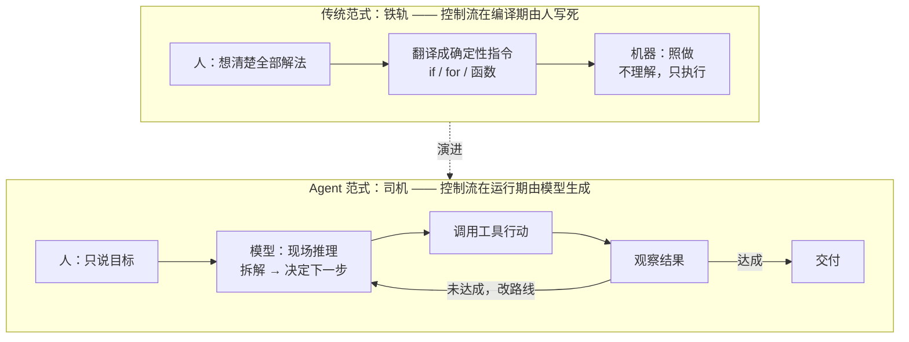

### 这带来的是「量变」还是「质变」

是质变。判据很简单：**能做的事的种类变了，而不只是效率变高了。**

传统自动化擅长处理**结构化、可预先建模**的任务：报表、CRUD、ETL。一旦任务变得「模糊、开放、需要临场判断」——比如「读懂这段没人写文档的祖传代码然后加个功能」「看着报错自己 debug」「根据一封含糊的邮件安排一场会」——传统范式就会崩溃，因为你无法在编译期把这些路况全焊进铁轨。

Agent 恰好吃的就是这类任务。它把软件能触及的边界，从「可预先建模的确定性世界」扩展到了「需要临场推理的模糊世界」。这是软件能力版图的一次扩张，不是同一版图里的提速。

### 放到五十年的尺度上看：三个编程时代

如果把这件事放进更长的历史里，你会看到一条清晰的主线——**「解法由谁产生、在何时产生」这个权力，一直在往后、往上移动。**

| 时代 | 代表 | 人做什么 | 机器做什么 | 解法在何时确定 |
|------|------|---------|-----------|--------------|
| **Software 1.0** | C / Java / Python | 亲手写下每一条逻辑 | 精确执行人写的指令 | 编译期，由人 |
| **Software 2.0** | 深度学习 | 设计架构、喂数据 | 从数据里**学出**一个函数 | 训练期，由数据 |
| **Software 3.0** | LLM / Agent | 描述目标、给工具与边界 | 运行时**推理生成**解法 | 运行期，由模型 |

这三个时代不是互相取代，而是层层叠加——今天的 Agent 系统里，执行层是 1.0 的确定性代码，感知层可能用 2.0 的模型，决策层是 3.0 的推理。但主线毋庸置疑：**从「人在编译期写死解法」，到「数据在训练期决定解法」，再到「模型在运行期现生成解法」。** 解法的产生时刻，一路从「最早、最死」推向了「最晚、最活」。

为什么「最晚才确定解法」是好事？因为**信息在时间上是递增的**。编译期你掌握的信息最少（你在猜未来会发生什么），运行期你掌握的信息最多（真实情况已经摆在面前）。把决策推迟到信息最充分的那一刻做出，本就是更优的策略——只是过去没有任何东西能在运行期「现想」，现在 LLM 能了。这是 Agent 范式在信息论意义上的正当性。

> **一句话总结第一章**：不是 Agent 比传统软件「更好」，而是它们解决的是**过去软件根本解决不了的一类问题**——那些解法必须在运行时才能确定的问题。

---

## 二、什么是 Agent：为什么 ChatGPT 不是完整的 Agent

### 一个最小可用的定义

市面上对 Agent 的定义有几十种，但从第一性原理看，一个 Agent 必须同时具备三个能力，缺一不可：

1. **感知（Perceive）**：能获取环境的当前状态——读文件、看报错、拿到 API 返回、读传感器。
2. **决策（Decide）**：能基于状态和目标，推理出下一步该做什么——这是 LLM 提供的核心。
3. **行动（Act）**：能对环境施加改变——写文件、调 API、下单、发消息。

三者首尾相连，构成一个**闭环**：行动改变了环境，感知到新状态，再决策再行动，直到目标达成。这个闭环，就是「自主」二字的全部秘密。

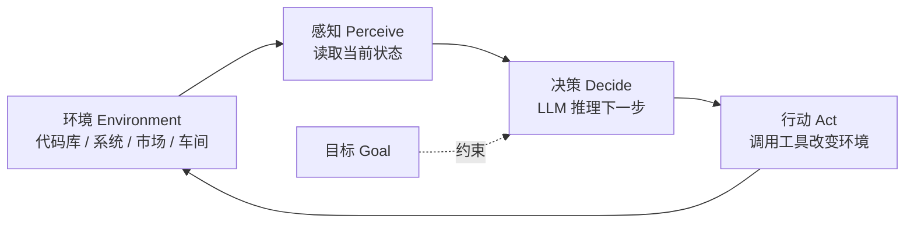

用一个更硬的类比：这就是控制论里的**反馈控制回路**。传统程序是**开环控制**——按下按钮，走完预设流程，不管结果对不对。Agent 是**闭环控制**——它持续测量「当前状态与目标的偏差」，并用行动去缩小这个偏差。搞自动化和控制的工程师对这张图会心一笑：这不就是 PID 吗？只不过把「比例-积分-微分」这个固定的控制律，换成了一个**会推理的、能处理非结构化反馈的 LLM 控制器**。

### 为什么 ChatGPT（裸的对话）不是完整的 Agent

因为它只有第 2 步（决策），缺了第 1 步和第 3 步与环境的**真实闭环**。

裸的 LLM 对话是这样的：你给一段文字，它回一段文字。它：

- **无状态**：这一轮不知道上一轮，除非你把历史再喂一遍。它没有真正的记忆，只有一个每次都要重新加载的上下文窗口。
- **不能行动**：它能告诉你「你应该运行 `npm install`」，但它自己跑不了。它对真实世界是**只读的，甚至只写文本**。
- **感知受限**：它只能看到你贴进对话框的东西。它不能主动去 `ls` 一个目录、不能主动去点开一个报错。

所以裸 LLM 更像一颗**离体的大脑皮层**：推理能力惊人，但没有眼睛、没有手、没有海马体（长期记忆）、没有前额叶的执行控制。它能想，但不能做；能建议，但不能负责。

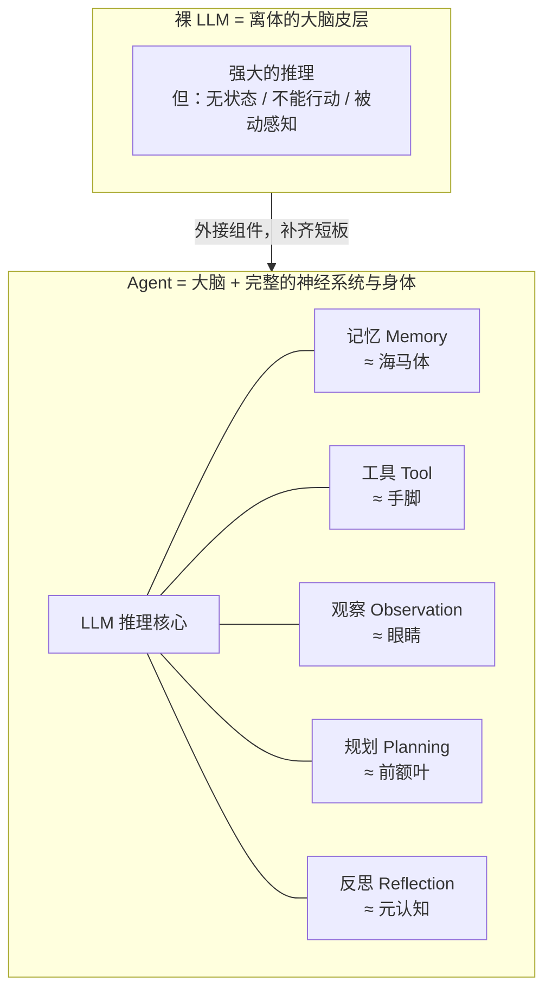

### 为什么「Agent 这样设计」是被 LLM 的短板逼出来的

这是理解整个 Agent 架构最关键的一句话：

> **Agent 架构里的每一个组件，都不是为了炫技，而是在补 LLM 的一个具体短板。**

| LLM 的固有短板 | 被逼出来的组件 | 补的是什么 |
|---------------|--------------|-----------|
| 无状态、会忘 | Memory | 给它一个跨轮次、跨会话的状态存储 |
| 不能行动、只能吐字 | Tool + Function Calling | 给它一双能改变世界的手 |
| 知识停在训练截止日、不知道你的私有数据 | Knowledge + RAG | 在回答前把外部事实检索进上下文 |
| 一步推理长任务会跑偏 | Planning | 逼它先拆解再执行，把大任务切成可验证的小步 |
| 会自信地犯错、不会自查 | Reflection | 给它一个「检查自己刚才做得对不对」的元认知回路 |
| 对行动的真实结果一无所知 | Observation | 把行动的真实反馈喂回去，形成闭环 |

看懂这张表，你就看懂了后面所有章节。**Agent 不是「LLM 加了一堆功能」，而是「围绕 LLM 这颗裸核，用工程手段补齐它成为一个自主体所缺的一切」。**

### 自主性是有光谱的

不是「是 Agent / 不是 Agent」的二元判断，而是一条连续光谱。业界常用一个分级（改编自 Anthropic 对 workflow 与 agent 的区分）：

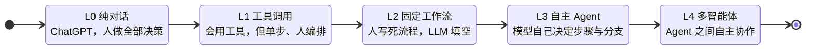

一个关键的工程判断：**不是层级越高越好。** L2 的固定工作流（人写死流程、LLM 只在每步填空）在**可预测性、成本、可调试性**上远胜 L3。真正的高手不是逢任务必上 L4，而是**为每个任务选择恰好够用的自主层级**——能用 workflow 解决的，绝不上 full agent。这一点，我们在第九章会重新回来。

用一个例子体会这条光谱。同样是「把用户邮件分类并回复」：

- **L1**：你手动把邮件贴给模型，让它拟一个分类和回复草稿，你复制出去发。模型只是个高级文本工具。
- **L2**：你写死一个流程——收到邮件 → 调模型分类 → 按分类走固定的回复模板 → 你审核后发送。流程是你定的，模型只在「分类」这一个节点上填空。稳定、便宜、好调试。
- **L3**：你只给目标「妥善处理收件箱」，Agent 自己决定：这封该分类、那封该查订单再回、另一封拿不准该转人工。步骤由它临场生成。
- **L4**：处理复杂投诉时，它把「查物流」委托给物流 Agent、把「算赔偿」委托给财务 Agent，协调多方给出方案。

同一个任务，四种自主度，成本和风险逐级上升。**大多数生产场景的最优解是 L2 或「L2 为主、局部 L3」**——而不是一上来就 L4。记住这个例子，它会帮你在第九章抵御「什么都想让 Agent 全自主」的冲动。

> **一句话总结第二章**：Agent = 感知 + 决策 + 行动的闭环。ChatGPT 只有决策，缺了与真实环境的闭环，所以它是「离体大脑」而非完整智能体。Agent 的每个组件都是在补 LLM 的短板。

---

## 三、传统软件开发 VS Agent 开发：十个维度的正面对比

前两章讲了「为什么」，这一章把两种范式摆到台面上，逐维度对照。这张表是全文的骨架，建议收藏。

| 维度 | 传统软件开发 | Agent 开发 | 为什么会这样 |
|------|------------|-----------|------------|
| **开发目标** | 实现一组**确定的功能**（把已知解法编码） | 达成一个**目标**（解法运行时生成） | 控制流从编译期迁移到运行期 |
| **系统架构** | UI → Service → DB 的分层调用栈 | LLM 推理核心 + 记忆/工具/知识的**外设总线** | 围绕「裸核补短板」组织，而非围绕数据流 |
| **数据流** | 结构化数据在模块间**确定性流动** | 自然语言 + 结构化数据在上下文里**动态汇聚** | 上下文（context）成为新的「内存」 |
| **控制流** | `if/for` 由人写死，路径可穷举 | 由模型每步**动态决定**，路径不可预先穷举 | 这是范式的第一性差异 |
| **工作方式** | 一次编写，重复精确执行 | 每次执行都是一次**新的推理**，带随机性 | LLM 是概率性的，不是确定性的 |
| **软件生命周期** | 需求 → 设计 → 编码 → 测试 → 运维 | 目标 → 定义角色/工具 → 评估 → **持续调教** | 更像招人和带人，而非造零件 |
| **调试方式** | 断点、堆栈、日志，**可复现** | 看推理轨迹（trace）、改 prompt/工具、跑评估集，**统计意义上收敛** | 不可精确复现，只能提高「做对的概率」 |
| **核心资产** | 源代码 | **Prompt + 工具集 + 评估集 + 记忆/知识库** | 代码不再是唯一的价值载体 |
| **开发者职责** | 写实现（How） | 定义目标与边界、设计工具、评估行为（What & Guardrail） | 从「编码者」变为「设计者 + 训练者 + 审计者」 |
| **用户交互方式** | 点固定的按钮，走固定的表单 | 用**自然语言表达意图**，界面动态生成 | 交互从「操作功能」变为「表达目标」 |

### 三个最反直觉的差异，值得单独拎出来

**其一：从「可复现」到「统计收敛」。** 传统程序同样的输入必得同样的输出，所以 bug 可以断点复现、精确定位。Agent 是概率性的——同一个任务跑两次，路径可能不同。这逼着开发方式发生根本变化：你不再追求「这一次绝对正确」，而是追求「在一个评估集上，做对的概率足够高」。**评估集（eval set）之于 Agent，等价于单元测试之于传统软件**，但它衡量的是统计表现而非布尔对错。这是从「软件工程」向「机器学习工程」思维的一次靠拢。

**其二：核心资产的转移。** 传统软件里，代码即资产，代码没了一切归零。Agent 里，价值分散到了四处：把任务讲清楚的 **Prompt**、能干活的 **工具集**、守住质量的 **评估集**、以及沉淀了经验的 **记忆/知识库**。一个残酷的推论：**你的 Python 代码可能是这套系统里最不值钱的部分**——因为工具的实现代码谁都能写，真正难的是「设计出正确的工具边界」和「调教出稳定的行为」。

**其三：开发者职责的上移。** 你不再回答「这个功能怎么用代码实现」，而是回答「这个岗位需要什么目标、什么权限、什么资料、什么红线」。你的工作从**指令的作者**，变成了**行为的设计者与审计者**。这不是贬值，恰恰相反——这是把工程师从翻译工里解放出来，去做更高杠杆的事。

### 一个任务，两种范式：把差异变具体

抽象的表格容易滑过去，我们用一个具体任务落地：**「从一堆格式各异的发票 PDF 里，提取金额和日期，汇总成一张报销表。」**

**传统范式怎么做？** 你得先分析所有 PDF 的版式，为每一种版式写一套解析规则（正则、坐标定位、模板匹配）。遇到没见过的新版式——程序直接崩，或提取出乱码。你的代码本质是一句话：**「如果长这样，就这样提取。」** 而「长这样」的情况你必须提前穷举完。来一张歪着拍的照片版发票？重写。

**Agent 范式怎么做？** 你给它一个目标（「提取金额和日期」）、一个工具（能读 PDF/图片的多模态能力）、一个输出格式（结构化 JSON）。它**理解**每张发票的语义，而不是**匹配**它的版式。新版式？它照样能读，因为它读的是「意义」不是「坐标」。歪着拍的？多模态模型照样认得出。

差异一目了然：

| | 传统范式 | Agent 范式 |
|---|---------|-----------|
| 应对新版式 | 崩溃，需重写规则 | 通常直接可用 |
| 开发方式 | 穷举所有版式写规则 | 描述目标 + 给工具 |
| 失败模式 | 静默出错（提错了不知道） | 可让它自评置信度、低置信度转人工 |
| 代价 | 前期开发重，边界外全废 | 单次推理有成本，且非 100% 准 |

注意最后一行——**Agent 不是免费的午餐**。它单次调用有 token 成本、有延迟、且不保证 100% 准确。如果你的发票就固定三种版式、永不变化，传统正则反而更快更省更可靠。**这再次印证第二章那句话：选择恰好够用的范式，而不是最时髦的范式。** Agent 的价值兑现区，是「版式无穷、规则写不完」的那种开放性——恰是传统范式的死角。

---

## 四、Agent 的核心组成：十个模块，每一个都在补一个短板

这一章是全文密度最高的部分。我们把一个完整 Agent 拆成十个模块，对每一个都回答四个问题：**是什么、为什么需要、内部如何工作、与传统软件的区别**。

先看它们如何拼在一起：

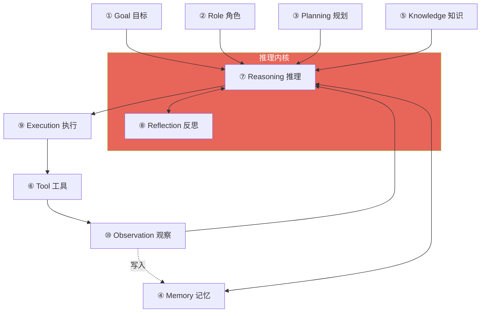

### ① Goal 目标

- **是什么**：用自然语言描述的、Agent 要达成的终态。比如「把这个仓库的测试覆盖率提到 80%」。
- **为什么需要**：它是闭环的「设定点（setpoint）」。没有目标，反思无从判断对错，规划无从展开——整个反馈回路失去了参照系。
- **内部如何工作**：Goal 通常被放在 system prompt 或任务描述里，作为每一步推理的最高约束。好的 Goal 必须**可判定**——Agent 要能判断「达成了没有」，否则闭环永远停不下来。
- **与传统软件的区别**：传统软件没有「目标」这个运行时概念，只有「功能」这个编译期概念。功能是「能做 X」，目标是「要达成 Y」——前者是手段，后者是意图。

### ② Role 角色

- **是什么**：给 Agent 设定的身份、专长、语气、行为边界。「你是一名严谨的资深后端工程师，遵守最小改动原则。」
- **为什么需要**：LLM 是一个「所有人格的叠加态」。Role 的作用是**坍缩这个叠加态**——把通用模型约束成一个特定岗位上稳定、可预期的专家。同样的模型，给不同的 Role，行为分布完全不同。
- **内部如何工作**：本质是一种强先验（prior）。它通过 prompt 把模型的输出分布，向「一个资深后端工程师会怎么做」这个子空间倾斜。
- **与传统软件的区别**：传统函数没有「人格」，`sort()` 对谁都一样。Agent 的行为高度依赖 Role——这既是它的灵活性，也是它的不确定性来源。

### ③ Planning 规划

- **是什么**：把一个大目标拆解成有序的、可执行、可验证的子步骤。
- **为什么需要**：因为**LLM 一步到位地解长任务会跑偏**。就像人做复杂事要先列提纲，Planning 强迫 Agent 先想清楚路径，把「一次赌对」变成「分步逼近」。它也让长任务变得可观测、可纠偏。
- **内部如何工作**：常见几种范式——**分解式**（先出完整计划再逐条执行）、**交错式**（ReAct：想一步、做一步、看一步）、**树搜索式**（ToT：展开多条路径再择优）。Claude Code 写代码前先列 TODO、Devin 先出 step-by-step plan，都是 Planning 的显式化。
- **与传统软件的区别**：传统软件的「计划」就是写死的代码路径，编译期就固定了。Agent 的计划是**运行时生成的、可以中途推翻重来的**。

### ④ Memory 记忆

- **是什么**：跨轮次、跨会话保存信息的能力。通常分**短期记忆**（当前上下文窗口）和**长期记忆**（外部向量库/数据库）。
- **为什么需要**：因为 LLM 本身无状态，上下文窗口还有限且昂贵。没有记忆，Agent 每次都是「失忆症患者」，学不到经验，也扛不住长任务。
- **内部如何工作**：短期记忆是把关键历史压缩后留在上下文里；长期记忆是把信息写进外部存储，需要时再检索回上下文（这和 RAG 是同一套机制，只是数据源是「自己的历史」）。核心工程难点是**上下文管理**——决定什么该记、什么该忘、什么该压缩。
- **与传统软件的区别**：传统软件的「状态」是精确的变量和数据库记录；Agent 的记忆是**有损的、需要检索的、可能记错的**——更像人脑，而非硬盘。

### ⑤ Knowledge 知识

- **是什么**：Agent 可调用的外部领域知识——文档、代码库、知识图谱、行业规范。
- **为什么需要**：LLM 的参数知识**停在训练截止日，且不含你的私有数据**。它不知道你公司的接口文档，也不知道昨天刚改的需求。Knowledge 把这些外部事实注入进来。
- **内部如何工作**：主流是 RAG——把知识切块、向量化、存库，回答前按相关性检索 Top-K 拼进上下文。区别于 Memory 的是：Knowledge 通常是**相对静态的外部事实**，Memory 是**动态积累的自身经历**。
- **与传统软件的区别**：传统软件把知识**硬编码**进业务逻辑（如把税率写进 if 分支）；Agent 把知识**外置**成可检索、可更新的数据，逻辑与知识解耦。

### ⑥ Tool 工具

- **是什么**：Agent 能调用的、对外部世界产生副作用的函数——执行代码、查数据库、调 API、读写文件、下单。
- **为什么需要**：这是 Agent 长出「手」的地方。没有工具，再强的推理也只是「纸上谈兵」，改变不了世界。**工具是决策与现实之间的唯一桥梁。**
- **内部如何工作**：靠 Function Calling（下一章详述）。你把工具的名字、功能、参数用 schema 描述给模型，模型在需要时输出一个「调用请求」，运行时真正执行，再把结果喂回。
- **与传统软件的区别**：传统软件里，函数调用由代码**写死**（A 一定调 B）；Agent 里，调哪个工具、传什么参数，由模型**运行时决定**。同一套工具，面对不同任务会被组合出完全不同的调用序列。

### ⑦ Reasoning 推理

- **是什么**：基于当前状态、目标、记忆和知识，推断「下一步该做什么」的核心认知过程。这是 LLM 提供的、整个 Agent 无可替代的心脏。
- **为什么需要**：它就是那段「过去只有人能做的翻译」。是它把模糊目标变成具体动作，把报错变成修复思路，把路况变成绕行决定。
- **内部如何工作**：靠 LLM 的前向推理，常配合 Chain-of-Thought（把思考显式写出来能显著提升复杂任务表现）。推理质量直接取决于喂进去的上下文质量——**garbage in, garbage out** 在这里是铁律。
- **与传统软件的区别**：传统软件没有「推理」，只有「计算」。计算是确定的映射，推理是带不确定性的判断。这是两种范式最根本的分界。

### ⑧ Reflection 反思

- **是什么**：Agent 审视自己刚才的输出/行动是否正确、是否偏离目标，并据此修正的元认知能力。
- **为什么需要**：因为 **LLM 会自信地犯错，且默认不会自查**。Reflection 给它装了一个「自我批判」回路，把「一次做对」的苛求，换成「做错了能发现并改」的韧性。这是 Agent 能扛住长任务的关键——错误不再累积成灾难，而是在每一步被拦截。
- **内部如何工作**：典型如 Reflexion 框架——执行后生成一段「自我反馈」，作为下一次尝试的输入。或者更简单：跑完测试看到 fail，把 fail 信息喂回去让它重想。Claude Code 看到测试红了自己去改，就是 Reflection 的闭环。
- **与传统软件的区别**：传统软件的「纠错」是人写的 try-catch，处理的是**预料之中**的异常；Reflection 处理的是**预料之外**的错误——它能对没被预设的失败做出反应。

### ⑨ Execution 执行

- **是什么**：把推理决定的「要调用某工具」这个意图，真正落地为对环境的操作，并管理其生命周期（超时、重试、并发、错误捕获）。
- **为什么需要**：意图和现实之间需要一层可靠的执行引擎。模型说「运行这段代码」，得有东西真的在沙箱里把它跑起来、把 stdout/stderr 抓回来。
- **内部如何工作**：这一层通常是**传统的、确定性的工程代码**——沙箱、进程管理、API 客户端、权限校验。它是 Agent 系统里最「传统软件」的部分，也恰恰是可靠性的地基。
- **与传统软件的区别**：区别不在执行本身，而在**谁来触发执行**——传统是代码触发，Agent 是模型的决策触发。执行层要为「一个概率性的大脑随时可能发来任意调用」做好防护。

### ⑩ Observation 观察

- **是什么**：把行动在环境里造成的真实结果，采集回来喂给推理内核。测试通过了吗？API 返回了什么？炉温升了还是降了？
- **为什么需要**：这是**闭环的最后一环，也是「自主」的命门**。没有观察，Agent 就是开环的——发出动作却不知道对错，等于蒙着眼睛开车。有了观察，偏差才能被感知，反思才有输入，下一步才有依据。
- **内部如何工作**：把工具执行的返回、环境的新状态，格式化后追加进上下文，作为下一轮推理的一部分。工程上的关键是**信噪比**——只喂关键信号，别把满屏日志灌进去挤爆上下文。
- **与传统软件的区别**：传统软件的函数返回值是给**代码**消费的（结构化、精确）；Observation 是给**模型**消费的（要可读、要能被推理利用）。同一个报错，怎么呈现给模型，直接决定它能不能修对。

### 把十个模块落到一个真实 Agent 上

抽象讲完，我们把它钉死在一个具体例子上：一个「读 GitHub issue，自己实现并提 PR」的编码 Agent。十个模块分别对应什么：

| 模块 | 在这个编码 Agent 里，具体是什么 | 如果没有它，会怎样 |
|------|------------------------------|-------------------|
| Goal | 「实现 issue #42 描述的功能，且 CI 全绿」 | 不知道何时算做完，无限兜圈 |
| Role | 「遵守本仓库规范的资深工程师，最小改动」 | 行为飘忽，风格与仓库不一致 |
| Planning | 先列 TODO：读相关代码→改 A→改 B→补测试 | 一上来乱改，大任务中途失控 |
| Memory | 记住本仓库的目录约定、上次踩过的坑 | 每个 issue 都从零摸索，反复犯同错 |
| Knowledge | 检索仓库 README、接口文档、编码规范 | 凭空捏造不存在的 API（幻觉） |
| Tool | `read_file` / `edit_file` / `run_tests` / `git` | 只能空谈，改变不了仓库 |
| Reasoning | 「测试挂在 42 行，是四舍五入用错了函数」 | —— 这是内核，没有它就不是 Agent |
| Reflection | 「改完测试还红，说明我判断错了，回头再读」 | 错误累积，越改越乱直至雪崩 |
| Execution | 在沙箱里真正跑 pytest、抓 stdout/stderr | 模型的决策落不了地 |
| Observation | 把「3 passed, 1 failed」喂回推理 | 闭着眼睛改，永远不知道对错 |

把这张表和第一章的「铁轨 vs 司机」对照，你会有一个顿悟：**传统软件里，上面除了 Tool/Execution 之外的一切（目标、计划、判断、纠错）都发生在程序员的脑子里，然后被压缩成静态代码；Agent 只是把这些原本「只存在于开发者大脑、且在编译期就凝固」的过程，外化成了运行时的、显式的、可观测的模块。** Agent 没有发明新东西，它只是把编程中最难自动化的「人的思考部分」，第一次搬到了机器里、搬到了运行时。

### 一个常见的认知误区，务必绕开

很多人第一次搭 Agent，会不自觉地想「把这十个模块都用最强配置堆满」。这是错的。**模块是能力选项，不是清单义务。** 一个查天气的简单 Agent，可能只需要 Goal + Tool + Observation 三个模块，硬塞 Planning 和 Multi-Agent 只会增加成本、延迟和出错面。

判断加不加一个模块，只问一句：**「不加它，当前任务会失败吗？」** 会，才加。这条「奥卡姆剃刀」贯穿整个 Agent 工程——**复杂度是负债，不是资产。**

> **一句话总结第四章**：十个模块，本质是一句话——**围绕 LLM 这颗只会推理的裸核，把它缺的记忆、手脚、眼睛、提纲能力、自查能力一件件补上，拼成一个能与世界闭环的自主体。** 但补哪几件，取决于任务缺哪几件——够用即止。

---

## 五、Agent 如何思考：Think–Plan–Act–Observe–Reflect 循环

前面拆的是「零件」，这一章讲这些零件**转起来**是什么样子。所有 Agent 的运行，无论框架，本质都是同一个循环在不停迭代。这个循环源自经典的 **ReAct**（Reasoning + Acting）范式，再叠加规划与反思：

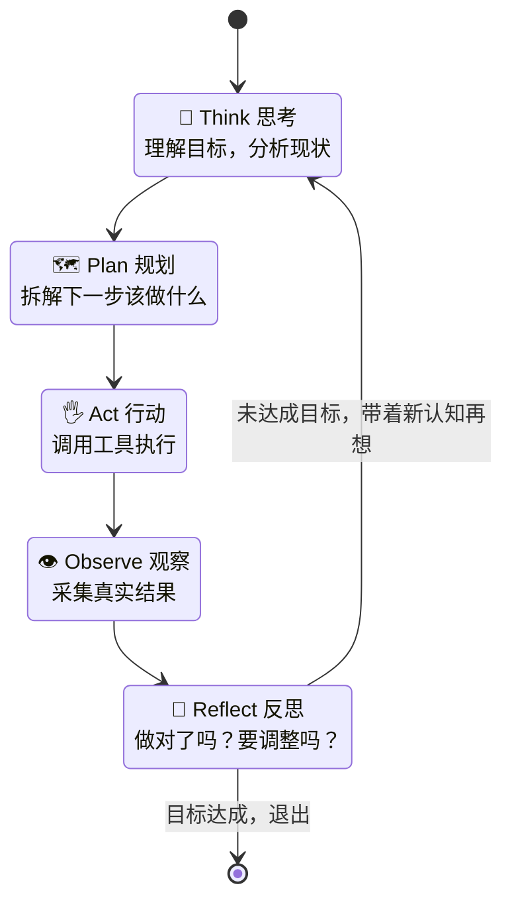

### 逐环拆解：一个真实的 debug 场景

抽象的循环不好体会，我们用一个「Agent 修复失败测试」的真实过程走一遍。假设目标是「让 `test_payment.py` 全部通过」：

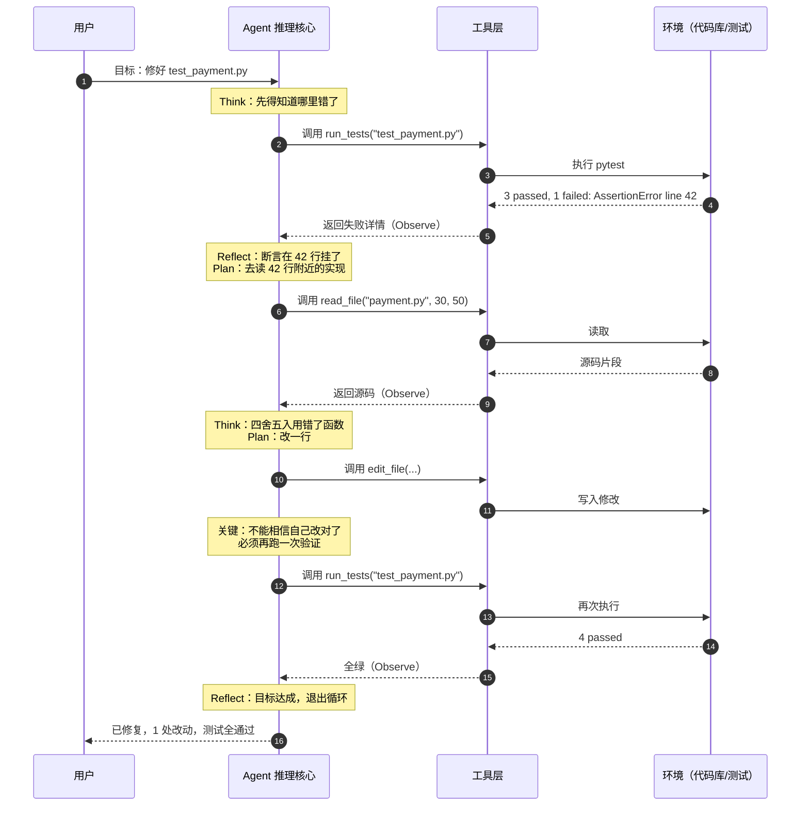

看懂这张时序图，你就看懂了 Claude Code、Cursor、Devin 在底层做的事情——它们不是「一次生成正确代码」，而是**「生成 → 用真实反馈验证 → 发现不对 → 改 → 再验证」的循环**。这也解释了一个常见困惑：为什么 Agent 有时会「兜圈子」？因为它在做真实的探索，而探索本就不是一条直线。

### 三个第一性原理级的洞察

**洞察一：Observe 是「自主」与「表演」的分水岭。** 一个只会 Think→Plan→Act 却不 Observe 的系统，是在**闭着眼睛表演自信**——它永远不知道自己做砸了。真正让 Agent 可靠的，不是它推理多强，而是它**肯不肯、能不能看真实结果并据此纠偏**。工业界一个反复验证的经验：**给 Agent 接上高质量的反馈信号（能跑的测试、能读的报错、能查的状态），比换一个更强的模型收益更大。**

**洞察二：Reflect 把「线性执行」变成「螺旋逼近」。** 没有反思，错误会沿着执行链累积，越走越偏，最后雪崩。有了反思，每一步都有一个「刹车与回头」的机会，错误被就地拦截。这就是为什么 Agent 能处理传统自动化扛不住的长任务——**它的可靠性不来自每步都对，而来自每步都能自我修正。**

**洞察三：循环必须有「刹车」。** 概率性系统天然有跑不出去的风险——反复试同一个错、或在两个错误方案间反复横跳。所以每个生产级 Agent 都必须有**终止条件**：最大迭代步数、预算上限、置信度阈值、或「连续 N 步无进展就求助人类」。没有刹车的自主，不是自主，是失控。

### 为什么 Agent 会「兜圈子」：三种典型失败模式与对策

既然循环是概率性的，它就会以特定方式失败。认得这三种，你就能诊断九成的「Agent 卡住了」：

| 失败模式 | 长什么样 | 根因 | 对策 |
|---------|---------|------|------|
| **死循环** | 反复试同一个错误方案 | 没有从失败中获得**新信息**，Reflection 空转 | 把失败详情喂得更具体；N 步无进展就换策略或求助 |
| **摇摆** | 在两个方案间反复横跳 A→B→A→B | 缺少「决定后就承诺」的机制 | 让它显式记录「已排除的方案」，禁止回头 |
| **上下文腐烂** | 越到后面越糊涂、忘了目标 | 上下文被垃圾信息（满屏日志）挤爆 | 上下文工程：压缩历史、只留关键信号、定期重述目标 |

第三种——**上下文腐烂（context rot）**——是长任务 Agent 最隐蔽的杀手，值得单独说。上下文窗口就是 Agent 的「工作记忆」，而它有限且昂贵。如果你把每一次工具调用的完整输出（几百行日志、整个文件内容）都无脑塞进去，模型很快就会被噪音淹没，抓不住真正重要的信号，表现断崖式下跌。

这引出了一个正在成型的核心工程学科——**上下文工程（Context Engineering）**：

> 决定「在每一步，把哪些信息、以什么形式、放进有限的上下文窗口」，是 Agent 工程里回报最高的手艺之一。它甚至比选哪个模型更影响最终表现。

它包括：**压缩**（把长历史总结成要点）、**筛选**（只喂与当前子任务相关的信息）、**复述**（在长任务中定期重申目标，防止漂移）、**外置**（把暂时用不到的信息写进 Memory，需要时再取回）。**如果说 Prompt 是对模型的静态编程，上下文工程就是对模型的动态供给——喂对信息，比模型本身聪明更重要。**

> **一句话总结第五章**：Agent 的「思考」不是一次灵光，而是一个**带真实反馈、能自我修正、有终止条件**的循环。它的智能，藏在循环里，不在单步里；而循环能不能跑好，八成取决于你喂进上下文的信息质量。

---

## 六、Agent 为什么能自主完成任务：九个概念如何协同

「MCP、A2A、RAG、Function Calling……」这些词经常被并列抛出，让人以为它们是同一层的东西。其实它们分布在**不同的抽象层**，各司其职。理解它们如何协同，比单独理解每一个更重要。

先给一张分层图——这是本章的地图：

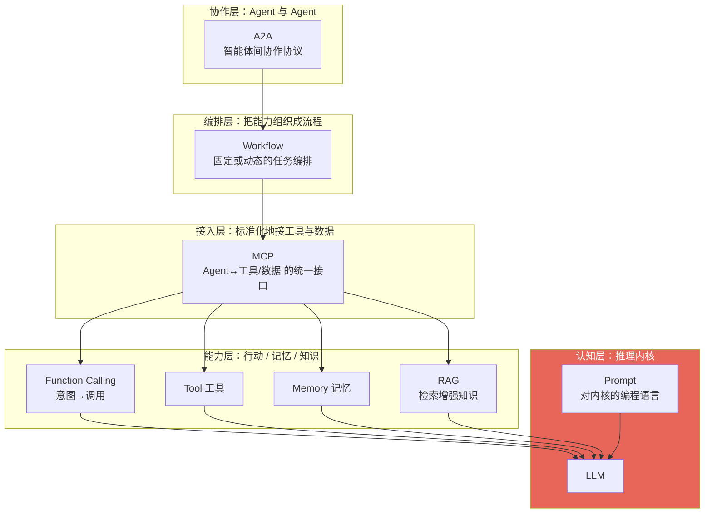

### 从底往上，逐层看它们各自补什么、如何咬合

**① LLM —— 认知内核。** 一切的地基。它提供推理，但如前所述，它是裸核。上面每一层，都是在把这颗裸核的能力「引出来、约束住、连出去」。

**② Prompt —— 内核的编程语言。** 这是被严重低估的一层。在 Agent 范式里，**Prompt 就是你对 LLM 编程的方式**：system prompt 定义角色与规则，任务描述给出目标，few-shot 示例校准行为。传统编程用语法约束 CPU，Agent 编程用自然语言约束 LLM。「Prompt Engineering」之所以是真本事，是因为它就是这个时代的一种编程。

**③ Function Calling —— 把意图变成调用。** LLM 本身只会吐文本。Function Calling 是一套约定：你用 schema 描述工具，模型在需要时**输出一个结构化的调用请求**（调哪个函数、传什么参数），运行时解析并真正执行。它是「大脑」长出「运动神经」的那一刻——意图第一次能转成对外部世界的精确操作。

**④ Tool —— 手，以及手能碰到的世界。** Function Calling 是机制，Tool 是被调用的实体：代码执行器、数据库客户端、搜索、下单接口。**工具的边界，就是 Agent 能力的边界**——它能做什么，完全取决于你给了它什么工具。

**⑤ Memory & RAG —— 状态与知识的外接。** 两者机制相通（都是「按需检索进上下文」），分工不同：Memory 检索的是 Agent 自己的历史经验，RAG 检索的是外部领域知识。它们共同解决同一个物理约束——**上下文窗口是有限且昂贵的**，不可能把一切都塞进去，只能按需取用。

**⑥ Workflow —— 把能力编排成流程。** 不是所有任务都需要「全自主」。Workflow 是一层编排：有时是人写死的固定流程（LLM 只在节点上填空，稳定可控），有时是模型动态生成的计划。**成熟工程的标志，是知道何时该用写死的 workflow，何时才放开成 full agent。**

**⑦ MCP（Model Context Protocol）—— 工具与数据的「USB-C」。** 这是关键的标准化一层。在 MCP 之前，每接一个工具/数据源都要写一套专用胶水代码，M 个 Agent 接 N 个工具是 M×N 的噩梁。MCP 由 Anthropic 于 2024 年底提出，定义了一套**统一协议**：工具方实现一个 MCP Server，任何 MCP 兼容的 Agent 都能即插即用。M×N 塌缩成 M+N。**它之于 Agent 生态，就像 HTTP 之于 Web、USB 之于外设——协议统一，生态才能爆发。**

**⑧ A2A（Agent2Agent）—— 智能体之间的协作协议。** 如果说 MCP 解决「Agent↔工具」，A2A（Google 于 2025 年提出）解决「Agent↔Agent」。它让一个 Agent 能把子任务**委托**给另一个（哪怕来自不同厂商、不同框架）的 Agent，像微服务之间的 RPC，只不过调用方和被调用方都是智能体。**MCP 让 Agent 有工具用，A2A 让 Agent 有同事。**

**⑨ 协同起来，是什么样子。** 把它们串成一句话你就懂了：

> 用户用**自然语言**表达意图 → **Prompt** 把它连同 Role/Goal 喂给 **LLM** → LLM 结合 **RAG** 检索的知识和 **Memory** 里的经验做**推理** → 决定调用工具，通过 **Function Calling** 发出请求 → 请求经 **MCP** 标准接口打到具体 **Tool** → **Workflow** 编排多个这样的步骤 → 遇到搞不定的子任务，通过 **A2A** 委托给别的 Agent → 每步结果**观察**回来，驱动下一轮。

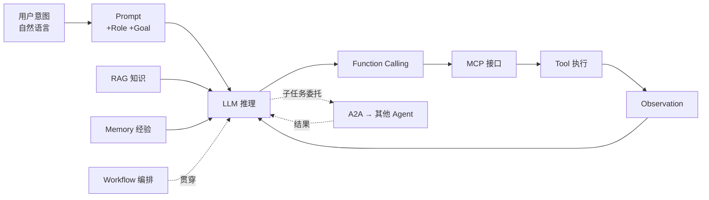

### 反过来想：抽掉一层会怎样

理解一个系统最快的方法，是看「拿掉某个零件它怎么坏」。逐层抽给你看：

- **抽掉 Function Calling**：LLM 只能吐建议文本，你得人肉复制粘贴去执行。退回「聊天机器人」，闭环断裂。
- **抽掉 Tool**：推理再强也是纸上谈兵，改变不了任何真实状态。「思想的巨人，行动的侏儒」。
- **抽掉 RAG/Memory**：模型只能靠训练时的旧知识和这一轮的上下文，不知道你的私有数据、记不住任何经验。每次都是失忆的实习生。
- **抽掉 MCP**：还能跑，但每接一个新工具都要写一次性胶水代码，M×N 的集成地狱，生态无法规模化。
- **抽掉 A2A**：单个 Agent 仍能工作，但无法把子任务委托给外部专精 Agent，复杂协作被锁死在一个进程内。
- **抽掉 Workflow 编排**：简单任务能跑，但一旦任务需要固定的多步流程或并发，就缺了「调度器」，稳定性和可控性骤降。

这个「抽层测试」也是**排查 Agent 故障的思维工具**：当一个 Agent 表现不好，别急着换更大的模型，先逐层问——是它没工具（抽了 Tool）？还是没喂对知识（RAG 检索差）？还是没看到真实反馈（Observation 信噪比低）？**九成的 Agent 问题不在模型不够聪明，而在某一层的信息没到位。**

> **一句话总结第六章**：这些概念不是竞品，是一条**技术栈**。LLM 是 CPU，Prompt 是编程语言，Function Calling 是系统调用，Tool 是外设，MCP 是设备驱动的统一协议，A2A 是网络协议，Workflow 是操作系统的调度器。看懂分层，才不会被名词淹没。

---

## 七、软件开发自己进入了 Agent 时代

最先被 Agent 改造的行业，是软件开发自己。这不奇怪——写代码这件事，恰好满足 Agent 最吃香的所有条件：**目标可判定**（测试过不过、编译报不报错）、**反馈即时且高质量**（编译器、测试、linter 都是现成的 Observation 源）、**环境完全数字化**（不需要机械臂就能改变世界）。软件开发是 Agent 的完美练兵场。

### 为什么 Claude Code、Codex 不是 IDE，而是 Agent

这是一个必须掰开的区别，因为它揭示了范式的分界线。

**IDE 是被动工具，Agent 是主动主体。** VS Code 再智能，它也只是「你的手的延伸」——你不敲，它不动；自动补全也要等你先打字。它没有目标、没有闭环、不会自己行动。它是**你**在开车，IDE 是方向盘。

Claude Code / Codex 则相反：你给一个目标（「给这个模块加上缓存」），它**自己**去读代码库、理解结构、制定计划、修改多个文件、运行测试、看报错、再修改——跑一整个第五章的循环，直到目标达成。**它是司机，不是方向盘。**

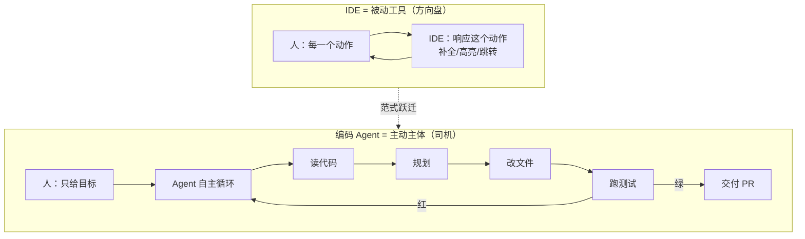

判据可以精确到一句话：**你是否需要在每一步都在场。** 需要，它就是工具；不需要、你只在开头给目标结尾做验收，它就是 Agent。

### 五个代表，五种形态

| 产品 | 形态 | 关键特征 | 揭示的趋势 |
|------|------|---------|-----------|
| **Claude Code** | 终端里的编码 Agent | 直接在你的仓库和 shell 里跑完整循环，工具即命令行 | Agent 就活在开发者原生环境里，不另造 IDE |
| **OpenAI Codex** | 云端/CLI 编码 Agent | 从任务到 PR 的端到端实现 | 「下达任务」取代「逐行编写」 |
| **Cursor** | Agent 原生编辑器 | 在编辑器内嵌入 Agent，人机在同一界面协作 | 过渡形态：IDE 与 Agent 融合，人仍高频在环 |
| **Devin**（Cognition） | 自主软件工程师 | 有自己的 shell/浏览器/编辑器，长时间自主作业 | 把 Agent 当「远程同事」而非「插件」 |
| **OpenHands**（原 OpenDevin，All Hands AI） | 开源 Agent 平台 | 开放的自主编码 Agent 框架 | 能力开源化，人人可自建编码 Agent |

一条清晰的谱系浮现出来：从 **Cursor**（人高频在环、Agent 辅助）→ **Claude Code**（人给目标、Agent 自主执行、人做验收）→ **Devin**（人像管理远程员工一样异步协作）。**人在环里的频率越来越低，Agent 的自主跨度越来越长。** 这条曲线的方向，就是整个行业的方向。

### 一个更硬核的案例：GitHub 上的 Agent

再往前一步是「从 issue 到 PR 全自主」。你在仓库里开一个 issue 描述需求，一个编码 Agent 认领它，自己开分支、写代码、补测试、提 PR，甚至根据 review 意见迭代。GitHub 的 Copilot coding agent 已经在做这件事。

它揭示的趋势更深远：**软件协作的基本单位，正在从「人 + 工具」变成「人 + Agent 同事」。** 未来的 git 历史里，commit author 是 Agent、reviewer 是人，会像今天的 CI 一样平常。

### 一个被低估的二阶效应：编码 Agent 会加速所有其他 Agent

这里有个容易被忽略、却极其重要的正反馈：**编码 Agent 成熟得越快，其他所有行业的 Agent 就长得越快。**

为什么？回顾第八章——搭一个行业 Agent，本质是写它的工具层、执行层、护栏（这些都是确定性的传统代码），再调教它的行为。而**写代码这件事，正在被编码 Agent 自动化。** 换句话说：

> 编码 Agent 是「造 Agent 的 Agent」。它把「构建 Agent 系统」本身的成本压了下来。

这形成一个加速回路：更强的编码 Agent → 更低的 Agent 开发成本 → 更多行业 Agent 涌现 → 更多真实场景反哺模型与工具生态 → 又推动编码 Agent 更强。这也是为什么「软件开发自己先进入 Agent 时代」不只是一个孤立现象，而是**整场变革的引擎**。第一块多米诺骨牌，恰好是能推倒其他所有骨牌的那一块。

> **一句话总结第七章**：区分 IDE 和 Agent 的唯一标准是「你要不要每一步都在场」。编码 Agent 之所以先成熟，是因为软件世界给了它最好的三样东西：可判定的目标、即时的反馈、纯数字的环境。

---

## 八、未来每一个行业，都会长出自己的 Agent

软件是第一个，但绝不是最后一个。任何满足「目标可判定 + 有反馈信号 + 可数字化操作」的领域，都会长出自己的 Agent。区别只在于——**每个行业的 Goal、Knowledge、Tool 各不相同，但架构骨架惊人地一致。**

### 先看骨架：所有行业 Agent 的公约数

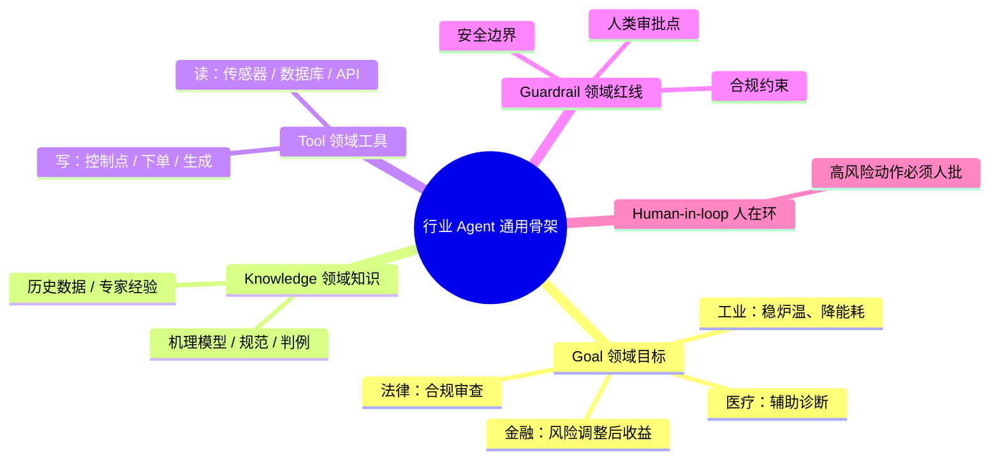

看出规律了吗？**换行业，本质是换四样东西：目标、知识、工具、红线。** 骨架不变。这就是为什么「Agent 开发思维」是可迁移的——学会在一个行业搭 Agent，换个行业只是换数据源和工具集。

### 九个行业，一张对照表

| 行业 | Goal（目标） | 关键 Knowledge | 关键 Tool | 最重要的 Guardrail |
|------|------------|---------------|-----------|-------------------|
| **工业** | 稳定工况、降本增效 | 机理模型、历史工况、SOP | DCS 读写点、软测量、优化器 | 安全联锁，绝不越过工艺极限 |
| **医疗** | 辅助诊断、提效 | 指南、病历、影像 | 检索、影像分析、结构化录入 | 医生终审，Agent 不下最终诊断 |
| **金融** | 风险调整后收益、合规 | 市场结构、策略库、监管规则 | 行情、回测、（受限的）交易接口 | 风控额度 + 人类审批下单 |
| **法律** | 合规审查、文书起草 | 法条、判例、合同库 | 检索、条款比对、文书生成 | 律师复核，不构成法律意见 |
| **教育** | 个性化学习、提分 | 课标、题库、学生画像 | 出题、批改、学情分析 | 保护未成年、不替代思考 |
| **科研** | 加速发现、验证假设 | 论文库、实验数据 | 文献检索、数据分析、仿真 | 结果可复现、防幻觉造数据 |
| **销售** | 转化、客户满意 | 产品库、话术、CRM | 检索、邮件/外呼、CRM 写入 | 不虚假承诺、隐私合规 |
| **设计** | 高质量视觉产出 | 品牌规范、素材库 | 生成模型、排版、资产管理 | 版权合规、品牌一致性 |
| **游戏** | 拟人 NPC、动态内容 | 世界观、剧情树、玩家行为 | 对话生成、行为决策、状态机 | 内容安全、不破坏游戏平衡 |

### 三个案例，讲透「换行业只是换四样东西」

**案例一：高炉 Agent（工业）。** 这是我最熟的领域，也最能说明问题。一座高炉是极复杂的非线性系统，炉温（铁水温度）受上百个变量耦合影响，滞后长达数小时。传统做法靠老师傅经验 + 固定的控制逻辑。高炉 Agent 怎么搭？

- **Goal**：铁水温度稳定在目标区间，同时降低焦比（能耗）。可判定。
- **Knowledge**：冶金机理模型 + 几十年的历史工况数据 + 老师傅的操作规程。
- **Tool**：读——DCS 上的温度/压力/气流传感器、软测量模型；写——喷煤量、风温、料批的调节指令。
- **Observation**：炉况传感器的时序数据，就是它的「测试结果」。
- **Reflection**：这一次调整后炉温是升是降、偏差多少，归因并修正下一步。
- **Guardrail（最关键）**：任何调节都不能越过安全联锁和工艺极限——这是**人命关天的红线**，必须硬编码在执行层，绝不交给概率性的模型自由裁量。

你会发现，把第四章的十个模块往高炉上一套，严丝合缝。**它和编码 Agent 是同一个骨架，只是 Tool 从「读写文件」换成了「读写控制点」，Observation 从「测试结果」换成了「传感器时序」。**

**案例二：自动交易 Agent（金融）。** 

- **Goal**：在给定风险约束下最大化收益。**注意，目标里天然含着约束**。
- **Knowledge**：市场微观结构、策略库、监管规则。
- **Tool**：行情读取、回测引擎、（严格受限的）下单接口。
- **Guardrail（生死线）**：这里的红线比任何行业都硬——**仓位上限、单笔额度、止损、以及关键的「真金白银的交易必须经人类审批」**。一个能自主下单却没有硬风控的交易 Agent，不是资产，是定时炸弹。这也呼应一条通用原则：**越是不可逆、越是高风险的行动，越要把人留在回路里。**

**案例三：企业办公 Agent（通用行政）。** 

- **Goal**：处理报销、安排会议、起草邮件、整理纪要。
- **Knowledge**：公司流程制度 + 你的个人偏好（沉淀在 Memory 里）。
- **Tool**：邮箱、日历、ERP、文档系统的读写接口。
- **Guardrail**：**发邮件、订机票、提交报销这类有外部副作用的动作，要么人类确认，要么严格限额**——因为它们代表你对外行动，错了要你担责。

**案例四：辅助诊断 Agent（医疗）。** 

- **Goal**：给定病历、检验、影像，输出**鉴别诊断建议**与需要补充的检查——注意是「建议」，不是「结论」。
- **Knowledge**：临床指南、循证医学库、患者历史病历。
- **Tool**：文献检索、影像特征分析、结构化病历录入。
- **Guardrail（不可退让）**：**Agent 永远不下最终诊断，医生终审**。医疗是「错误代价极高 + 强监管 + 责任必须落到具体的人」的领域，这决定了它天然是「人在环」的，且人必须是决策的最终节点，Agent 只做「把医生的注意力引到对的地方」。

**案例五：合同审查 Agent（法律）。** 

- **Goal**：审查一份合同，标出与我方标准条款的偏离、潜在风险点、缺失的必备条款。
- **Knowledge**：法条、判例、公司的标准合同模板与红线条款库。
- **Tool**：条款抽取、与模板比对、风险检索、修订建议生成。
- **Observation**：这里有个微妙之处——法律没有「跑测试」这样的即时客观反馈，**它的 Observation 质量较低**。这正解释了为什么法律 Agent 比编码 Agent 难做：**反馈信号越弱、越主观、越延迟的领域，Agent 越难自主，越依赖人类在环校验**。这是一条可以用来预判「哪个行业的 Agent 会先成熟」的通用规律。

**案例六：科研 Agent（科研）。** 

- **Goal**：给定一个假设，做文献综述、设计实验、分析数据、给出证据链。
- **Knowledge**：论文库、实验数据集、领域本体。
- **Tool**：文献检索、数据分析、仿真、（在计算科学里）代码执行。
- **Guardrail（学术生命线）**：**结果必须可复现，必须防止模型「幻觉造数据」**。科研 Agent 最大的风险不是效率，而是**用看似严谨的语言编造不存在的证据**——所以每一条结论都要能回溯到真实数据源，这是不可动摇的红线。

六个案例，六个天差地别的行业，但你已经能预测第七个、第八个行业的 Agent 长什么样了——因为**骨架是守恒的**。这正是「Agent 开发思维」的威力：它是一套跨行业通用的建模框架。而这六个案例还悄悄教了你一条预判规律：**一个领域的反馈信号越客观、越即时（编码、工业），它的 Agent 就越早、越自主；越主观、越延迟（法律、医疗），就越晚、越依赖人在环。**

> **一句话总结第八章**：行业 Agent 不是九种不同的东西，而是**同一个骨架的九次实例化**。换行业 = 换目标、换知识、换工具、换红线。谁先把自己行业的这四样想清楚，谁就先拥有那个行业的 Agent。

---

## 九、如何开发一个 Agent：像培养员工，而不是编写程序

前面都是「理解」，这一章是「动手」。但请先接受一个心态上的转变，否则后面全是坑：

> **你不是在编写一个程序，你是在招聘并培养一名员工。**

这不是比喻的修辞，而是**方法论的直译**。开发 Agent 的每一步，都能在「带一个新人」里找到精确对应：

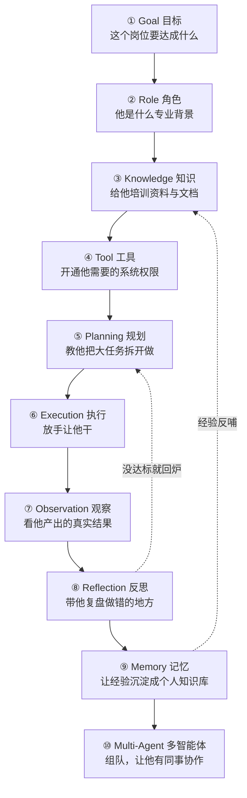

### 逐步走一遍这条「带人」链

**① 先定 Goal，且必须可判定。** 招人第一件事是想清楚「这个岗位要产出什么」。Agent 同理——目标必须能被判断达成与否（能跑的测试、能量化的指标）。**一个说不清「怎样算做完」的目标，会让 Agent 永远兜圈子**，就像一个 KPI 模糊的员工永远不知道该干到哪。

**② 定 Role，坍缩人格。** 「资深后端工程师」和「谨慎的财务审核员」会做出完全不同的行为。Role 越具体，行为越稳定。

**③ 给 Knowledge，做入职培训。** 别指望模型「本来就懂」你的私有业务。把接口文档、业务规则、行业规范喂给它（通常经 RAG）。**新人不会读心术，Agent 也不会。**

**④ 配 Tool，开系统权限。** 他需要读数据库？开只读权限。需要发邮件？给邮件工具。**关键原则：最小权限。** 只给完成目标必需的工具——多给一个高危工具，就多一个出事的入口。这和给新员工开权限的原则一模一样。

**⑤ 教 Planning，别让他蒙头干。** 复杂任务要求先出计划再执行。这既提升成功率，也让你能在他动手前就发现方向错了。

**⑥ 放手 Execution。** 让他真的去干。但配好沙箱与超时——就像新人上手先在测试环境练，而不是直接动生产库。

**⑦ 看 Observation，要真实结果。** 别看他「说」自己做得怎么样，看**真实产出**。这是最容易偷懒、也最致命的一步——反馈信号的质量，直接决定 Agent 的上限。

**⑧ 带 Reflection，做复盘。** 没达标？把差距和原因喂回去，让他重来。**Agent 的成长发生在复盘里，不在执行里。**

**⑨ 沉淀 Memory，把经验留下。** 这次踩的坑、学到的招，写进长期记忆，下次别再犯。**一个不积累经验的员工永远是新人**——一个没有记忆的 Agent 也一样。

**⑩ 组建 Multi-Agent，让他有同事。** 单个 Agent 有能力上限。复杂任务可以拆给一个团队：一个规划、几个专精执行、一个审查。它们通过 A2A 协作。

### 为什么「员工」这个心智模型如此重要

因为它一次性纠正了程序员最容易犯的三个错：

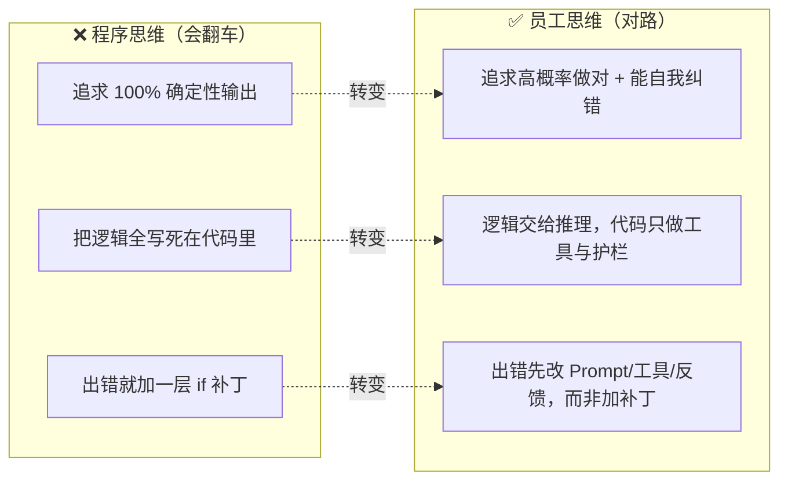

- **别追求确定性，追求高概率 + 可纠错。** 你不会要求一个员工「永不犯错」，你要求他「犯了错能发现能改」。用评估集衡量他的「胜率」，而不是用断言要求他「永远对」。
- **别把逻辑写死。** 一旦你开始用 `if` 硬编码「遇到 X 就做 Y」，你就退回了铁轨范式，也放弃了 Agent 的全部价值。逻辑交给推理，代码只负责提供**可靠的工具**和**不可逾越的护栏**。
- **出错先调教，别打补丁。** 传统 bug 靠改代码。Agent 的「行为不对」，八成要靠改 Prompt、改工具设计、改反馈信号来解决——你是在**调教一个人**，不是在**修一台机器**。

### 落地演练：从零带一个「退款客服 Agent」

把「带人」链走一遍真实的、有副作用、有红线的例子——一个处理退款申请的客服 Agent。

1. **Goal**：读懂用户的退款诉求，依据退款政策给出处理结果（同意/拒绝/转人工），并把已同意的退款登记到工单系统。可判定：处理完且合规。
2. **Role**：「耐心、共情、但严格遵守退款政策的资深客服」。共情决定语气，严格决定不被话术带偏。
3. **Knowledge**：退款政策文档、常见问题库、该用户的订单与历史（经 RAG 检索，不硬编码——政策会变）。
4. **Tool**：`查订单`（只读）、`查政策`（只读）、`创建退款工单`（**写，高危**）、`转人工`。
5. **Planning**：先核对订单状态 → 再比对政策 → 判断是否符合 → 决定动作。把判断和动作分成两步，便于中间插入护栏。
6. **Guardrail（这个例子的灵魂）**：
   - **金额红线**：退款 ≤ 50 元且完全符合政策，可自动执行；> 50 元或有任何模糊，**一律转人工**。
   - **只写一次**：`创建退款工单` 做幂等，防止模型重试时重复退款。
   - **最小权限**：它没有「改政策」「改订单金额」的工具——**能力上就不给它犯大错的手段**。
7. **Observation**：工单系统返回「创建成功/失败」，喂回让它确认并回复用户。
8. **Reflection**：如果政策比对时自己都不确定，不要硬猜——**「不确定」本身就是一个合法且正确的输出**，触发转人工。
9. **Memory**：沉淀「这类话术其实是想钻空子」「那类描述通常是真实质量问题」，越用越准。

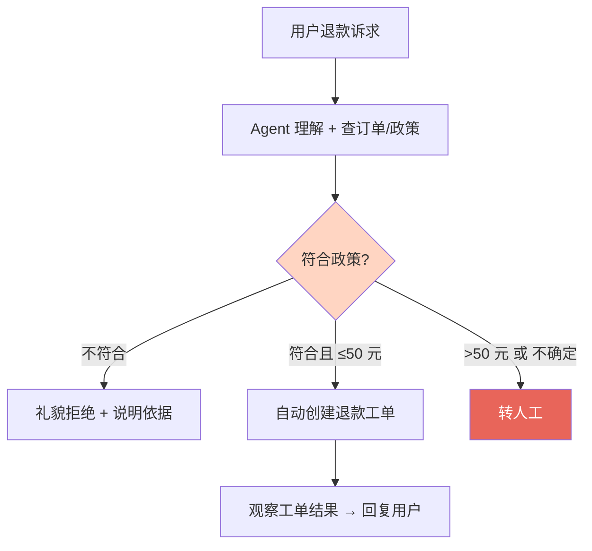

看这张图里最重要的是那个红色的「转人工」出口。**一个设计良好的 Agent，不是想方设法自己扛下一切，而是清楚地知道自己能力和权限的边界，并在越界前主动把方向盘交回给人。** 「知道什么时候该求助」，是自主性里最成熟的一种，也是最容易被新手忽略的一种。

### 但要克制：不是所有任务都配当 full agent

一个成熟工程师的标志，是**知道什么时候不该上 Agent**。回到第二章的自主光谱：如果一个任务流程固定、分支可穷举，就用**写死的 workflow**（稳定、便宜、可调试）；只有当任务真正开放、需要临场判断时，才放开成 full agent。**用推理去解决本可以用一个 `if` 解决的问题，是这个时代最昂贵的偷懒。**

> **一句话总结第九章**：开发 Agent 的心智模型是「带人」而非「编程」。定目标、给资料、配权限、教方法、看结果、带复盘、留经验。你管理的是行为，不是指令——而好的管理者，懂得只在必要时才授权。

---

## 十、未来的软件架构：从「调用栈」到「智能核 + 能力总线」

把前九章收束到一张架构图上。软件的骨架正在发生结构性重排。

### 旧骨架：确定性的分层调用栈

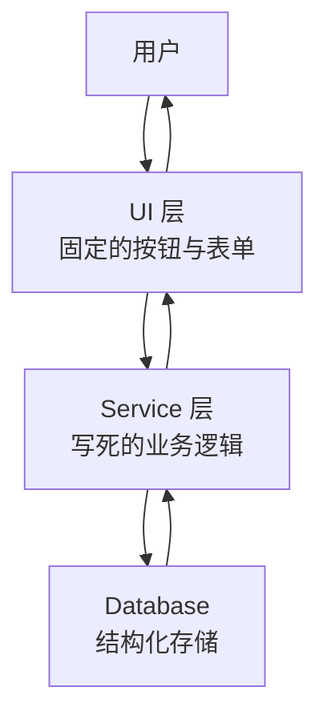

它的世界观是：**功能是预先定义的，用户在预设的功能集里做选择。** 数据确定性地流过每一层。过去三十年的软件，几乎都是这张图的变体。它可靠、可预测，但它的能力边界，在编译期就被焊死了。

### 新骨架：智能核心 + 能力总线

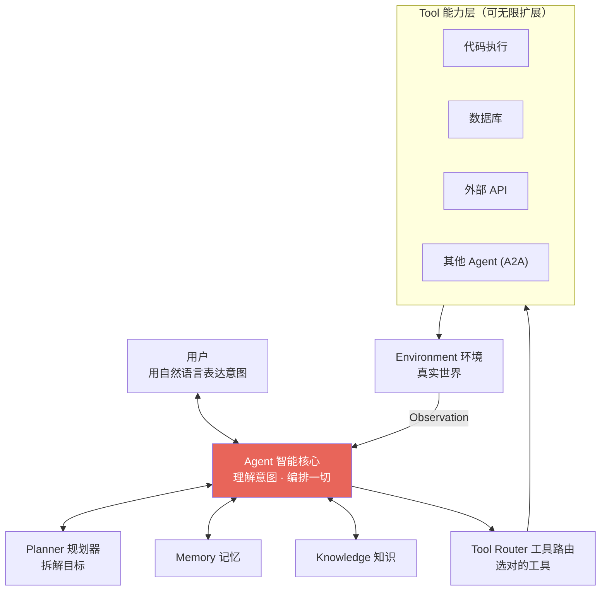

对比两张图，三个结构性变化：

1. **入口从「UI」变成「意图」。** 用户不再点按钮，而是说目标。UI 从「固定的功能面板」退化（或进化）为「动态生成的交互」——需要表格时给你表格，需要确认时弹确认。**界面成了推理的产物，而非预先画好的画布。**
2. **中枢从「Service」变成「Agent」。** 过去的中枢是被动执行写死逻辑的 Service，现在是主动推理、动态编排的 Agent。业务逻辑从「代码里的分支」变成「推理时的决策」。
3. **能力从「固定调用」变成「可路由的总线」。** 工具挂在一条总线上（靠 MCP 标准化接入），Agent 通过 Tool Router 按需选用。**加一个能力 = 挂一个工具，而不是改一层代码。** 系统的能力边界，第一次可以在运行时扩展。

一句话概括这次重排：**软件从「功能的集合」，变成了「能力的集合 + 一个会调度它们的智能核心」。**

### 那么,未来的软件工程师要掌握什么

范式变了，能力模型也跟着变。有些技能贬值,有些技能空前增值：

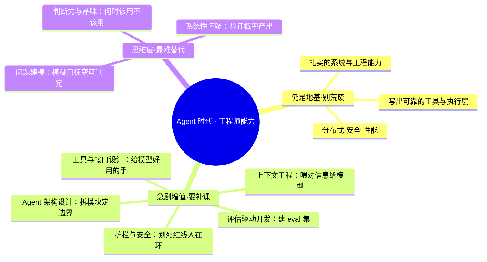

**注意最反直觉的一点：底层工程能力不但没贬值，反而更重要了。** 因为 Agent 系统里最可靠的部分——工具层、执行层、护栏——仍然是确定性的传统软件，而且它们是整个概率性系统的地基。**地基越不确定的时候，会打地基的人越值钱。** 那些以为「有了 Agent 就不用懂工程」的人，恰恰会搭出最脆弱的系统。

真正贬值的，是「把已知解法翻译成代码」这段纯体力翻译——而这本来就不该是工程师价值的核心。范式把工程师从翻译工，推向了**架构师、训练者、审计者**。这是一次上移，不是一次替代。

具体到日常，可以这样预判自己的技能篮子：

- **会快速贬值**：手写样板代码、记忆特定框架的 API、把清晰需求逐行翻译成实现——这些恰是 Agent 最擅长替代的。
- **会快速增值**：把模糊问题建模成可判定目标的能力、设计工具与接口的品味、构建评估集来度量「好」的能力、以及在概率性产出上保持系统性怀疑的判断力。
- **最难被替代**：知道「什么问题值得解决」和「什么解法足够好」——这是价值判断，而 Agent 只能优化你给它的目标，给不了目标本身。

一个朴素的自检：**如果你的核心竞争力，是「比别人更快地把想好的东西敲成代码」，那你正站在被自动化的正前方；如果是「比别人更准地想清楚该做什么、该守住什么」，那 Agent 是你的杠杆，不是你的对手。**

> **一句话总结第十章**：未来的软件 = 智能核心 + 能力总线。工程师的价值，从「写实现」上移到「定义目标、设计工具、划定边界、评估行为」。会打确定性地基的人，在概率性的世界里更稀缺。

---

## 总结

把两万字收进四句话：

1. **范式的本质，是控制流的迁移**——从「编译期由人写死」到「运行期由模型生成」。这一条派生出其余一切差异。你要判断一个系统是不是真 Agent，就看它的下一步是被代码决定的，还是被推理决定的。
2. **Agent 的每个组件，都在补 LLM 这颗裸核的一个短板**——记忆补健忘，工具补无手，规划补跑偏，反思补自负,观察补失明。看懂这条,十个模块、九个概念就不再是散落的名词，而是一个自洽的系统。
3. **它的可靠性不来自每步都对，而来自每步都能自我修正**——真实反馈 + 反思闭环，是「自主」二字的全部秘密。给它高质量的反馈信号，往往比换更强的模型更有用。
4. **开发 Agent 是「带人」，不是「编程」**——定目标、给资料、配权限、看结果、带复盘、留经验。你的杠杆，从敲键盘的速度，变成了设计目标与边界的品味。

最后一句留给还在观望的工程师：

> **不必焦虑「Agent 会不会取代程序员」。真正的问题是——当写代码这件事本身被自动化之后，你为它准备好了「更高一层」的能力吗？**
>
> **过去,我们教机器执行我们想好的解法。现在,我们教机器自己找解法。而我们，要学会去定义什么是好解法、并守住它的边界。这一层，机器还给不了答案。**

---

## 附录一 · 参考文献

以下是本文观点背后的一手来源，按主题分组。建议读一手，别只读二手解读。

**范式与核心思想**

- Anthropic, *Building Effective Agents*（2024）——区分 workflow 与 agent、何时该用哪个，本文第二、九章的自主光谱深受其影响。
- Andrej Karpathy, *Software 2.0* / *Software 3.0* 相关演讲——「神经网络是新的软件」这一范式判断的源头。
- Anthropic, *Introducing the Model Context Protocol (MCP)*（2024）——第六章 MCP 部分的一手依据。
- Google, *Announcing the Agent2Agent (A2A) Protocol*（2025）——第六章 A2A 部分的一手依据。

**关键技术范式（论文）**

- Yao et al., *ReAct: Synergizing Reasoning and Acting in Language Models*（2022）——第五章循环的理论原型。
- Shinn et al., *Reflexion: Language Agents with Verbal Reinforcement Learning*（2023）——Reflection 模块的代表工作。
- Wei et al., *Chain-of-Thought Prompting*（2022）——推理显式化。
- Lewis et al., *Retrieval-Augmented Generation (RAG)*（2020）——Knowledge/Memory 检索机制的源头。
- Yao et al., *Tree of Thoughts*（2023）——Planning 的树搜索范式。

> 说明：本文为帮助建立心智模型而写，部分年份与表述凭作者知识整理，引用前请以官方原文为准。

---

## 附录二 · 推荐阅读

- **Anthropic Engineering 博客**——工程视角的 Agent 构建实践，密度极高，是我认为最值得反复读的来源。
- **Lilian Weng, *LLM Powered Autonomous Agents***——一篇被引爆的综述，把 Planning/Memory/Tool 讲得极系统，Agent 入门必读。
- **Chip Huyen, *AI Engineering***（书）——从传统 ML 工程过渡到 LLM/Agent 工程的系统读物，适合有工程背景的人补齐全景。
- **各模型厂商的官方 Agent/Tool-use 文档**——Function Calling、结构化输出、工具设计的最权威说明，写 Agent 前务必通读。

---

## 附录三 · 推荐开源项目

按「你想学哪一层」来选，而不是盲目 star：

| 想理解的层 | 项目 | 看它学什么 |
|-----------|------|-----------|
| 编码 Agent 全貌 | **OpenHands**（All Hands AI） | 一个完整自主编码 Agent 的工业级实现 |
| 多智能体编排 | **LangGraph** | 用图来显式建模 Agent 的状态与控制流 |
| 多智能体协作 | **AutoGen**（Microsoft） | Agent 之间对话式协作的经典范式 |
| 角色化多 Agent | **CrewAI** | 用「角色 + 任务」组织 Agent 团队 |
| 工具/数据标准接入 | **MCP 官方 SDK 与 Servers** | 亲手写一个 MCP Server，理解标准化接入 |
| 数据/知识框架 | **LlamaIndex** | RAG 与知识管线的成熟实现 |
| 通用 Agent 框架 | **LangChain** | 生态最大，适合快速拼原型（但注意别被抽象绑架） |

> 学习建议：**先徒手用「LLM API + Function Calling」写一个最小 Agent 循环（约 100 行），再去读框架。** 否则框架的抽象会挡住你对第一性原理的理解。

---

## 附录四 · 学习路线

一条从「会用」到「会造」的四阶段路径。不要跳级——每一阶都在为下一阶打地基。

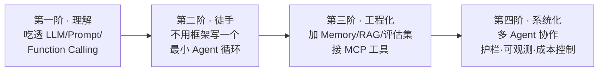

- **第一阶 · 理解（1–2 周）**：搞懂 LLM 是什么、Prompt 如何编程、Function Calling 的机制。目标——能说清「Agent 的每个组件补的是哪个短板」。
- **第二阶 · 徒手（1–2 周）**：**不用任何框架**，纯 API 手写一个 Think→Act→Observe 循环，做一个能读文件、跑命令、看结果的小编码 Agent。这一步的顿悟，抵得过读十篇教程。
- **第三阶 · 工程化（1–2 月）**：给它加长期记忆、接 RAG、写一个评估集来量化胜率、用 MCP 接入真实工具。开始按「评估驱动开发」的方式迭代。
- **第四阶 · 系统化（持续）**：多 Agent 协作、护栏与权限、可观测性（trace）、成本与延迟控制。到这一阶，你关心的已经不是「能不能跑通」，而是「稳不稳、贵不贵、安不安全」——这是生产级 Agent 的真正战场。

---

## 附录五 · 未来展望

三个我个人押注的方向，供讨论：

1. **自主跨度会持续变长，人在环的频率持续降低。** 从「补全一行」到「完成一个函数」到「实现一个 PR」到「维护一个模块」——Agent 单次自主作业的时间尺度，会从秒级走向小时级、天级。人的角色从「操作员」变成「审阅者」再变成「目标设定者」。
2. **协议层会决定生态格局。** MCP 与 A2A 这类标准，重要性会被反复低估又反复验证——正如 HTTP 决定了 Web。**得协议者得生态**：谁的工具/Agent 接入标准被广泛采纳，谁就掌握了下一代软件的连接层。
3. **「护栏工程」会成为一门独立的硬核学科。** 当越来越多不可逆的、有真实副作用的动作交给概率性系统，如何划定红线、如何设计人类审批点、如何做可观测与可回溯、如何在自主与安全之间取舍——这会像今天的网络安全一样，成为一个专门的、高价值的工程领域。**能力的天花板由模型决定，落地的下限由护栏决定。**

但有一件事我判断不会变：

> **无论 Agent 多强，「定义什么问题值得解决、什么解法足够好、什么边界不可逾越」——这件事的最终责任，仍然在人手里。**
>
> 技术的每一次范式跃迁，都不是把人赶下牌桌，而是把人推到更高一层的牌桌。Agent 时代也一样。**你要做的，是坐上那张新桌子。**

---

**参考阅读（本站相关）**：

- [代码不再是源头：从 Vibe Coding 到 Spec-Driven Development](../spec-driven-development-new-paradigm/)
- [Claude Code + Codex 协作开发心得](../claude-code-codex-workflow/)
- [代码里的脚手架：写了就要拆，但不能不写](../scaffolding-in-code/)

