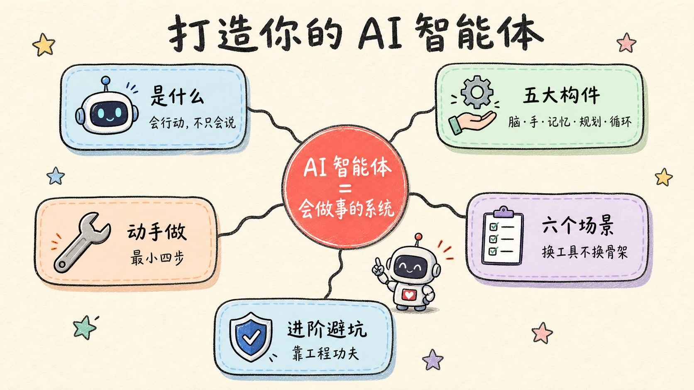
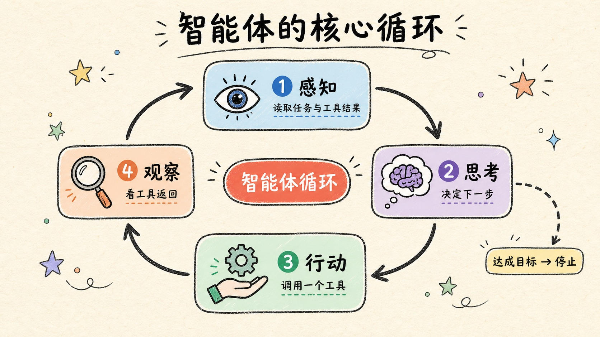
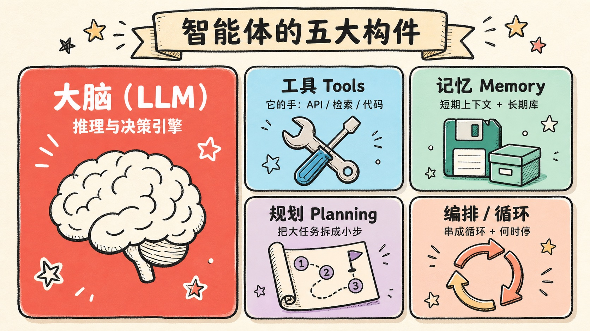
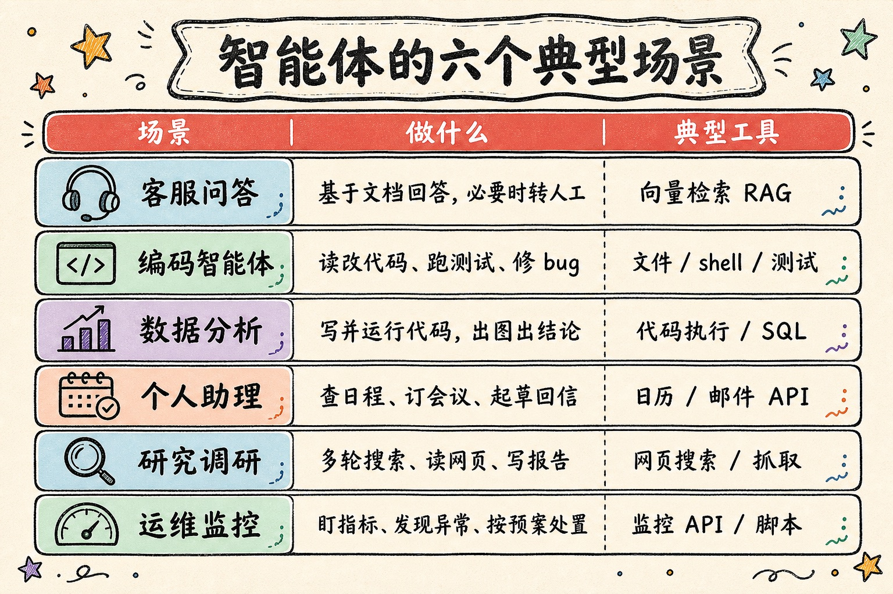
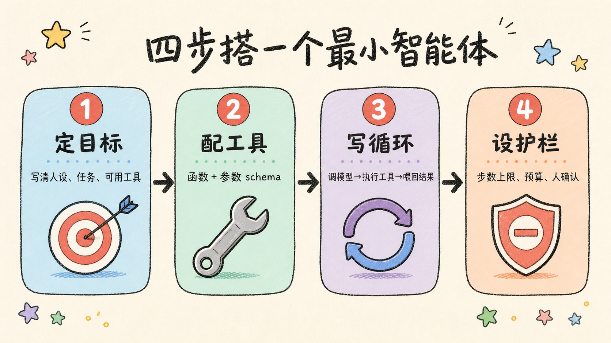
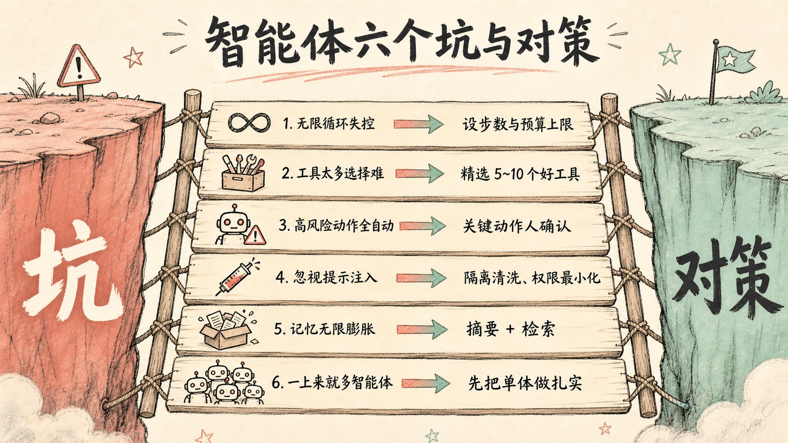

> 聊天机器人是"一问一答"，智能体是"给个目标，它自己想办法一步步做完"。区别不在模型多聪明，而在你给它装了什么手、什么记忆、什么循环。

---

## 先讲结论

1. **智能体 = 大模型 + 工具 + 记忆 + 自主循环。** 它和聊天机器人的本质区别是能"行动"——调用工具改变外部世界，并根据结果自己决定下一步。
2. **决定智能体好不好用的，不是模型多聪明，而是你怎么设计三件事**：工具（能做什么）、上下文与记忆（知道什么）、循环与边界（怎么决策、何时停）。
3. **别一上来就堆多智能体。** 从"单智能体 + 几个可靠工具"起步，按场景逐步加记忆、加规划、加协作，足以解决绝大多数问题。



---

## 一、什么是智能体：从"会聊天"到"会做事"

一次普通的大模型调用是这样的：你问，它答，结束。它不能查今天的天气、不能帮你下单、不能改一行代码——它只会"说"。

智能体的关键升级，是给大模型装上两样东西：一双**手**（工具）和一个**循环**。于是它能：

**感知**（读取任务和工具返回）→ **思考**（决定下一步做什么）→ **行动**（调用某个工具）→ **观察**（看工具返回了什么）→ 再回到思考……如此循环，直到达成目标或触发停止条件。

这个循环，就是智能体的心脏。最经典的形态叫 **ReAct（Reasoning + Acting）**：模型交替地"推理一步、行动一步"，像人做事一样边想边做、边做边调整。

| 维度 | 普通 LLM 调用 | 智能体（Agent） |
|------|--------------|----------------|
| 交互 | 一问一答 | 给目标，自己多步完成 |
| 能力 | 只会生成文本 | 能调工具、改变外部世界 |
| 决策 | 无，答完即止 | 根据工具结果决定下一步 |
| 何时停 | 立刻 | 达成目标 / 触发边界才停 |

一句话：**聊天机器人回答问题，智能体解决问题。**



---

## 二、拆开看：智能体的五大构件

把智能体拆开，你会看到五个部件。模型只有一个，但后面四样都是**你设计**的——这也是"智能体工程"的重点所在。

1. **大脑（LLM）**——推理与决策引擎，负责回答"下一步做什么"。它是唯一你不用自己造的部分。
2. **工具（Tools）**——它的"手"：函数、API、检索、代码执行、浏览器操作。**工具决定了智能体能力的边界**——模型再强，没有工具也只能空想。
3. **记忆（Memory）**——短期记忆是对话上下文窗口；长期记忆靠向量库、文件、数据库。让它记得住跨步骤、跨会话的信息。
4. **规划（Planning）**——把大任务拆成小步骤。简单的靠模型即兴发挥（ReAct），复杂的先出计划再执行（Plan-and-Execute）。
5. **编排 / 循环（Orchestration）**——把上面四者串成一个循环，并管理"何时停"：达成目标、超过步数、超出预算、或遇到需要人确认的高风险动作。

> 记住这句话：**模型是买来的，工具、记忆、循环是你造的。** 智能体工程，就是设计后面这三样。



---

## 三、智能体能做什么：六个典型场景

智能体不是某一个具体产品，而是一副可以套进各种场景的**骨架**。换场景，本质上只是换一组工具和提示词，循环骨架不变。

| 场景 | 它做什么 | 典型工具 |
|------|---------|---------|
| 客服 / 知识问答 | 基于你的文档回答，必要时转人工 | 向量检索（RAG）、工单 API |
| 编码智能体 | 读代码、改代码、跑测试、修 bug（如 Claude Code） | 文件读写、shell、测试执行 |
| 数据分析 | 写并运行代码做统计、画图、下结论 | 代码执行、SQL、pandas |
| 个人助理 | 查日程、订会议、起草回信 | 日历 API、邮件 API、搜索 |
| 研究 / 调研 | 多轮搜索、读网页、汇总成报告 | 网页搜索、抓取、摘要 |
| 运维 / 监控 | 盯指标、发现异常、按预案处置 | 监控 API、告警、脚本执行 |

它们的共同点一目了然：**都是"一个目标 + 一组工具 + 一个循环"**。理解了这一点，你就不会被五花八门的"XX 智能体"名词迷惑——它们底层是同一套东西。



---

## 四、动手做：从最小智能体到按场景选形态

一个能跑的**最小智能体**，只需要四步：

1. **定目标与人设**（system prompt）：你是谁、要完成什么、可以用哪些工具、什么时候该停。
2. **定义工具**：给每个工具写清楚函数和参数 schema，让模型知道"有什么、怎么调"。
3. **写循环**：调用模型 → 如果它要求调用工具，就执行并把结果喂回去 → 否则输出最终答案。
4. **设停止条件与护栏**：最大步数、预算上限、高风险动作要人确认。

核心循环用伪代码表示，就这么短：

```python
messages = [system_prompt, user_goal]
for step in range(MAX_STEPS):          # 护栏：步数上限
    resp = llm(messages, tools=TOOLS)  # 大脑决策
    if resp.tool_calls:                # 要行动
        for call in resp.tool_calls:
            result = run_tool(call)    # 调用工具（你的代码）
            messages.append(result)    # 观察：把结果喂回去
    else:
        return resp.content            # 没有工具调用 = 完成
raise Exception("超出最大步数")         # 兜底停止
```

真正的工程量不在这个循环，而在**工具写得好不好**、**提示词说得清不清楚**、**边界设得稳不稳**。

任务复杂度不同，选的"形态"也不同——**能用简单形态，就别上复杂的**：

| 场景 | 推荐形态 |
|------|---------|
| 简单问答 / 单步 | 单次调用（可加 RAG），根本不需要循环 |
| 多步骤但线性 | ReAct 循环（想一步、做一步） |
| 复杂、步骤多 | Plan-and-Execute（先出计划，再逐步执行） |
| 多种专长 / 要并行 | 多智能体（一个主管把活分给多个子智能体） |

多智能体最灵活，也最难调试和最贵，**放到最后再考虑**。



---

## 五、从入门到高级：进阶要点与避坑

跑通一个 demo 容易，让智能体真正上生产，靠的是下面这些**工程**功夫：

- **记忆管理**：上下文会爆，要做摘要、压缩、检索式记忆，而不是把所有历史硬塞进窗口。
- **工具设计**：工具要幂等、错误信息可读、参数清晰——工具烂，再聪明的模型也白搭。
- **可观测性**：记录每一步的思考与调用（trace），否则出了问题根本无法归因。
- **评估（evals）**：给智能体建一套测试集，每改一版就跑一遍，别靠"感觉它变好了"。
- **人在环（human-in-the-loop）**：付款、删库、发邮件这类高风险动作，必须留人确认。
- **成本与延迟**：每一步都是一次模型调用，循环越长越贵越慢，一定要设预算。
- **安全**：权限最小化 + 防提示注入——工具返回的内容可能本身就是攻击载荷。

几个最常见的坑，每个都配一条对策：

| 坑 | 对策 |
|----|------|
| 无限循环 / 失控 | 设最大步数 + 预算上限 |
| 工具太多、选择困难 | 精选 5~10 个高质量工具 |
| 高风险动作全自动 | 关键动作人在环确认 |
| 忽视 prompt injection | 隔离清洗工具返回内容、权限最小化 |
| 记忆无限膨胀 | 摘要 + 检索，别塞满上下文 |
| 一上来就多智能体 | 先把单智能体做扎实 |



---

## 总结

1. **智能体 = 大脑（LLM）+ 工具 + 记忆 + 自主循环**；本质是"会行动"，而不只是"会说话"。
2. **重点不是模型，而是你设计的工具、记忆、循环与边界**——这才是智能体工程的主战场。
3. **换场景 = 换工具和提示词，循环骨架不变**；六大场景都是同一副骨架。
4. **从最小智能体起步**（目标 + 工具 + 循环 + 停止条件），能用简单形态就别急着上多智能体。
5. **进阶靠工程**：记忆管理、可观测性、评估、人在环、安全——这些决定它能不能真正上生产。

> 智能体不是更聪明的聊天机器人，而是"会自己动手把事做完"的系统。先跑通一个最小循环，你就已经上路了。

---

**参考阅读**：

- Anthropic, *Building Effective Agents*——工作流与智能体的设计模式，值得反复读
- Yao et al., *ReAct: Synergizing Reasoning and Acting in Language Models*——ReAct 循环的原始论文
- Claude Code / 各家 Agent SDK 文档——现成的智能体骨架，边用边学最快
- LangChain / LlamaIndex 文档——工具、记忆、检索的现成实现参考
