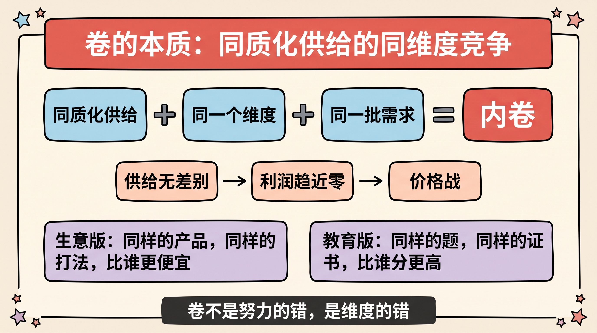
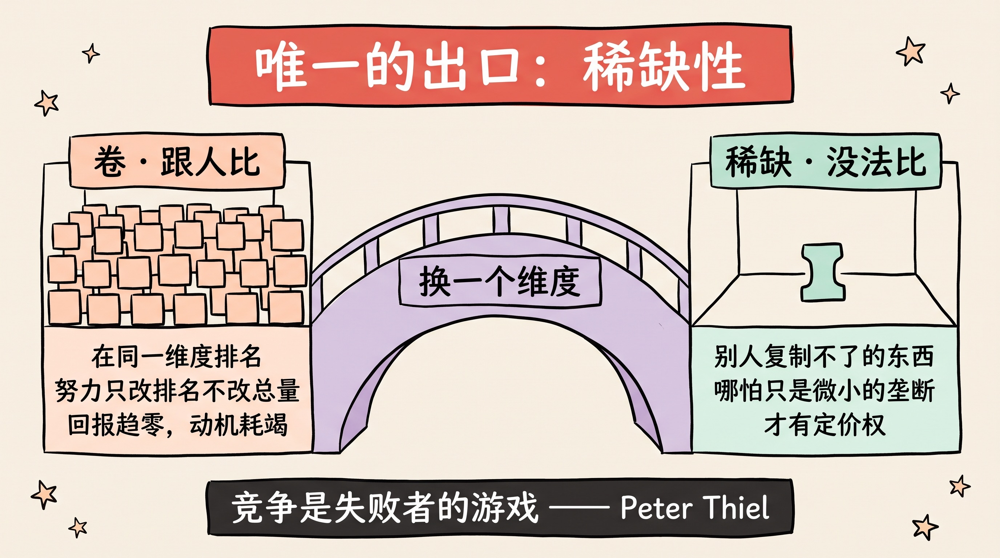
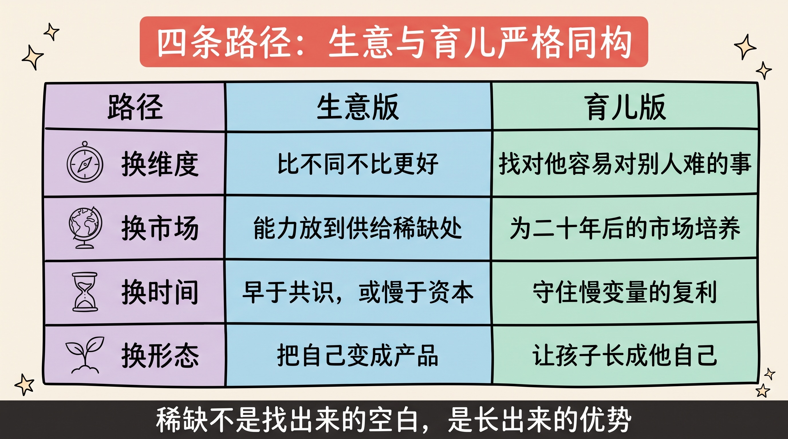
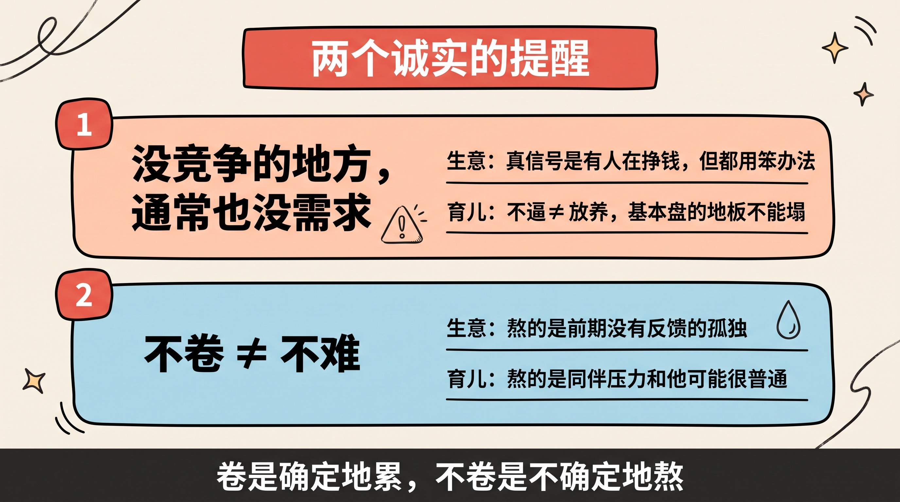
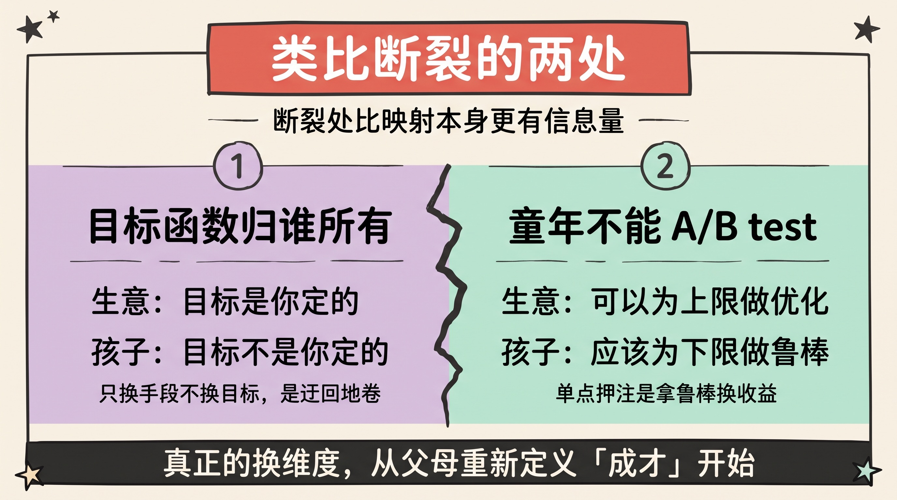
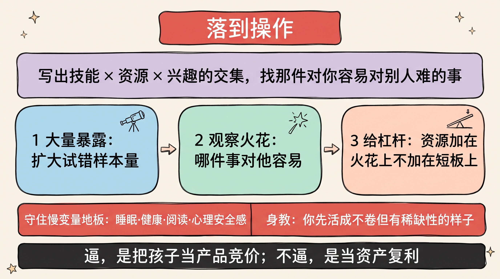

> 卷的反义词不是躺平，而是稀缺。不卷挣钱与不逼成才，是同一道题的两次求解：把「跟人比」换成「没法比」。

最近反复在想两个问题：中国几乎所有生意都卷得不行，有没有办法不卷但还能挣钱？转念一想，育儿是同一道题——不逼孩子，怎么让他成才？

把这两个问题并排放着看，会发现它们不仅像，而且在逻辑上**严格同构**。这篇文章就用同一套框架，把两道题一起拆完。

---

## 一、卷的本质：同质化供给的同维度竞争

先把「卷」定义清楚，否则讨论没有抓手：

**卷 = 同质化的供给，在同一个维度上，抢同一批稀缺的需求。**

经济学里这叫完全竞争：当供给彼此没有差别时，利润必然趋近于零，终点是价格战。教育版一模一样：所有孩子刷同样的题、考同样的级、堆同样的简历，在「分数」这一个维度上抢固定的名额——回报趋零，还附赠动机耗竭。

这里有个容易被忽略的要点：**卷不是努力的错，是维度的错。** 当所有人挤在同一维度上时，努力只能改变你的排名，不能改变回报的总量。这是标准的军备竞赛结构：每个人的理性选择（多刷一小时题、再降一块钱价），加总起来是所有人的集体困境。

所以「要不要卷」是个假问题。真问题是：**怎么离开这个维度。**

---

## 二、唯一的出口：稀缺性

Peter Thiel 在《Zero to One》里那句被引用烂了的话，放在这里刚好：**竞争是失败者的游戏（Competition is for losers）。**

挣钱靠的从来不是竞争，而是某种别人短期内复制不了的稀缺性——哪怕只是一点点微小的「垄断」：独特的定位、稀缺的信任、时间的积累、不可复制的个人风格。

成才同理。一个人立得住，靠的不是「比别人分数高」，而是某种不可替代性。

沿着「稀缺性从哪来」这个问题拆下去，路径只有四条。

---

## 三、四条路径：生意与育儿的同构

### 路径一：换维度——比不同，不比更好

**生意版**：差异化不是「做得更好」，而是「做得不同」。比「更好」就是卷，比「不同」才有定价权。关键问题从来不是「我怎么赢过他们」，而是「我在哪个维度上没有对手」。这也是我在[《生意赚钱的三个核心逻辑》](/posts/business-money-logic/)里写的第二问：你凭什么与众不同。

**育儿版**：不是把短板卷到平均线，而是找到孩子「天赋 × 气质 × 兴趣」的独家组合——那件**对他容易、对别人难**的事。父母的角色是侦察兵，不是教练：大量暴露、观察火花出现在哪，然后加杠杆。

### 路径二：换市场——把供给放到稀缺的地方去

**生意版**：国内几乎所有行业都供给过剩，但同样的执行力、供应链、工程能力，放到供给稀缺的市场就是降维。出海是一条（不止跨境电商——SaaS、内容、数字产品都算），利基是另一条：市场小到大玩家看不上、但足够养活你，也就是隐形冠军的逻辑——**在一厘米宽的市场里做到一公里深**。

**育儿版**：孩子真正进入的「市场」在二十年后。逼孩子的家长，其实是在为一个即将消失的市场优化——解题速度、标准答案、信息记忆，恰好是 AI 正在清零的维度。二十年后依然稀缺的是：品味、判断力、提问能力、可信度、内驱的行动力。这就是[《站在未来看现在》](/posts/view-from-the-future/)的逻辑，只是标的从投资换成了孩子。

### 路径三：换时间——要么早，要么慢

**生意版**：早，是在共识形成前进场（AI 应用层现在就处在「人人都说重要、多数人还没动手」的窗口）；慢，是做资本等不起的事——信任、品牌、内容复利。卷是存量市场里的即时竞争，**时间差本身就是护城河**。

**育儿版**：成才靠的全是慢变量——阅读、健康、心理安全感、和世界的真实接触，全是复利资产。而抢跑是即时竞争，不复利，还经常**从长期账户借债**：透支的正是内驱力和亲子信任。我在[《养孩子，到底在养什么》](/posts/raising-children/)里写的五个核心，全部落在慢变量这一栏。

### 路径四：换供给形态——把自己变成产品

**生意版**：Naval 说的 specific knowledge：审美、判断力、信任、个人风格，这类供给天然不可复制。「一人公司 + AI 杠杆」让这条路的启动成本处在历史最低点。

**育儿版**：这条是核心。成才的终局是**孩子长成他自己**——因为「做他自己」是唯一没人能跟他卷的赛道。而内驱力有个残酷的特性：只能被保护，不能被逼出来。逼，本质上是用外部动机置换内部动机，置换率极差（这是自我决定论半个世纪的核心结论）。用 Alison Gopnik 的比喻：父母是园丁，不是木匠——你负责土壤和气候，不负责雕刻形状。

四条路径放在一张表里：

| 路径 | 生意版 | 育儿版 |
|------|--------|--------|
| 换维度 | 比不同不比更好，找没有对手的定位 | 找「对他容易、对别人难」的天赋组合 |
| 换市场 | 供给过剩处的能力 → 供给稀缺处变现 | 为二十年后的市场培养，不为正在消失的维度优化 |
| 换时间 | 早于共识进场，或慢于资本积累 | 守住慢变量：阅读、健康、心理安全感的复利 |
| 换供给形态 | 把自己变成产品，天然不可复制 | 让孩子长成自己——唯一无人能卷的赛道 |

---

## 四、两个诚实的提醒

**提醒一：完全没竞争的地方，通常也没需求。**

生意上，真正值得进的信号不是「蓝海」，而是「有人在挣钱，但所有人都在用同一种笨办法挣钱」。育儿上的对应是：**不逼 ≠ 放养**。读写、数学、纪律、健康这些基本盘是工具不是排名，这个地板不能塌。逃离的是「同维度军备竞赛」，不是「基础教育」本身。

**提醒二：不卷 ≠ 不难。**

它只是把难度从「跟人消耗」换成了「忍受不确定」。**卷是确定地累，不卷是不确定地熬。**

生意上，熬的是前期没有反馈的孤独；育儿上，熬的全在父母这边——顶住「别的家长都在报班」的同伴压力，接受「他可能就是个普通人」的可能性。多数人选卷，不是因为卷有效，而是因为逼孩子**缓解的是家长自己的焦虑**，而熬比累更反人性。

反过来说，正因为多数人熬不住，不卷的路径才能长期有效——反共识的空间就在这里。

---

## 五、类比断裂的两处（也是最重要的两处）

框架映射得再工整，也要诚实地标出它断裂的地方。恰好，断裂处比映射本身更有信息量。

**断裂一：目标函数的归属不同。**

生意的目标是你定的，孩子的不是。如果「不逼」只是你更聪明地通往同一个目标——还是名校、还是你定义的成才——孩子会闻出来。那不是不卷，只是迂回地卷。**真正的换维度，发生在父母重新定义「成才」这个词的那一刻。**

**断裂二：生意可以试错重开，童年不能 A/B test。**

所以策略要反过来：生意可以为上限做优化，孩子应该**为下限做鲁棒**。健康、心理安全感、学习力是反脆弱资产；任何单点押注（比如把一切压在竞赛路线上）都是拿鲁棒性换收益的脆弱化操作——这是[《系统思维与反脆弱》](/posts/systems-thinking-antifragile/)在育儿上最该用的地方。

---

## 六、落到操作

**生意，一道题**：写出你的「技能 × 资源 × 兴趣」的交集，在里面找那件「对你容易、对别人难」的事。不卷的生意很少是「找」出来的空白市场，几乎都是「长」出来的个人优势。

**育儿，三件事加两条底线**：

1. **大量暴露**——扩大试错的样本量，书、工具、人、真实世界都算；
2. **观察火花**——留意哪件事「对他容易、对别人难」，那是天赋在报信；
3. **给杠杆**——火花出现后，把资源加在那里，而不是加在短板上。

两条底线：守住慢变量的地板（睡眠、健康、阅读、心理安全感）；以及**身教**——你自己先活成「不卷但有稀缺性」的样子，这比任何道理都可信。

---

## 写在最后

- 卷 = 同质化供给在同一维度上的存量竞争，出口只有一个：稀缺性；
- 四条路径：换维度、换市场、换时间、换供给形态——生意与育儿严格同构；
- 不卷 ≠ 不管，不卷 ≠ 不难：本质是把「确定的累」换成「不确定的熬」；
- 类比断裂的两处最重要：目标函数归孩子所有；为下限做鲁棒，不为上限做优化；
- 一句话总结：**逼，是把孩子当产品去竞价；不逼，是把孩子当资产去复利。**

## 参考资源

- Peter Thiel, *Zero to One*（从 0 到 1）
- *The Almanack of Naval Ravikant*（纳瓦尔宝典）
- Hermann Simon, *Hidden Champions*（隐形冠军）
- Alison Gopnik, *The Gardener and the Carpenter*（园丁与木匠）
- Nassim Taleb, *Antifragile*（反脆弱）
- Edward Deci & Richard Ryan, Self-Determination Theory（自我决定论）
- 站内相关：[生意赚钱的三个核心逻辑](/posts/business-money-logic/) · [站在未来看现在](/posts/view-from-the-future/) · [养孩子，到底在养什么](/posts/raising-children/) · [系统思维与反脆弱](/posts/systems-thinking-antifragile/)
