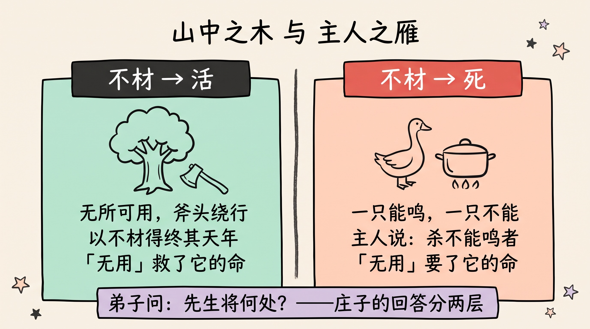
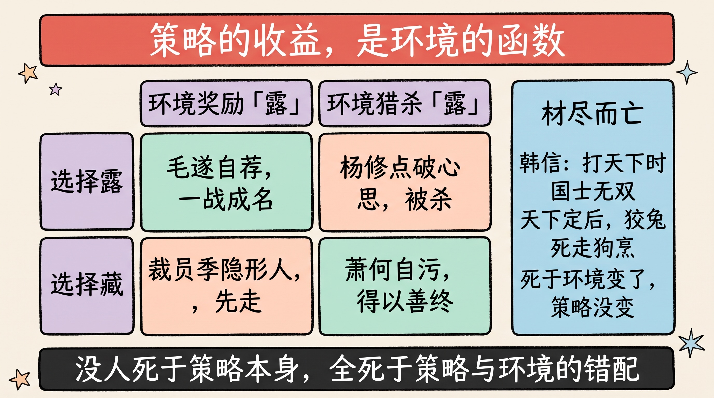
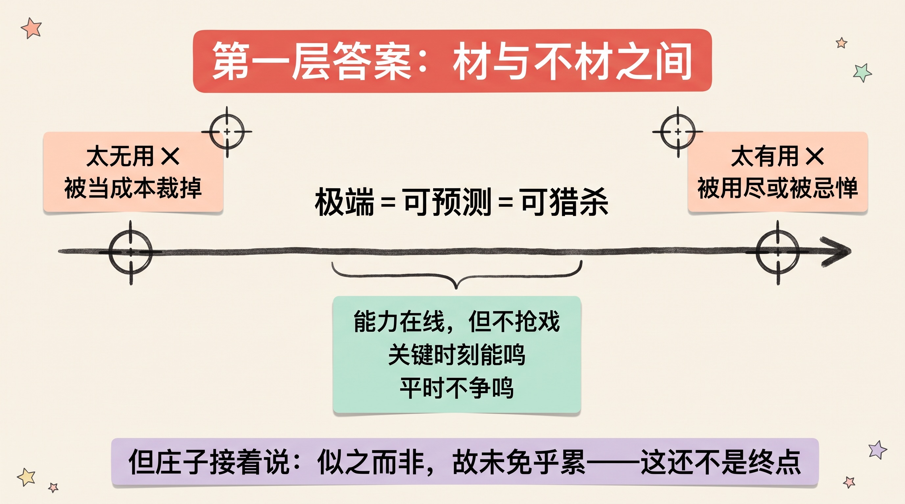
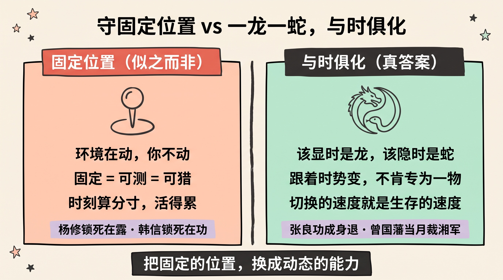
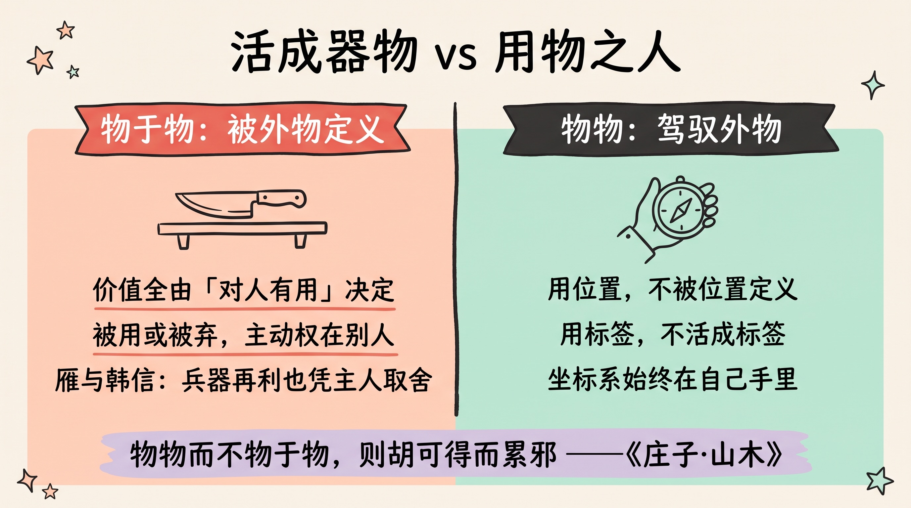
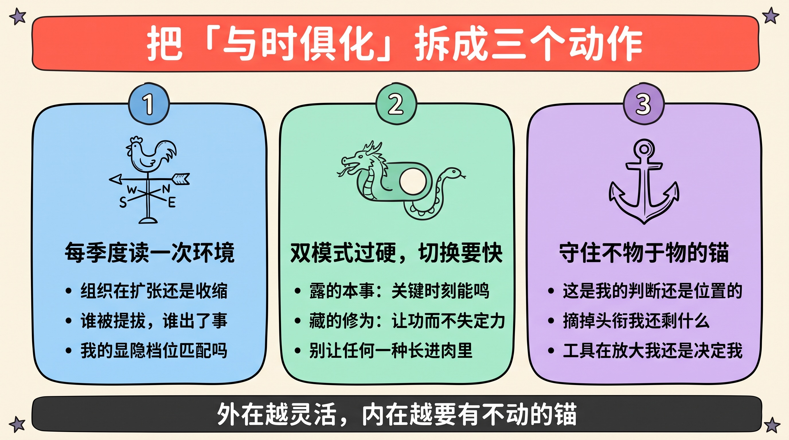

> 山中的大树，因为不成材，躲过了斧头，活满了天年。
>
> 主人家的雁，因为不会叫，被第一个宰了待客。
>
> **同样是「无用」，一个因此活，一个因此死。** 学生问庄子：先生，那到底该做有用的，还是无用的？庄子笑着给了一个答案——然后紧接着，又亲手把这个答案推翻了。被推翻后的那一层，才是这则两千年前的故事里，最值钱的东西。

---

## 先讲结论

1. **不存在永远安全的策略。** 大树以「不材」保命，雁以「不材」丧命——**同一个特质，在不同环境里的收益是相反的**。锋芒毕露有杨修的死法，藏拙守分有雁的死法。任何把「藏」或「露」奉为铁律的处世学，都只讲对了一半场景。
2. **「材与不材之间」只是第一层答案，庄子自己都说它「似之而非」。** 因为「中间」仍然是一个**固定的位置**，而环境是流动的——今天的安全区，明天可能就是靶心。守着任何一个固定刻度的人，迟早被变化的世界清算。
3. **真正的答案是「一龙一蛇，与时俱化」：把固定的位置，换成动态的能力。** 该显时能显，该隐时能隐，切换自如、不被任何一种形态锁死——并且始终「**物物而不物于物**」：使用位置、标签和工具，而不被它们定义。

---

## 一、一棵树与一只雁：同一种策略，两种命运

故事出自《庄子·山木》，结构精巧得像一道刻意设计的思想实验。

**上半场，在山里。** 庄子带着弟子走山路，看见一棵巨大的树，枝叶繁茂，长势惊人。奇怪的是，伐木的人就站在树旁，却看都不看它一眼。庄子问为什么，伐木人说：这树是散木，**「无所可用」**——做船船沉，做棺材烂得快，做器具不结实。庄子回头对弟子说：你们看，**这棵树正因为「不成材」，才得以活满它的天年。**

如果故事停在这里，它就是我们熟悉的那个庄子——「无用之用，方为大用」，不争、藏拙、全身远祸。

**下半场，在山下。** 当晚，庄子一行借宿在老朋友家。主人高兴，吩咐童仆杀雁款待。童仆问：咱家两只雁，**一只会叫，一只不会叫，杀哪只？** 主人说：**杀那只不会叫的。**

会叫的雁能看家护院，是「有用」的，留下；不会叫的雁没有用处，先死。——**上午还在救命的「无用」，到了晚上就成了死刑判决书。**

**第二天，弟子憋不住了**，问出了那个我们每个人都想问的问题：

> 「昨日山中之木，以不材得终其天年；今主人之雁，以不材死。**先生将何处？**」
>
> ——山里的树因为无用而活，主人的雁因为无用而死。先生，您打算站在哪一边？

这个问题，本质上是在向老师索要一条**普适的处世铁律**：您就告诉我，到底该「有用」还是「无用」，该露还是该藏？给我一个能用一辈子的标准答案。

庄子笑了。他的回答分两段——**大多数人只记住了第一段，而真正的答案在第二段。** 我们一层一层来。

---

## 二、为什么没有一招鲜：策略的收益，是环境的函数

先别急着看庄子的答案，先把弟子的困惑拆透——因为这个困惑本身，就藏着大多数人处世翻车的根源。

弟子的思维方式是：**策略 → 结果**。好像「藏拙」或「露才」这个策略本身，自带一个固定的好坏属性。但树和雁的对照恰恰证明：

> **决定策略生死的，从来不是策略本身，而是「策略 × 环境」的匹配。**
>
> 同一个策略，换一个环境，收益直接翻转符号。

把这个矩阵摆开，历史上的名字会自动对号入座：

| | 环境奖励「露」时 | 环境猎杀「露」时 |
|---|---|---|
| **选择露** | 毛遂自荐，一战成名 | **杨修**：屡屡点破曹操心思，被杀 |
| **选择藏** | 裁员季的「隐形人」，第一批走 | 萧何自污名节，得以善终 |

再加上第三种最容易被忽略的死法——**「材尽而亡」**：韩信在楚汉相争时是「国士无双」，有用到刘邦离不开他；天下已定，他的「用」被耗尽，狡兔死、走狗烹。**他不是死于无用，是死于「曾经太有用，而如今用完了」。**

三种死法摆在一起，规律就浮出来了：

- 杨修死于**在猎杀锋芒的环境里露**（曹操晚年多疑，容不下被看穿）；
- 雁死于**在检验价值的环境里藏**（主人家只养「有产出」的家禽）；
- 韩信死于**环境变了，策略没变**（打天下需要战神，坐天下需要顺臣）。

**没有一个死于策略「本身错了」，全部死于策略与环境的错配。** 这就是为什么一切「永远要低调」或「永远要敢于表现」的成功学，注定害人——它们把一个**条件依赖**的答案，包装成了**无条件**的铁律。

> 用工程的话说：**策略的收益不是常数，是环境的函数。** 把函数当常数用，就是大多数聪明人栽跟头的方式。

---

## 三、第一层答案：材与不材之间

现在看庄子回答的第一段：

> **「周将处乎材与不材之间。」**
>
> ——我庄周啊，会把自己放在「成材」与「不成材」**之间**。

先承认，作为第一层答案，它已经比弟子的二选一高明得多。它至少说对了三件事：

**其一，两个极端都是靶子。** 太有用，会被当工具用到死，或被当威胁除掉；太无用，会被当成本裁掉。**极端意味着可预测，可预测意味着可猎杀。** 「之间」首先是在降低自己被一眼看穿、一枪打死的概率。

**其二，「之间」不是平庸，是「有本事而不扎眼」。** 处在材与不材之间的人，大致长这样：

- **能力在线，但不抢戏**——活儿拿得出手，功劳不四处认领；
- **关键时刻能鸣**——像那只留下的雁，该出声时出得了声，证明自己不可裁；
- **平时不争鸣**——不在每件事上刷存在感，不做那个「屡屡猜中曹操心思」的人。

用今天的职场语言翻译：**让老板离不开你，但别让老板忌惮你；让裁员名单绕开你，但别让斗争的火力对准你。**

**其三，它是一个「度」的智慧，而不是一个「点」的位置。** 藏三分露七分还是藏七分露三分，取决于场合——这已经隐隐指向了动态。

到这里，大部分讲「木雁之间」的文章就收尾了：学会中庸，把握分寸，完。

**但庄子的原文，恰恰在这里才真正开始。** 因为他说完这句话，紧接着补了一句让所有想抄答案的人措手不及的话。

---

## 四、庄子亲手推翻了自己：「似之而非，故未免乎累」

《山木》原文里，「周将处乎材与不材之间」的下一句是：

> **「材与不材之间，似之而非也，故未免乎累。」**
>
> ——「之间」这个位置，看起来对，其实还是不对；守着它，依然免不了被拖累。

为什么？庄子看得极深：**因为「之间」仍然是一个固定的位置。** 只要你的策略是静态的——哪怕它精妙地卡在正中间——它就有三个致命弱点：

1. **环境在动，你不动。** 「中间」是相对两端画出来的，可环境一变，两端就挪了位，昨天的安全中点，今天可能正好落在火力覆盖区。扩张期的组织奖励出头鸟，收缩期的组织既裁「不能鸣者」、又斗「太能鸣者」——**同一家公司，两年之间，「之间」的位置能挪出十万八千里。**
2. **固定即可测，可测即可猎。** 你永远「适度表现」，久了别人就能精确预判你、利用你、给你画像。**任何被看穿的策略，都会被针对**——这是博弈论最朴素的结论。
3. **守位置的人，心是悬着的。** 时刻计算「我现在露了几分、藏了几分」，跟李斯时刻计算「怎么保住丞相位」是同一种活法——**被策略奴役，患得患失，此谓之「累」。**

那不守固定位置，守什么？庄子给出了第二层、也是真正的答案：

> **「若夫乘道德而浮游则不然……一龙一蛇，与时俱化，而无肯专为。」**
>
> ——该腾跃时是龙，该蛰伏时是蛇，**跟着时势一起变化，绝不肯把自己固定成任何一种东西。**

看懂这两层的区别，整则故事才算读完：

| | 第一层答案 | 第二层答案 |
|---|---|---|
| 核心 | 材与不材**之间** | 一龙一蛇，**与时俱化** |
| 本质 | 一个**固定的位置** | 一种**动态的能力** |
| 你在守什么 | 一个精妙的刻度 | 对环境的持续感知 + 切换的自由 |
| 弱点 | 环境一变就失效；久了被看穿 | ——它本身就是为变化而生的 |
| 状态 | 悬着心计算分寸（累） | 从容（游刃有余的「游」） |

**历史给这两层答案各留了一组样本。** 守固定策略的：杨修固定在「露」，死；韩信在环境翻转后固定在「功高」，死。而与时俱化的：**张良**，打天下时运筹帷幄（龙），天下定后即刻称病隐退、闭门学道（蛇），善终；**曾国藩**，平太平天国时手握重兵锋芒毕露（龙），攻下南京的**当月**就主动上疏裁撤湘军、自去兵权（蛇），在功高震主的死局里全身而退。

张良和曾国藩不是找到了更好的「位置」——**他们是根本不守位置的人。环境要龙，他们是龙；环境容不下龙，他们立刻是蛇。** 切换之快、之彻底，让「狡兔死走狗烹」的剧本在他们身上失效。

> 这也正是[《反脆弱》](../systems-thinking-antifragile/)那篇里的结论换了个古典的说法：**在不确定的世界里，最优解不是找到最坚固的姿势，而是保持可变。** 庄子比塔勒布早说了两千三百年。

---

## 五、比藏露更深一层：物物而不物于物

《山木》这一段的收尾，还有一句常被漏掉的话，它把整个讨论又抬高了一层：

> **「物物而不物于物，则胡可得而累邪！」**
>
> ——**驾驭外物，而不被外物驾驭**（把东西当东西用，而不让自己活成一件被用的东西），那还有什么能拖累你呢？

这句话戳破了「材/不材」这个问题的底层：**弟子问的其实是「我该把自己做成一件什么样的器物，才不会被扔掉或用坏」——而庄子说，错了，问题不在做哪种器物，在于你根本不该把自己活成器物。**

「材」这个字本身就暴露了视角：**材是从用它的人眼里看出来的。** 树对伐木人是「材」，雁对主人是「菜」。只要你的价值完全由「对别人有没有用」来定义，你就永远活在别人的取舍里——被用，或被弃，主动权都不在你手上。

- **雁的悲剧**不是不会叫，是它的生死完全由「主人要不要」决定；
- **韩信的悲剧**不是功高，是他把自己活成了刘邦手里的一件兵器——兵器再锋利，也是收进库房还是回炉重铸，全凭主人；
- 我在[《李斯与两只老鼠》](../granary-rat-positioning/)里写过同构的结论：**李斯把自己活成了「丞相之位」的附属品，位置一动摇，人就碎了。**

「物物而不物于物」翻译成今天的话：

> **用位置，而不被位置定义；用标签，而不活成标签；用工具，而不沦为工具。**
>
> 你可以在公司里做一颗高效的螺丝钉，但你心里得始终有自己的坐标系——自己的目标、判断与去留的自由。**「器」是你的用法，不是你的本体。**

这一层在今天有个格外应景的注脚：AI 时代人人都在问「我会不会被替代」——这个问题本身就是「材」的视角，是在问「我这件工具还有没有用」。而庄子式的问法是反过来的：**我如何始终是那个「用工具的人」？** 工具越强大，「物物而不物于物」的人杠杆越大；把自己活成工具的人，才真正处在被替换的队列里。

---

## 六、实操：把「与时俱化」拆成三个动作

道理讲完，落地。「一龙一蛇」听起来玄，拆开其实是三个可以练的动作。

### 动作一：每季度读一次环境——现在什么被奖励，什么被猎杀

与时俱化的前提是**看得见「时」**。定期问三个问题：

1. **我所在的组织/行业处在什么周期？** 扩张期（奖励出头、抢地盘）还是收缩期（猎杀显眼者、清理无用者）？
2. **最近被提拔的是什么人？最近出事的是什么人？** 这两份名单，比任何官方口号都诚实地告诉你当前的奖惩函数。
3. **我现在的「显隐档位」，和环境匹配吗？** 扩张期你在蛰伏，是浪费行情；收缩期你在高调，是自己走向靶心。

### 动作二：把「藏与露」都练成真本事，并把切换成本降到最低

「与时俱化」不是墙头草的见风使舵——**蛇形态不是躺平，龙形态不是表演。** 它要求两种硬能力同时在线：

- **露的能力**：真拿得出手的活、关键时刻能站出来「鸣」的实力与勇气——这是你「该当龙时」的本钱；
- **藏的能力**：把功劳让出去的胸襟、退到幕后仍能沉住气做事的定力——这是你「该当蛇时」的修为；
- **切换的能力**：最难的是这个。多数人不是不懂该切换，是**切不动**——高调惯了放不下面子，低调惯了鼓不起勇气。平时就要小步练习两种模式，别让任何一种「长进肉里」。

曾国藩裁湘军之所以是千古级操作，不在「裁」这个决定，而在**攻下南京当月就裁**——切换之果断，没有一天的贪恋。**切换的速度，就是生存的速度。**

### 动作三：守住「不物于物」的锚——三个自检问题

动态不等于没有内核。恰恰相反，**外在越是灵活，内在越需要一个不动的锚**，否则「与时俱化」会滑向无原则的投机。定期自检：

1. **我最近做的事，是我的判断，还是纯粹「位置要求我这样」？**（防止被位置物化）
2. **如果明天摘掉现在的头衔和标签，我还剩下什么、还想做什么？**（防止被标签物化）
3. **我用的工具/平台/方法论，是在放大我的目标，还是在替我决定目标？**（防止被工具物化）

三问的本质是同一件事：**确认「用」与「被用」的方向，始终是从你指向外物，而不是反过来。**

---

## 总结

1. **没有永远安全的策略**：树以不材活，雁以不材死，韩信以「材尽」亡——策略的收益是环境的函数，把函数当常数用，是聪明人最常见的死法。
2. **「材与不材之间」只是第一层**：它教会你别做极端的靶子，但它仍是一个固定位置——庄子自己都说「似之而非，故未免乎累」。守任何固定刻度的人，都会被移动的环境清算。
3. **真答案是「一龙一蛇，与时俱化」**：把固定的位置换成动态的能力——持续读环境、双模式都过硬、切换快且彻底。张良与曾国藩赢在「不守位置」，杨修与韩信输在「锁死形态」。
4. **最深一层是「物物而不物于物」**：别把自己活成一件等人取舍的器物。用位置、用标签、用工具，但坐标系始终在自己手里——这是灵活外表下那个不动的锚。

最后，回到山里那棵树和主人家那只雁。

弟子以为老师会挑一边站，庄子却笑了——因为这个问题本身问错了。**树和雁都没得选，它们被自己的形态锁死了；而人之所以为人，就在于可以不被锁死。**

> 木以不材终其天年，雁以不材死于庖厨。
>
> **真正的处世高手，不在木雁之间选一个位置——而在让自己永远保有变化的自由。位置是死的，「化」是活的；守位置的人被时代筛选，会变化的人与时代共舞。**

---

**参考阅读**：

- 《庄子·山木》——木雁故事、「材与不材之间」「一龙一蛇，与时俱化」「物物而不物于物」的原始出处
- 《史记·留侯世家》《曾国藩家书》——张良功成身退、曾国藩自裁湘军：「与时俱化」的两个历史样本
- 本站相关：[李斯与两只老鼠](../granary-rat-positioning/)——同构的结论：用粮仓，而不被粮仓定义
- 本站相关：[系统思维与反脆弱](../systems-thinking-antifragile/)——不确定世界里，可变性比坚固更重要
- 本站相关：[站在未来看现在](../view-from-the-future/)——别押注单一未来，构建在多个未来里都不亏的仓位
