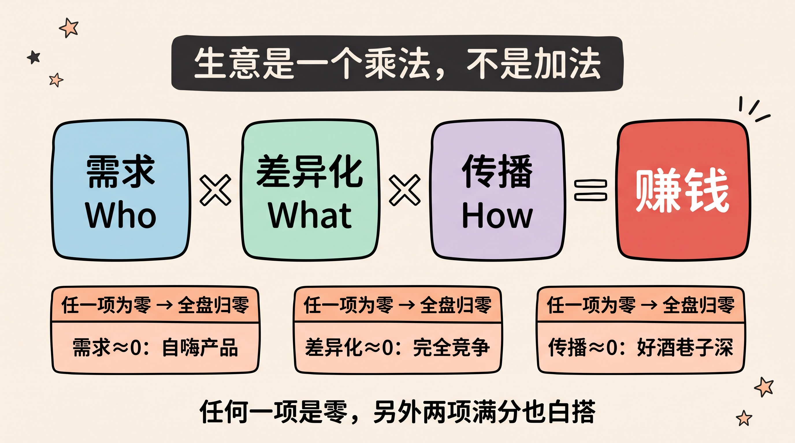
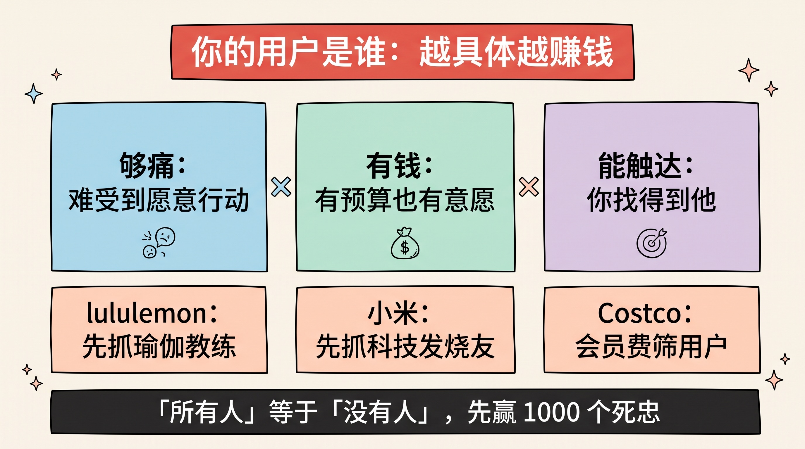
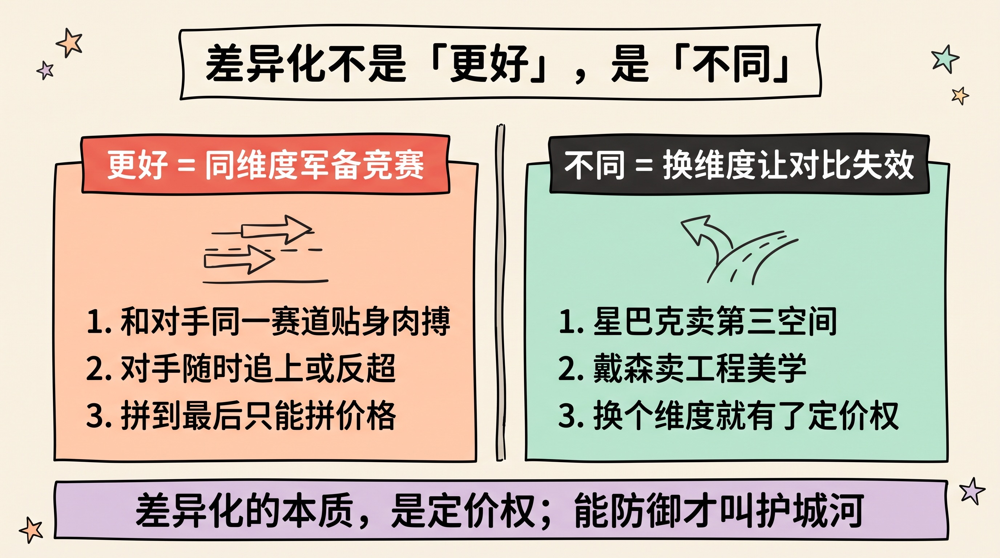
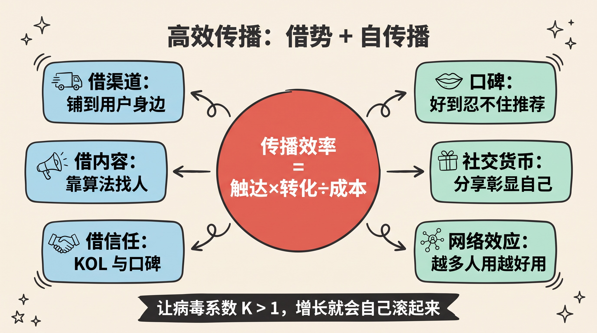
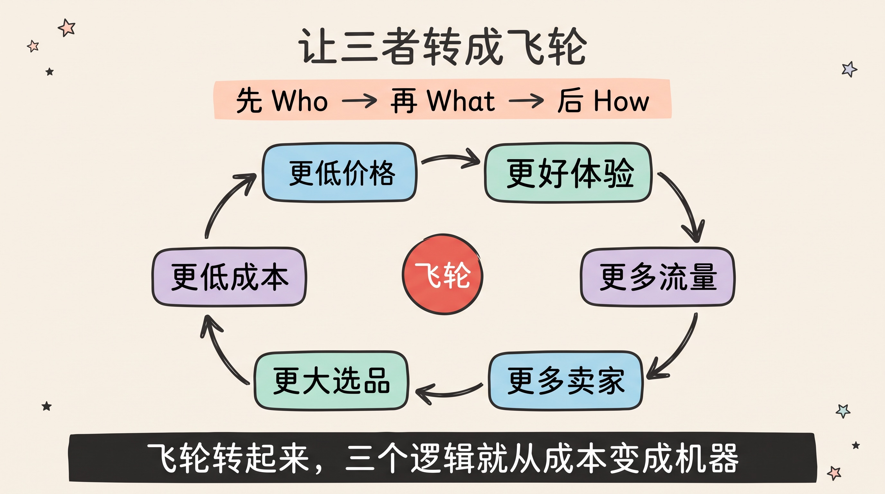
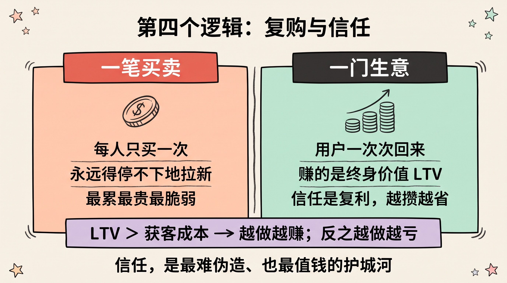

> 大多数生意失败，不是因为老板不努力，而是因为在一个错误的问题上拼命努力。
>
> 赚钱这件事，其实只有三个真问题：**你的用户是谁？你凭什么和别人不一样？你怎么让他们高效地知道？** 想清楚这三个，剩下的都是执行。

---

## 先讲结论

1. **生意是一个乘法，不是加法**：`赚钱 ≈ 需求 × 差异化 × 传播效率`。三项里任何一项接近零，整体就接近零——再努力也白搭。
2. **顺序不能反**：先搞清楚**为谁**（用户），再决定**做什么**（差异化产品），最后才谈**怎么让人知道**（传播）。反过来做，就是拿着锤子满世界找钉子。
3. **三个逻辑之上还有第四个**：复购与信任。前三条决定你能不能做成**一笔**生意，第四条决定你能不能做成**一门**生意——把一次性买卖，变成有复利的资产。



---

## 一、先把生意拆成一个乘法

在谈三个逻辑之前，先建立一个底层模型，否则三条会散成三句正确的废话。

赚钱这件事，本质可以拆成两个动作：**创造价值**，然后**捕获价值**。你先为某些人创造出他们想要的东西，再想办法把其中一部分价值收回到自己口袋。用户的三个问题，恰好卡在这条链条的三个关键节点上：

```text
创造价值 ──────────────►  捕获价值
  ├─ 为谁创造？  → 用户是谁（需求）
  ├─ 创造什么？  → 差异化商品（供给）
  └─ 怎么送达？  → 高效传播（分发）
```

这里最关键的认知是：**这三者是乘法关系，不是加法关系。**

| 哪一项趋近于零 | 会发生什么 | 典型死法 |
|--------------|-----------|---------|
| 需求 ≈ 0 | 做了个没人真正需要的东西 | "我觉得很酷"的自嗨型产品 |
| 差异化 ≈ 0 | 和所有人一样，只能拼价格 | 陷入完全竞争，利润被磨到零 |
| 传播 ≈ 0 | 好东西没人知道 | "酒香也怕巷子深"，默默死掉 |

加法允许你用长板补短板——某一项特别强，可以拉高总分。乘法不行：**任何一项是零，另外两项再满分，结果都是零。** 这就是为什么"产品很好但公司倒了""流量很大但不赚钱"的故事到处都是——他们在一个乘法题里，交了一张有零分项的答卷。

> 记住这个乘法模型。后面每一章，本质都是在回答"如何让这一项不为零，并尽可能大"。

---

## 二、第一逻辑 · Who：你的用户是谁

### 为什么这是第一个、也是最容易被跳过的问题

几乎所有创业者都能滔滔不绝讲自己的产品有多好，却答不上来一个简单问题：**这东西到底是卖给谁的？** 你若追问，得到的答案往往是"所有人""年轻人""有需要的人"。

而这，恰恰是最危险的答案。

> **"所有人"在商业上约等于"没有人"。**

因为资源是有限的。当你想服务所有人，你的产品、定价、渠道、话术就必须取所有人的最大公约数——结果是对每一个人都不够好，对每一群人都没有吸引力。而生意的利润，恰恰来自"对某一群人特别好"。

### 第一性原理：需求 = 够痛 × 有钱 × 能触达

一个值得做的用户需求，必须同时满足三个条件，缺一不可：

| 要素 | 含义 | 反例 |
|------|------|------|
| **够痛（真需求）** | 这个问题让他难受到愿意行动，而不只是"有了也不错" | 伪需求：调研时都说好，掏钱时都不买 |
| **有钱（支付力）** | 他有能力也有意愿为解决它付费 | 需求真实但人群没预算，做慈善不是做生意 |
| **能触达（可达）** | 你有办法找到并接触到这群人 | 人群存在但极度分散，获客成本高到不可能盈利 |

很多人只盯着第一个"痛"，忽略了后两个。**痛而没钱、或痛而找不到，都不是好生意。** 三者相乘，才圈出一个真正能赚钱的人群。

### 越具体，越赚钱

好的用户定义，应该具体到你能在脑子里想象出一个活生生的人：他多大、在哪、为什么烦、现在用什么凑合的方案、愿意花多少钱。

- **lululemon** 没有说"我卖运动服给所有人"。它锁定的是"热爱瑜伽、追求生活方式、愿意为品质付高价的都市女性"，先从瑜伽馆的教练这群"超级用户"打起。
- **小米** 早期不服务"所有想买手机的人"，只服务"愿意刷论坛、参与内测、追求性价比的科技发烧友"，用一小群狂热用户撬动口碑。
- **Costco** 干脆用会员费筛选用户：它只服务"愿意为长期低价预先付费的中产家庭"，主动把只想占便宜、不复购的人挡在门外。

看出规律了吗？**他们都在做减法，而不是加法。** 先锁死一小群"有钱且够痛"的人，把他们伺候到极致，让他们成为你的传播节点，再慢慢向外扩。

> 一个残酷但有用的检验：如果你的产品"谁都能用"，那通常意味着"谁都不是非用不可"。**先赢得 1000 个死忠，胜过讨好 100 万个路人。**



---

## 三、第二逻辑 · What：差异化的本质是定价权

### 为什么必须差异化：完全竞争的利润是零

经济学有一个冷酷的结论：**在完全竞争市场里，长期利润趋近于零。** 当你和所有对手卖的东西一模一样，用户唯一的决策依据就是价格，于是大家一起把价格打到成本线，谁都不赚钱。

所以差异化不是"锦上添花"，而是**逃离完全竞争的唯一出路**。差异化的真正含义，用一个词概括就是：

> **定价权。** 你有多与众不同，你就有多大的自由不跟着别人降价。

爱马仕能定高价，不是因为皮子成本高，而是因为"稀缺 + 身份象征"这个差异化别人抄不走。可口可乐比杂牌可乐贵，卖的不是糖水，是一百年沉淀的品牌与情绪。

### 关键区分：差异化不是"更好"，而是"不同"

这是最多人踩的坑。"我要做一个更好的 XX"——更快、更便宜、更多功能——这几乎总是死路。因为"更好"是同一维度上的军备竞赛，对手随时能追上或反超，而你还在原来的赛道上和他们贴身肉搏。

真正的差异化是**换一个维度**，让对比失效：

- 别人比拼咖啡好不好喝，星巴克去卖"第三空间"——家和公司之外的一个待着的地方。
- 别人比拼手机参数，早期苹果去卖"简单和审美"。
- 别人比拼吸尘器吸力大小，戴森去卖"工程美学与身份感"。

### 差异化可以来自哪里

差异化不只有"产品功能"一条路。任何一个环节做到别人做不到的极致，都是护城河：

| 维度 | 差异化打法 | 案例 |
|------|-----------|------|
| **产品/技术** | 别人做不出的功能或体验 | 戴森、特斯拉 |
| **成本** | 把成本结构做到行业最低 | Costco、拼多多 |
| **体验/服务** | 让人爽到愿意复述给别人 | 胖东来、海底捞 |
| **品牌/情绪** | 占据用户心智里的一个词 | 可口可乐（快乐）、爱马仕（身份） |
| **网络效应** | 用的人越多越好用，形成壁垒 | 微信、淘宝 |

一个务实的建议：**别追求在所有维度都赢，那不可能。** 选一个你能做到极致、且对手难以模仿的维度，把它做穿。差异化的可防御性（护城河），比差异化本身更重要——**能被轻易抄走的不同，只是暂时的领先，不是真正的差异化。**



---

## 四、第三逻辑 · How：传播的本质是借势与自传播

你有了对的人、对的产品，还差最后一步：**让他们知道，并且低成本地知道。** 这一步决定了前两步的价值能不能被真正兑现。

### 第一性原理：传播效率 = 触达 × 转化 ÷ 成本

再好的东西，触达不到就等于不存在。而"传播效率"不是"声量大"，而是一个性价比：**用多低的成本，让多少对的人，产生了多少行动。** 声量大但都是无关的人、或获客成本高过用户终身价值，都是无效传播。

高效传播的两条路，本质都是"少花钱、多办事"：

### 路径一：借势——借别人的渠道、内容、信任

你不必从零建立触达能力，聪明的做法是**借**：

- **借渠道**：可口可乐的护城河之一，是它无处不在的分销网络——你在任何一个小卖部都能买到。
- **借内容与算法**：字节把"分发"本身做成了核心能力，让内容通过算法自己找到对的人。
- **借他人的信任（KOL/口碑）**：找到你的目标用户已经信任的人，借他的信任背书，比你自己吆喝一百遍都有效。

### 路径二：自传播——让产品自己会说话

最高效的传播，是**产品自带传播力**，让每一个用户都成为一个传播节点。这时你的传播成本趋近于零，增长开始复利：

- **口碑**：产品好到用户忍不住主动推荐（胖东来、海底捞的服务，让人自发讲给朋友）。
- **社交货币**：用户分享它，是因为分享本身能彰显自己（泡泡玛特的盲盒、早期的特斯拉）。
- **网络效应**：他拉来的新用户，让老用户也获益，于是老用户有动力去拉新（微信、拼多多的"砍一刀"）。

> 一个衡量自传播强度的指标叫**病毒系数 K**：平均每个老用户带来多少个新用户。**K > 1，增长就会自己滚起来**，你几乎不用再花钱买流量。这是所有增长里性价比最高的一种。

### 一个反直觉的事实

特斯拉在很长时间里几乎不投传统广告。为什么它敢？因为它把预算投在了**产品本身**和**创始人 IP** 上，让产品的话题性和口碑替它传播。这印证了一条规律：

> **传播不是在产品做完之后才开始的事，而应该在设计产品时就一起设计。** 一个"自带话题、值得分享"的产品，比一个"需要砸钱吆喝"的产品，在传播这一项上赢在了起跑线。



---

## 五、三者之上：顺序不能反，还要转成飞轮

到这里，三个逻辑都讲完了。但只把它们当三个孤立的知识点，你仍然会做错。它们之间有两个更高层的关系。

### 关系一：顺序不能反

正确的顺序是 **Who → What → How**：先有人，再有物，最后有连接。

现实中最常见的错误，是把顺序做反了——**先有一个自己喜欢的产品（What），再去找谁会要（Who）**。这就是"拿着锤子找钉子"：你爱上了自己的解决方案，然后满世界找一个匹配它的问题。这种项目往往在 demo 阶段惊艳，在市场阶段沉默。

| 正确顺序（拉动） | 错误顺序（推动） |
|----------------|----------------|
| 先发现一群人的真痛点 | 先做出一个自己得意的产品 |
| 再为他们定制差异化方案 | 再去说服别人这是他们需要的 |
| 用户"我正需要！" | 用户"这挺好，但我不需要" |

> **好生意是被需求拉出来的，不是被产品推出去的。**

### 关系二：让三者首尾相连，转成飞轮

三个逻辑不是一条直线走完就结束，而应该首尾相连，转成一个自我强化的**飞轮**（正反馈循环）。最经典的是亚马逊飞轮：

```text
更低的价格 → 更好的用户体验 → 更多的流量
     ↑                              ↓
更低的成本 ← 更多的卖家入驻 ← 更大的选品
```

每转一圈，每个环节都被上一个环节推得更强。**一旦飞轮转起来，你的三个逻辑就不再是三份要持续投入的成本，而变成了一台自我增强的机器。** 用户带来口碑（传播变便宜），规模带来成本优势（差异化变强），更好的产品又吸引更精准的用户（Who 更聚焦）。

这也是为什么真正的好生意，越做越轻松，而不是越做越累——因为它在造飞轮，而不是在推石头。



---

## 六、隐藏的第四逻辑：复购与信任

用户给了我三个逻辑，我想认真补上第四个，因为它决定了你做的是**一笔买卖**还是**一门生意**。

前三条逻辑，帮你完成"一次成交"。但如果每个用户都只买一次，你就得永远不停地拉新——这是最累、最贵、最脆弱的活法。真正让生意变成资产的，是**复购**。

### 第一性原理：赚的是终身价值（LTV），不是单笔利润

衡量一个用户价值的，不是他这一次给你贡献了多少，而是他一生会给你贡献多少——**LTV（Life-Time Value，用户终身价值）**。

> 当 `LTV > 获客成本`，你每获得一个用户就是在赚钱，生意就能规模化；
> 当 `LTV < 获客成本`，你每获得一个用户都在亏钱，规模越大，死得越快。

复购是撬动 LTV 的杠杆。会员制（Costco）、订阅制（各类 SaaS 与流媒体）、耗材模式（吉列的刀架刀片），本质都是在把"一次性买卖"重构成"持续性关系"。

### 复购的地基，是信任

而用户凭什么一次次回来？靠的是**信任**——他相信你下次依然不会让他失望。信任是所有商业关系里最慢积累、却最有复利的资产：

- 它积累极慢：需要一次次兑现承诺才能攒下一点。
- 它一旦建立，获客成本、传播成本、复购成本会同时下降——用户默认信你，还愿意替你背书。
- 它一旦崩塌，前面所有的积累会瞬间归零。

> **信任是商业世界里的复利。** 前三个逻辑帮你赢得一次交易，信任帮你赢得一辈子的交易。把每一次交付都当成一次"存信任"，长期看，这是回报率最高的投资。



---

## 总结

把整篇文章收进四句话：

1. **生意是乘法**：`需求 × 差异化 × 传播 × 复购`，任何一项为零，整体归零。别在有短板的题上拼命堆长板。
2. **Who 决定生死**：先找到"够痛、有钱、能触达"的一小群人，做减法而非加法——"所有人"等于"没有人"。
3. **What 的本质是定价权**：差异化不是"更好"，而是"不同"；换一个维度让对比失效，并且要能防御，才叫护城河。
4. **How 靠借势与自传播**：用别人的渠道和信任，做自己会说话的产品；让病毒系数 K > 1，增长才会复利。

最后，别忘了那个隐藏的第四条：**复购与信任**——它把前三条的"一次成功"变成"持续复利"。

> 生意的终极形态，不是"我卖了一个好东西给你"，而是"你愿意一直找我"。
>
> **前者靠聪明，后者靠信任。而信任，是这个世界上最难伪造、也最值钱的护城河。**

---

**参考阅读**：

- 本站相关：[把赚钱当成工程问题](../money-as-engineering-problem/)——用建模思维拆解赚钱这个复杂问题
- 本站相关：[增强回路：长期主义为什么有效](../reinforcing-loops-long-term-value-right-things/)——飞轮与正反馈的底层逻辑
- 迈克尔·波特《竞争战略》——差异化、成本领先与护城河的经典框架
- 彼得·蒂尔《从0到1》——"竞争是留给失败者的"，为什么要做垄断而非同质竞争
- 杰弗里·摩尔《跨越鸿沟》——从早期超级用户向主流市场扩散的路径
