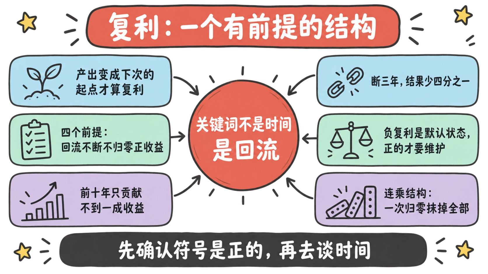
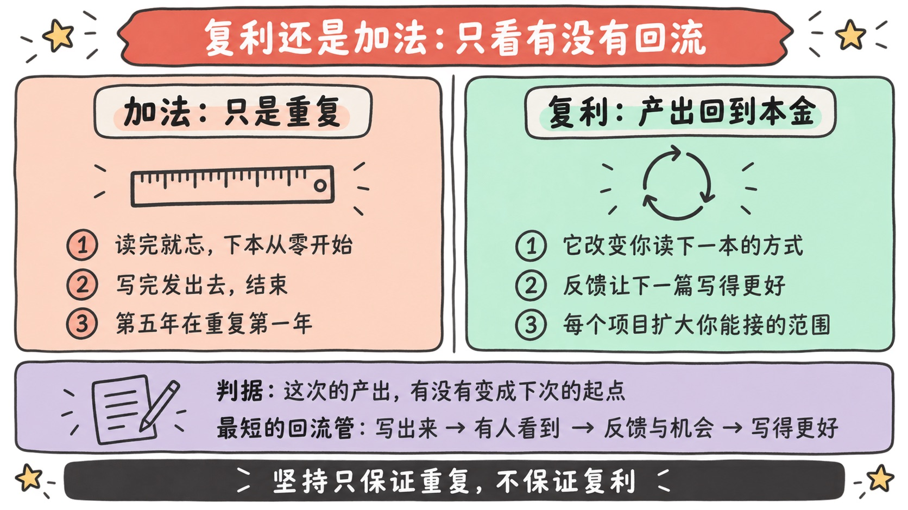
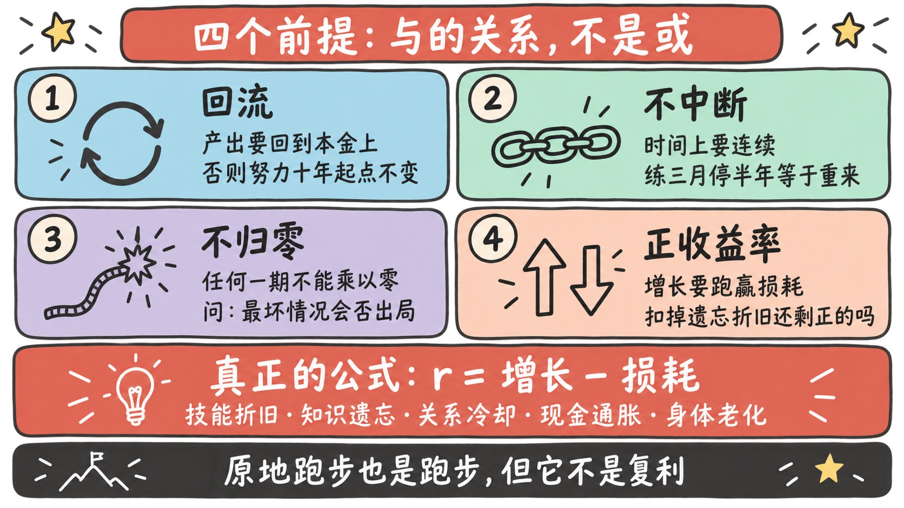
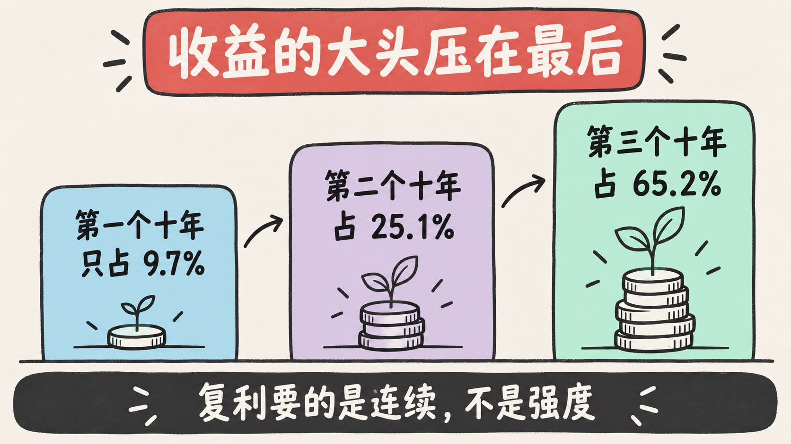
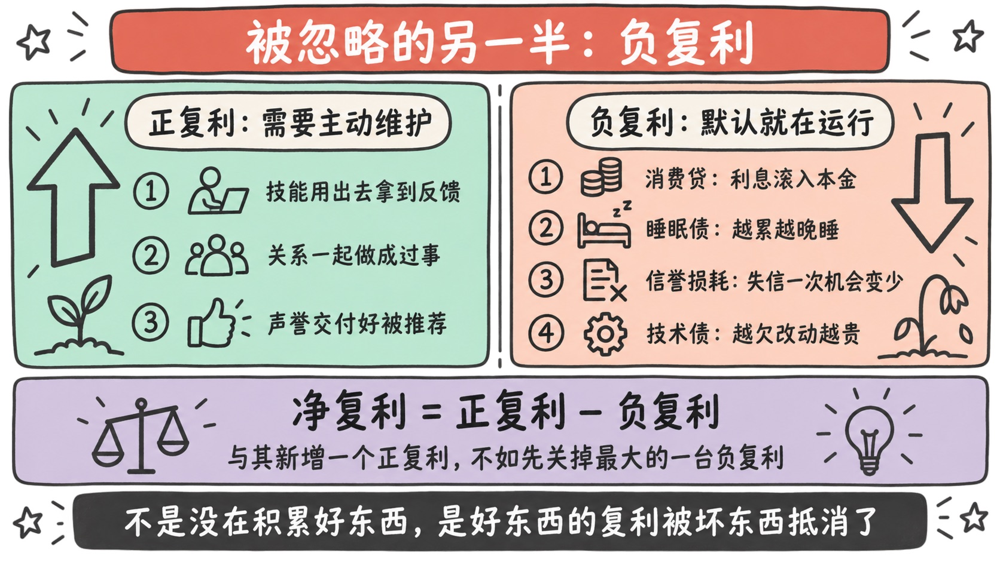
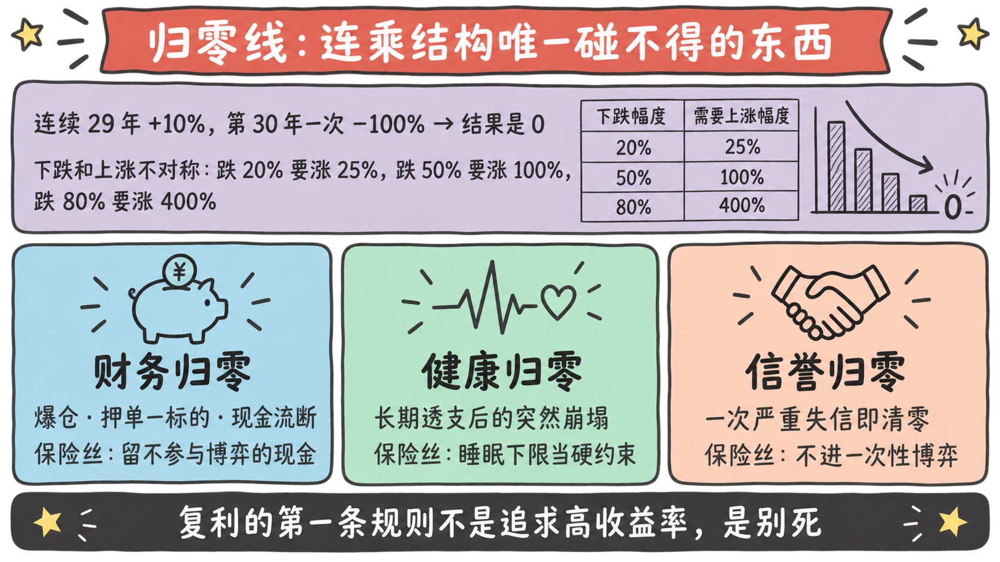
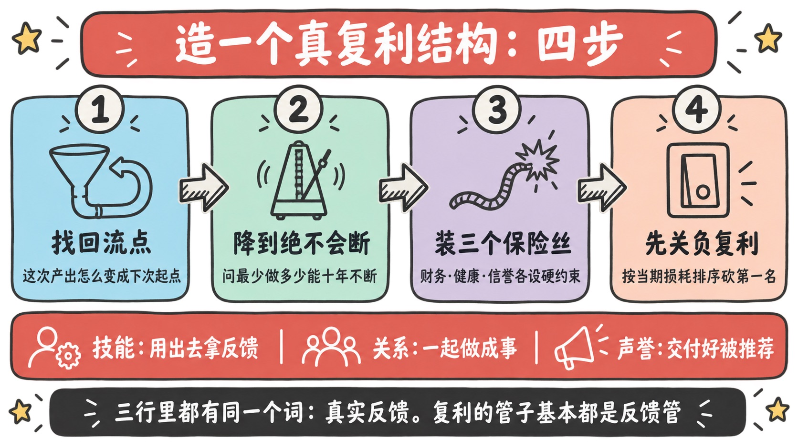

> 「复利是世界第八大奇迹」这句话被传了一百年，但它漏掉了最重要的部分：**复利有前提。**
>
> 不是所有的坚持都在复利，不是所有的积累都会回来。**大多数人嘴里的「复利」，数学上只是加法。**
>
> 这篇想把这个词还原回它本来的样子——一个有严格条件的结构，一条不能碰的归零线，和一个几乎没人算的负数项。

---

## 先讲结论

1. **复利的关键词不是「时间长」，是「回流」**：本期的产出必须变成下一期的本金。没有回流点的坚持，无论坚持多久都是加法——**它会变好，但不会加速变好。**
2. **复利真正的杀手不是慢，是中断和归零。** 复利是连乘：断三年损失四分之一，某一期乘以 0 则前面几十年一起归零。所以**复利的第一条规则不是追求高收益率，是别死。**
3. **时间对复利是中性的，它放大的是符号。** 债务、睡眠债、信誉损耗、关系里的小怨恨，全都在以同样的机制复利。**大多数人的问题不是没有正复利，而是同时开着几台负复利机器。**

---

## 一、先把这个词还回去：复利到底在说什么

复利的定义其实极其朴素：

> **本期的产出，成为下一期的本金。**

注意，这个定义里**根本没有「时间很长」这件事**。时间只是让这个结构重复得更多次而已。真正定义复利的是那个动作——**回流（产出回到本金上）**。

这就给了一个非常锋利的判据：

> **问一句：这次的产出，有没有变成下次的起点？**
>
> 有，是复利；没有，是加法。

### 用这把尺子量一遍日常的「积累」

| 你在做的事 | 什么情况下只是加法 | 什么情况下才是复利 |
|-----------|------------------|------------------|
| **跑步** | 只是维持体能，不跑就掉回去 | 体能提升让你能承受更大训练量，于是提升得更快 |
| **读书** | 读完就忘，下一本还是从零开始读 | 它改变了你读下一本的方式、和下一个决策的质量 |
| **写作** | 写完发出去，结束 | 带来读者与反馈，反过来让下一篇写得更好 |
| **工作** | 第 5 年在重复第 1 年的经验 | 每个项目都在扩大你能接的项目的范围 |
| **人脉** | 加了微信，再无交集 | 一起做成过事，于是更容易再一起做成事 |

这张表里藏着一个不太舒服的事实：

> **同一件事，既可以是复利，也可以是加法，区别不在这件事本身，而在于你有没有给它接上回流的管子。**

跑步、读书、写作本身都不自动复利。**「坚持」只保证重复，不保证复利。**

### 一个最典型的回流点：公开的作品

如果要举一个回流管道最短、最容易搭起来的例子，我会选**公开发布**：

> 写出来 → 有人看到 → 给你反馈和机会 → 你理解得更深 → 下一篇写得更好 → 更多人看到。

这个环之所以好用，是因为它把「你的产出」和「你的输入」直接焊在了一起。相比之下，只是私下学习、私下思考的人，输出没有回到输入上，所以第十年和第一年的学习效率几乎一样。

---

## 二、复利的四个前提，缺一条就不成立

把定义拆开，会得到四个必须同时满足的条件。**它们是「与」的关系，不是「或」。**

| 前提 | 说的是什么 | 典型的失败方式 | 怎么自检 |
|------|-----------|--------------|---------|
| **① 回流** | 产出要能回到本金上 | 努力了十年，第十年的起点还是第一年的起点 | 这次的成果改变了下次的起点吗？ |
| **② 不中断** | 时间上要连续 | 练三个月停半年，回来重新找手感 | 我能把它降到一个绝不会断的频率吗？ |
| **③ 不归零** | 任何一期都不能乘以 0 | 爆仓、猝倒、信誉崩塌 | 最坏情况会不会让我出局？ |
| **④ 正收益率** | r 要大于 0，且跑赢损耗 | 在一个学不到东西的岗位上「积累经验」 | 扣掉遗忘和折旧，还剩正的吗？ |

前三条比较直觉，第四条最容易骗人，值得单独说。

### 第四条：很多东西的 r 其实是负的

复利公式里的 r 不是「有没有在做事」，而是**净增长率**。而你所有的资产都同时在被损耗：

- **技能**在折旧（行业变了，你会的那套过时了）；
- **知识**在遗忘（读过但没用过的，三个月后等于没读）；
- **关系**在冷却（不维护的联系会自然变弱）；
- **现金**在通胀；
- **身体**在老化。

所以真正的公式是 **r = 增长 − 损耗**。这解释了一个常见的困惑：

> **为什么有人「一直在努力」，十年后却没有任何复利效果？**
>
> 因为他的增长速度刚好等于损耗速度。**原地跑步，也是跑步，但它不是复利。**

最危险的一种情况，是**你以为 r 是正的，其实是负的**——比如在一份完全重复、学不到新东西的工作里待了五年。这五年你没闲着，但你的可迁移能力在净折旧。这就是我在[《李斯与两只老鼠》](../granary-rat-positioning/)里写的：跟着位置走的东西，都是租来的。

---

## 三、算术真相：为什么它前期慢得让人放弃

这一章我想给一组实际算过的数，因为**「复利前期很慢」这件事不是心理感受，是数学事实**，而知道它有多慢，会改变你维持它的方式。

### 收益的大头压在最后

假设 10% 的年化，本金 100，跑 30 年：

| 阶段 | 期末值 | 本阶段增值 | 占 30 年总收益 |
|------|-------|-----------|---------------|
| 第 1 个十年 | 259 | +159 | **9.7%** |
| 第 2 个十年 | 673 | +413 | 25.1% |
| 第 3 个十年 | 1745 | +1072 | **65.2%** |

看清楚这两个数字：**前十年只贡献了不到 10% 的总收益，最后十年贡献了 65%。**

这意味着：

> **在复利曲线上，你能感受到回报的那一天，一定在你投入了很久之后。**

所以有一个几乎是必然的推论：

> **任何需要「感受到回报才能坚持下去」的复利行为，都注定会中断。**

因为在前 1/3 的时间里，回报客观上就是不存在的。这不是你不够有毅力，是曲线本来就长这样。

### 所以维持复利不能靠意志力，得靠别的

既然回报在前期不会来，那维持它的力量必须来自别处。我自己用的是这三样：

- **身份认同**：不是「我在坚持写作」，而是「我是一个写东西的人」。前者需要动力，后者只需要一致性；
- **环境与默认值**：把它变成不需要决策的事——固定时间、固定地点、工具永远就绪。**每次都要做一个决定的事，迟早有一天决定是「不」**；
- **降低单次强度**：这一点反直觉但极其关键，下一节展开。

我在[《你只需要三个习惯》](../three-habits/)和[《早点装上》](../install-early/)里写过同一件事：**能长出复利的东西，都得在你还感受不到它的时候就装上。**

### 中断的代价，比大多数人以为的大

同样是 10% 年化 30 年，如果中间有 3 年完全停滞（r = 0）：

> 不中断：**1745**　　中断 3 年：**1311**　　→ **少了 25%**

**只停了十分之一的时间，却少了四分之一的结果。** 因为被跳过的不是「三年的收益」，而是「这三年的钱本来能在后面继续生的钱」。

这直接推出一条很实用的策略：

> **复利要的是连续，不是强度。**
>
> **每周写一次、连续十年**，远远好过**每天写、写三个月、然后停两年**。

所以在设计任何长期习惯时，正确的问题不是「我最多能做到多少」，而是——**「我最少做到多少，才能保证它永远不断？」** 把频率降到那个水平，然后守住它。

---

## 四、被忽略的另一半：负复利

关于复利的文章有九成只讲一半——**正的那一半**。但同一个机制反过来跑，威力完全一样。

### 你身上大概率正在运行的几台负复利机器

| 负复利 | 它怎么自我强化 |
|--------|--------------|
| **消费贷 / 高息债务** | 利息滚入本金，还款压力逼你做更短视的选择 |
| **睡眠债** | 精力下降 → 效率下降 → 工作到更晚 → 睡得更少 |
| **信誉损耗** | 一次失信降低下一次的合作概率 → 机会变少 → 更倾向做一次性博弈 |
| **技术债 / 认知债** | 欠的债让每次改动更贵 → 更没时间还债 → 债更多 |
| **关系里的小怨恨** | 未表达的不满降低沟通意愿 → 误解更多 → 怨恨更多 |
| **健康拖延** | 小问题不处理 → 变成大问题 → 更不敢面对 |

它们有一个共同的可怕之处：

> **正复利需要你主动维护，负复利是默认状态。**

这其实就是[《熵增定律》](../entropy-law-life-choices/)那篇的同一件事——**你不推它，它自己会往乱的方向走。**

### 净复利 = 正复利 − 负复利

这是这一章最重要的一个式子。因为它解释了一个非常普遍的现象：

> **很多人不是没有在积累好东西，而是好东西的复利，全被坏东西的复利抵消掉了。**

一边每天读书学习（正），一边背着高息消费贷、长期睡四五个小时（负）。**账面上很努力，净值原地不动。**

由此得到一个我认为性价比最高的建议：

> **与其新增一个正复利习惯，不如先关掉一台负复利机器。**

原因有三个，而且都很硬：

1. **见效更快**——负复利的当期成本通常比正复利的当期收益大得多；
2. **它在吃掉你所有其他努力**——不关掉它，你新加的正复利只是在填坑；
3. **关掉比建立容易**——停止做一件事，比养成一件事需要的持续投入少。

所以如果现在只能做一件事，**先列出你的负复利清单，砍掉最大的那一台。**

---

## 五、归零线：复利唯一不能碰的东西

这一章讲复利里最要命、也最容易被高收益幻觉盖过去的一条。

### 连乘的脆弱性

复利是**连乘**结构，而连乘有一个加法没有的性质：

> **任何一项乘以 0，整个结果归零。**

连续 29 年做到 +10%，第 30 年遭遇一次 −100%——**最终结果是 0**，前面 29 年一分不剩。这不是危言耸听，这是乘法的定义。

而且即使没归零，**回撤也是不对称的**：

| 你跌了 | 需要涨多少才回本 |
|--------|----------------|
| −20% | +25% |
| −50% | **+100%** |
| −80% | **+400%** |

**下跌和上涨在数学上不是一回事。** 这就是为什么保住本金的优先级，永远高于提高收益率。

### 一群人玩一次，和一个人玩一千次，不是一回事

这是关于风险最反直觉、也最重要的一点。

想象一个赌局：期望值为正，但有 1% 的概率输光全部。

- 如果**一万个人各玩一次**：平均下来这群人是赚的——少数人归零，多数人盈利，**平均值很好看**；
- 如果**一个人连玩一千次**：他几乎必然会在某一次撞上那 1%，然后**出局，没有下一次**。

关键在于：**你是后者。** 你的人生不是一万个平行的自己取平均，而是**你自己这一条路径，从头走到尾**。

> **所以「期望值为正」根本不足以构成下注的理由。你还必须问：这一注会不会让我失去继续下注的资格？**

### 三条必须设保险丝的归零线

| 归零类型 | 长什么样 | 保险丝 |
|---------|---------|--------|
| **财务归零** | 杠杆爆仓、all in 单一标的、现金流断裂 | 保留不参与任何博弈的现金储备；永远不用会被强平的杠杆 |
| **健康归零** | 长期透支后的突然崩塌 | 设睡眠下限和体检节奏，把它当硬约束而不是弹性项 |
| **信誉归零** | 一次严重失信 | 不进入一次性博弈；不做「这次赚完就跑」的事 |

信誉那条尤其值得强调：它是我在[《〈纳瓦尔宝典〉读后感》](../naval-almanack/)里说的**元复利**——它不直接产生收益，而是降低你所有其他交易的摩擦。用[《未来现金流折现》](../discounted-cash-flow/)的语言说：**声誉不增加你的分子，它降低你的分母。** 而分母上的东西，一次严重违约就归零。

所以那句话值得重复一遍：

> **复利的第一条规则不是追求高收益率，是别死。**

活得久本身就是一种收益率——**因为 n 在指数上。**

---

## 六、怎么给自己造一个真复利结构

把前面五章收敛成可执行的四步。

### 第一步：找到回流点

对每一件你想长期做的事，问一句：**「这次的产出，怎么才能变成下次的起点？」**

如果答不上来，那它现在还只是加法——**你需要给它加一根管子**，而不是加大投入。

三类核心资产的回流点长这样：

| 资产 | 回流点（产出 → 本金） | 没有它就只是加法 |
|------|---------------------|----------------|
| **技能** | 用出去 → 拿到真实反馈 → 修正 → 下次更准 | 只学不用，三个月后归零 |
| **关系** | 一起做成过事 → 信任提高 → 更容易再一起做事 | 只是认识，不产生任何回流 |
| **声誉** | 交付质量 → 被推荐 → 遇到更好的合作 → 交付更好 | 做得好但没人知道，等于没做 |

三行里都有同一个词：**真实反馈**。**复利的管子，基本都是反馈管。**

### 第二步：把频率降到绝不会断

不是「我最多能做多少」，而是**「我最少做多少，能保证十年不断」**。然后守住这条线——**状态好的时候可以多做，但下限永远不降。**

### 第三步：给三条归零线各装一个保险丝

财务、健康、信誉，各设一条硬约束。**这三条不参与优化，不参与权衡，它们是边界条件。**

### 第四步：先关掉最大的一台负复利机器

列出你正在运行的负复利清单，按「当期损耗」排序，砍掉第一名。**做完这一步，再去想新增什么。**

---

## 七、复利最常被滥用的三种方式

最后必须写这一章，因为这个词现在已经被用滥了，而滥用它的代价全部由使用者自己承担。

**其一：用「复利」为不作为辩护。**

「我现在在积累」——但如果这份积累没有回流点、没有真实反馈，它就不会复利，只会累积。**「积累」和「复利」不是同一个词。** 判据还是那一句：这次的产出，变成下次的起点了吗？

**其二：用「长期主义」掩盖方向错误。**

复利是一个放大器，它不判断方向。**在错误的方向上复利，只是更快、更彻底地走远。** 所以「要不要坚持」永远是第二个问题，第一个问题是「这个方向对不对」。我在[《站在未来看现在》](../view-from-the-future/)里写的那个问法仍然最好用：**十年后回头看，这件事还值钱吗？**

**其三：把复利当成承诺。**

复利不承诺任何事，**它只是在四个前提都满足时才成立的一个结构**。把它当成「只要坚持就一定会好」，等于把一个条件句读成了一个保证书——而现实会用十年的时间来纠正这个误读。

---

## 总结

1. **复利的关键词是回流，不是时间。** 判据只有一句：这次的产出，有没有变成下次的起点？没有，就只是加法。
2. **四个前提缺一不可**：回流、不中断、不归零、正收益率。第四条最容易骗人——**很多事情的 r 扣掉损耗之后是负的。**
3. **前期慢是数学事实**（前十年只占 9.7%），所以别指望靠「感受到回报」维持它；**靠身份认同、环境默认值，以及一个低到绝不会断的频率。**
4. **先关负复利，再加正复利。** 净复利 = 正 − 负，而负复利是默认状态、无需你努力就在运行。

最后，如果这篇只留一句话：

> **复利不是「坚持就会变好」，它是「在没死、没断、有回流的前提下，时间会放大你的符号」。**
>
> **所以先确认符号是正的，再去谈时间。**

---

**参考阅读**：

- [《增强回路、长期价值与做正确的事》](../reinforcing-loops-long-term-value-right-things/)
- [《〈纳瓦尔宝典〉读后感：财富是一个方程，幸福是一项技能》](../naval-almanack/)
- [《未来现金流折现：一个公式，把「价值」这件事说清楚了》](../discounted-cash-flow/)
- [《熵增定律：为什么人生总是走向混乱，以及如何对抗它》](../entropy-law-life-choices/)
- [《你只需要三个习惯：心智、身体、财富》](../three-habits/)
- [《早点装上：那些一旦掌握就受益终生的东西》](../install-early/)
- [《透过现象看本质：一句正确的废话，除非你有方法》](../phenomenon-and-essence/)
