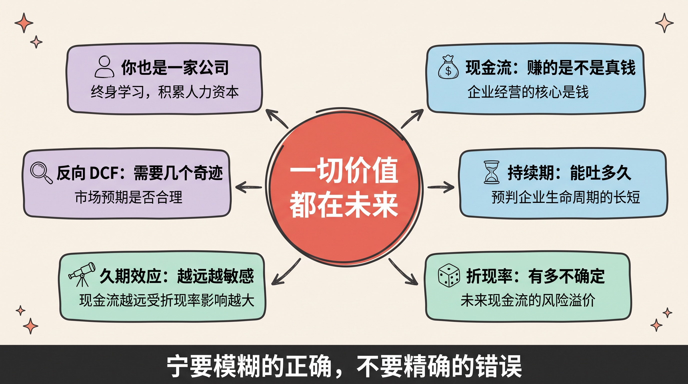
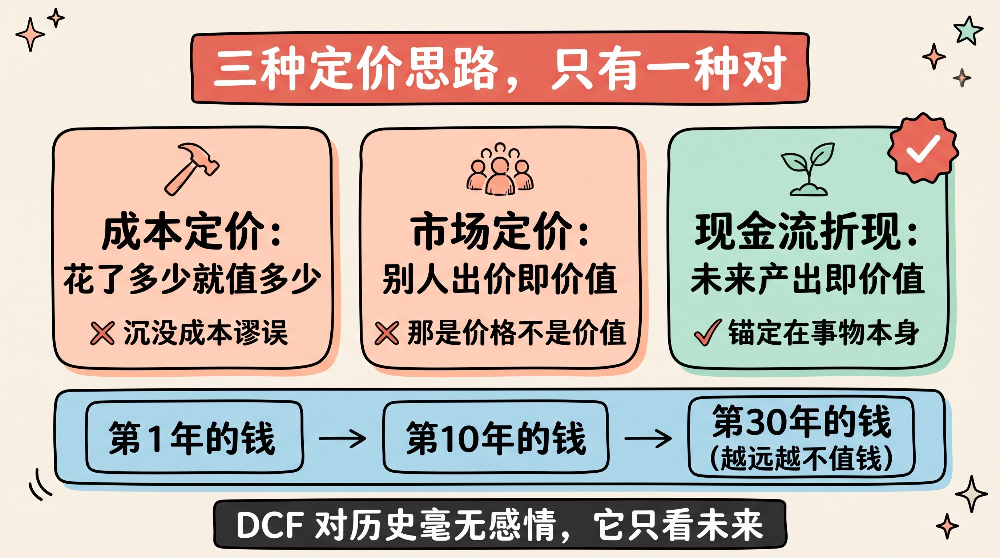
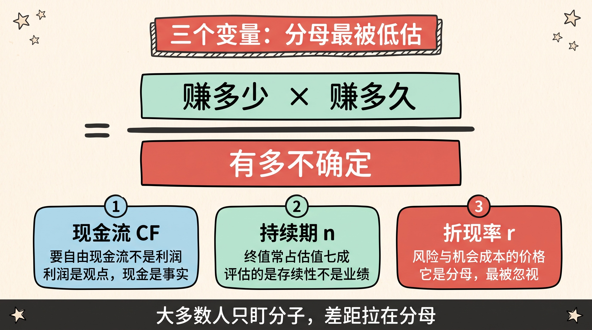
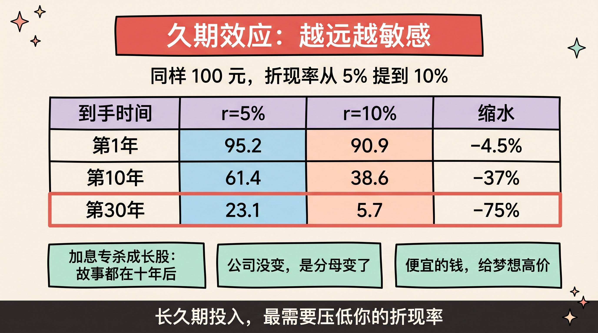
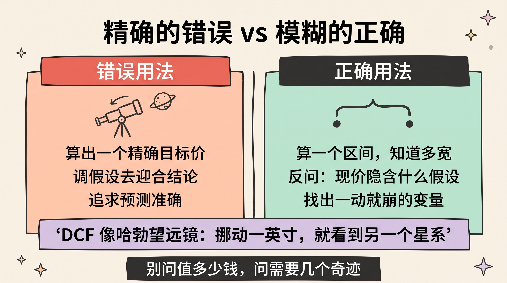
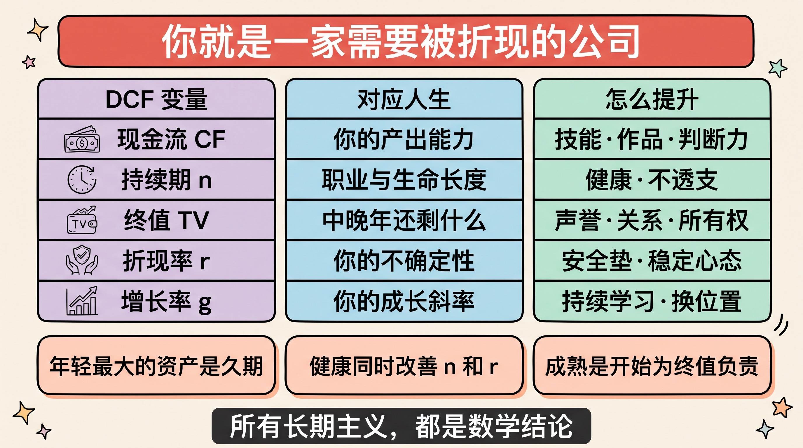

> 「任何资产的价值，等于它在剩余生命周期里所能产生的全部现金流，用适当的利率折现到今天。」
>
> 这是巴菲特反复引用的一句话，出自约翰·伯尔·威廉姆斯。它听起来像一个枯燥的财务公式，但它其实是一句**关于价值的判决**——
>
> **一切价值，都在未来。今天的价格，只是对未来的一次贴现。**

> **免责声明**：本文是思维模型与方法论探讨，不构成任何投资建议。文中不推荐任何标的。我不是持牌投顾，你的钱请你自己负责。

---

## 先讲结论

1. **DCF 真正的价值不是算出一个数，而是它给「价值」下了一个可操作的定义**：价值不取决于你花了多少成本、也不取决于别人愿意出多少钱，而取决于**它未来能产出什么、持续多久、以及有多确定**。
2. **三个变量里，折现率最被低估、也最被误用。** 它同时承载了「机会成本」和「不确定性」。折现率一动，远期现金流的现值天翻地覆——这就是**久期效应**，也是加息为什么专杀成长股的原因。
3. **DCF 最大的悖论是「精确的错误」**：公式给你一个精确到小数点后两位的答案，但输入端只要动一点点假设，结果能差三倍。**所以高手不用它算价格，只用它建立结构——宁要模糊的正确，不要精确的错误。**



---

## 一、一个公式，回答了「什么是价值」

在讲怎么算之前，先讲它到底在说什么。因为**DCF 的哲学价值，远高于它的计算价值。**

人类给东西定价，历史上大致有过三种思路：

| 定价思路 | 逻辑 | 致命问题 |
|---------|------|---------|
| **成本定价** | 花了多少成本，就值多少钱 | 沉没成本谬误：一堆废铁的成本也很高 |
| **市场定价** | 别人出多少钱，它就值多少钱 | 这是价格不是价值：郁金香也曾很贵 |
| **现金流折现** | 它未来能产出多少，就值多少钱 | 需要预测未来（难，但方向对） |

只有第三种，把价值锚定在**这个东西本身能干什么**，而不是锚定在过去的花费或旁人的情绪上。

写成公式就是这样：

```text
                  CF₁         CF₂         CF₃              CFₙ
价值 (PV)  =  ─────────  +  ─────────  +  ─────────  + … + ─────────
               (1+r)¹       (1+r)²       (1+r)³           (1+r)ⁿ

CF = 每一期的自由现金流    r = 折现率    n = 期数
```

别被公式吓到，它只说了两件极其朴素的事：

1. **一个东西的价值，等于它未来能吐出来的所有钱的总和**；
2. **越远的钱越不值钱**——所以要除以一个越来越大的数（`(1+r)ⁿ` 随 n 指数增长）。

### 为什么「越远的钱越不值钱」

这是整个模型的支点，值得单独说清楚。今天的 100 块，比一年后的 100 块值钱，因为：

- **机会成本**：今天拿到手，你可以拿去投资、赚取回报；
- **不确定性**：一年后那 100 块，可能因为各种意外而收不到；
- **通胀**：同样的钞票，明年能买的东西更少。

这三件事合起来，被压缩进了一个数字——**折现率 r**。所以：

> **折现率不是一个技术参数，它是你对「等待」和「风险」这两件事的定价。**

### 一个反直觉的推论

如果价值 = 未来现金流的折现，那么会推出一个让很多人不舒服的结论：

> **一个公司过去赚了多少钱，和它现在值多少钱，没有直接关系。**

历史业绩只在一个意义上有用——**它是你预测未来的证据**。一家过去十年稳定赚钱的公司，你有理由相信它未来还能赚；但如果这个理由被打破了（技术变了、护城河没了），**过去的辉煌一分钱都不值。**

柯达的历史现金流极其漂亮，但当胶卷的未来归零时，那些历史一文不值。**DCF 是一个彻底面向未来的模型，它对历史毫无感情。**



---

## 二、三个变量：现金流、时间、折现率

公式里只有三个可调的东西。理解一项资产（或一个人）的价值，本质就是理解这三件事：

### 变量一：现金流（CF）——赚的是不是「真钱」

这里有个关键区分：**DCF 用的是自由现金流，不是利润。**

利润是会计口径，可以被折旧、应收账款、资本化各种手法修饰；**自由现金流是「真正能拿出来分给股东的钱」**，它扣掉了维持生意所必需的资本开支。

> 一句老话：**利润是观点，现金是事实。**

这也解释了一类经典陷阱：有些公司账面利润连年增长，却始终没有自由现金流——因为它赚的钱必须不断再投进去维持运转（重资产、高维护成本）。这种生意，账上很好看，**但它是个吞钱的机器，不是产钱的机器。**

### 变量二：时间（n）——能持续多久

这是最容易被低估的一项。**同样的年现金流，能持续 5 年和能持续 30 年，价值差好几倍。**

而在真实的 DCF 模型里，有一个惊人的事实：

> 对一家健康的公司做 10 年 DCF，**最后那个「终值」（Terminal Value）常常占到总估值的 60%~80%。**

也就是说，你辛辛苦苦预测的前十年，只决定了估值的一小部分；**大头在「十年之后它还在不在、还行不行」。** 这是 DCF 给出的最深刻的商业提示：

**你以为在评估一家公司的业绩，其实在评估它的存续性。** 护城河、品牌、网络效应这些看似虚的东西之所以值钱，正是因为它们守护的是**终值**。

### 变量三：折现率（r）——风险与机会成本的价格

前两个变量讲的是「你能得到什么」，折现率讲的是「这件事有多靠谱、以及你本可以拿去做什么」。

- **风险越高 → 折现率越高 → 现值越低。** 一个说不准的未来，市场会打折。
- **无风险利率越高 → 折现率越高。** 因为你的机会成本变高了：国债都给 5%，你凭什么接受一个风险资产只给 6%？

三个变量的关系可以浓缩成一句话：

> **价值 = （赚多少 × 赚多久）÷ 有多不确定。**

分子是故事，分母是风险。**大多数人只盯着分子，而真正拉开差距的往往是分母。**



---

## 三、折现率与久期：为什么加息专杀成长股

这一章讲一个绝大多数人算过 DCF 却没想透的机制。它能解释很多市场现象。

### 折现率的一点点变化，威力有多大

看一组对比。假设某笔现金流是 100 块，分别在第 1 年、第 10 年、第 30 年到手：

| 到手时间 | r = 5% 时的现值 | r = 10% 时的现值 | 现值缩水 |
|---------|----------------|-----------------|---------|
| 第 1 年 | 95.2 | 90.9 | **−4.5%** |
| 第 10 年 | 61.4 | 38.6 | **−37%** |
| 第 30 年 | 23.1 | 5.7 | **−75%** |

同样是折现率从 5% 提到 10%：

- 近在眼前的现金流，只掉了 4.5%；
- 三十年后的现金流，**直接蒸发了四分之三。**

这就是**久期效应（Duration Effect）**：**现金流越靠后，对折现率越敏感。**

### 它解释了什么

一旦理解这个机制，很多现象立刻通透：

- **为什么加息一来，成长股跌得比价值股惨？** 因为成长股的价值几乎全在遥远的未来（现在还不怎么赚钱，故事都在十年后），久期极长；而价值股的现金流就在眼前，久期短。**利率上升，长久期资产首当其冲。**
- **为什么同一家公司，在不同利率环境下估值天差地别？** 公司没变，分母变了。
- **为什么「讲故事」的公司在低利率时代最风光？** 因为低折现率会把遥远的、虚无缥缈的未来现金流，折算出一个惊人的现值。**便宜的钱，会给梦想一个很高的价格。**

> 一个值得记住的判断：**当你听到「这家公司的价值在于十年后的星辰大海」时，你实际上是在买一个超长久期资产——它对利率、对信心、对任何一点风险变化，都极度敏感。**

### 对个人的启示

这个机制不只适用于股票。你人生里的很多投入，也有久期：

- **学一门马上能涨薪的技能** = 短久期资产，回报快、确定性高、但天花板低；
- **读一个要五年才见效的学位、写一本要三年的书、养一个十年才成型的能力** = 长久期资产，一旦成立回报巨大，但对"中途放弃"和"环境突变"极度敏感。

**所以长久期的投入，最需要的不是聪明，而是「让折现率保持低位」的能力**——也就是：**减少你人生的不确定性**（稳定的现金流、健康的身体、扛得住波动的心态）。它们不直接创造回报，但它们压低了你的分母，从而放大了你所有长期投入的现值。



---

## 四、精确的错误：DCF 最大的悖论

现在必须讲这个模型的阴暗面，否则就成了推销。

### 垃圾进，垃圾出

DCF 的输出精确到小数点后两位，看起来极其科学。但它的输入是什么？**是你对未来十年的预测。**

做过模型的人都懂那个尴尬时刻：**先有目标价，再倒推假设。** 想让估值高一点？增长率调高 1 个点、折现率调低 0.5 个点、终值增长率从 2% 改成 3%——**数字立刻听话。**

一个粗略但真实的感受：**三个假设各微调一点点，最终估值差出两三倍，是很常见的事。**

所以有个著名的说法在投资圈流传：

> **DCF 就像哈勃望远镜——你把它挪动一英寸，就能看到另一个星系。**

### 芒格那句刺人的话

查理·芒格说过一句大意如此的话：**「我从没见过沃伦算 DCF。」** 巴菲特笑着补了一句：**「有些事不能当着你的面做。」**

这段对话常被误读成"DCF 没用"。我理解的意思恰恰相反：

> **真正的高手不是不用 DCF，而是不用它来算出一个精确的数字——他们把它当成一种「思考的结构」内化了。**

当巴菲特看一家公司时，他脑子里跑的是同一套逻辑：这生意十年后还在吗（终值）、能持续吐现金吗（CF）、这现金有多稳（r）。**他只是不需要把它写进 Excel。**

### 正确的用法：三个转变

所以 DCF 该怎么用？我总结成三个转变：

| 错误用法 | 正确用法 |
|---------|---------|
| 算出一个精确的目标价 | 算一个**区间**，并知道区间有多宽 |
| 调整假设去迎合结论 | **反过来用**：现在这个价格，隐含了什么假设？这些假设合理吗？ |
| 追求预测准确 | 追求**理解敏感性**：哪个变量一动，结论就崩？那就是真正的风险所在 |

第二条尤其值得展开——这是 DCF 最聪明的用法，叫**反向 DCF**：

> 不要问「这家公司值多少钱」，要问「**要撑起现在这个价格，它未来必须做到什么？**」
>
> 然后判断：这件事，它做得到吗？

这个问法把一个"预测题"变成了一个"判断题"，难度直线下降，而且极难自欺欺人。当你算出"现价隐含着未来十年每年增长 40%"时，你不需要精确预测，你只需要问一句：**历史上有几家公司做到过？**

> 这也是[《生意赚钱的三个核心逻辑》](../business-money-logic/)里那条判断的延伸：**故事听起来多美不重要，重要的是这个故事需要多少个奇迹才能成立。**



---

## 五、把 DCF 用在人生上：你就是一家公司

到这里，公式讲完了。但我认为 DCF 最大的用处，根本不在股票市场。

**因为你自己，就是一家需要被折现的公司。**

把三个变量对照过来，人生立刻有了一个清晰的结构：

| DCF 变量 | 对应到人生 | 提升的方式 |
|---------|-----------|-----------|
| **现金流 CF** | 你的产出能力：能创造什么价值 | 技能、作品、判断力 |
| **持续期 n** | 你的职业与生命长度 | **健康**、可持续的工作方式、不透支 |
| **终值 TV** | 中晚年你还剩什么 | 复利型资产：声誉、关系、所有权 |
| **折现率 r** | 你人生的不确定性与波动 | 安全垫、多元技能、稳定的心态 |
| **增长率 g** | 你的成长斜率 | 持续学习、换到增量更大的位置 |

这张表能推出几个相当锋利的结论：

**其一：年轻最大的资产不是精力，是「久期」。**

一个 25 岁的人，剩余现金流期数可能是 40 期；一个 55 岁的人，可能只剩 10 期。这意味着：

> **年轻人的价值，绝大部分在终值里。**

所以年轻时最划算的事，恰恰是那些**当期现金流很低、但能大幅抬高成长斜率**的事——读书、打基础、进一个能学到东西的地方、做一件短期不赚钱但能长出真本事的事。**用当期的低现金流，换更高的 g 和更长的 n，这在数学上是极其划算的交易。**

反过来，年轻时用"高当期现金流、零成长"的方式换钱（比如纯出卖时间且学不到东西的活儿），是在**用久期这个最宝贵的资产，换最不值钱的东西**。

**其二：健康是唯一能同时改善 n 和 r 的东西。**

它延长了期数（n 变大），又降低了不确定性（r 变小）。**在 DCF 的结构里，健康不是一项支出，它是整个模型的乘数。** 我在[《养孩子，到底在养什么》](../raising-children/)里把健康排在第一位，逻辑是一样的：它是乘法里的那个 1。

**其三：真正的成熟，是开始为终值负责。**

年轻时拼的是 g（成长速度），中年后拼的是 TV（终值）——**你到底沉淀下了什么，能在你不再全力奔跑之后，继续为你产生现金流。** 那可能是声誉、作品、股权、一群信任你的人。

我在[《站在未来看现在》](../view-from-the-future/)里写过"十年后它还值钱吗"，其实就是在问同一个问题：**你在为终值添砖，还是在为当期现金流透支终值？**



---

## 六、反过来看：什么在毁灭你的现金流折现

正着讲完，反着再讲一遍——因为芒格说过，**反过来想，总是反过来想。** 如果我想毁掉一个人（或一家公司）的价值，最有效的四种做法是：

**一、透支终值换当期现金流。**

公司层面：砍研发、砍品牌投入、压榨供应商，短期利润非常好看，**代价是把十年后的自己吃掉了**。个人层面：熬夜换产出、消耗信誉换一次性利益、在一个学不到东西的地方挣快钱。**所有"寅吃卯粮"的行为，本质都是把终值挪到当期。**

**二、抬高自己的折现率。**

财务上没有安全垫、技能极度单一、情绪极度不稳定——**这些都会让你的未来变得不确定**，从而在数学上直接压低你所有长期投入的现值。这解释了一个现象：**越是没有安全感的人，越倾向于做短期的事**——因为在他的心理折现率下，远期的东西真的"不值钱"。

> 这是个残酷的循环：**焦虑推高折现率 → 只敢做短期的事 → 无法积累长期资产 → 更焦虑。** 打破它的方式不是"逼自己有耐心"，而是**先降低你的不确定性**（存钱、健康、退路），耐心是结果，不是原因。

**三、把现金流建在别人的地基上。**

如果你的产出完全依附于某个平台、某个职位、某个人，**那这份现金流的折现率极高，因为它随时可能归零**。我在[《李斯与两只老鼠》](../granary-rat-positioning/)里写过同样的事：跟着位置走的东西都是租来的。

**四、算得太精，看得太短。**

把精力全花在优化下一个季度的数字上，反而看不见那个决定 70% 价值的终值。**这是"精确的错误"在人生层面的版本。**

---

## 总结

1. **DCF 首先是一个关于价值的定义，其次才是公式**：价值不来自成本、也不来自别人的出价，而来自**未来能产出什么、持续多久、有多确定**。它对历史毫无感情。
2. **三个变量里，分母最被低估**：`价值 =（赚多少 × 赚多久）÷ 有多不确定`。折现率同时定价了"等待"和"风险"，而久期效应决定了——**越远的价值，越经不起风吹草动**。
3. **别用它算价格，用它建结构**：正着算容易自欺欺人，**反向 DCF 才是利器**——不问"值多少钱"，只问"现在这个价格，需要未来发生几个奇迹"。宁要模糊的正确。
4. **你自己就是一家需要被折现的公司**：年轻最大的资产是久期，健康是同时改善 n 和 r 的乘数，成熟是开始为终值负责。**而毁掉这一切最快的方式，是透支终值换当期。**

最后回到威廉姆斯那句话。

它之所以在提出近九十年后依然锋利，是因为它其实在说一件与金融无关的事：

> **你今天值多少，从来不取决于你过去付出了多少，也不取决于此刻别人怎么看你。**
>
> **它取决于——你未来还能创造什么，还能持续多久，以及这件事有多可靠。**
>
> 从这个角度看，**所有真正的长期主义，都不是道德选择，而是数学结论。**

---

**参考阅读**：

- John Burr Williams, *The Theory of Investment Value*（1938）——「价值=未来现金流折现」的原始出处
- 巴菲特历年致股东信——DCF 思维的实战演绎，尤其是关于「内在价值」与「护城河守护终值」的论述
- Aswath Damodaran 的估值课程与博客——公开资料里对 DCF 假设敏感性讲得最系统的来源
- 本站相关：[站在未来看现在](../view-from-the-future/)——「十年后它还值钱吗」与复利资产
- 本站相关：[生意赚钱的三个核心逻辑](../business-money-logic/)——差异化即定价权、LTV 与信任复利
- 本站相关：[把赚钱当成工程问题](../money-as-engineering-problem/)——用建模而非玄学的方式逼近财富

> 再次提醒：本文为个人思考记录，不构成投资建议。模型的输出永远不会好过它的假设，请独立判断。
