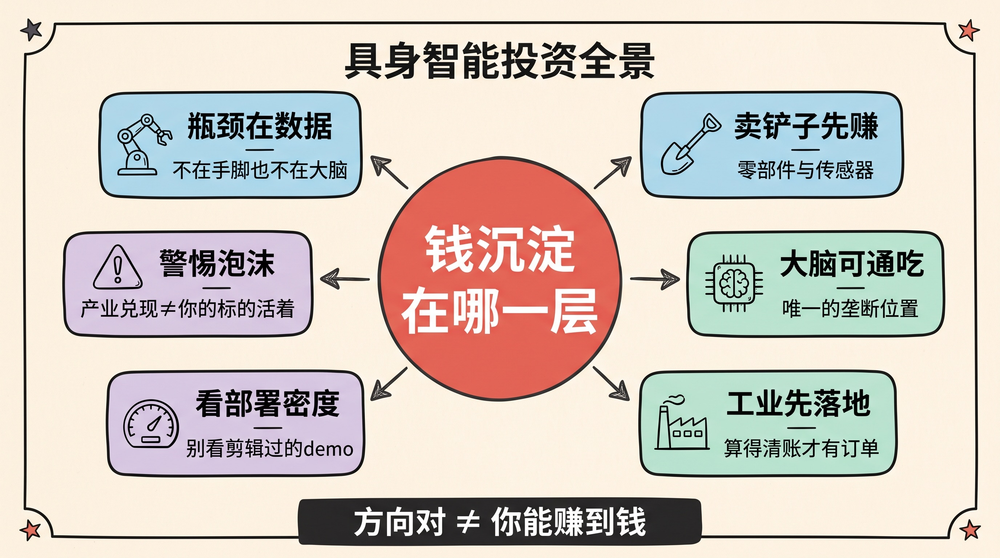
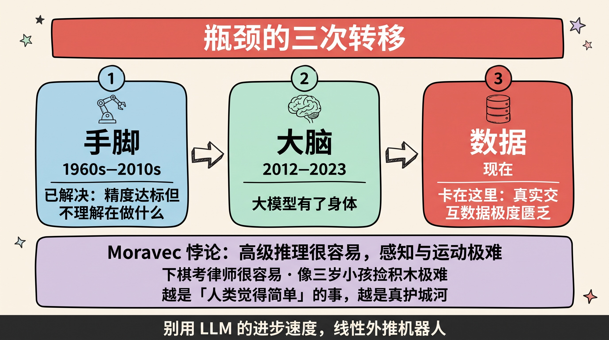
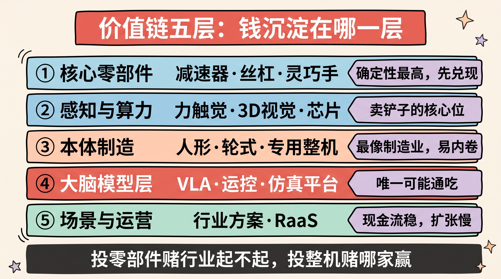
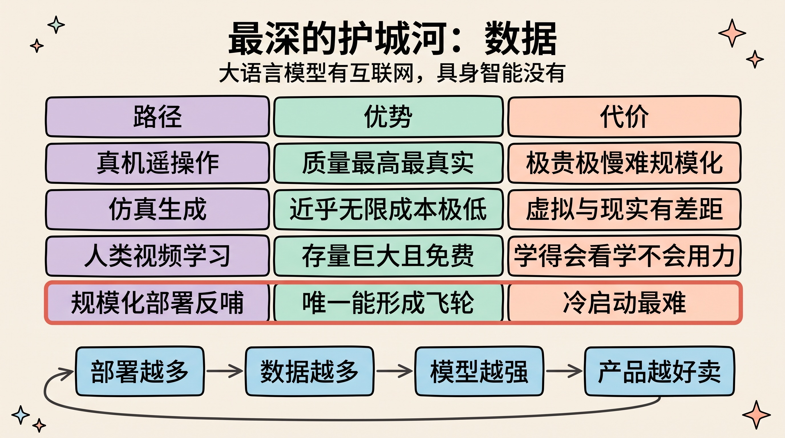
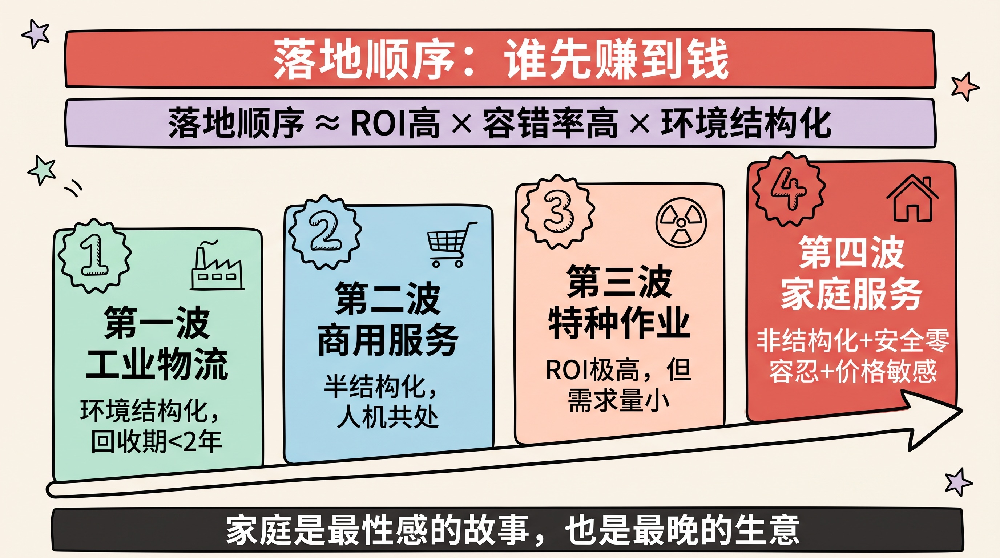
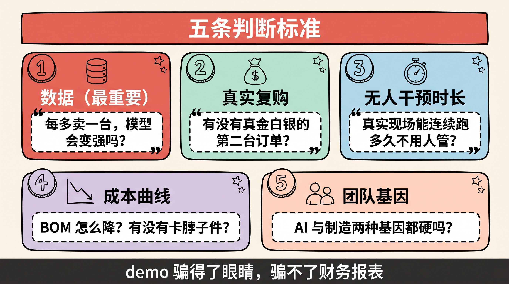

> 机器人不是新东西——工业机器人卖了五十年。真正新的是：**它第一次有了能理解模糊指令、能对没见过的场景做出判断的「大脑」。**
>
> 而在一场技术革命里，最贵的问题从来不是「这东西行不行」，而是——**当它成了，钱会沉淀在哪一层？** 这篇文章就想把这一层拆开。

> **免责声明**：本文是产业结构分析与思考框架，不构成任何投资建议。文中提到的公司仅作行业样本，不是推荐标的。我不是持牌投顾，你的钱请你自己负责。

---

## 先讲结论

1. **瓶颈已经三次转移：从「手脚」→「大脑」→「数据」。** 机械本体早就不是主要障碍（波士顿动力二十年前就能后空翻）；LLM 补上了通用认知这一环；**现在卡住整个行业的，是「真实世界交互数据」的匮乏**——这是理解一切投资机会的钥匙。
2. **短期赚钱的是「卖铲子的」，长期通吃的是「掌握数据飞轮的」。** 淘金热里，先赚到钱的永远是卖铲子的人（核心零部件、算力、传感器）；但最终的超额利润，属于那些能把**部署量 → 数据 → 模型能力 → 更多部署**这个飞轮转起来的公司。
3. **别看 demo，看「部署密度」和「无人干预时长」。** 视频里翻跟头、叠衣服的 demo 与能规模化交付的产品之间，隔着最难走的 90%。**判断一家具身智能公司，唯一诚实的指标是：有多少台真机、在真实客户现场、连续无人干预地跑了多久。**

---

## 一、为什么是现在：瓶颈的三次转移

要判断一个赛道值不值得投，先得回答一个最朴素的问题：**这件事人类试了几十年都没成，凭什么现在能成？**

如果答不上来，那大概率是在为一个旧故事的新包装买单。具身智能的答案，藏在「瓶颈的三次转移」里。

### 第一阶段：瓶颈在「手脚」（1960s–2010s）

早期机器人的核心难题是**机械与控制**：怎么让机械臂精准定位、让双足机器人不摔倒。这个阶段解决得相当好——工业机械臂的重复定位精度早已达到 ±0.02mm，波士顿动力的 Atlas 十几年前就能跑酷后空翻。

但这些机器人有个共同点：**它们不理解自己在做什么。** 工业机械臂执行的是人类逐点示教的固定轨迹，换个工件就得重新编程；Atlas 的跑酷是精心调试的预设动作，不是临场判断。

用我在[《智能体时代的软件开发范式》](../agent-native-software/)里的说法：**它们是铁轨上的火车，不是会看路的司机。**

### 第二阶段：瓶颈在「大脑」（2012–2023）

真正卡住机器人走进开放世界的，是**认知**：看懂一个没见过的场景、听懂一句模糊的指令（「把桌上那个脏杯子放到洗碗机里」）、在没有预设程序的情况下拆解任务。

这件事在深度学习之前无解。而 2012 年后的视觉突破 + 2022 年后的大语言模型，第一次把「通用感知 + 常识推理 + 任务拆解」变成了可以调用的能力。

**这就是「具身智能（Embodied AI）」这个词成立的原因**：不是机器人变强了，是**大模型第一次有了身体**。

> 一个关键判断：**具身智能不是机器人行业的延续，而是 AI 行业的外延。** 它的技术源头、人才结构、迭代节奏，更接近 AI 而非传统制造。这决定了它的竞争格局会更像 AI（赢家通吃、迭代极快），而不像传统机械（区域割据、缓慢演进）。

### 第三阶段：瓶颈在「数据」（现在）

大脑有了，为什么机器人还没进你家？因为**大脑和身体之间的那一层没打通**——模型知道「杯子应该被拿起来」，但不知道该用多大力气捏才不会捏碎、滑了该怎么调整。

这类知识叫**操作技能（manipulation skills）**，它无法从互联网文本里学到，只能从**真实的物理交互**中学。而这类数据，人类几乎没有存量。

这就引出了整个行业最硬的约束，也是第三章要重点讲的东西。

### Moravec 悖论：为什么「简单」的事最难

理解这个行业，必须先理解这条四十年前就被提出的规律：

> **Moravec 悖论**：对计算机来说，**高级推理只需要很少的算力，而低级的感知与运动技能需要极其庞大的算力。**

翻译成大白话：**让 AI 下赢围棋、通过律师考试很容易；让它像三岁小孩那样捡起一块积木、拧开一个瓶盖，极难。**

因为前者是人类进化了几千年的显式知识（可以写下来、可以被语言编码），后者是进化了几亿年的隐式本能（从来没被写下来过）。

这条悖论对投资的含义极其重要：

- **别用 LLM 的进步速度线性外推机器人的进步速度。** GPT 三年从「能聊天」到「能写代码」，但机器人从「能抓杯子」到「能可靠地抓一万种没见过的物体」，需要的时间尺度完全不同。
- **越是「人类觉得简单」的任务，越是真正的技术护城河。** 叠衣服、整理房间这类家务，恰恰是最难的——所以它们也是最晚被攻克、但一旦攻克价值最大的场景。

---

## 二、价值链分层：钱会沉淀在哪一层

想清楚了「为什么是现在」，第二个问题是：**这条产业链上，钱会沉淀在哪里？**

任何硬件产业链，都可以按「上游零部件 → 中游本体 → 下游应用」来拆，但真正决定利润分配的，是每一层的**壁垒高度**和**替代难度**。我把具身智能拆成五层：

| 层级 | 包含什么 | 壁垒来源 | 利润特征 |
|------|---------|---------|---------|
| **① 核心零部件** | 减速器、丝杠、灵巧手、力矩电机、编码器 | 材料、工艺、良率、长期 know-how | **确定性最高**，率先兑现；但天花板受整机出货量约束 |
| **② 感知与算力** | 力／触觉传感器、3D 视觉、边缘算力芯片 | 芯片设计、传感器精度与成本平衡 | 强绑定出货量，「卖铲子」的核心位置 |
| **③ 本体制造** | 人形／轮式／专用机器人整机 | 集成能力、供应链、成本控制、量产工艺 | **最像制造业**：容易内卷，毛利可能被压得很薄 |
| **④ 大脑（模型层）** | VLA 模型、运控算法、仿真训练平台 | 数据 + 算法 + 算力，赢家通吃 | **最像软件**：边际成本低，一旦领先可通吃 |
| **⑤ 场景与运营** | 具体行业解决方案、机器人即服务（RaaS） | 场景 know-how、客户关系、交付能力 | 现金流稳，但难标准化，扩张慢 |

### 三个反直觉的判断

**判断一：短期最确定的钱在①②，不在③。**

这是所有硬件浪潮的共同规律——**淘金热里最先赚到钱的，永远是卖牛仔裤和铁锹的人。** 因为无论最终哪家整机厂胜出，它们都得买减速器、买丝杠、买传感器、买芯片。零部件厂商的收入，**和整个赛道的总投入正相关，而不和某一家的胜负绑定。**

这也意味着：**投零部件是在赌「行业会不会起来」，投整机是在赌「哪家会赢」。** 前者的胜率结构性地更高，代价是天花板更低（且要小心：一旦整机厂大规模自研核心部件，这层利润会被上下挤压）。

**判断二：③本体制造最危险——它长得像制造业。**

人形机器人整机看起来最性感，但它面临一个残酷的历史规律：**只要是能被标准化、能被规模化制造的硬件，长期毛利都会趋近于制造业平均水平。** 手机、电动车、无人机，无一例外。

除非——**你的整机是模型能力的载体，而不只是一堆零件的集合。** 特斯拉做 Optimus 的逻辑正在于此：它卖的不是一具身体，是一个能持续 OTA 变强的智能体。**这一层的胜负手不在硬件，在软件。**

**判断三：④大脑层是唯一可能出现「垄断级」利润的地方。**

因为软件的边际成本趋近于零，且模型能力有强烈的规模效应和数据飞轮。**如果最终出现一个「机器人界的安卓」——一个被广泛采用的通用具身模型底座，它的价值会超过所有整机厂的总和。**

这也是为什么各大玩家挤破头也要做「大脑」：**这是产业链上唯一有可能赢家通吃的位置。**

> 用[《生意赚钱的三个核心逻辑》](../business-money-logic/)里的框架说：零部件的差异化来自工艺与成本，是**可防御但有天花板**的；大脑的差异化来自数据与算法，是**可能形成网络效应**的。前者赚辛苦钱，后者赚垄断钱。

---

## 三、最深的护城河：数据

如果这篇文章你只记住一句话，我希望是这句：

> **大语言模型有互联网，具身智能没有。**

这是整个行业最根本的不对称，也是判断一切竞争格局的钥匙。

### 为什么数据是这个行业的死穴

GPT 能力的来源，本质是人类几十年积累的**互联网文本语料**——这是一份免费的、现成的、规模达万亿 token 的公共品。任何有钱有卡的团队都能拿到它。

但机器人需要的是**「物理交互数据」**：某个角度、某种材质、某个力度下抓取会不会滑，摔倒前 0.1 秒关节该怎么补偿。这类数据：

- **互联网上不存在**（没人会记录「我拧瓶盖时手指用了多少牛顿」）；
- **无法靠爬虫获取**，只能靠真机采集或仿真生成；
- **采集成本极高**：一台真机、一个操作员，一天可能只能采几百条有效轨迹。

这就形成了一个**先有鸡还是先有蛋**的死结：没有数据 → 模型不够好 → 卖不出机器人 → 采不到数据。

### 四条突围路径（以及它们的代价）

各家现在的技术路线之争，本质上是**四种数据获取方式的赌注**：

| 路径 | 怎么做 | 优势 | 代价 |
|------|--------|------|------|
| **真机遥操作** | 人穿戴设备远程操控机器人，采集轨迹 | 数据质量最高、最真实 | 极贵、极慢，难以规模化 |
| **仿真生成（Sim2Real）** | 在物理引擎里生成海量数据 | 近乎无限、成本极低 | **仿真与现实的差距（reality gap）**，虚拟里学会的到现实可能失效 |
| **人类视频学习** | 从海量第一人称视频学人类动作 | 数据存量巨大且免费 | 缺少力反馈与本体感受，学到「怎么看」学不到「怎么用力」 |
| **规模化部署反哺** | 先把机器人卖出去，从真实作业中持续回收数据 | **唯一能形成飞轮的路径** | 需要先有一个「刚好够用」的产品，冷启动最难 |

**最关键的洞察在最后一行。** 前三条路径都是「造数据」，只有第四条是「长数据」——它会随着部署量增长而自我强化：

> **部署越多 → 数据越多 → 模型越强 → 产品越好卖 → 部署更多。**

这就是**数据飞轮**。特斯拉在自动驾驶上验证过它的威力（几百万辆车持续回传路况），现在所有严肃的具身智能玩家都在试图复制它。

### 对投资的含义

这条逻辑直接给出了判断标准：

- **别只看模型的 demo 效果，要看「数据从哪来、能不能持续来」。** 一家公司的数据来源如果是一次性采购或封闭实验室，它的能力增长是**线性**的；如果来自真实部署的持续回收，它的能力增长可能是**指数**的。
- **「先做一个能卖出去的窄场景产品」可能比「憋一个通用大脑」更聪明。** 因为前者能启动飞轮，后者可能永远在烧钱。
- **警惕「数据资产」的伪命题**：不是所有数据都等值。**在客户现场、真实工况下产生的失败数据，比实验室里一万条成功数据更宝贵**——因为模型是从边界情况里学会鲁棒的。

---

## 四、商业化排序：谁先赚到钱

投资时间点的判断，取决于一个问题：**具身智能会按什么顺序落地？**

这不是随机的，它由两个变量决定：**ROI（投入产出比）** 和 **容错率（出错的代价）**。

> **落地顺序 ≈ 按「ROI 高 × 容错率高 × 环境结构化」排序。**

按这个公式排下来，顺序相当清晰：

| 阶段 | 场景 | 为什么是这个顺序 | 关键指标 |
|------|------|-----------------|---------|
| **第一波** | 工业制造、仓储物流 | 环境结构化、任务重复、ROI 可精确计算（替代人力成本）、容错率高（出错只损失货物） | 投资回收期 < 2 年 |
| **第二波** | 商用服务（巡检、清洁、配送、零售） | 环境半结构化、人机共处但风险可控 | 单台日均有效工时 |
| **第三波** | 特种作业（核电、消防、深海、太空） | ROI 极高（人命无价），但需求量小、定制化强 | 可靠性 > 成本 |
| **第四波** | 家庭服务 | **环境完全非结构化 + 安全要求极高 + 价格极度敏感**，三重地狱 | 价格降到消费级 |

### 三条推论

**推论一：家庭机器人是最性感的故事，也是最晚的生意。**

每次看到「机器人管家」的宣传片都要提醒自己：家庭是**最难的场景**——没有两个家一样（非结构化）、旁边有小孩和老人（安全零容忍）、还得便宜到普通家庭买得起（成本地狱）。**它的技术难度和商业难度同时是最高级别。**

**推论二：工业场景不性感，但它是唯一能在近期跑通商业闭环的地方。**

因为工厂能算清账：一台机器人多少钱、替代几个人力、多久回本。**只要投资回收期能压到 2 年以内，采购决策就会变成理性的财务决策，而不是尝鲜。** 这也是为什么大量务实的团队，选择先从工业和物流切入。

**推论三：真正的爆发点，是「泛化能力」跨过某个阈值的时刻。**

现在的机器人大多还是「一个场景一次部署一次调试」，交付成本高、规模化难。**当模型的泛化能力强到「同一套系统换个工厂就能直接干活」时，边际部署成本会断崖式下降**——那才是行业从线性增长切换到指数增长的拐点。

**盯住这个拐点，比盯住任何一个 demo 都重要。**

---

## 五、五条判断标准

把前面四章收敛成一个可操作的框架。看一家具身智能公司（无论是一级还是二级），我会问这五个问题：

### 标准一：数据从哪来？能不能自我强化？

**最重要的一条。** 追问到底：真机数据每天采多少条？来自实验室还是客户现场？部署量增加时，数据获取是线性增长还是指数增长？

**能回答「我们的机器人每多卖一台，模型就变强一点」的公司，和只能回答「我们采购了 X 万条数据」的公司，不是一个物种。**

### 标准二：有没有真实付费客户？复购如何？

**demo 骗得了眼睛，骗不了财务报表。** 关键不是签了多少「战略合作」和「意向订单」，而是：

- 有没有**真金白银的付费订单**（不是补贴、不是关联方采购）；
- **有没有复购**——这是产品真正跑通的唯一证据。客户买了第二台，说明第一台确实创造了价值。

### 标准三：无人干预时长有多久？

这是最诚实的技术指标，类似自动驾驶的「接管里程」。

**一台机器人在真实客户现场，能连续多久不需要人工干预？** 是 10 分钟、8 小时，还是一周？这个数字比任何 demo 视频都能说明产品成熟度——**因为可靠性是指数级难的：从 95% 到 99.9%，工作量可能是前面全部的十倍。**

### 标准四：成本曲线怎么走？

硬件生意的本质是成本曲线。要问：

- BOM 成本的**下降路径**是什么（规模效应？国产替代？设计简化？）；
- 有没有**卡脖子的部件**（某个进口件占成本 30% 且没有备选，就是致命风险）；
- **什么价位能引爆需求**——找到那个「跨过就放量」的价格阈值，倒推还需要几年。

### 标准五：团队的基因对不对？

具身智能是**极其罕见的交叉学科**：机械 + 电子 + 控制 + AI + 制造 + 场景 know-how。

- 纯 AI 背景的团队，容易低估量产和可靠性的难度（**「demo 到产品」的坑**）；
- 纯机械背景的团队，容易在模型能力上掉队（**「身体强大但没脑子」**）；
- **最好的组合是两种基因都硬，且有人真正懂目标场景的业务。**

---

## 六、风险与陷阱：四个最容易踩的坑

写投资分析而不写风险，是不负责任的。这个赛道最容易亏钱的四种方式：

**坑一：把「技术可行」当成「商业可行」。**

技术上能做到 ≠ 有人愿意花这个钱买。很多机器人产品卡在一个尴尬区间：**能干活，但算下来不如雇人便宜。** 永远先算 ROI，再谈技术。

**坑二：被 demo 和估值故事绑架。**

一个精心剪辑的视频可能拍了 200 次才成一次。**要问的是成功率是多少、场景换一个还能不能用。** 而在情绪高涨期，估值往往已经透支了未来五年最乐观的假设——**买入的价格，决定了你的回报率。**

**坑三：低估周期长度。**

硬件的迭代周期以年计，不是以周计。**从原型到量产、从量产到规模盈利，中间可能是 5–10 年。** 用互联网的耐心投硬科技，多半会在黎明前倒下——**能承受多长的等待，是这个赛道最重要的自我认知。**

**坑四：忽略「泡沫先于产业」的规律。**

几乎所有革命性技术都经历过「预期泡沫 → 幻灭低谷 → 缓慢爬升 → 规模落地」。**产业最终会兑现，不代表现在买入的公司能活到兑现的那一天。** 互联网确实改变了世界，但 2000 年买入的绝大多数公司归零了。

> 这正是我在[《站在未来看现在》](../view-from-the-future/)里写的那条原则：**别押注一个具体的未来，构建一个在多个未来里都不亏的仓位。** 具体到这个赛道——与其重仓一家「可能成为苹果」的公司，不如想清楚：**无论哪家赢，什么东西一定会被大量需要？**

---

## 总结

1. **看懂瓶颈在哪一层，才看得懂机会在哪一层。** 手脚（已解决）→ 大脑（LLM 补上）→ **数据（当前卡点）**。今天所有的技术路线之争，本质都是数据获取方式之争。
2. **短期赚确定的钱在「卖铲子」，长期赚垄断的钱在「大脑」。** 零部件与传感器绑定行业总投入、胜率高但有天花板；整机制造最容易陷入制造业内卷；模型层是唯一可能赢家通吃的位置。
3. **落地顺序由 ROI × 容错率决定**：工业物流 → 商用服务 → 特种作业 → 家庭。**家庭机器人是最性感的故事、最晚的生意**；真正的拐点是泛化能力跨过阈值、边际部署成本断崖下降的那一刻。
4. **五条标准防坑**：数据能否自我强化、有无真实复购、无人干预时长、成本下降路径、团队基因。**而所有标准之上是那句老话——技术可行不等于商业可行，产业兑现不等于你的标的能活到那天。**

最后说一句可能不太受欢迎的话。

具身智能大概率是未来十年最大的产业机会之一——**但「方向对」和「你能赚到钱」是两件完全不同的事。** 方向对只保证了这条路有人走到终点，不保证你选的那匹马能跑完全程，更不保证你上车的价格合理。

> 在一个所有人都在讲故事的赛道里，最稀缺的能力不是想象力，而是**把故事翻译成数字的能力**——
>
> **多少台、卖给谁、多少钱、多久回本、坏了谁修。** 能把这五个问题问到底的人，才配在这场革命里赚到钱。

---

**参考阅读**：

- Hans Moravec, *Mind Children*（1988）——Moravec 悖论的原始出处：为什么感知运动比高级推理更难
- 各家具身智能公司的技术白皮书与开源工作（如 Google RT 系列、开源 VLA 模型）——理解「大脑」这一层真实进展的一手材料
- 本站相关：[智能体时代的软件开发范式](../agent-native-software/)——Agent 的十个模块与「工具是长出手的地方」
- 本站相关：[生意赚钱的三个核心逻辑](../business-money-logic/)——差异化的本质是定价权，护城河要能防御
- 本站相关：[站在未来看现在](../view-from-the-future/)——别押注单一未来，构建在多个未来里都不亏的仓位

> 再次提醒：以上均为个人思考记录，不构成投资建议。市场有风险，决策请独立判断。
