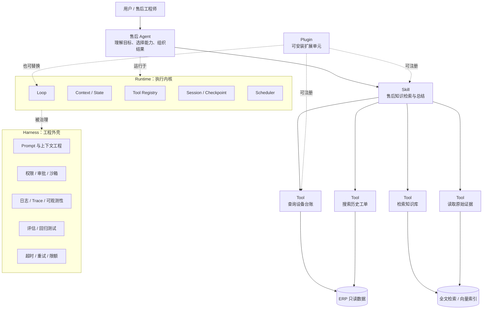
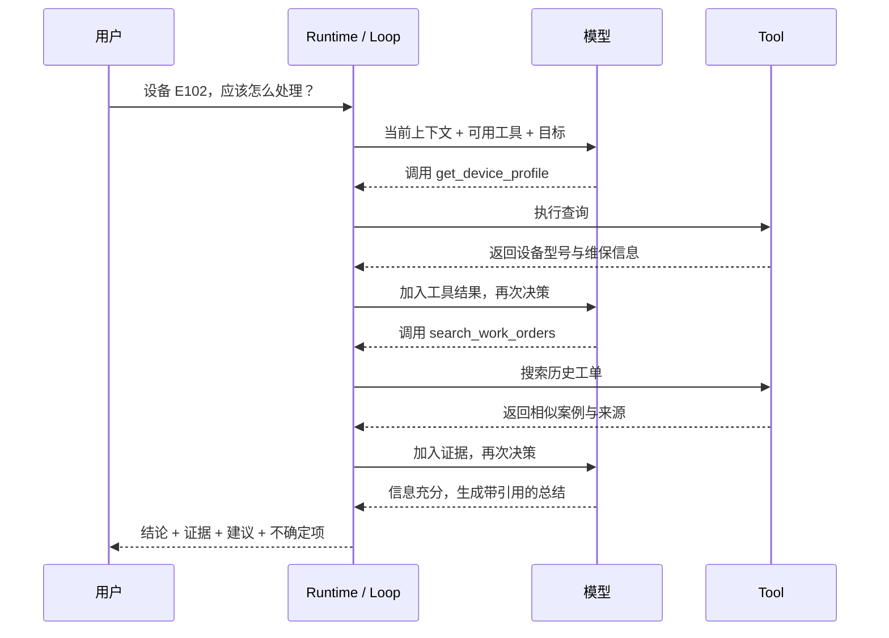
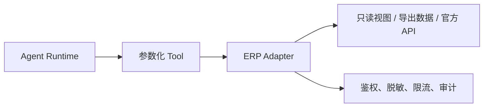

> Agent 系统不是“给大模型接几个 API”这么简单，而是由业务角色、工具、技能、循环、运行时和治理机制共同组成的一套可控执行系统。

---

## 先说结论

如果只记住四件事，可以记住下面这四句：

1. **Tool 是原子动作，Skill 是做事方法，Plugin 是软件扩展单元。** 三者不在同一个抽象维度上。
2. **Loop 既是一个概念，也会被实现成运行组件。** 它负责让模型在“思考—行动—观察—再决策”之间持续迭代。
3. **Runtime 是把 Agent 真正跑起来的执行内核，Harness 是包裹模型与 Runtime 的整套工程外壳。**
4. **企业落地不要一开始就做多 Agent。** 对售后场景，先做“一个 Agent + 一个知识检索 Skill + 4 个只读 Tool + 一个受控 Loop”，通常更稳。

如果你还没有建立 Agent 的基础认识，可以先阅读[《从入门到进阶：如何理解并打造属于你的 AI 智能体》](/posts/ai-agent-guide/)；如果想深入理解 Harness，再阅读[《Agent 与 Harness：模型是发动机，Harness 才是整台车》](/posts/agent-harness-guide/)。

---

## 一、为什么这些概念总让人混淆

Agent 领域的术语看起来很多，但真正的问题不是术语多，而是它们来自不同维度：

- 有的是**业务抽象**，例如 Agent、Skill；
- 有的是**执行抽象**，例如 Tool、Loop；
- 有的是**软件扩展方式**，例如 Plugin；
- 有的是**运行基础设施**，例如 Runtime、Harness；
- 有的是**系统间协议**，例如 MCP。

更麻烦的是，不同框架会复用同一个词。某个框架里的 Skill 可能只是提示词文件，另一个框架里的 Skill 可能还包含 Python 脚本、模板和测试集；某个项目把 Runtime 算进 Harness，另一个项目则把二者当作近义词。

因此，最可靠的理解方法不是死记名称，而是看它在系统中解决什么问题。

| 概念 | 它回答的问题 | 企业售后示例 |
|---|---|---|
| Agent | 谁负责完成目标 | 售后知识助手 |
| Tool | 具体能执行什么动作 | 查询设备、搜索工单 |
| Skill | 这类任务应该按什么方法完成 | 售后知识检索与总结流程 |
| Plugin | 能力如何安装、替换和扩展 | ERP 连接器插件 |
| Loop | 下一步怎么持续推进，何时停止 | 查资料、检查证据、继续或结束 |
| Runtime | 任务如何真正运行 | 管理会话、状态、工具调用和恢复 |
| Harness | 如何让 Agent 可控、可靠、可观测 | 权限、沙箱、日志、评估、审批 |
| MCP | Agent 如何用统一协议连接外部能力 | 把 ERP 查询封装成 MCP Server |

---

## 二、先看全景：一个企业级 Agent 系统长什么样

下面这张图把主要概念放到同一个位置上：



这张图里最重要的不是箭头，而是职责边界：

- Agent 负责**理解目标和做决策**；
- Skill 负责**沉淀做事方法**；
- Tool 负责**执行确定动作**；
- Loop 负责**推动任务持续向前**；
- Runtime 负责**管理整个任务生命周期**；
- Harness 负责**让这一切在真实环境里可控、可靠、可追踪**。

---

## 三、Agent：不是一段 Prompt，而是一个面向目标的业务角色

### 一句话定义

**Agent 是一个能够围绕目标做决策、调用能力并根据反馈调整下一步的执行主体。**

在企业系统中，一个 Agent 通常至少包含：

- 角色与目标；
- 可使用的 Tool 和 Skill；
- 决策策略；
- 上下文与状态；
- 结束和升级条件；
- 权限边界。

以售后场景为例，“售后知识 Agent”不是一句“你是一名售后专家”的系统提示词，而是一组明确约束：

- 只能读取 ERP 和知识库，不能修改订单；
- 回答必须附带数据来源；
- 信息不足时必须说明缺什么；
- 证据冲突时不能强行下结论；
- 低置信度时转交人工工程师。

换句话说，**Prompt 只是 Agent 的一部分，Agent 是业务角色、能力、状态和运行规则的组合。**

还要区分三个容易混用的词：

| 名称 | 含义 | 示例 |
|---|---|---|
| Agent 应用 | 面向具体业务的产品 | 企业售后知识助手 |
| Agent 框架 / Runtime | 用来构建和运行 Agent 的基础设施 | 状态机、工具调度、会话管理框架 |
| Agent 平台 | 面向多个 Agent 的企业级管理系统 | 工具注册、权限、评估、监控、多租户 |

DeepSeek Harness（DSH）属于后两者之间：它提供 Agent Harness 与运行环境，但它本身不是开箱即用的企业售后系统。

---

## 四、Tool：Agent 能够执行的最小动作

### 一句话定义

**Tool 是具有明确输入、明确输出和明确副作用边界的可调用能力。**

Tool 可以是：

- 一个 Python 函数；
- 一个 HTTP API；
- 一条受控数据库查询；
- 一个文件读取器；
- 一个搜索服务；
- 一个 MCP Tool；
- 一段被沙箱执行的脚本。

但“有一段 Python 代码”不等于“已经有了一个好 Tool”。一个可用于生产环境的 Tool，还需要具备稳定接口和治理信息。

下面是一个只读工单检索 Tool 的简化示例：

```python
from typing import Any

from pydantic import BaseModel, Field


class SearchWorkOrdersInput(BaseModel):
    """历史工单检索参数。"""

    error_code: str = Field(description="设备故障码，例如 E102")
    device_model: str | None = Field(
        default=None,
        description="设备型号；未知时可以不传",
    )
    top_k: int = Field(default=5, ge=1, le=20, description="最多返回条数")


def search_work_orders(params: SearchWorkOrdersInput) -> dict[str, Any]:
    """只读检索历史售后工单，并返回可引用的结构化结果。

    实际项目中，这里应调用受控的数据访问层，不能让模型直接拼接 SQL。
    """
    # 示例仅展示 Tool 接口；数据库访问逻辑由 ERP Adapter 实现。
    records = erp_adapter.search_work_orders(
        error_code=params.error_code,
        device_model=params.device_model,
        limit=params.top_k,
    )

    return {
        "items": records,
        "source": "erp.work_orders",
        "read_only": True,
        "count": len(records),
    }
```

一个好的 Tool 通常满足以下条件：

1. **职责单一**：查询设备和创建工单不要写在同一个工具里；
2. **输入有 Schema**：字段类型、是否必填、取值范围说清楚；
3. **输出结构化**：不要只返回一大段无格式文本；
4. **错误可理解**：区分“没有数据”“无权限”“超时”和“系统故障”；
5. **副作用明确**：标记只读、可写、是否需要审批；
6. **可审计**：记录谁在什么会话中用什么参数调用了它；
7. **可测试**：同一组输入能够稳定复现结果。

> Tool 是 Agent 的“手”，但手不能自己决定业务流程。

---

## 五、Skill：可复用的做事方法，不只是一个函数

### 一句话定义

**Skill 是针对某类任务沉淀下来的可复用方法包，通常包含步骤、规则、示例、模板，必要时也包含脚本和资源。**

例如，“售后知识检索与总结”可以被定义为一个 Skill：

1. 从问题中提取设备型号、序列号和故障码；
2. 信息不足时先补全关键字段；
3. 查询设备台账；
4. 检索相同型号、相同故障码的历史工单；
5. 检索正式知识库；
6. 比较证据的一致性和时间有效性；
7. 输出结论、证据、建议步骤和不确定项；
8. 低置信度时转人工。

一个 Skill 完全可以包含 Python 脚本。例如：

```text
skills/after-sales-knowledge-answer/
├── SKILL.md                         # 任务目标、步骤、边界与使用说明
├── scripts/
│   └── normalize_error_code.py      # 故障码归一化脚本
├── templates/
│   └── answer.md                    # 标准回答模板
├── examples/
│   └── e102-case.md                 # 标准案例
└── evals/
    └── cases.yaml                   # 回归评估用例
```

但这里需要区分两件事：

- 脚本放在 Skill 中，说明它是该方法包的实现资源；
- 脚本只有被 Runtime 通过稳定接口注册、授权和调用后，才成为 Agent 可直接使用的 Tool。

因此，“Skill 里有 Python 脚本”没有问题。关键不是物理文件放在哪里，而是**上层看到的是业务方法，底层暴露的是受控能力**。

### Tool 和 Skill 的区别

| 维度 | Tool | Skill |
|---|---|---|
| 核心问题 | 能做什么动作 | 这类事情应该怎么做 |
| 粒度 | 原子能力 | 多步骤方法 |
| 示例 | 查询历史工单 | 完成售后知识诊断 |
| 组成 | 函数、API、Schema | 指令、流程、模板、脚本、示例、评估 |
| 复用方式 | 被多个 Skill 调用 | 被一个或多个 Agent 选用 |
| 是否可直接执行 | 通常可以 | 通常需要 Runtime 解释或编排 |

在某些框架里，一个复杂 Skill 也会被包装成“高级 Tool”暴露给上层 Agent。这不是矛盾，而是抽象层次上移了。

---

## 六、Plugin：能力的安装与扩展方式

### 一句话定义

**Plugin 是软件层面的扩展、装配和分发单元。**

Tool 和 Skill 描述的是“能力与方法”，Plugin 描述的是“这些东西如何被装进系统”。

例如，一个 `erp-connector-plugin` 可以同时提供：

- ERP 认证配置；
- `get_device_profile` Tool；
- `search_work_orders` Tool；
- 字段映射和脱敏逻辑；
- 健康检查；
- 权限声明；
- 日志与指标采集。

另一个 `after-sales-skill-plugin` 可以注册售后 Skill、模板和评估集。

因此，一个 Plugin 可能只包含一个 Tool，也可能包含多个 Tool、多个 Skill，甚至提供模型适配器、Storage、Loop 或 UI。

这正是 DeepSeek Harness 的核心设计思想：**Everything is a Plugin**。在 DSH 中，模型、工具、Skill、会话、沙箱、存储、Loop、调度和 UI 都可以通过插件组合或替换。

可以把三者记成一句话：

> **Tool 是能力，Skill 是方法，Plugin 是装能力的方法。**

---

## 七、Loop：既是概念，也是 Runtime 中的执行组件

### 一句话定义

**Loop 是 Agent 为了达成目标，不断进行“读取状态—做出决策—执行动作—观察结果—更新状态”的循环。**

它首先是一个概念。在最简单的实现中，它确实可能只是一段 `while` 或 `for` 循环；在生产系统里，它通常会被实现成状态机、图执行器、事件循环或可恢复的工作流引擎。



Loop 的真正价值不是“重复调用模型”，而是管理以下问题：

- 当前证据够不够；
- 下一步应该调用哪个 Tool；
- Tool 失败后是重试、换路还是停止；
- 是否需要向用户补问信息；
- 是否触发人工审批；
- 是否已经超过最大步骤、时间或费用；
- 什么时候算任务完成。

下面是一段刻意保持简单的 Runtime Loop 伪实现：

```python
from dataclasses import dataclass, field
from typing import Any, Protocol


class Model(Protocol):
    """模型适配器协议。"""

    def decide(
        self,
        *,
        goal: str,
        events: list[dict[str, Any]],
        tool_schemas: list[dict[str, Any]],
    ) -> dict[str, Any]:
        """根据当前状态返回下一步决策。"""
        ...


@dataclass
class AgentState:
    """一次 Agent 任务的运行状态。"""

    goal: str
    events: list[dict[str, Any]] = field(default_factory=list)
    finished: bool = False


def run_agent(
    *,
    goal: str,
    model: Model,
    tool_registry: Any,
    guard: Any,
    max_steps: int = 8,
) -> str:
    """执行一个具有步数限制、权限检查和完整事件记录的 Agent Loop。"""
    state = AgentState(goal=goal)

    for step in range(1, max_steps + 1):
        # 每一轮都把当前状态交给模型，由模型决定下一步。
        decision = model.decide(
            goal=state.goal,
            events=state.events,
            tool_schemas=tool_registry.schemas(),
        )

        decision_type = decision.get("type")

        if decision_type == "final":
            state.finished = True
            return str(decision["content"])

        if decision_type == "ask_user":
            return str(decision["question"])

        if decision_type != "tool_call":
            raise RuntimeError(f"未知决策类型: {decision_type}")

        tool_name = str(decision["tool_name"])
        arguments = dict(decision.get("arguments", {}))

        # Runtime 在真正执行前检查权限、风险和审批策略。
        guard.authorize(tool_name=tool_name, arguments=arguments)

        tool = tool_registry.get(tool_name)
        result = tool.invoke(arguments)

        # 以事件形式追加记录，便于审计、恢复和评估。
        state.events.append(
            {
                "step": step,
                "type": "tool_result",
                "tool_name": tool_name,
                "arguments": arguments,
                "result": result,
            }
        )

    raise RuntimeError("Agent 超过最大执行步数，已安全停止")
```

这段代码里的 `for` 只是 Loop 的外形。真正的工程价值来自外围的 Tool Registry、Guard、State、事件日志、停止条件和错误处理。

---

## 八、Runtime：把 Agent 真正跑起来的执行内核

### 一句话定义

**Runtime 是负责启动、推进、暂停、恢复和结束 Agent 任务的运行环境。**

如果说 Loop 是发动机的往复运动，那么 Runtime 就是整套动力与控制系统。它通常管理：

1. **Session**：这次任务是谁发起的、属于哪个会话；
2. **State**：当前做到哪一步、已经获得哪些证据；
3. **Context Builder**：每一轮给模型看哪些信息；
4. **Model Adapter**：如何调用不同模型；
5. **Tool Registry / Dispatcher**：有哪些工具、如何执行；
6. **Loop Executor**：如何推进下一轮；
7. **Scheduler**：多个任务如何排队、并发或延迟执行；
8. **Checkpoint**：中断后如何恢复；
9. **Timeout / Retry**：调用失败后如何处理；
10. **Event / Trace**：全过程如何记录与回放。

因此，Loop 只是 Runtime 的一个核心部件，并不等于 Runtime 本身。

在一个简单项目中，Runtime 可以是当前 Python 进程中的一个类；在企业系统中，它可能是独立服务，配合 PostgreSQL、Redis、消息队列和对象存储，支持长任务、并发、恢复与审计。

---

## 九、Harness：让模型在真实世界里可控地工作

### 一句话定义

**Harness 是围绕模型和 Runtime 构建的整套工程外壳，用来约束、增强、观察和评估 Agent。**

这个术语目前没有完全统一的边界。本文采用一个便于工程实践的划分：

- Runtime 关注“任务怎么运行”；
- Harness 关注“任务怎样安全、稳定、可维护地运行”。

Harness 通常包括：

- 系统提示词和上下文工程；
- Tool 与 Skill 管理；
- Runtime 和 Loop；
- 权限、审批和沙箱；
- 会话持久化和恢复；
- 日志、Trace 与回放；
- 成本、Token 和时间限制；
- 评估集与回归测试；
- 错误恢复和降级；
- 子 Agent 与调度机制。

这也是为什么 Harness Engineering 越来越重要：模型能力可以买到，但让模型稳定完成企业任务的那层工程，必须由团队自己设计。

### DSH 在这张图里处于什么位置

DeepSeek Harness（`dsh`）是一个开源 Agent Harness 和运行环境。它采用插件化架构，把模型、Tool、Skill、Session、Sandbox、Storage、Loop、Scheduling 和 UI 都作为可组合组件；同时通过追加式会话日志记录运行轨迹，支持查看、恢复、分叉和回放。

官方提供的快速启动方式是：

```bash
# 启动 DeepSeek Harness 的 Web 界面，用于本地体验和插件实验。
npx @deepseek-ai/dsh web
```

但要注意：截至本文写作时，DSH 仍处于 **developer preview**，核心插件和 API 可能继续变化。对于新手，更合适的用法是：

- 把它当作理解现代 Agent Runtime 和插件架构的教材；
- 用它快速实验不同 Tool、Skill 和 Loop 的组合；
- 不要在没有兼容性验证、权限设计和安全评估的情况下，直接把关键 ERP 写操作交给它。

DSH 不是“售后 Agent 成品”，而是可以承载售后 Agent 的 Harness。

---

## 十、MCP：不是 Agent，也不是 Skill，而是统一连接协议

### 一句话定义

**MCP（Model Context Protocol）是一种让 AI 应用以统一方式发现和调用外部数据、Tool 与工作流的开放协议。**

它解决的是连接问题，而不是业务决策问题。

在典型架构中：

- Agent 应用是 MCP Host；
- Host 内部为每个服务建立 MCP Client；
- ERP、知识库或搜索服务可以被封装成 MCP Server；
- MCP Server 对外暴露 Resource、Tool 或 Prompt。

例如，可以把 ERP 查询能力暴露成：

- `get_device_profile`；
- `search_work_orders`；
- `get_warranty_status`；
- `get_service_contract`。

但 MCP 不是魔法。如果 ERP 目前没有 API，也没有只读数据库视图，MCP 无法凭空获得数据。正确顺序应该是：

1. 先建立安全、稳定的 ERP 数据访问层；
2. 把访问层封装成参数化 Tool；
3. Tool 接口稳定以后，再按需要暴露为 MCP Server。

> MCP 统一“怎么连接”，Tool 定义“能做什么”，Skill 规定“怎么把事情做好”。

---

## 十一、企业售后案例：先做知识库检索和总结

现在把所有概念放回一个真实场景。

用户输入：

> XX 工厂 3 号设备无法启动，故障码 E102，应该怎么处理？

### 1. 第一版不要做成多 Agent

最小可用系统可以只包含：

- **1 个 Agent**：`AfterSalesKnowledgeAgent`；
- **1 个 Skill**：`after_sales_knowledge_answer`；
- **4 个只读 Tool**；
- **1 个受控 Loop**；
- **1 套 Runtime 与 Trace**；
- **0 个自动写操作**。

四个 Tool 足以覆盖第一版：

| Tool | 输入 | 输出 |
|---|---|---|
| `get_device_profile` | 序列号或设备编号 | 型号、版本、安装时间、维保状态 |
| `search_work_orders` | 型号、故障码、时间范围 | 相似历史工单与处理结果 |
| `search_knowledge` | 查询文本、产品过滤条件 | SOP、手册、FAQ 的相关片段 |
| `get_source_excerpt` | 来源 ID | 可直接引用的原文与更新时间 |

### 2. Skill 规定标准处理方法

`after_sales_knowledge_answer` Skill 可以规定：

1. 识别设备编号、型号、故障码和发生时间；
2. 缺少关键标识时先补问，不猜设备；
3. 查询设备台账和软件版本；
4. 同时检索历史工单与正式知识文档；
5. 优先采用型号匹配、版本匹配、时间较新的证据；
6. 对相互冲突的资料明确标记冲突；
7. 生成“结论—证据—建议步骤—风险—来源”；
8. 置信度不足时转人工。

### 3. Loop 决定继续、停止还是升级

每一轮执行后，Loop 都检查：

- 是否已经识别出具体设备；
- 是否至少有一条正式知识来源；
- 是否有多个历史案例交叉验证；
- 是否存在版本或时间冲突；
- 是否需要用户补充信息；
- 是否达到最大步骤；
- 是否应转交人工。

合理的停止状态不只有“回答完成”，还包括：

- `NEED_MORE_INFO`：缺少设备编号或完整故障码；
- `LOW_CONFIDENCE`：资料不足，转人工；
- `DATA_CONFLICT`：知识库与历史工单冲突；
- `TOOL_ERROR`：ERP 或检索服务不可用；
- `BUDGET_EXCEEDED`：超过步骤、时间或费用限制。

### 4. 输出必须带证据，而不是只给结论

一份合格的回答可以长这样：

> **初步判断**：E102 更可能与编码器信号异常有关，而不是电源故障。  
> **证据**：同型号近 12 个月共有 18 条相似工单，其中 15 条最终定位为接口松动；知识库 SOP-ENC-04 也将连接检查列为第一步。  
> **建议**：先断电后检查编码器接口，再读取诊断寄存器；未恢复时转二线工程师。  
> **不确定项**：当前缺少设备固件版本，无法确认是否受已知版本问题影响。  
> **来源**：工单 ID、SOP 编号、更新时间和原文片段。

这和普通聊天机器人的区别很明显：它不是“像专家一样说话”，而是**按受控流程获得证据，再基于证据回答**。

---

## 十二、暂时拿不到 ERP API，应该怎么开始

这是很多企业项目的真实起点。没有 API 不等于项目不能做，但第一阶段的重点必须从“Agent”前移到“数据通道”。

### 方案一：定期只读导出

由 ERP 定时导出经过脱敏的 CSV、Excel 或 JSON：

- 设备台账；
- 历史工单；
- 故障码字典；
- 维修结论；
- 文档索引。

适合做第一版验证，优点是风险低，缺点是实时性有限。

### 方案二：只读数据库视图或副本

由 ERP 管理员提供：

- 只读账号；
- 受限视图；
- 字段白名单；
- 查询超时和行数限制；
- 审计日志。

这是比“让模型自由写 SQL”安全得多的方式。

### 方案三：建立 ERP Adapter

在 ERP 与 Agent 之间增加一个适配服务：



Agent 永远只看到 `get_device_profile` 这类稳定业务接口，不应该看到 ERP 的表结构、数据库密码或任意 SQL 执行能力。

### 数据准备至少要完成四件事

1. **统一主键**：设备编号、工单号、客户号能够关联；
2. **标准化字段**：型号、故障码、软件版本采用统一格式；
3. **保留来源**：每个检索片段都有来源 ID、更新时间和权限标签；
4. **增量同步**：明确数据多久更新一次，避免 Agent 引用过期资料。

对售后知识 Agent 来说，数据质量往往比模型大小更决定效果。

---

## 十三、推荐技术栈：先简单，再扩展

对于 Python 开发者，一套容易落地的第一版技术栈可以是：

| 层 | MVP 推荐 | 规模扩大后 |
|---|---|---|
| API 服务 | Python 3.12、FastAPI、Pydantic | 网关、多实例、限流 |
| Agent 编排 | 自定义受控 Loop，或轻量状态图框架 | 可恢复工作流、分布式调度 |
| 模型接入 | 支持 Tool Calling 的统一 Model Adapter | 多模型路由、降级和成本策略 |
| 关系数据 | PostgreSQL | 读写分离、审计库 |
| 检索 | PostgreSQL 全文检索 + pgvector | 独立搜索与重排服务 |
| 会话与缓存 | PostgreSQL；必要时加 Redis | 分布式 Session、队列 |
| 文档存储 | 本地文件或对象存储 | MinIO / S3 兼容存储 |
| 可观测性 | 结构化日志 + OpenTelemetry | Trace 后端、告警与看板 |
| 评估 | pytest + 固定问答集 | 在线抽检、版本对比、自动回归 |
| 部署 | Docker Compose | Kubernetes、灰度发布 |
| 权限 | 服务账号 + RBAC + 字段脱敏 | OIDC、策略引擎、细粒度审批 |

关于框架选择，我的判断是：

- **学习阶段**：先亲手写一个最小 Loop，理解每一轮发生了什么；
- **业务 MVP**：选择简单、可调试、支持状态持久化的方案；
- **研究 Harness 架构**：可以阅读和试用 DSH；
- **平台阶段**：再考虑插件市场、多 Agent 调度和统一 Runtime。

不要因为某个框架功能多，就默认项目需要那些功能。企业第一版最重要的是可验证和可审计，而不是“看起来很智能”。

---

## 十四、从 0 到 1 的开发路线

### 阶段 0：先把问题和评估集定义清楚

收集 50～100 个真实售后问题，标注：

- 正确答案；
- 必须引用的来源；
- 哪些问题应该拒答或转人工；
- 哪些字段缺失时必须补问。

没有评估集，就无法判断新版本到底变好了还是变差了。

### 阶段 1：只读知识检索与总结

目标：让工程师更快找到资料。

验收指标可以包括：

- 检索结果是否覆盖正确文档；
- 引用是否真实存在；
- 回答是否只使用检索到的证据；
- 平均检索时间；
- 人工认为“有帮助”的比例。

### 阶段 2：加入 Tool 和受控 Loop

目标：自动补充设备、工单和版本上下文。

这一阶段仍然只读，但 Agent 可以根据当前证据决定继续查询哪个 Tool。

### 阶段 3：加入人工审批后的动作

可以逐步开放：

- 创建草稿工单；
- 生成升级报告；
- 通知二线工程师；
- 推荐备件。

所有有副作用的操作都要支持：

- 人工确认；
- 幂等键；
- 操作预览；
- 审计记录；
- 失败补偿。

### 阶段 4：确有必要时再做多 Agent

只有当任务确实存在明显角色边界、并行价值或不同权限域时，才考虑拆成：

- 接待 Agent；
- 检索 Agent；
- 诊断 Agent；
- 工单 Agent；
- 研发协同 Agent。

多 Agent 会增加调用成本、状态同步、调试和责任归属难度。它不是成熟度的象征，只是一种在特定问题下有价值的架构选择。

---

## 十五、生产环境最容易踩的坑

| 风险 | 常见表现 | 对策 |
|---|---|---|
| 幻觉 | 没查到资料也给出确定结论 | 强制引用、低置信度转人工 |
| 提示注入 | 文档中包含诱导 Agent 执行危险操作的内容 | 工具结果视为不可信输入、最小权限 |
| 任意 SQL | 模型生成高风险或高负载查询 | 参数化 Tool、只读视图、行数限制 |
| 数据过期 | 引用旧 SOP 或旧软件版本 | 更新时间过滤、版本匹配、同步告警 |
| 无限 Loop | 重复检索相同内容 | 最大步数、去重、预算限制 |
| 重复副作用 | 超时重试导致重复建单 | 幂等键、事务、操作状态机 |
| 权限泄漏 | 普通工程师查到不该看的客户数据 | RBAC、字段脱敏、来源级 ACL |
| 无法复盘 | 只保存最终答案，没有中间过程 | 事件日志、Trace、会话回放 |
| 评估失真 | 只挑几个成功案例演示 | 固定测试集、失败样本、版本回归 |

真正的企业 Agent 不是“永远自动完成”，而是能够在不确定、冲突和风险出现时，**安全地停下来**。

---

## 十六、把所有概念再压缩成一套记忆模型

可以把 Agent 系统想象成一家售后服务中心：

- **Agent**：负责处理问题的售后工程师；
- **Tool**：ERP 查询、搜索、测量仪器；
- **Skill**：标准故障诊断 SOP；
- **Plugin**：把新工具和新 SOP 安装进系统的软件包；
- **Loop**：查一步、判断一步、再决定下一步的工作节奏；
- **Runtime**：让任务排队、执行、暂停和恢复的工作环境；
- **Harness**：权限、流程、日志、质检、安全制度和基础设施；
- **MCP**：不同系统和工具之间统一的接口标准。

它们的关系可以浓缩成一句话：

> **Agent 在 Runtime 中运行，通过 Loop 选择 Skill，Skill 调用 Tool；Plugin 负责扩展这些能力，Harness 负责治理整个过程，MCP 负责连接外部系统。**

---

## 三点总结

1. **概念要按职责理解，而不是按框架名字记忆。** Tool、Skill、Plugin、Loop、Runtime、Harness 和 MCP 解决的是不同问题。
2. **企业 Agent 的核心竞争力不只是模型。** 真正决定能否上线的是数据访问、工具设计、运行时、权限、审计、评估和人工兜底。
3. **售后场景最合适的起点是只读知识检索。** 先用一个 Agent 跑通“查询—检索—引用—总结—转人工”的闭环，再逐步增加动作和协作。

> 先把一个小闭环做得可靠，再谈一个大平台。Agent 系统最怕的不是能力少，而是边界不清、证据不足、出了问题无法复盘。

---

## 参考资料

- [Anthropic：Building effective agents](https://www.anthropic.com/engineering/building-effective-agents)
- [Anthropic：Writing effective tools for AI agents](https://www.anthropic.com/engineering/writing-tools-for-agents)
- [Model Context Protocol：Introduction](https://modelcontextprotocol.io/docs/2026-07-28/getting-started/intro)
- [Model Context Protocol：Architecture overview](https://modelcontextprotocol.io/docs/2026-07-28/learn/architecture)
- [DeepSeek Harness 官方介绍](https://deepseek.com/harness/en/)
- [DeepSeek Harness GitHub 仓库](https://github.com/deepseek-ai/deepseek-harness)
- [DeepSeek Harness Safe Use Policy](https://www.deepseek.com/harness/en/privacy/)
