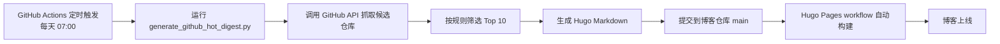

> 这篇文章记录我如何把“每天看 GitHub AI 热点项目”这件事，做成一套由 GitHub 自己完成的自动发布流程。

---

## 想解决什么问题？

我想做一件很具体的事：

**每天早上 7 点，自动生成一篇 GitHub 热点项目日报，重点关注 Claude / Gemini / OpenAI / Copilot 以及重点人物仓库，并直接发布到博客。**

如果靠手工做，这件事至少包含这些步骤：

1. 打开 GitHub 搜项目
2. 人工筛选哪些值得看
3. 整理成 10 条
4. 给每条补上摘要和引用来源
5. 写成 Hugo Markdown
6. 提交到博客仓库
7. 等博客重新部署

这套动作手工做一次不难，但每天做就会很快变成负担。所以我最终的目标不是“写一篇文章”，而是把它变成一个**可持续运行的内容生产流水线**。

---

## 为什么选择 GitHub 端自动化，而不是本地脚本？

这是这个方案里最重要的设计决策。

### 本地定时任务的问题

如果用本地 cron 或 LaunchAgent，也能定时跑脚本，但会遇到几个典型问题：

- 电脑必须开机
- 网络环境必须稳定
- 本地 token、环境变量、依赖都要自己兜底
- 换机器后还要重新配
- 排查失败时不如 GitHub Actions 直观

### GitHub 端自动化的优势

我最后采用的是：

**GitHub Actions 定时触发 -> 生成日报 -> commit 回博客仓库 -> Hugo 自动部署**

这条链路的好处很直接：

- 不依赖本地机器
- 日志统一在 GitHub Actions
- 定时稳定
- 博客仓库本身就是内容源，天然适合自动 commit
- 一旦跑通，后续维护成本很低

---

## 整体架构

可以把整个流程理解成两条工作流首尾相接：

这个设计有一个很实际的好处：

**日报生成和站点部署被拆成了两个明确的责任层。**

- 生成层只关心内容
- 部署层只关心 Hugo 构建和发布

这样出问题的时候更容易定位。

---

## 核心文件有哪些？

这套方案最后主要落在两个文件里：

### 1. `scripts/generate_github_hot_digest.py`

这个脚本负责：

- 调用 GitHub API 搜索候选仓库
- 识别重点主题和重点 owner
- 根据 stars、forks、活跃度、release 等信号排序
- 生成 Hugo Markdown
- 为每个项目补一条“功能/用途”说明

### 2. `.github/workflows/github-hot-digest.yml`

这个 workflow 负责：

- 每天北京时间 7 点触发
- 执行生成脚本
- 把日报写到 `content/posts/news/`
- 自动 commit 回仓库

博客本身已有 `hugo.yml`，所以新文章一进入 `main`，站点就会自动部署。

---

## 抓取逻辑怎么设计？

“GitHub 热点项目”这个词听起来简单，但真正落地时会碰到一个问题：

**你要的是全 GitHub 热度，还是你真正关心的 AI 开发生态热度？**

我这次做的不是一个泛化热榜，而是一个**偏 AI 工程价值的热点榜**。

### 重点关注对象

当前策略会优先覆盖：

- Claude
- Gemini
- OpenAI
- Copilot
- 重点官方组织
- 重点人物仓库

### 排序依据

脚本会综合这些信号：

- stars
- forks
- 最近更新时间
- 是否命中重点关键词
- 是否来自重点官方组织
- 是否来自重点人物
- 最近是否有 release

这样做的目的，是避免榜单被“全站最热视频”式的泛 AI 项目挤满，而更偏向真正值得跟踪的开发工具和生态项目。

---

## 文章怎么组织？

我不希望它只是“列链接”，而是希望读者打开后能快速判断：

1. 这个项目是干什么的
2. 为什么今天值得看
3. 它适合什么用途
4. 原始来源在哪

所以每条项目最终会生成这些字段：

- 项目名
- 原始仓库简介
- 一句中文“功能/用途”说明
- 关注理由
- stars / forks / language / 最近更新时间
- 命中主题
- 引用来源

这种结构非常适合“晨间快速浏览”。

---

## 一个实际踩过的坑

一开始我以为把 workflow 写在分支上，就可以直接用 `workflow_dispatch` 触发测试。

结果 GitHub 给了一个很真实的限制：

**手动触发的 workflow 必须已经存在于默认分支。**

也就是说，如果 workflow 还只在功能分支里，GitHub Actions API 会直接返回：

> workflow not found on the default branch

这个坑的结论很简单：

- 想长期自动跑，workflow 必须进 `main`
- 如果只是临时先发一篇，可以本地生成后直接提交文章到 `main`

这也解释了为什么我在正式合入自动化前，先做了一次“本地生成并发布”的临时发布路径。

---

## 为什么还要保留“手动发布一次”的能力？

自动化不等于不能人工干预。

我刻意保留了手动方案，因为它在下面几种场景特别有用：

- workflow 还没合进主分支
- 想先检查当天内容
- 想调整摘要文案后再发
- GitHub Actions 临时异常

对应的思路是：

1. 本地运行生成脚本
2. 直接写出 `github-hot-YYYY-MM-DD.md`
3. commit 到博客仓库 `main`
4. 交给 Hugo workflow 自动部署

也就是说，这套方案不是“只能自动”，而是“**自动优先，人工可接管**”。

---

## 这套方案适合哪些人？

如果你有以下需求，这种模式很值得复用：

- 想做日报、周报、行业热点汇总
- 已经有 GitHub Pages / Hugo 博客
- 希望内容生产尽量自动化
- 又不想依赖本地电脑定时跑任务

尤其适合这种信息型内容：

- GitHub 热点项目
- AI 工具更新
- 开源仓库巡检
- 行业资讯聚合
- 投研/技术情报简报

---

## 还有哪些可以继续优化？

这套方案现在已经能稳定运行，但还有很多值得继续做的空间：

### 1. 白名单增强

比如固定提高这些项目的优先级：

- `openai/codex`
- `anthropics/claude-code`
- `google-gemini/gemini-cli`
- `github/awesome-copilot`

### 2. 摘要更智能

现在“功能/用途”说明用的是规则推断，优点是稳定、便宜、可控；
未来可以再加一层模型润色，让摘要更自然。

### 3. 趋势变化

除了当天榜单，还可以补：

- 新上榜项目
- 排名变化
- 今天新增 release
- 今天新增重点仓库

### 4. 多主题版本

现在是一条 AI 开发生态线，后面完全可以复制成：

- AI 投研日报
- 自动化工具日报
- 远程办公工具日报
- 个人知识管理工具日报

---

## 总结

这次最有价值的，不是“多了一篇自动生成的文章”，而是把一件原本需要每天手工重复的事，变成了一条可以长期运行的内容工作流。

一句话概括这套方案：

**GitHub 自动抓取 -> 自动筛选 -> 自动写成博文 -> 自动提交 -> 自动部署博客**

如果你本身就有博客、有固定信息源、有想持续输出的主题，这种方式真的很值得做一遍。
