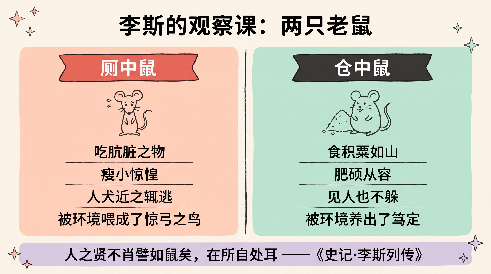
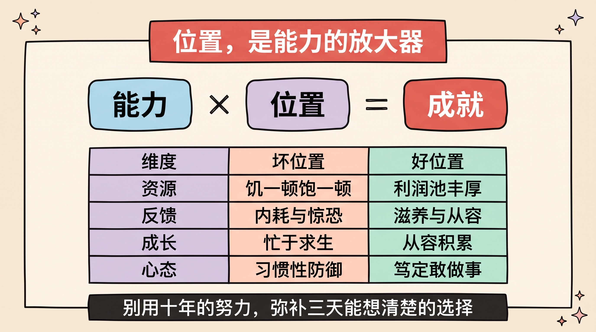
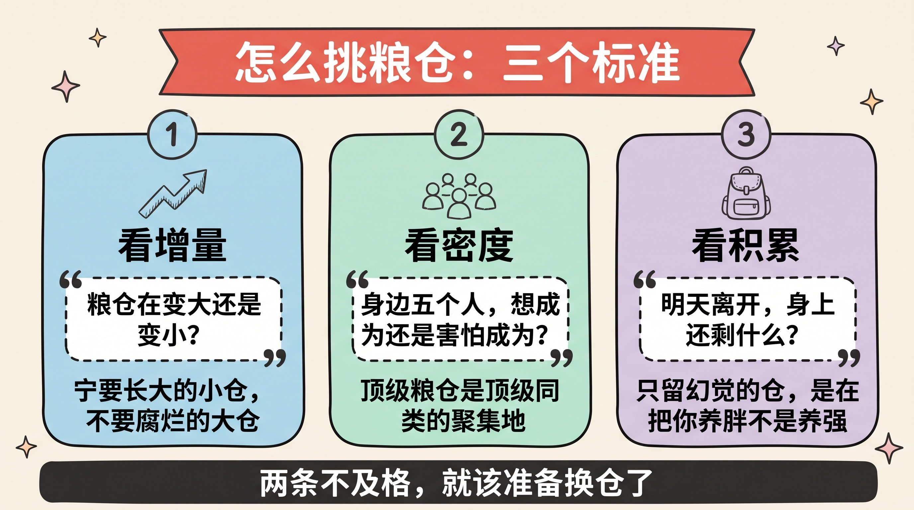
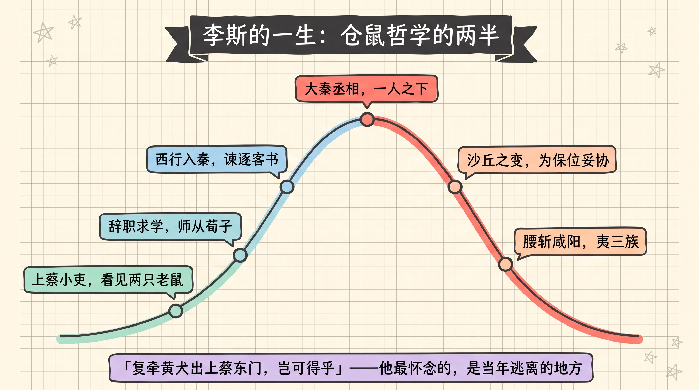
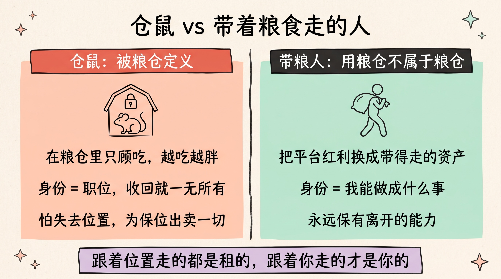
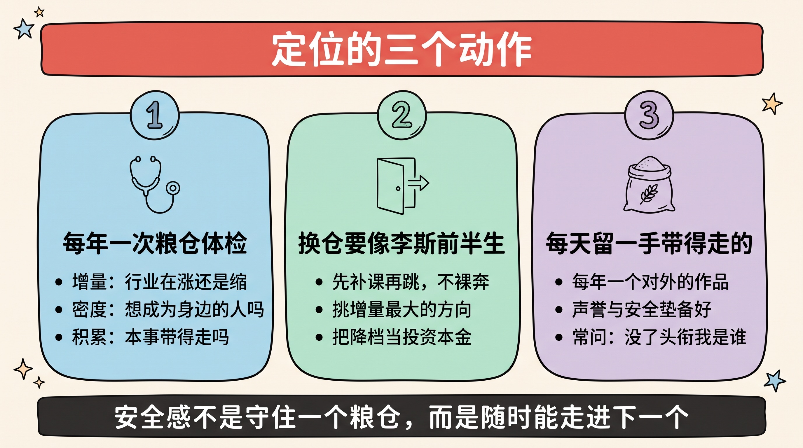

> 「人之贤不肖譬如鼠矣，在所自处耳。」
>
> ——一个人是贤能还是不肖，就像老鼠一样，**取决于他把自己放在什么位置上。**
>
> 说这话的人叫李斯。这句话把他从楚国小城的粮仓，一路送进了咸阳的丞相府；也在很多年后，把他送上了咸阳的刑场。这则故事的前一半人人都在讲，后一半才是真正值钱的部分。

---

## 先讲结论

1. **仓鼠哲学对的一半：位置是能力的放大器。** 同样一只老鼠，在厕所里吃脏东西、见人就逃；在粮仓里吃粟米、安然自得。差的不是老鼠，是位置。个人同理：`成就 ≈ 能力 × 位置`——位置选错，能力再强也被大打折扣。
2. **仓鼠哲学错的一半：当位置成为你的全部，你就成了位置的囚徒。** 李斯后来的每一次堕落——沙丘政变里的妥协、对赵高的退让——本质都是同一个恐惧：**怕失去粮仓**。一个把自我价值完全绑在位置上的人，最终会为保住位置出卖一切，包括他自己。
3. **真正的定位，是「用粮仓，而不被粮仓定义」**：借位置放大自己，同时把平台的红利持续转化为**带得走的能力**。安全感不来自守住某一个粮仓，而来自——**你随时有能力走进下一个。**

---

## 一、两只老鼠：一堂改变历史的观察课

故事记在《史记·李斯列传》的开头，太史公把它放在第一段，不是没有原因的。

李斯年轻时，是楚国上蔡的一个小吏——用今天的话说，一个小县城体制内的基层办事员，管文书仓库，一眼能望到头的人生。

某天他上厕所，看见厕所里的老鼠：吃着肮脏的东西，瘦小、惊惶，每当有人或狗走近，就吓得仓皇逃窜。

后来他进粮仓，又看见粮仓里的老鼠：吃着堆积如山的粟米，住在宽敞的廊庑之下，肥硕、从容，**见了人也不躲**。

同样是老鼠，为什么活得天差地别？李斯站在粮仓里，说出了那句流传两千年的话：

> **人之贤不肖譬如鼠矣，在所自处耳。**
>
> 人和老鼠一样——所谓贤与不肖、体面与卑贱，往往不取决于你是谁，而取决于**你把自己放在了哪里**。

这不是一句牢骚。李斯是真的按这个洞察行动了，而且行动得极其彻底：

- **第一步，离开上蔡。** 他辞掉小吏，跑去齐国兰陵，拜当世大儒荀子为师，学的不是寻章摘句，而是「帝王之术」——治理天下的实学。
- **第二步，挑最大的粮仓。** 学成之后选择去向，他的分析冷静得像一份行研报告：六国皆弱，唯秦有吞并天下之势——**要做事，只能去秦国**。临别时他对荀子说：「诟莫大于卑贱，而悲莫甚于穷困。」（最大的耻辱是地位卑贱，最深的悲哀是穷困潦倒。）
- **第三步，在粮仓里往上爬。** 入秦后从吕不韦门下舍人做起，上《谏逐客书》而崭露头角，辅佐嬴政谋划统一，最终官至丞相——书同文、车同轨、统一度量衡，这些刻进中国两千年底层操作系统的工程，都有他的手笔。

从小城仓库的看门人，到人类历史上第一个大一统帝国的丞相——**这是「选对位置」所能兑现的、最极端的样本。**

---

## 二、仓鼠哲学对的一半：位置是能力的放大器

先把故事翻译成一个模型。李斯观察的本质是：

> **成就 ≈ 能力 × 位置**
>
> 这是个乘法。厕鼠和仓鼠的「能力」几乎相同，但「位置」这一项差了几个数量级，结果就差了几个数量级。

为什么位置的权重这么大？拆开看，一个好位置至少在四个维度上放大你：

| 维度 | 厕所 | 粮仓 | 对应到今天 |
|------|------|------|-----------|
| **资源** | 吃脏污，饥一顿饱一顿 | 积粟如山，取之不尽 | 行业的利润池、平台的资源池 |
| **环境反馈** | 人犬交侵，终日惊恐 | 居大庑之下，无人打扰 | 组织给你的是消耗还是滋养 |
| **成长速度** | 求生存，无暇他顾 | 从容积累，越来越强 | 你是在做事成长，还是在内耗求生 |
| **心态气质** | 惶惶不可终日 | 从容笃定 | 环境塑造性格，性格塑造决策 |

注意最后一行——它最隐蔽，也最致命。**长期呆在坏位置上，改变的不只是你的收入，是你这个人本身**：厕鼠的惊惶不是天生的，是环境喂出来的。一个人在持续内耗、朝不保夕的环境里泡久了，会真的变得目光短浅、习惯性防御——然后别人会说，你看，他就是这种人。

> 我在[《站在未来看现在》](../view-from-the-future/)里写过一对概念：**从现在看未来，你是环境的函数；从未来看现在，你是目标的函数。** 李斯的厉害之处在于，他在两千年前就同时用了这两个视角——先承认「人是环境的函数」（所以必须换环境），再用目标倒推行动（所以离开上蔡、师从荀子、西行入秦）。

### 「选择大于努力」的严格版本

这个模型也顺便把「选择大于努力」这句被讲烂的话，讲严格了：

- 它**不是**说努力没用——乘法里能力那一项还在，是 0 一样完蛋。
- 它是说：**在乘法关系里，你应该优先优化权重更大、且更容易被忽视的那一项。** 大多数人把 100% 的精力花在「能力」上，对「位置」的选择却近乎随机——顺其自然进了某个行业、某家公司，然后用十年的努力，去弥补当初三天就能想清楚的选择。
- 雷军那句「不要用战术上的勤奋，掩盖战略上的懒惰」，和两千年前粮仓里那句话，是同一个意思。

---

## 三、怎么挑粮仓：三个标准

承认位置重要只是第一步，真正的问题是：**什么样的位置才是好粮仓？** 从李斯的选择里，能提炼出三个可操作的标准。

### 标准一：看增量——粮仓在变大还是变小

李斯选秦国，不是因为秦国当下最舒服（恰恰相反，秦法严苛），而是因为**秦国是唯一在扩张的势力**。他要的不是存量最多的仓，是增量最大的仓。

这是挑位置的第一原则：**宁要高速增长的小粮仓，不要缓慢腐烂的大粮仓。** 增长中的行业和平台，机会自己会长出来，坑位越来越多，你顺水行舟；萎缩中的体系里，再体面的位置也是在漏水的船上抢座位，内卷是必然的——**存量博弈的粮仓里，老鼠们最终会互相撕咬。**

### 标准二：看密度——你身边坐的是谁

李斯去兰陵，是为了荀子；后来韩非也在那里。**顶级的粮仓，首先是顶级同类的聚集地。**

判断一个环境值不值得呆，有个朴素的测试：**看看你身边最近的五个人，你是想变成他们，还是害怕变成他们？** 想变成——留下；害怕变成——这个位置在把你往厕鼠的方向喂养，趁早走。

### 标准三：看积累——你在里面长出的本事，带得走吗

这是最容易被忽略的一条，也是为第四章埋的伏笔。同样呆五年：

- 有的位置让你长出**可迁移的资产**——真本事、作品、判断力、行业人脉；
- 有的位置只给你**不可迁移的幻觉**——只在这个系统内有效的流程熟练度、依附于位置的权力、以及「平台的能力是我的能力」的错觉。

> 检验方法一句话：**想象明天离开这个位置，你身上还剩下什么？** 剩下的越多，这个粮仓越值得呆；如果答案是「几乎什么都不剩」，那么你不是在粮仓里成长，你只是在粮仓里**变胖**——而胖，是带不走的。

---

## 四、仓鼠哲学致命的一半：当位置成为全部

如果故事到丞相为止，这就是一碗完美的成功学鸡汤。但《史记》最狠的地方，是把结局也写给你看了。

公元前 210 年，秦始皇死在沙丘平台的巡游路上。遗诏本该由长子扶苏继位。宦官赵高找到李斯，要合谋篡改遗诏，改立胡亥。

李斯起初是拒绝的。但赵高只问了他几个问题，大意是：**论才能、论功劳、论与扶苏的关系，你比得过蒙恬吗？扶苏即位，丞相之位必归蒙恬——你还回得了上蔡吗？**

司马迁写下了李斯挣扎的全过程。这个当年敢从上蔡一路走到咸阳的人，此刻权衡的却全是**怎么保住现在的位置**。最终他仰天长叹，流泪妥协了。

后面的事情像多米诺骨牌：矫诏赐死扶苏、蒙恬；胡亥即位，赵高专权；李斯被构陷谋反，屈打成招。公元前 208 年，他被腰斩于咸阳街市，夷灭三族。

刑场上，李斯对一同赴死的次子说了他人生最后一句被记住的话：

> **「吾欲与若复牵黄犬，俱出上蔡东门逐狡兔，岂可得乎！」**
>
> ——我还想和你再牵着黄狗，出上蔡东门去追野兔，还可能吗？

那个他当年拼命逃离的小城，成了他死前最怀念的地方。

### 复盘：杀死李斯的，正是仓鼠哲学本身

这不是命运的嘲讽，是逻辑的必然。把李斯的败亡拆开，会发现每一环都源自仓鼠哲学的内在缺陷：

| 缺陷 | 表现 | 在李斯身上 |
|------|------|-----------|
| **价值外包** | 把自我价值 100% 绑定在位置上 | 「诟莫大于卑贱」——他的全部尊严都来自位置 |
| **恐惧决策** | 位置越高，越怕失去，决策越变形 | 沙丘之变：不是被说服的，是被「失去丞相位」吓垮的 |
| **越陷越深** | 为保位置做的每次妥协，都需要下一次更大的妥协来守住 | 从改遗诏，到附和暴政，到无力自辩 |
| **粮仓风险** | 你把一切押在粮仓上，可粮仓本身会塌 | 他登顶三年，秦帝国崩塌——**最大的那个粮仓，恰恰塌得最快** |

看清这个链条：**当「保住位置」压倒一切，位置就从你的放大器，变成了你的主人。** 厕鼠怕人，是怕丢命；晚年的李斯怕赵高，是怕丢位置——**一个把位置当命的人，和厕鼠的惊惶，本质上没有区别。** 他从厕所走到了粮仓，却从来没走出「老鼠」这个身份。

> 仓鼠哲学的隐藏条款：**它只教你怎么进入粮仓，没教你如何在失去粮仓时依然是你自己。** 而后者，才是定位这门课的下半场。

---

## 五、升级：从「仓鼠」到「带着粮食走的人」

那正确的姿势是什么？不是否定位置的价值——第二章的乘法依然成立——而是给它加上一条边界：

> **用粮仓，而不被粮仓定义。**
>
> 位置是放大器，不是身份；是你人生的一个阶段性容器，不是你本身。

具体来说，「带着粮食走的人」和「仓鼠」有三个根本区别：

### 区别一：把平台红利，持续转换成个人资产

仓鼠在粮仓里做的事是**吃**——享受资源、变胖；带粮人在粮仓里做的事是**换**——用平台给的资源、场景、机会，换取自己**带得走的东西**：拿得出手的作品、被验证过的判断力、跨平台通用的真本事、以及跟着你而不是跟着职位走的声誉。

同样十年大厂，有人攒下的是「我操盘过从 0 到 1 的完整战役」，有人攒下的只是「我熟悉我司的报销流程和汇报话术」。前者是粮食，后者是仓库的灰。

### 区别二：身份挂在「我能做什么」上，而不是「我是什么职位」上

自我介绍时你说的是「我是 XX 公司的 XX 总」，还是「我是一个能把 XX 做成的人」？前一种身份，公司一收回，你就一无所有；后一种身份，谁也收不走。**李斯到死都是「大秦丞相李斯」，从来没能成为「李斯本人」——所以丞相位一动摇，他整个人就碎了。**

### 区别三：永远保有「离开的能力」

这是最关键的一条。**谈判桌上真正的筹码，从来不是你多需要这个位置，而是你随时可以不需要它。**

保有离开的能力，不是真的要频繁跳槽，而是维持一种状态：技能在市场上随时可验证、作品和声誉可被外部看见、财务上有安全垫、心态上不把此处当唯一。有了这个「出口」，你才敢在该说不的时候说不——**沙丘那一夜，李斯输就输在他没有出口：离开丞相位，他觉得自己什么都不是。**

> 我在[《生意赚钱的三个核心逻辑》](../business-money-logic/)里写过：信任是跟着人走的复利资产。个人定位同理——**跟着位置走的东西都是租来的，跟着你走的东西才是你的。** 判断标准还是那一条：十年后、换个地方，它还值钱吗？

---

## 六、实操：定位的三个动作

把前面五章收敛成三个可以立刻做的动作。

### 动作一：每年做一次「粮仓体检」

拿第三章的三个标准，冷静地审视你现在的位置，别骗自己：

1. **增量**：我所在的行业/平台，是在扩张还是在萎缩？（看的是三年趋势，不是这个月的新闻）
2. **密度**：身边最近的五个人，我是想成为他们，还是害怕成为他们？
3. **积累**：过去一年我长出的本事，明天离开还带得走吗？

三问里有两问不及格，就该认真考虑换仓了——**别像温水里的青蛙一样，用「稳定」麻痹自己。糟糕位置最大的成本不是当下的收入，是它每天都在重新塑造你。**

### 动作二：换仓要趁早，动作要像李斯

真决定换，学李斯前半生的三个细节：

- **先补课，再跳。** 他不是从上蔡直接冲进咸阳的，中间隔着在荀子门下的数年苦学。换仓的底气是能力储备，不是一时冲动。
- **挑增量最大的方向，而不是当下最舒服的方向。** 去咸阳意味着从零开始做门客，远不如在上蔡当吏舒服——但一个是向上的抛物线，一个是水平的直线。
- **付得起转换成本。** 换仓前期几乎必然降档（收入、头衔、舒适度），把它当成投资的本金，而不是损失。

### 动作三：在粮仓里，每天留一手「带得走的」

不必悲壮地裸辞才叫保有出口。日常就能做：

- 每年至少产出一个**可以外部展示的作品**（项目复盘、开源、文章、演讲——任何能脱离公司背书证明你的东西）；
- 维护**跨出本公司的专业声誉**，让市场持续知道你值多少；
- 存下**够撑一年的安全垫**，让你在关键时刻有说「不」的底气；
- 时不时问自己那个终极问题：**如果明天失去现在的头衔，我是谁？** ——如果这个问题让你心慌，说明该补的不是职级，是「跟着你走的东西」。

---

## 总结

1. **仓鼠哲学的前一半是对的**：`成就 ≈ 能力 × 位置`，位置是能力的放大器，也在反过来塑造你这个人。选位置值得你拿出选专业、选配偶级别的认真。
2. **挑粮仓看三条**：增量（在长大吗）、密度（想成为身边的人吗）、积累（本事带得走吗）。两条不及格就准备换仓，换仓要先补课、挑增量、付得起转换成本。
3. **仓鼠哲学的后一半是致命的**：把自我价值全部绑定在位置上的人，终将被「怕失去」绑架，为保位置出卖一切——李斯的刑场，就是这条逻辑链的终点。**况且，粮仓本身也会塌。**
4. **真正的定位是「用粮仓，不被粮仓定义」**：把平台红利持续换成带得走的资产，把身份挂在「我能做什么」上，永远保有离开的能力。**安全感不是守住一个粮仓，而是随时能走进下一个。**

最后回到那个刑场。

李斯一生看懂了老鼠，却始终没看懂那句话的另一层：**「在所自处」的「处」，不该只是一个地方，更是一种立身的方式。** 只把它读成地方的人，一辈子都在找更大的粮仓，也一辈子都在怕失去粮仓。

> 位置能放大你，也能吞掉你。
>
> **最好的定位，是让自己成为那个「走到哪里，哪里就是粮仓」的人。**

---

**参考阅读**：

- 司马迁《史记·李斯列传》——两只老鼠、《谏逐客书》、沙丘之变与黄犬之叹的原始出处
- 本站相关：[站在未来看现在](../view-from-the-future/)——环境的函数 vs 目标的函数、可迁移的复利资产
- 本站相关：[生意赚钱的三个核心逻辑](../business-money-logic/)——差异化与定价权、信任是跟着人走的复利
- 本站相关：[熵增定律：为什么人生总是走向混乱](../entropy-law-life-choices/)——为什么「舒服的位置」会悄悄腐蚀人
