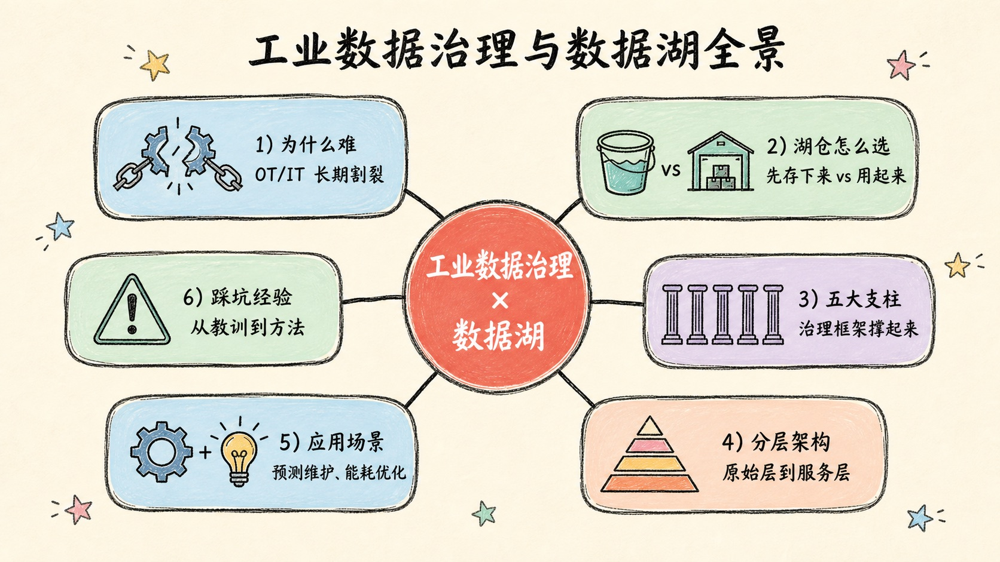
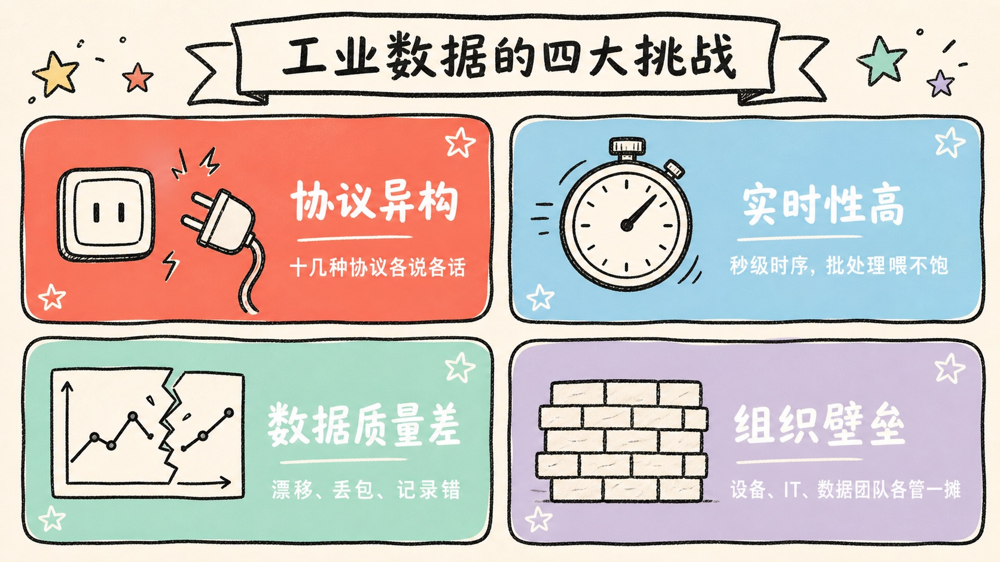
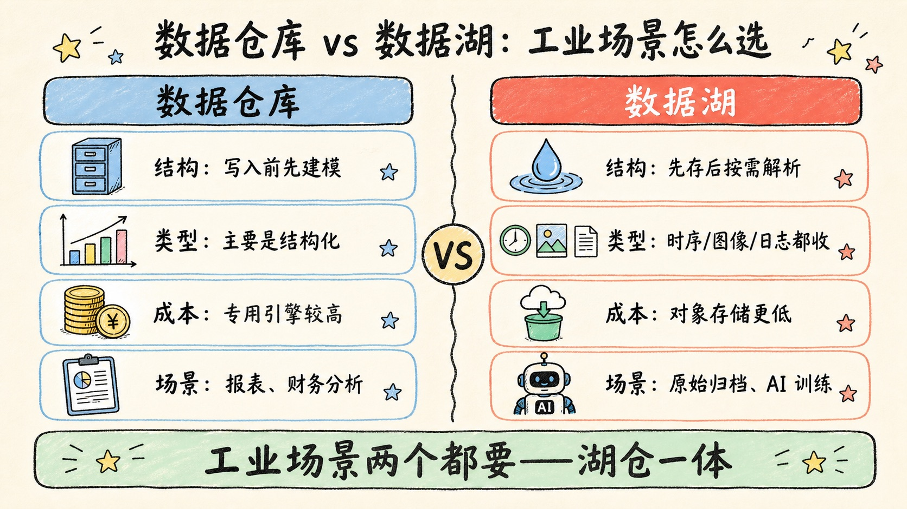
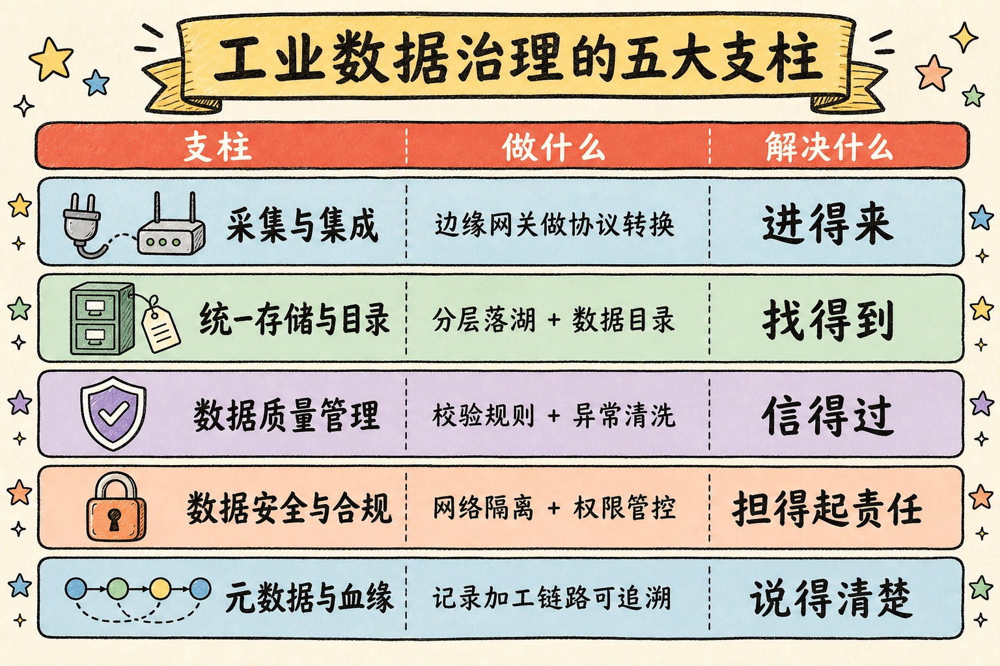
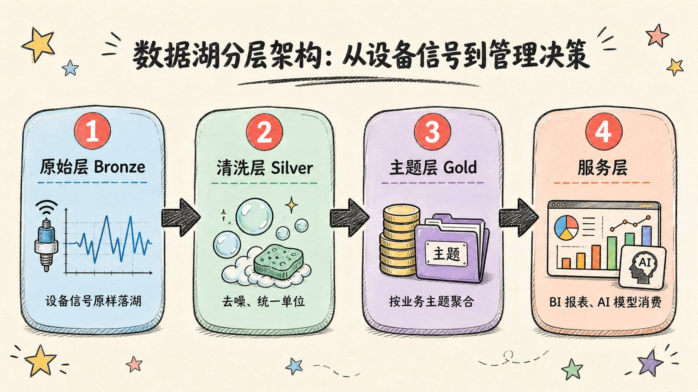
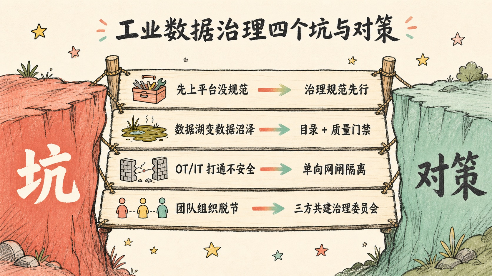

> 工业数据不缺，缺的是能被治理、被信任、被复用的数据——数据湖只是一个容器，治理才是让"水"变得可以喝的那道工序。

---

## 先讲结论

1. **工业场景数据治理的核心矛盾，不是"没数据"，而是"数据散、脏、不可信"**——根源在于 OT（设备/产线）和 IT（信息系统）长期割裂，各说各话。
2. **数据湖不是数据仓库的替代品，而是"先存起来再治理"的容器。** 工业场景真正能跑起来的，靠的是"湖仓一体"+分层治理，不是非此即彼的二选一。
3. **治理框架要靠五根支柱撑起来**——采集集成、统一存储、数据质量、安全合规、元数据血缘——少一根，应用阶段就会塌方。



---

## 一、为什么工业数据治理这么难：从 OT/IT 割裂说起

聊工业数据治理，绕不开一个历史包袱：工厂里的系统，是分两条线各自长大的。

**OT（Operational Technology，运营技术）** 这条线，是 PLC、传感器、SCADA、DCS、MES 这些跟设备和产线打交道的系统。它们诞生的年代，目标是"稳定运行"，不是"数据共享"——协议五花八门（Modbus、OPC UA、Profibus、各厂商私有协议），历史数据库彼此不通，很多设备干脆就是一个黑盒，只吐状态灯和报警。

**IT（Information Technology，信息技术）** 这条线，是 ERP、PLM、WMS、财务系统，管的是订单、物料、财务这些"业务事实"。它们结构清晰、有主键、有事务，但完全不知道产线上此刻是什么温度、什么转速。

这两条线各自演化了二三十年，中间几乎没有共同语言。于是工业数据治理的第一道坎，往往不是"用什么工具"，而是四个具体的老大难：

- **协议异构**：一个中型工厂可能同时存在五六种通信协议和十几种历史库，光"读出数据"就要先做一层协议翻译。
- **实时性要求高**：产线数据是秒级甚至毫秒级的时间序列，传统按天批处理的 ETL 思路直接搬过来会"喂不饱"实时监控和预警场景。
- **数据质量天生差**：传感器漂移、网络丢包、人工记录笔误、单位不统一（有的用摄氏度，有的用华氏度）是常态，不像业务系统那样有强约束和校验。
- **组织壁垒**：设备部门、IT 部门、数据团队各管一摊，"这个数据归谁负责、谁能改字段定义"经常没人说得清。

> 提示：如果你的工厂还没有开始数据治理项目，不要急着上平台——先花两周时间，把"到底有哪些系统、哪些协议、谁在维护"摸清楚。这份清单比任何工具选型都更重要。



---

## 二、数据湖 vs 数据仓库：工业场景该怎么选

理解了工业数据"散、脏、异构"的现实，就能明白为什么传统数据仓库在这个场景里经常水土不服。

数据仓库（Data Warehouse）的哲学是 **schema-on-write**：数据进来之前必须先定义好结构，经过清洗、建模才能入库。这套逻辑对结构清晰的业务数据（订单、财务）很合适，但工业现场的原始数据往往连"要不要保留"都还没想清楚——传感器每秒吐出的振动波形、摄像头拍下的巡检画面、设备的原始报警日志，你不可能等想清楚 schema 再采集，等想清楚的时候数据早就丢了。

数据湖（Data Lake）反过来，是 **schema-on-read**：先把各种格式（结构化、半结构化、非结构化）原样存下来，成本低、写入快，等真正要用的时候再按需解析和建模。这正好补上了工业场景最痛的那一环——先把"证据"保住，再谈治理。

| 维度 | 数据仓库 | 数据湖 |
|------|---------|--------|
| 数据结构 | 强 schema，写入前建模 | schema-on-read，原样存储 |
| 数据类型 | 主要是结构化数据 | 结构化 + 半结构化 + 非结构化（时序、图像、日志） |
| 存储成本 | 较高（专用存储引擎） | 较低（对象存储/HDFS，可用廉价存储） |
| 典型场景 | 报表、BI、财务分析 | 原始数据归档、AI 训练、探索性分析 |
| 工业场景短板 | 装不下时序波形、图像、非标日志 | 单独用容易变"数据沼泽"，缺治理会导致不可用 |

但这不意味着工业场景只需要数据湖。现实是**两者都要**——原始数据先落湖保证不丢失、成本低；治理和聚合之后的主题数据，仍然需要仓库式的强 schema 来支撑报表和决策。这也是这几年"湖仓一体（Lakehouse）"概念被工业场景大量采用的原因：借助 Delta Lake、Apache Iceberg、Apache Hudi 这类开放表格式，在数据湖的存储之上，叠加类似数据仓库的事务、版本管理和 schema 约束能力，一份存储，两种用法都覆盖。



---

## 三、工业数据治理的五大支柱

选好了"存在哪"，接下来的问题是"怎么让这些数据变得可信、可用"。这就是治理要解决的事。工业场景的数据治理框架，可以拆成五根支柱，缺一根都撑不起后面的应用：

1. **采集与集成**：在设备侧部署边缘网关，做协议转换（OPC UA/Modbus → 统一消息格式），把高频时序数据先写入时序数据库（InfluxDB、TDengine），把结构化业务数据通过 CDC（变更数据捕获）同步过来，解决"进得来"的问题。
2. **统一存储与目录**：把不同来源的数据按分层落到湖仓中，同时建立数据目录（Data Catalog），记录每张表/每个字段"是什么、从哪来、谁能用"，解决"找得到"的问题。
3. **数据质量管理**：定义校验规则（量程范围、单位一致性、时间戳连续性），做异常检测和自动清洗，给每份数据打质量分，解决"信得过"的问题。
4. **数据安全与合规**：OT 网络和 IT 网络物理或逻辑隔离（单向网闸、DMZ 区），按角色做访问控制，满足工业互联网安全和数据出境相关合规要求，解决"担不了责任"的顾虑。
5. **元数据与血缘**：记录数据从原始信号到最终报表经过了哪些加工步骤，出问题时能一路追溯到源头，解决"说不清楚"的问题——这是审计和复用的基础。

> 五根支柱里，最容易被忽视、但事后最痛的是"元数据与血缘"。没有它，治理好的数据用久了照样会变成第二个数据沼泽——因为没人说得清一张表到底能不能信。



---

## 四、数据湖分层架构：从设备信号到管理决策

支柱是原则，落到工程实现上，工业数据湖通常会做成四层，一层比一层"干净"、一层比一层贴近业务：

- **原始层（Bronze）**：设备原始信号、时序数据、报警日志、图像视频，几乎不加工，只做格式统一和时间戳对齐。目的是"先留证据"。
- **清洗层（Silver）**：去除明显异常值、统一单位和编码、按设备/产线做维度关联，解决"脏数据"问题，但还是明细级数据。
- **主题层（Gold）**：按业务主题聚合，比如"设备健康主题"（振动、温度、运行时长汇总）、"能耗主题"（分产线分时段能耗）、"产量质量主题"（良率、工艺参数关联），这一层开始体现业务语义。
- **服务层**：面向 BI 报表、AI 模型训练、API 调用做最后一层适配，是数据真正被"消费"的地方。

```
设备信号/PLC/SCADA  →  原始层 Bronze（原样落湖，时序数据库 + 对象存储）
                          ↓ 去噪、单位统一、维度关联
                       清洗层 Silver（标准化明细数据）
                          ↓ 按业务主题聚合
                       主题层 Gold（设备健康 / 能耗 / 质量等主题表）
                          ↓ 按场景适配
                       服务层（BI 报表 / 预测模型 / API）
```

这套分层不是一次性建完就完事，而是一个持续的管道（pipeline）：新设备接入、新协议出现、新业务主题诞生，都会往这条管道里加东西。分层的价值在于——出问题时，你能清楚知道是"原始数据本身就错了"还是"清洗规则写错了"还是"聚合口径对不齐"，而不是对着一张糊涂账无从下手。



---

## 五、落地：四个典型应用场景与踩坑经验

治理框架和分层架构讲得再漂亮，最终还是要落到"能不能解决实际问题"。工业场景里跑得通的应用，大多集中在这四类：

| 应用场景 | 依赖的治理能力 | 典型价值 |
|---------|--------------|---------|
| **预测性维护** | 高质量时序数据 + 设备主题层 | 提前预警设备故障，减少非计划停机 |
| **能耗优化** | 多产线能耗数据打通 + 主题聚合 | 找出能效异常产线，支撑节能改造决策 |
| **质量追溯** | 工艺参数、检测数据、物料批次关联 + 血缘 | 出现质量问题能追溯到具体工序和批次 |
| **供应链协同** | 生产数据与 ERP/供应商数据打通 | 按实际产能和库存动态调整排产计划 |

这四类场景有个共同点：它们都不是"上了数据湖就自动实现"的，而是建立在前面四章讲的治理能力之上——没有干净的时序数据，预测性维护模型就是垃圾进垃圾出；没有元数据血缘，质量追溯只能停留在"大概是那批料的问题"。

真正做过工业数据项目的人都知道，理论框架容易画，落地过程踩的坑往往更有参考价值：

- **坑一：先上技术平台，没有治理规范。** 很多项目一上来就采购数据湖平台、部署大数据组件，结果字段命名各写各的、没人定义数据责任人。→ **解决**：治理规范先行，哪怕只是一份 Excel 版的数据字典和责任人清单，也比空有平台强。
- **坑二：数据湖建成了"数据沼泽"。** 什么都往湖里丢，没有目录、没有质量门禁，半年后没人知道哪张表还能信。→ **解决**：强制要求新数据接入必须登记元数据目录，设置数据质量门禁，不达标的数据不进入主题层。
- **坑三：OT/IT 打通带来安全风险。** 为了拿到产线数据，把 OT 网络直接和 IT 网络打通，结果给了勒索软件可乘之机。→ **解决**：用单向网闸或边缘计算节点做隔离，数据只出不进，敏感操作权限留在 OT 侧。
- **坑四：组织没跟上，数据团队和产线脱节。** 数据团队坐在办公室建模型，产线的人完全不知道这些模型存在，更不会用。→ **解决**：成立跨部门的数据治理委员会，产线、IT、数据团队三方共建，让一线的人也能提需求、看结果。



---

## 总结

1. 工业数据治理难，根子在 OT/IT 长期割裂，协议异构、实时性高、数据质量差、组织壁垒是绕不开的四座山。
2. 数据湖解决"先存下来"的问题，数据仓库解决"能用起来"的问题，工业场景真正稳定运行的架构是湖仓一体，而不是二选一。
3. 五大支柱（采集集成、统一存储、数据质量、安全合规、元数据血缘）撑起治理框架，配合原始层到服务层的分层架构，才能把数据变成真正能用的资产。
4. 技术平台只是入场券，治理规范和组织协同才是决定项目成败的关键——没有责任人的数据湖，迟早会变成数据沼泽。

工业数据治理没有一劳永逸的终点，它更像是给工厂装上一套持续运转的"神经系统"——设备是神经末梢，湖仓是脊髓，治理规则是让信号准确传导的鞘膜。装得好，工厂才能真正"感知到自己"。

---

**参考阅读**：

- [Databricks - What is a Data Lakehouse?](https://www.databricks.com/glossary/data-lakehouse)
- [Apache Iceberg 官方文档](https://iceberg.apache.org/)
- [OPC Foundation - OPC UA 规范](https://opcfoundation.org/about/opc-technologies/opc-ua/)
- [工业互联网产业联盟 - 工业数据分类分级指南](https://www.aii-alliance.org/)
