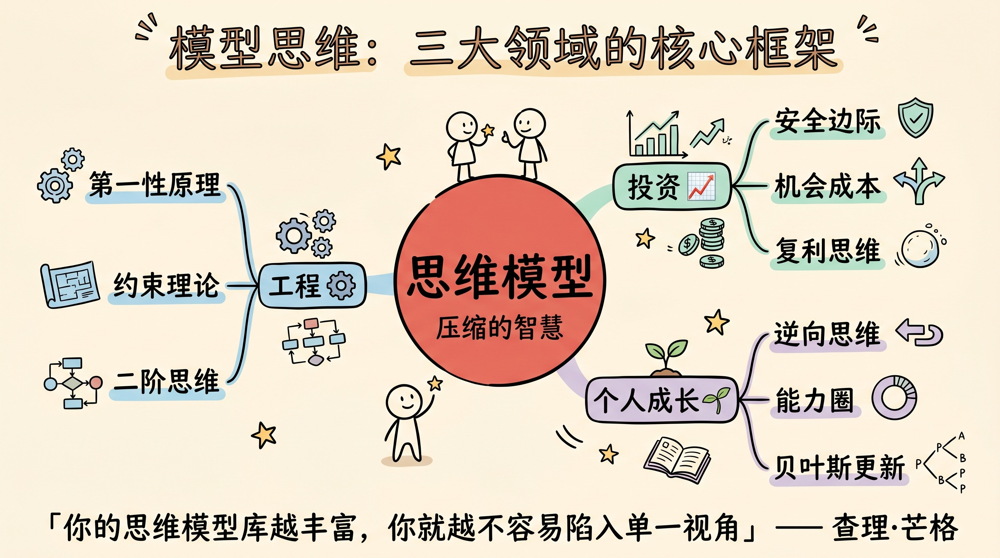
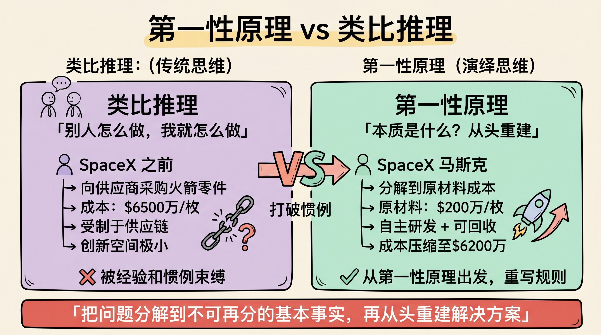
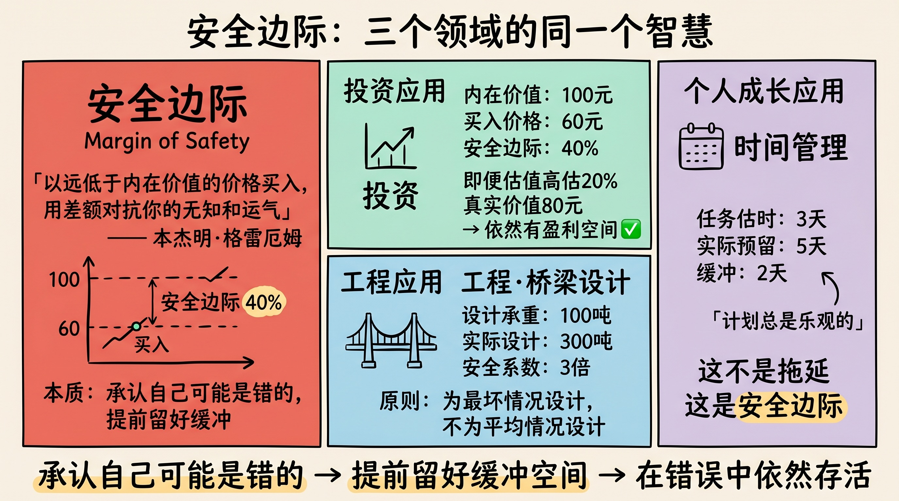
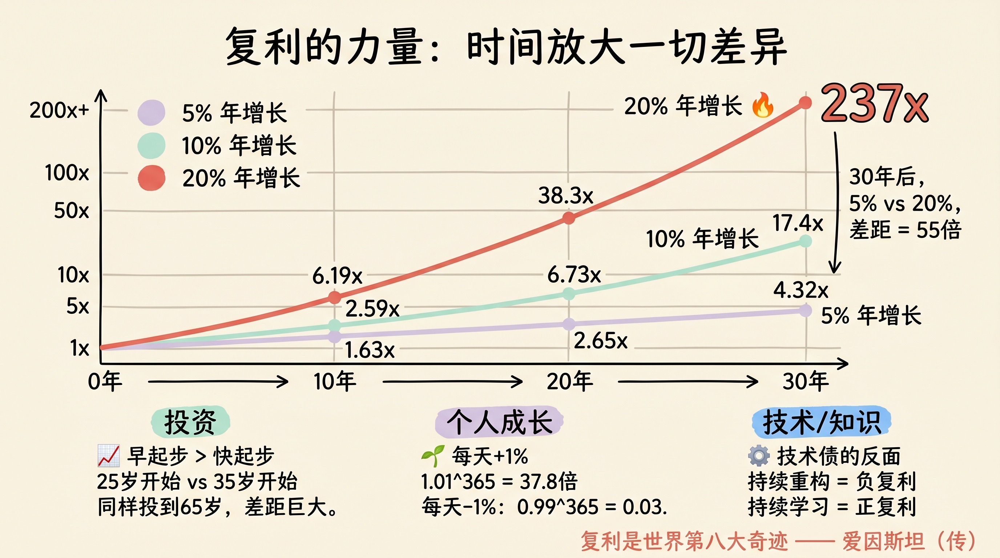
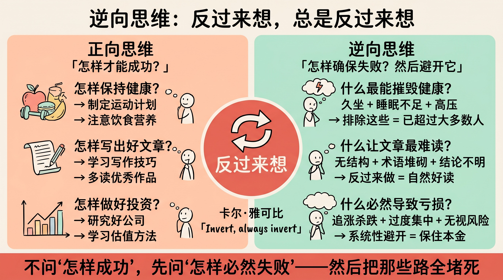
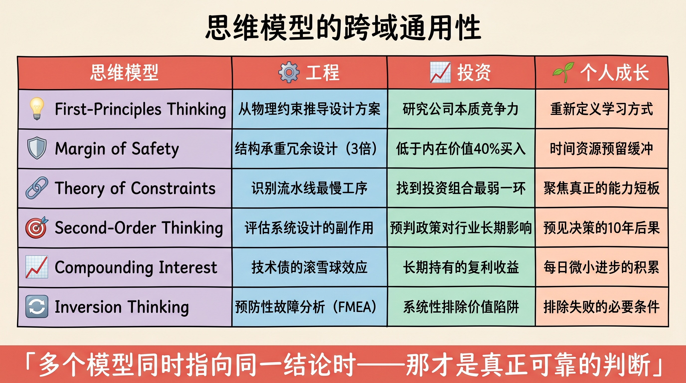

> 你的思维模型库越丰富，你就越不容易陷入单一视角的困境。
>
> —— 查理·芒格

---

## 先讲结论

普通人用经验解决问题，聪明人用框架解决问题。

所谓**思维模型**，就是对现实世界某一规律的抽象提炼。当你拥有足够多的思维模型，遇到新问题时，你不需要从零开始——只需要问自己：**这属于哪一类问题？哪个模型适用于这里？**

查理·芒格终其一生收集了 100+ 个思维模型，他把这套方法论叫做"多元思维模型"（Latticework of Mental Models）。他的核心洞见是：

> **如果你只有一把锤子，你会把所有问题都当成钉子。**

本文不打算列出 100 个模型，而是聚焦在**工程、投资、个人成长**三个领域中，最值得内化的核心模型——以及它们如何跨域通用。

---

## 一、什么是思维模型

### 模型 ≠ 公式，是"看问题的方式"

思维模型不是答题模板，而是一种**压缩了大量经验的认知框架**。

举个例子：

- **工程师**遇到系统故障，会问"瓶颈在哪里"——这是**约束理论**
- **投资人**遇到机会，会问"下行风险有多大"——这是**安全边际**
- **个人成长**遇到目标，会问"如果反过来想，什么会导致失败"——这是**逆向思维**

三个问题，三个领域，但背后是**同一类思考方式**：先找限制，再评估风险，再排除错误。

### 为什么要主动学习思维模型

大脑的默认状态是**走捷径**。它倾向于用最近的经验、最熟悉的框架来解释新问题，这叫**可得性偏差**（Availability Bias）。

主动积累思维模型，是对抗这种偏差的最有效方式：

1. **减少重新发明轮子**：很多"新问题"其实是老问题换了外衣
2. **跨域迁移洞见**：工程领域的解法，往往在投资里同样适用
3. **降低认知负荷**：有了框架，复杂问题变得可操作

---

## 二、工程领域：构建系统的思维

### 第一性原理（First Principles Thinking）

埃隆·马斯克把这个概念带火了，但它最早来自亚里士多德：

> **把问题分解到不可再分的基本事实，再从头重建解决方案。**

传统思维是**类比推理**：别人怎么做，我就怎么做。第一性原理是**演绎推理**：事情的本质是什么，我从本质出发。

**工程案例**：
SpaceX 造火箭。传统做法：向航天供应商采购，成本高达 $6500 万/枚。马斯克的问题：火箭的原材料成本是多少？答案：$200 万。于是 SpaceX 决定自己造，把成本压缩到 $6200 万以内，并实现可回收。

**投资应用**：
不问"这支股票涨了多少"，而问"这家公司的核心竞争力到底是什么"。

**个人成长应用**：
不问"别人是怎么学英语的"，而问"语言学习的本质是什么——大量可理解的输入"。

### 约束理论（Theory of Constraints）

由管理学家以利亚胡·高德拉特（Eliyahu Goldratt）提出：

> **任何系统的产出，都被它最薄弱的环节（瓶颈）所限制。优化非瓶颈环节，是浪费。**

**工程案例**：
一条流水线有 5 道工序，每道工序的产能分别是 100/80/120/90/110 件/小时。整体产出 = 80（最慢的一道）。无论你把其他工序优化到多快，产出都不会超过 80。

**个人成长应用**：
你的写作能力、思维深度、表达技巧——哪一个是你的瓶颈？提升非瓶颈，不会带来真正的进步。

### 二阶思维（Second-Order Thinking）

> **不只问"这件事会发生什么"（一阶），还要问"然后呢？再然后呢？"（二阶、三阶）。**

| 决策 | 一阶效果 | 二阶效果 |
|------|---------|---------|
| 降价促销 | 短期销量提升 | 品牌价值受损，竞争对手跟进 |
| 996 加班 | 短期产出增加 | 长期效率下降，人才流失 |
| 禁止某种药物 | 减少正规使用 | 黑市泛滥，质量无法管控 |

---

## 三、投资领域：在不确定性中做决策

### 安全边际（Margin of Safety）

本杰明·格雷厄姆在《聪明的投资者》中提出，被沃伦·巴菲特奉为投资圣经：

> **以远低于内在价值的价格买入，用价格与价值之间的差额作为缓冲，对抗你的无知和运气。**

它的本质是：**承认自己可能是错的**，所以为错误预留足够空间。

**投资应用**：一家公司内在价值 100 元，你在 60 元买入。即便你的估值高估了 20%（真实价值 80 元），你依然有盈利空间。

**工程应用**：桥梁设计承重 100 吨，实际设计为 300 吨。安全边际 = 200%。

**个人成长应用**：计划完成一项任务需要 3 天，给自己留 5 天。这不是拖延，是安全边际。

### 机会成本（Opportunity Cost）

> **做了 A，就意味着放弃了 B。A 的真实成本 = A 的直接成本 + 放弃 B 的代价。**

经济学第一课，但大多数人在实际决策中完全忽略它。

**常见误区**：
- 买了一张不想看的演出票（已花 500 元），因为"不看就亏了"——这是**沉没成本谬误**，与机会成本相反
- 正确做法：那 3 小时，你能做什么更有价值的事？

**投资中的机会成本**：
把钱存在银行（年化 2%），真实成本是：放弃了投资指数基金（年化 8-10%）的机会。

### 复利思维（Compound Interest）

> **在足够长的时间里，持续的小改进会产生惊人的大结果。**

爱因斯坦称其为"世界第八大奇迹"。

| 年增长率 | 10年后 | 20年后 | 30年后 |
|---------|--------|--------|--------|
| 5% | 1.63x | 2.65x | 4.32x |
| 10% | 2.59x | 6.73x | 17.4x |
| 20% | 6.19x | 38.3x | 237x |

**关键洞见**：增长率的差异，在时间的放大下，会产生**指数级**的分叉。这就是为什么早起步比快起步更重要。

**个人成长应用**：每天比昨天进步 1%，一年后是昨天的 37.8 倍（1.01^365）。

---

## 四、个人成长领域：优化自己这台机器

### 逆向思维（Inversion）

数学家卡尔·雅可比（Carl Jacobi）有一句名言：

> **反过来想，总是反过来想。**

与其问"怎样才能成功"，先问"怎样才能确保失败"——然后避开那些事。

**应用示例**：

想要保持健康，逆向问：什么习惯最能摧毁健康？
→ 久坐不动、睡眠不足、饮食不规律、长期高压
→ 把这些全部排除，你就已经比大多数人健康了。

想要写出好文章，逆向问：什么最能让文章难读？
→ 长段落、专业术语堆砌、没有结构、结论不明确
→ 反过来做，文章自然好读。

### 能力圈（Circle of Competence）

巴菲特的核心原则之一：

> **知道自己知道什么，比知道很多更重要。在能力圈内行动，在边界处谨慎。**

三个圆圈：
1. **你知道自己知道的**（能力圈内）
2. **你知道自己不知道的**（边界区域）
3. **你不知道自己不知道的**（最危险区域）

大多数人在第 3 区域翻车——他们不知道自己不知道。

扩大能力圈的方式：大量阅读、深度实践、向比你强的人请教。

### 贝叶斯更新（Bayesian Updating）

> **新证据出现时，理性地更新你的信念，而不是固执地捍卫原有观点。**

公式简化理解：新信念 = 原有信念 × 新证据的影响

**应用示例**：
你原本认为某个项目成功率 60%。新数据显示竞争对手刚做了类似的尝试并失败了。理性做法：更新你的成功率估计，可能降到 40%，而不是找理由"我的情况不一样"。

---

## 五、思维模型的跨域通用性

真正强大的思维模型，往往在多个领域都有对应。

| 思维模型 | 工程 | 投资 | 个人成长 |
|---------|------|------|---------|
| 第一性原理 | 从物理约束推导设计 | 研究公司本质价值 | 重新定义学习方式 |
| 安全边际 | 结构承重冗余设计 | 低于内在价值买入 | 时间和资源预留缓冲 |
| 约束理论 | 识别流水线瓶颈 | 找到组合里的弱项 | 聚焦真正的短板 |
| 二阶思维 | 评估系统副作用 | 预判政策对行业影响 | 预见决策的长期后果 |
| 复利思维 | 技术债的滚雪球效应 | 长期持有复利收益 | 每日微小进步的累积 |
| 逆向思维 | 预防性故障分析（FMEA） | 避开价值陷阱 | 排除失败的必要条件 |

---

## 六、如何建立自己的模型库

### 不要收集，要内化

很多人喜欢"收集"思维模型——读了书、保存了笔记，但下次遇到问题时根本想不起来。

**内化的三个步骤**：

1. **举例验证**：每学一个模型，立刻找 3 个真实案例验证它
2. **跨域迁移**：在它"原生领域"之外，能用在哪里？
3. **反例测试**：这个模型在什么情况下会失效？失效的边界在哪里？

### 避免"锤子综合症"

掌握了某个模型后，人很容易过度使用它。**每个模型都有适用边界**。

- 第一性原理适合从头创新，但不适合已有成熟解决方案的场景
- 安全边际适合价值投资，但不适合需要快速抢占市场的情况
- 约束理论适合串行流程，但不适合高度并行的创意工作

### 组合使用，互相校验

最强的判断，来自**多个模型指向同一结论**。

当第一性原理说"这个方向正确"、安全边际说"风险可控"、逆向思维找不到明显的失败路径——这时候，你的决策信心才应该真正提升。

---

## 总结：少即是多

1. **思维模型是压缩的智慧**：少数模型，覆盖大多数重要问题
2. **跨域迁移是核心能力**：在工程里学到的，在投资里用；在投资里悟到的，在生活里用
3. **内化比收集更重要**：100 个没用过的模型，不如 10 个随手可用的模型
4. **组合校验最可靠**：单一模型容易误判，多模型交叉验证才稳健

> 给我一个足够长的杠杆和一个支点，我可以撬动整个地球。——阿基米德
>
> 思维模型，就是你认知世界的杠杆。

---

**参考阅读**：

- Munger, C. (1994). *A Lesson on Elementary, Worldly Wisdom*
- Graham, B. (1949). *The Intelligent Investor*
- Goldratt, E. (1984). *The Goal*
- Parrish, S. *The Great Mental Models* (Farnam Street)
