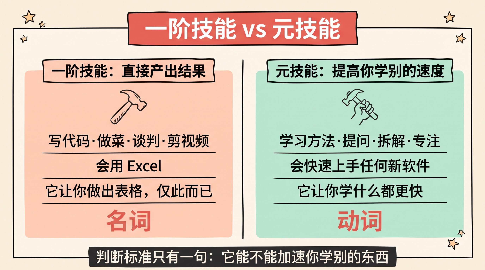
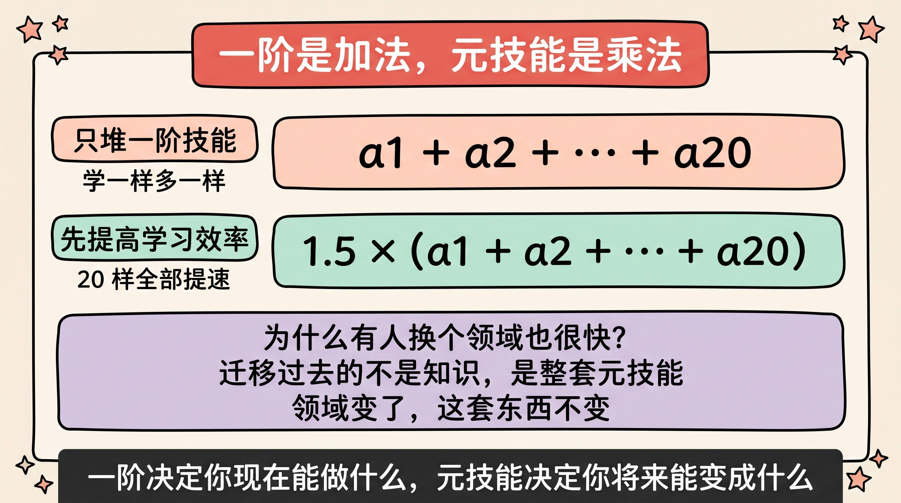
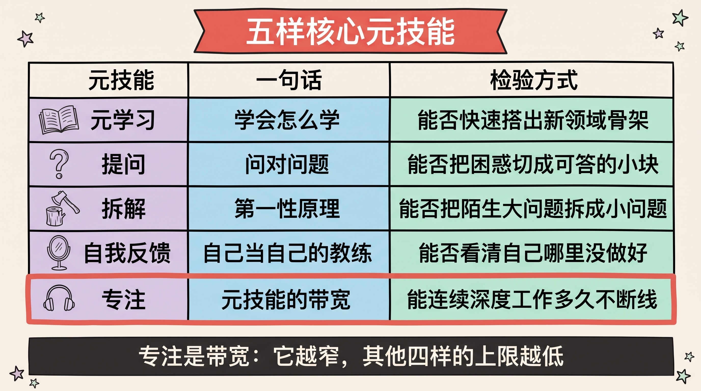
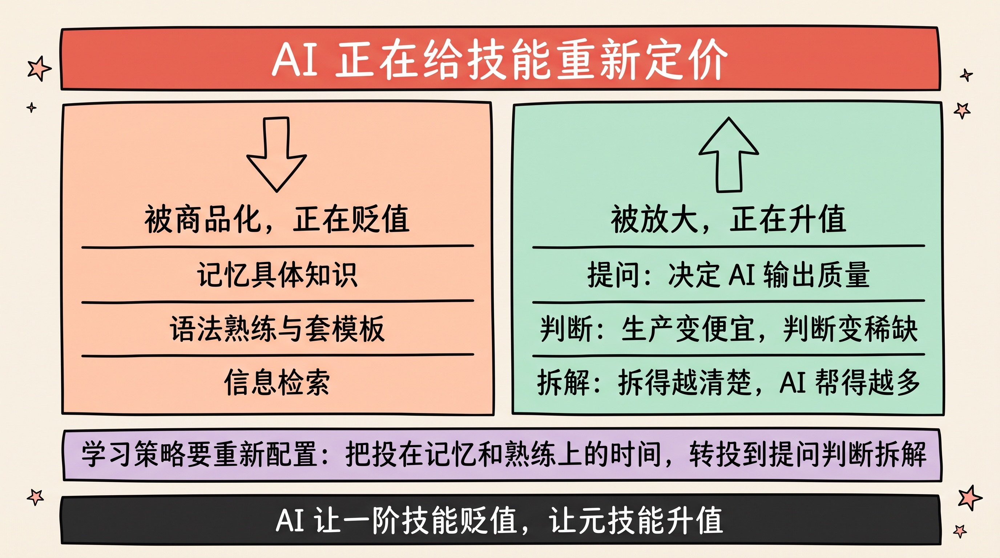
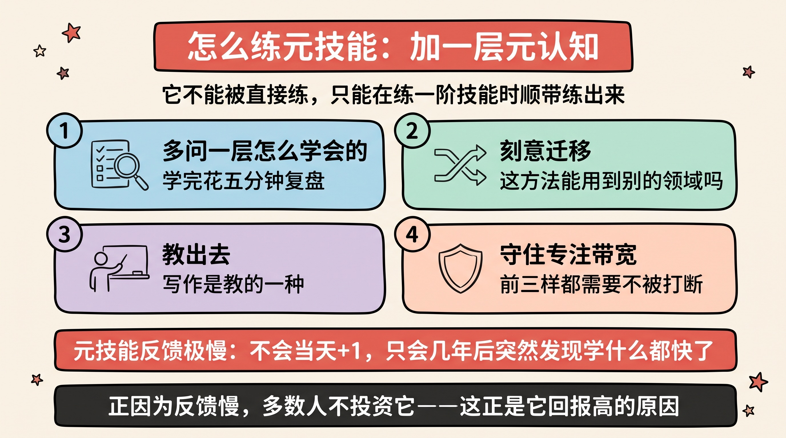
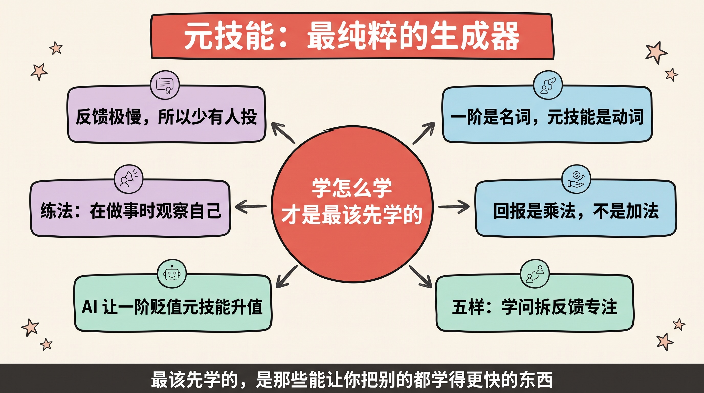

> 大多数人把时间花在学"技能"上，很少有人花时间学"学技能的技能"。而后者的回报，会乘进你此后学的每一样东西里。

在[《早点装上》](/posts/install-early/)里我提过一句：真正该抢占早期插槽的，是**元技能**——学习方法会提高你此后学习一切东西的速度。当时一笔带过，但这个概念值得单独展开，因为它可能是所有关于"学什么"的问题里，回报最高的那个答案。

这篇文章想把它讲透：元技能到底是什么、为什么它的回报是乘法、有哪几种、怎么练，以及 AI 正在怎样改写这张清单。

---

## 一、什么是元技能

先给一个干净的定义。技能可以分成两层：

- **一阶技能**：直接产出结果。写代码、做菜、谈判、弹钢琴、剪视频。
- **元技能（二阶技能）**：不直接产出结果，但**提高你获得一阶技能的速度和质量**。学习方法、专注力、提问能力、拆解问题的能力、自我反馈的能力。

打个比方：一阶技能是你手里的工具，元技能是**造工具和用工具的能力**。你可以有一屋子工具却不会造新的，也可以只有几样工具但能快速造出任何缺的那件——后者在一个工具会不断过时的世界里，明显更值钱。

**判断一个能力是不是元技能，只需一个测试**：它能不能加速你学别的东西？

- "会用 Excel" —— 一阶。它让你做出表格，仅此而已。
- "会快速上手任何新软件" —— 元。它让你学 Excel、学 Figma、学任何工具都更快。

一阶技能是**名词**（一件件东西），元技能是**动词**（一种能力）。名词会过时，动词不会。

---

## 二、为什么元技能的回报是乘法

这是整件事的核心。一阶技能是加法，元技能是乘法。

假设你要在未来学 20 样东西。如果你只堆一阶技能，你的产出是这 20 样的**加总**——学一样多一样。但如果你先把学习效率提高 50%，这个系数会**乘进后面每一样**里——20 样全部提速。前者是 `a₁ + a₂ + ... + a₂₀`，后者是 `1.5 × (a₁ + a₂ + ... + a₂₀)`。

而且这个乘数会**叠加复利**。学习方法让你更快学会"如何更好地提问"，更好的提问又反过来让你学得更快……元技能之间互相加速，形成一个增强回路——关于增强回路怎么运作，[《增强回路、长期价值与做正确的事》](/posts/reinforcing-loops-long-term-value-right-things/)里有专门的展开。

这也解释了一个常见的困惑：**为什么有些人换个领域也能很快做到很好？** 表面看是"天赋"或"聪明"，本质上他们迁移过去的不是具体知识，而是一整套元技能——怎么快速建立一个领域的地图、怎么找到最关键的 20%、怎么判断自己哪里没懂。领域变了，这套东西不变，所以他们看起来"干什么都快"。

> 一阶技能决定你**现在**能做什么，元技能决定你**将来**能变成什么。

---

## 三、核心元技能清单

元技能不是一个模糊的整体，它可以拆成几样具体的、可以分别训练的东西。我认为最底层的是这五样：

### 1. 元学习：学会怎么学

关于学习本身的知识。它包括：怎么快速建立一个新领域的骨架，怎么识别哪 20% 的概念撑起 80% 的理解，怎么安排间隔重复和主动回忆（而不是低效地重读）。

一个最好用的子技能是**费曼技巧**：把一个东西讲到一个外行能懂，你才真的懂了——它同时是学习方法和检验方法。

### 2. 提问的能力

在一个答案唾手可得的时代，**问对问题**比知道答案稀缺得多。好的问题能把一个模糊的困惑切成可以回答的小块，能一下子跳到问题的要害。这个能力在 AI 时代的权重被急剧放大（下一节细说）——因为你和 AI 协作的质量，几乎完全由你的提问质量决定。

### 3. 拆解问题的能力（第一性原理）

把一个大的、陌生的、吓人的问题，拆成一组小的、已知的、能逐个击破的子问题。这是[第一性原理](/posts/quant-trading-first-principles/)的日常形态——不接受"事情就该这样"的打包答案，而是拆到底层再自己搭回来。它是所有硬问题的通用入口。

### 4. 自我反馈的能力

没有教练时，能不能自己给自己当教练？这需要两样东西：一是**看清自己哪里没做好**的诚实（这很难，人天然美化自己），二是**知道好应该是什么样**的标准。刻意练习之所以有效，核心就是这个反馈回路——而多数人的"练习"只是在重复，没有反馈，所以练十年也不进步。

### 5. 专注力：所有元技能的带宽

上面四样都需要一样底层资源——**深度专注的能力**。它像是元技能的带宽：带宽越窄，其他所有认知能力的上限越低。在一个注意力被系统性收割的环境里，能长时间专注本身已经成了一种稀缺的元技能，也是最该刻意保护的一样。

| 元技能 | 一句话 | 检验方式 |
|--------|--------|----------|
| 元学习 | 学会怎么学 | 能不能把新领域的骨架快速搭出来 |
| 提问 | 问对问题 | 你的问题能不能把困惑切成可答的小块 |
| 拆解 | 第一性原理 | 能不能把陌生大问题拆成已知小问题 |
| 自我反馈 | 自己当自己的教练 | 你能不能看清自己哪里没做好 |
| 专注 | 元技能的带宽 | 你能连续深度工作多久不断线 |

---

## 四、AI 正在改写这张清单

这是今天讨论元技能绕不开的一层，因为 AI 不是又一个要学的一阶技能——**它是一台一阶技能的放大器，同时是一台元技能的重新定价机**。

它做了两件事：

**它把一部分能力商品化了。** 具体知识的记忆、语法的熟练、模板的套用、信息的检索——这些过去需要多年积累的一阶能力，现在几乎免费。把它们苦练成肌肉记忆的投资回报率正在坍塌。

**它把另一部分能力的价格抬高了。** 越是"元"的能力，越被 AI 放大而不是替代：

- **提问**变成了核心生产力。AI 的输出质量几乎完全由你的问题质量决定——你问得含糊，它答得含糊；你问得刁钻，它给你惊喜。
- **判断**变成了瓶颈。AI 能生成十个方案，但选哪个、看出哪个似是而非，是你的事。它把"生产"变便宜了，于是"判断"变成了稀缺资源。
- **拆解**变成了协作的接口。你把一个大问题拆得越清楚，AI 能帮你的部分就越大。不会拆解的人，面对 AI 也使不上力。

所以 AI 时代的学习策略，本质是一次**重新配置**：把过去投在"记忆和熟练"上的时间，转投到"提问、判断、拆解"上。关于怎么和 AI 具体协作，我在[《递归法》](/posts/recursive-ai-technique/)和[《如何打造属于你的 AI 智能体》](/posts/ai-agent-guide/)里写过更落地的做法——但底层逻辑是这一条：

> AI 让一阶技能贬值，让元技能升值。你越早把重心从"学具体的东西"移到"学怎么学、怎么问、怎么判断"，越占便宜。

---

## 五、怎么练元技能

元技能有个麻烦的特性：**它不能被直接练习，只能在练习一阶技能的过程中被顺带练出来。** 你没法"单独练元学习"，你只能一边学一门具体的东西，一边训练你学它的方式。

所以练法是**加一层元认知**——在做事的同时，观察自己是怎么做的：

1. **每学一样新东西，多问一层"我是怎么学会的"。** 学会之后花五分钟复盘：哪个方法有效、哪里卡住、下次怎么更快。这一层复盘，就是把一次性的学习经验，沉淀成可复用的元技能。

2. **刻意迁移。** 学会一样东西后，逼自己问："这里面哪些方法，能用到一个完全不同的领域？"迁移的次数越多，你抽取出的东西就越"元"、越通用。

3. **教出去。** 教是最强的元技能训练——它同时逼你检验理解（费曼）、组织结构（拆解）、预判困惑（提问）。写作是教的一种，这也是为什么[把东西写清楚](/posts/how-to-write-technical-blog-posts-with-structure/)本身就是在锻炼元技能。

4. **保护专注这条带宽。** 前三样都需要不被打断的深度时间。这意味着要主动对抗那些收割注意力的东西——这是练元技能的**前置条件**，不是可选项。

一个提醒：元技能的进步**看不见摸不着，反馈极慢**。你不会在学完某样东西的那天发现"我的元学习能力+1"，你只会在几年后某天突然意识到"怎么现在学什么都比以前快了"。正因为反馈慢，多数人不会主动投资它——这恰恰是它回报高的原因。

---

## 写在最后

- **技能分两层**：一阶直接产出结果，元技能提高你获得一阶技能的速度——前者是名词，后者是动词；
- **元技能的回报是乘法**：它乘进你此后学的每一样东西里，还会互相加速形成复利；
- **核心五样**：元学习、提问、拆解、自我反馈、专注——每一样都可以分别刻意训练；
- **AI 在重新定价**：它让一阶技能贬值、让元技能升值，学习重心应从"记忆和熟练"转向"提问、判断、拆解"；
- **练法是加一层元认知**：在做事的同时观察自己怎么做，复盘、迁移、教出去，并守住专注这条带宽；
- 一句话：**最该先学的，是那些能让你把别的都学得更快的东西。**

这篇是[《早点装上》](/posts/install-early/)里"装生成器而非结论"的具体化——元技能，就是最纯粹的生成器。

## 参考资源

- Barbara Oakley, *A Mind for Numbers* / Coursera《Learning How to Learn》（元学习）
- Richard Feynman，费曼技巧（用教来检验理解）
- K. Anders Ericsson, *Peak*（刻意练习与反馈回路）
- Cal Newport, *Deep Work*（专注作为稀缺能力）
- 站内相关：[早点装上](/posts/install-early/) · [模型思维](/posts/mental-models/) · [第一性原理分析](/posts/quant-trading-first-principles/) · [递归法：用 AI 最强大的技巧](/posts/recursive-ai-technique/) · [增强回路与长期价值](/posts/reinforcing-loops-long-term-value-right-things/)

