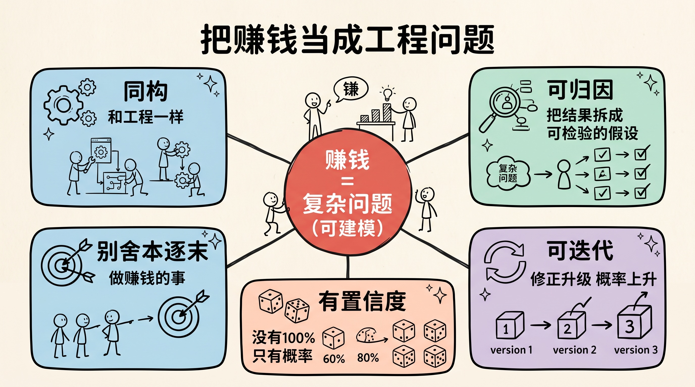
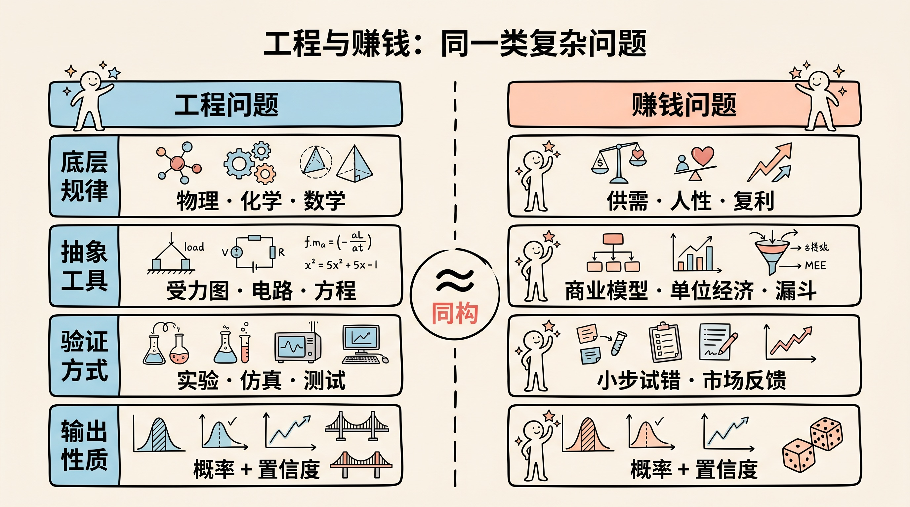
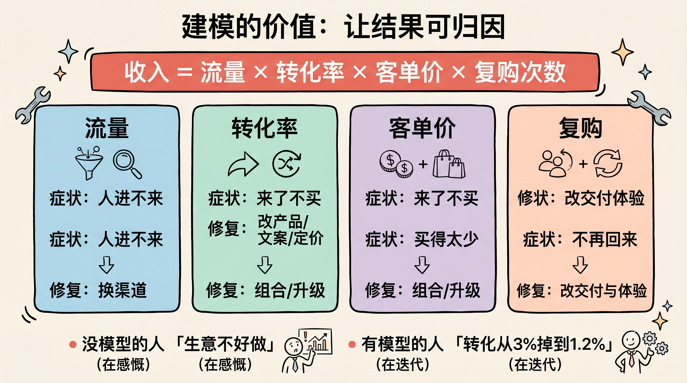
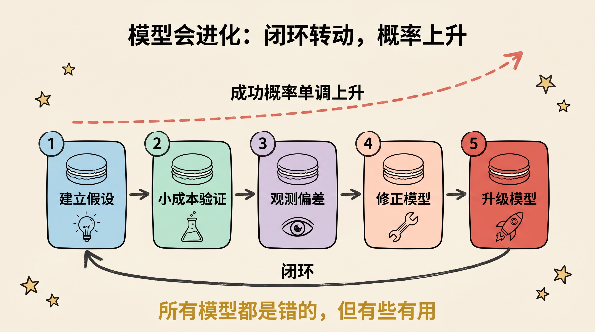
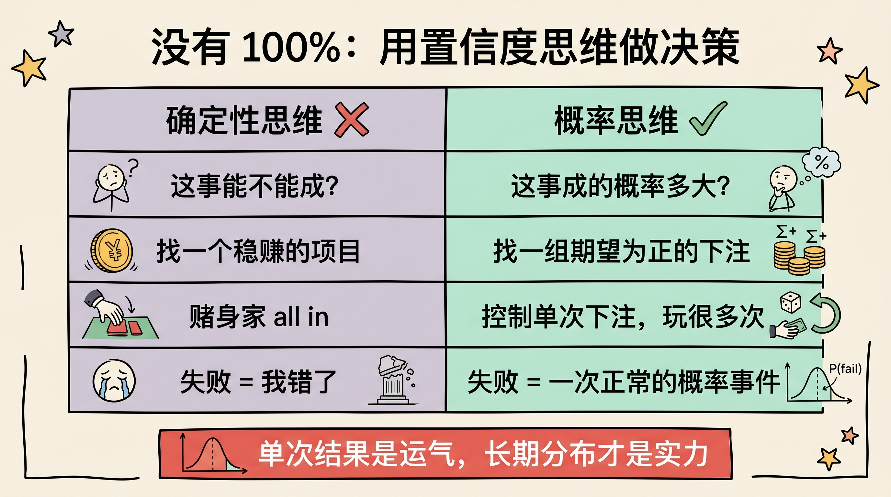
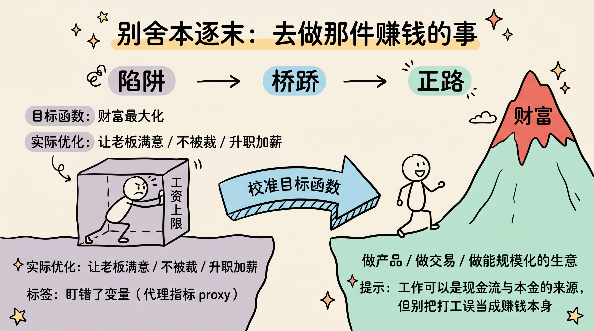

> 工程师从不指望一个公式直接给出真理，他们只是不断修正模型，让正确的概率越来越高。赚钱也一样——它不是玄学，而是一个可以建模、可以迭代、有置信度的复杂问题。

---

## 先讲结论

1. **赚钱是一种行为，本质上是一个复杂问题**，和工程问题同构——可以用建模的方式去逼近，而不是靠运气或玄学。
2. **没有 100% 可信的模型**。复杂问题的输出永远是带置信度的概率，而不是确定的答案。承认这一点，你才会去迭代而不是赌博。
3. **想赚钱，就去做那件赚钱的事**。指望通过一份不相干的工作"顺便"获得财富，是典型的舍本逐末。



---

## 一、赚钱和工程，是同一类问题

做工程的人有一种很朴素的信仰：**任何复杂系统，背后都有可被理解的规律。**

桥会不会塌、芯片会不会过热、火箭能不能入轨——这些都是极其复杂的问题，变量成千上万，耦合关系盘根错节。但工程师并不因此放弃，他们做的事情很一致：

- 找到底层规律（牛顿力学、热力学、麦克斯韦方程……）；
- 把现实抽象成一个**模型**（受力分析、电路图、有限元网格）；
- 用模型去**预测**结果，再用现实去**校正**模型。

赚钱是什么？赚钱是一种**行为**，是你在一个由人、需求、价格、时间、信息构成的系统里做出的一连串决策。它的变量同样成千上万：用户要什么、对手在干嘛、成本结构如何、现金流够不够、时机对不对。

这和工程问题是**同一类问题**——都是高维、强耦合、动态变化的复杂系统。

| 维度 | 工程问题 | 赚钱问题 |
|------|---------|---------|
| 底层规律 | 物理、化学、数学 | 供需、人性、成本、复利 |
| 抽象工具 | 受力图、电路、方程 | 商业模型、单位经济、漏斗 |
| 验证方式 | 实验、仿真、测试 | 小步试错、市场反馈 |
| 输出性质 | 概率 + 置信度 | 概率 + 置信度 |

既然是同一类问题，那么工程师对付复杂问题的方法论，理应可以迁移过来。



---

## 二、为什么是"建模"：要的是可归因

很多人对赚钱的态度是"试试看"，赚到了说自己有眼光，亏了说运气不好。这种态度最大的问题不是输赢，而是**不可归因**——你永远不知道是哪一步对了、哪一步错了。

工程学之所以强大，核心不在于它能算得准，而在于它**可归因**：

> 当一座桥出问题，工程师能定位到是哪根梁、哪个焊点、哪个载荷假设错了。

建模的真正价值，就是把一个混沌的结果，拆解成**一串可以单独检验的假设**。一个赚钱模型大致长这样：

```text
收入 = 流量 × 转化率 × 客单价 × 复购次数
成本 = 获客成本 + 履约成本 + 固定成本
利润 = 收入 − 成本
```

这个公式本身并不深刻，但它的意义在于：**当结果不及预期，你能逐项归因。**

- 是流量不够？→ 改渠道。
- 是转化太低？→ 改产品 / 文案 / 定价。
- 是复购起不来？→ 改交付和体验。

没有模型的人，亏了只会笼统地说"生意不好做"；有模型的人，亏了会说"转化率从 3% 掉到 1.2%，问题出在落地页改版"。**前者在感慨，后者在迭代。**

建模不是为了一次算对，而是为了**让每一次失败都变成一条信息**。



---

## 三、模型会进化：修正与升级让概率上升

这里要破除一个误解：建模不是一锤定音地造出一个"正确模型"，而是**持续修正**的过程。

工程上有个经典认知——**所有模型都是错的，但有些是有用的**（George Box）。第一版受力分析一定不完美，但它给了你一个可以被现实打脸的对象。每被打一次脸，你就修正一次参数、补一个被忽略的变量，模型就更接近真实一点。

赚钱模型也一样，它的生命周期是一个闭环：

1. **建立假设**——我认为 A 渠道的用户愿意为 B 付费。
2. **小成本验证**——花最小的钱跑一次真实交易。
3. **观测偏差**——实际转化、成本、复购和预期差多少。
4. **修正模型**——更新参数，或推翻某个假设。
5. **升级模型**——加入新发现的变量（季节性、口碑效应……）。

> 关键洞察：**只要这个循环能持续转动，达成目标的概率就会单调上升。**

这正是工程和创业最相似的地方——**没有人第一次就把火箭送上天，但每一次失败的数据都让下一次更可能成功。** SpaceX 炸了那么多火箭，本质上是在用爆炸给模型喂数据。

所以判断一个人能不能赚到钱，不要看他第一版计划多漂亮，要看他的**迭代速度**和**对反馈的诚实程度**。模型升级得越快，逼近财富的速度就越快。



---

## 四、没有 100%：用置信度思维做决策

工程师有一个外行常常不理解的习惯：**他们从不说"绝对安全"，只说"在 99.99% 的工况下不会失效"。**

这不是甩锅，而是对复杂问题本质的清醒认知：

> 复杂问题不存在"输入参数 → 输出确定答案"这种东西。它的输出永远是一个**带置信度的概率分布**。

赚钱更是如此。再完美的商业模型，也只能告诉你"这件事大概有 60% 的概率能跑通"，而给不了你"一定能赚 100 万"的保证。任何承诺确定性收益的人，要么不懂复杂问题，要么在骗你。

接受"概率 + 置信度"的思维方式，会改变你的决策习惯：

| 确定性思维（错） | 概率/置信度思维（对） |
|----------------|--------------------|
| 这事能不能成？ | 这事成的概率有多大？ |
| 找一个稳赚的项目 | 找一组期望为正的下注 |
| 赌身家 all in | 控制单次下注，让自己能玩很多次 |
| 失败 = 我错了 | 失败 = 一次正常的概率事件 |

真正的高手不追求"押中一次"，而是追求**让自己处在一个长期期望为正、且能反复下注的位置**。因为只要单次置信度够高、下注次数够多，大数定律会替你赚钱。

**单次结果是运气，长期分布才是实力。**



---

## 五、舍本逐末：别从"工作"里要财富

最后这一点，是最朴素也最被忽略的。

如果你的目标是**赚钱**，那么按照建模的逻辑，你应该直接去做**那件能产生财富的事**——做产品、做交易、做能规模化的生意。

但现实里，绝大多数人做的是另一件事：**找一份不相干的工作，期望从工作中获取财富。**

这在模型上是**目标和手段错配**：

- 你的**目标函数**是"财富最大化"；
- 你优化的**实际变量**却是"如何让老板满意、如何不被裁、如何升职加薪"。

这两个函数在小范围内正相关，但在大尺度上几乎是脱钩的——一份薪水的天花板，和财富的量级根本不在一个数量级。把全部精力投在一个上限很低的变量上，**这就是典型的舍本逐末。**

> 工作不是原罪。工作可以是现金流的来源、是学习行业的入口、是积累本金和认知的阶段。问题在于：**别把"打工"误当成"赚钱"本身。**

用工程语言说：你要优化的是**真正的目标函数**，而不是某个和目标只有微弱相关性的代理指标（proxy）。一旦你盯错了变量，再努力的优化也只是在错误的方向上狂奔。

所以诚实地问自己一句：

> **我现在每天投入最多时间的那件事，到底是在直接生产财富，还是只是在换一份和财富量级无关的安稳？**

想清楚这个问题，比任何模型都重要。



---

## 六、动手：搭一个属于你的赚钱模型

把上面的思路落到行动，五步就能起步：

1. **写下你的收入公式。** 把"想赚钱"翻译成可拆解的变量（流量、转化、客单、复购、成本），让目标可归因。
2. **找到底层规律。** 你这门生意真正依赖什么？是供需差、信息差、规模效应，还是复利？想不清楚，模型就是空中楼阁。
3. **做最小验证。** 用最低成本跑一次真实交易，让现实来打你模型的脸——越早被打越好。
4. **建立反馈闭环。** 把每次结果记下来，逐项对比预期与实际，修正参数、升级变量。
5. **校准目标函数。** 定期检查：我投入的精力，是在优化"财富"本身，还是某个低天花板的代理指标？

记住，你不需要一开始就有一个完美模型，你只需要有一个**能转起来的循环**。

---

## 总结

1. **赚钱是复杂问题，和工程同构**——能建模、能归因、能迭代，不必交给玄学和运气。
2. **建模的价值在于可归因**——让每一次失败都变成一条能指导下一步的信息。
3. **模型靠迭代逼近真实**——只要闭环能持续转动，成功的概率就单调上升。
4. **永远没有 100%**——用"概率 + 置信度"做决策，追求长期为正、可反复下注的位置。
5. **别舍本逐末**——想赚钱就去做赚钱的事，别把低上限的工作误当成财富本身。

> 工程师不相信奇迹，他们相信迭代。把赚钱当成一个工程问题，你就从一个许愿的人，变成了一个会逼近答案的人。

---

**参考阅读**：

- George E. P. Box, *"All models are wrong, but some are useful"*（统计建模的经典论断）
- 纳西姆·塔勒布《反脆弱》——关于在不确定性中下注与迭代
- 丹尼尔·卡尼曼《思考，快与慢》——概率思维与决策偏差
