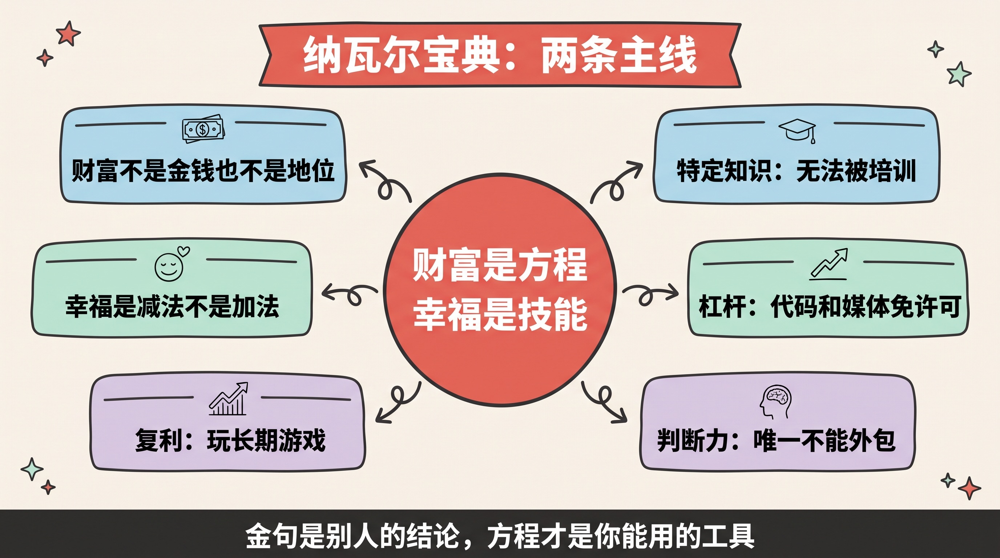
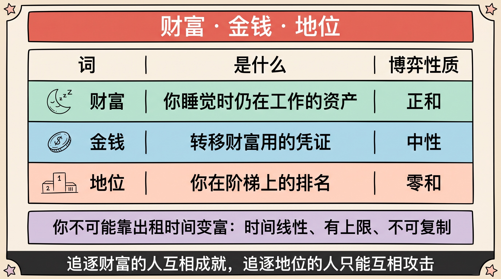
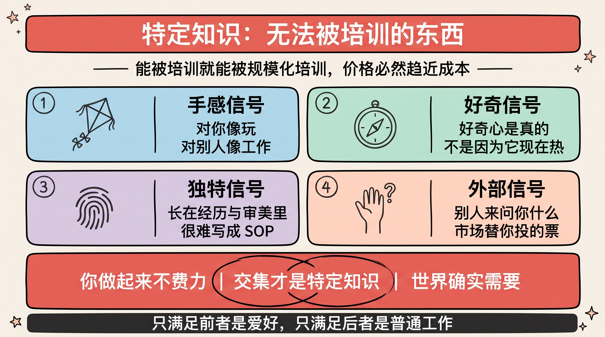
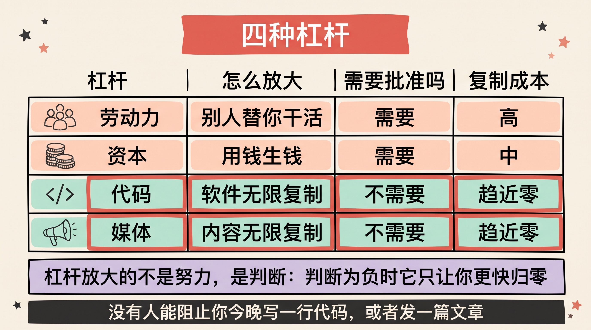
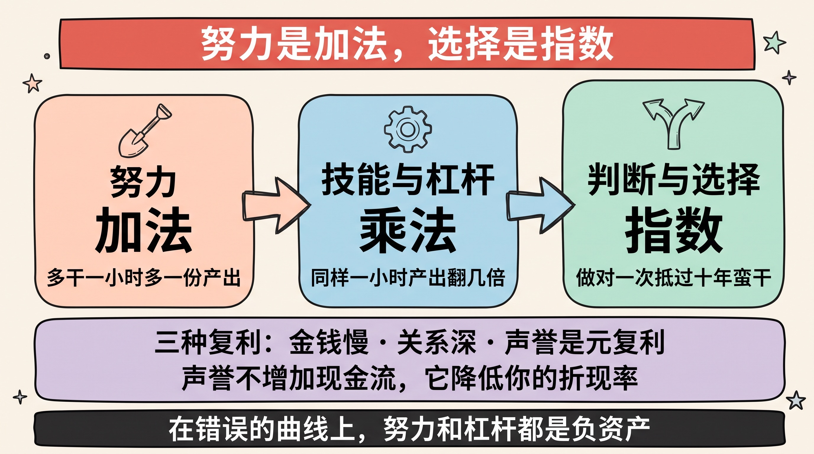
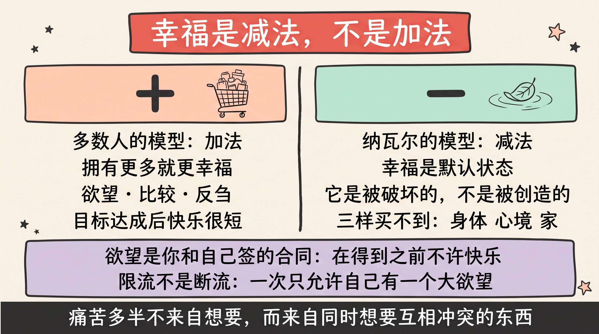
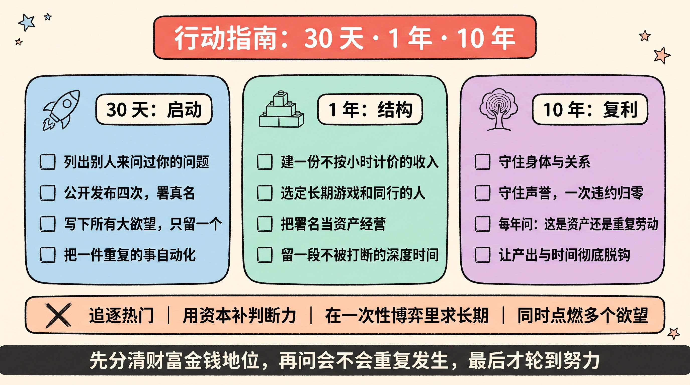

> 这本书没有一句新话——它讲的每件事，你大概都在别处听过。
>
> 但它做成了一件更难的事：**把「怎么变富」和「怎么快乐」这两个被鸡汤糟蹋了三十年的问题，重新写成了两个可以推导的结构。**
>
> **财富是一个方程，幸福是一项技能。** 剩下的，都是注脚。

> **说明**：本文是读书笔记与方法论整理，不构成任何投资或职业建议。文中不推荐任何标的。

---

## 先讲结论

1. **这本书的内核是一个方程，不是一堆金句。** 财富 = **特定知识 × 杠杆 × 判断力**，然后交给时间做复利。大多数人读完只记住了金句，是因为没把它还原回方程——**金句是结论，方程才是能拿去用的东西。**
2. **全书最被低估的是后半本。** 前半讲赚钱，后半讲幸福，而后半的杀伤力更大：**幸福不是达成某个条件之后的结果，而是一项可以训练的技能**——训练方式主要是减法：减欲望、减比较、减对未来的抵押。
3. **它有三个明显的盲区**：幸存者偏差、把结构问题讲成了个人问题、对运气与关系的轻描淡写。**读它最好的方式不是当圣经，而是当一把手术刀——用之前先知道刀口哪里是钝的。**

---

## 一、先厘清三个词：财富、金钱、地位

Naval 开篇就做了一件大多数财富类书不做的事：**定义**。

这三个词在日常语言里几乎是混着用的，但它们是三种完全不同的东西：

| 词 | 是什么 | 博弈性质 |
|---|---|---|
| **财富（Wealth）** | 你睡觉时仍在为你工作的资产 | **正和**：你变富不需要别人变穷 |
| **金钱（Money）** | 社会用来转移财富的凭证 | 中性：它是财富的计量，不是财富本身 |
| **地位（Status）** | 你在社会阶梯上的排名 | **零和**：你上去，必须有人下来 |

这个三分法最锋利的地方在最后一列。

**财富是正和的，地位是零和的。** 所以追逐财富的人可以互相成就，而追逐地位的人只能互相攻击——因为在排名的游戏里，压低你就等于抬高我。这也解释了一个常见现象：**为什么有人会本能地敌视创造财富的行为。** 他们不是在反对财富，他们是在玩另一个游戏（[《零和游戏与正和游戏》](/posts/life/zero-sum-vs-positive-sum-games/)里我写过这件事）。

### 一句更扎人的推论

> **你不可能靠出租时间变富。**

因为时间是**线性的**（一天只有 24 小时）、**有上限的**（单价再高也封顶）、且**不可复制的**（你不在场，收入就停）。

这不是说打工不好，而是说：**按小时计价的收入，天花板由你的时间总量决定，而不是由你的能力决定。** 一旦意识到这点，问题就从「怎么让我的时薪更高」变成了**「怎么让我的产出和我的时间脱钩」**——这正是整本书要回答的问题，答案叫杠杆。

---

## 二、特定知识：那件「对你容易、对别人难」的事

方程的第一个变量，也是最难速成的一个。

Naval 给的定义非常干净：

> **特定知识（specific knowledge），是那种无法通过培训获得的知识。**

这个定义之所以有力，是因为它自带一个筛选机制：**如果一件事能被培训，它就一定能被规模化培训；能被规模化培训，供给就会涌入；供给涌入，价格就会趋近于成本。**

所以「可培训」三个字本身，就宣判了这类能力的长期价格。

### 三个识别信号

怎么知道哪件事是你的特定知识？书里给的线索大致是三条：

- **它对你像玩，对别人像工作。** 同样一件事，你做起来不太耗，别人做起来很累——这个差值就是你的比较优势；
- **好奇心是真的**，而不是因为它现在热。追着热点找特定知识是矛盾的：热点意味着供给正在涌入；
- **它长在你的经历、审美、判断和性格里**，很难被写成一份 SOP 交给别人执行。

### 我要补一个更实操的检验

上面三条偏内省，容易自我感觉良好。我自己更信一个**外部信号**：

> **看别人主动来问你什么。**

人们不会为了客气去请教一个他们不认为你懂的问题。**你被反复咨询的那个点，就是市场已经替你验证过的特定知识。** 这个信号的好处是它不需要你自我评估——它是别人用行动投的票。

### 一个必须澄清的误解

特定知识 **不等于** 小众爱好。它必须落在一个交集上：

> **（你做起来不费力的事）∩（世界确实需要的事）**

只满足前者，那是爱好；只满足后者，那是普通工作。**两者的交集才是特定知识。** 我在[《生意赚钱的三个核心逻辑》](../business-money-logic/)里写的「差异化」，和[《反内卷的同一套逻辑》](../anti-involution-same-logic/)里写的「找那件对你容易、对别人难的事」，讲的是同一件事的不同侧面。

---

## 三、杠杆：现代世界最大的不公平，也是最大的机会

如果这本书只能留一章，我留这一章。

**杠杆的定义很简单：让同一份判断，作用在更大的量上。** Naval 把它分成四种：

| 杠杆 | 怎么放大 | 需要谁批准 | 边际复制成本 | 特点 |
|------|---------|-----------|-------------|------|
| **劳动力** | 别人替你干活 | 需要（招得到、管得住） | 高 | 最古老，也最难管理 |
| **资本** | 用钱生钱 | 需要（得有人愿意给你钱） | 中 | 放大最快，反噬也最快 |
| **代码** | 软件被无限复制 | **不需要** | ≈ 0 | 你睡觉时它还在运行 |
| **媒体** | 内容被无限复制 | **不需要** | ≈ 0 | 积累的是信任和影响力 |

### 关键词：无需许可

前两种杠杆有一个共同前提——**需要别人点头**。你得先说服某个人把钱交给你，或者先说服某些人来给你打工。这意味着在你拿到杠杆之前，你必须先赢得一场「获得许可」的竞赛。

而代码和媒体是**无需许可的杠杆（permissionless leverage）**：

> **没有人可以阻止你今晚写一行代码，或者发一篇文章。**

这是人类历史上极其罕见的一次权力下放。它的直接后果是：**一个有特定知识但没有资源、没有人脉、没有出身的人，第一次可以在不请求任何人批准的情况下，把自己的判断放大一百万倍。**

### 这本书出版之后，被验证得最彻底的一条

《纳瓦尔宝典》成书于 2020 年。五年过去，最被现实加强的正是这一条——**因为 AI 把「写代码」和「做内容」的门槛又砍掉了一大截。**

过去你要用代码这个杠杆，得先花几年成为工程师；现在你需要的是**把问题描述清楚的能力**。杠杆的入口从「会不会实现」移到了「想不想得清楚」。我在[《智能体时代的软件开发范式》](../agent-native-software/)里写过这个迁移，在[《元技能》](../meta-skills/)里写过它的后果：**当生产变便宜，判断就变贵。**

这也意味着 Naval 这个方程在今天有了一个新的读法：**杠杆这一项的获取成本在暴跌，于是另外两项——特定知识和判断力——的权重在暴涨。**

### 但必须说清楚杠杆的另一面

杠杆是**放大器**，而放大器对正负一视同仁：

> **杠杆放大的不是你的努力，是你的判断。判断为负时，杠杆只会让你更快地归零。**

资本杠杆尤其如此——它是四种里唯一能让你**倒欠**的。这就是为什么方程里判断力必须排在杠杆后面做乘数，而不是加数。

---

## 四、判断力与复利：为什么「和谁做、做什么」比「多努力」重要得多

方程的第三个变量，是唯一一个**不能外包**的。

特定知识可以慢慢长，杠杆可以借，**判断力必须自己长**——而且它长得极慢，因为它的反馈周期以年计。

### 三种回报结构

我把这件事压成一个对照，它几乎能解释职业生涯里所有的差距：

| 你投入的东西 | 回报结构 | 举例 |
|-------------|---------|------|
| **努力** | 加法 | 多干一小时，多一小时的产出 |
| **技能与杠杆** | 乘法 | 同样一小时，产出翻几倍 |
| **判断与选择** | 指数 | 做对一次「做什么、和谁做」，抵过十年蛮干 |

这和我在[《元技能》](../meta-skills/)里写的「加法 vs 乘法」是同一根轴，只是这里多了一层：**选择的回报是指数级的，因为它决定了前两项作用在哪条曲线上。**

一个残酷但真实的推论：**在一条错误的曲线上，努力和杠杆都是负资产**——你只是更快地跑向一个不该去的地方。

### 「和长期的人玩长期的游戏」

这是全书我最常想起的一句。它表面上是一句关系建议，实际上是一条**关于复利的数学判断**：

复利的本质是「结果反复作用在同一个基数上」。而**一次性博弈会不断重置这个基数**——每换一批人、每换一个领域、每做一次一锤子买卖，你的信任存量都清零重来。

所以它推出了一个很实际的筛选标准：

> **判断一段关系或一件事值不值得投入，先问一句：这件事会重复发生吗？**
>
> 如果答案是「只此一次」，那诚信、口碑、长期主义在博弈论上都没有回报——而这恰恰是最该警惕的场合。

### 三种复利，和那个「元复利」

- **金钱的复利**：最广为人知，也最慢；
- **关系的复利**：一起做成过难事的人，会在十年后以你想不到的方式回来；
- **声誉的复利**：**这是元复利**——因为它降低你所有其他交易的摩擦成本。

声誉之所以特殊，是因为它作用在分母上。用[《未来现金流折现》](../discounted-cash-flow/)的语言说：**声誉不增加你的现金流，它降低你的折现率**——而降低折现率，会同时放大你所有长期投入的现值。

也正因为如此，**它是唯一一种「一次严重违约就归零」的资产**。复利的另一面永远是脆弱性。

---

## 五、后半本书：幸福是一种技能

如果说前半本书让人兴奋，后半本才是真正让人安静下来的部分。而我认为，**后半本比前半本值钱。**

### 关于欲望，全书最狠的一句

Naval 对欲望的定义大意是：

> **欲望，是你和自己签的一份合同——在得到它之前，不许快乐。**

这句话的杀伤力在于，它把一个被默认为「动力」的东西，重新定义成了一笔**预支的负债**。

你每多一个欲望，就多签一份「在此之前我不快乐」的协议。**同时点燃十个欲望的人，等于同时签了十份让自己不快乐的合同。**

### 所以幸福是减法，不是加法

大多数人对幸福的默认模型是加法：拥有得更多 → 更幸福。Naval 的模型是减法：

> **幸福是默认状态，它是被东西破坏掉的，而不是被东西创造出来的。**

破坏它的主要有三样：**欲望**（对未来的抵押）、**比较**（把自己的处境换算成别人的排名）、**反刍**（对过去的重复咀嚼）。

这解释了一个常见的困惑：为什么达成目标后的快乐那么短。因为**你兑现的不是快乐，只是解除了一份自己签的合同**——合同解除的那一刻，人并不会变幸福，只会变回默认状态；然后你立刻签下一份。

### 三样买不到的东西

书里反复出现一组东西：**健康的身体、平静的心、充满爱的家。**

它们的共同点是——**没有一样能用钱直接买到，也没有一样能靠杠杆加速。** 它们都只能靠日复一日的复利累积，而且都对「透支」极度敏感。

这和我在[《你只需要三个习惯》](../three-habits/)里写的结构是一致的：心智、身体、财富三件事里，**财富是唯一可以被杠杆加速的**，另外两件只能老老实实地长。

### 我的一条补注：减法不等于禁欲

书里的减法容易被误读成「什么都别想要」。我不同意这个读法，也不觉得那可执行。

我的版本是**限流，不是断流**：

> **不是不许有欲望，而是限制同时点燃的欲望数量——一次只允许自己有一个大欲望。**

痛苦往往不来自「想要」，而来自**同时想要很多个互相冲突的东西**：既要自由又要安稳、既要深度又要广度、既要现在爽又要以后好。**冲突的欲望才是持续内耗的真正来源。**

庄子在[《木雁之间》](../between-wood-and-goose/)里给过一个很像的答案：痛苦常常不在「有用还是无用」这个选择本身，而在于**你同时想要两边的好处**。

---

## 六、三点保留意见

写读后感只写好话是不负责任的。这本书我读了两遍，仍然有三条挥之不去的保留。

**其一：幸存者偏差。**

Naval 是成功的创业者兼天使投资人，而这本书本质上是**从结果倒推出来的叙事**。同样这套方程，被上千个人执行过，其中失败的那些人不会有一本书。

这不意味着方程是错的——**它意味着这个方程描述的是「必要条件」，不是「充分条件」。** 按它做不保证你成功，但不按它做，你几乎一定被困在出租时间里。这是两句很不一样的话。

**其二：它把结构问题讲成了个人问题。**

出身、国别、行业周期、资本准入、语言、时区——这些东西共同决定了**你的杠杆起点在哪里**。一个已经握有资源与网络的人使用「无需许可的杠杆」，和一个从零开始的人使用同一个杠杆，效率差着数量级。

方程本身没错，**但初始值不同，这不是一个公平的游戏。** 把一切归因于「你有没有找到特定知识」，对结构性的差异是一种温柔的忽视。

**其三：对运气与关系的轻描淡写。**

书里把运气分成四类（盲目的运气、勤奋带来的运气、敏感带来的运气、由独特性吸引来的运气），这个分类很聪明，也确实把运气的一部分变成了可经营的东西。

但它仍然低估了一个变量：**第一次机会是谁给的。** 从「没人认识你」到「有人愿意赌你一次」的这一步，往往不由特定知识决定，而由你恰好站在谁旁边决定。

> 这三条不否定方程，**它们校准的是你对方程的期望值**——照着做，你提高的是概率，不是确定性。而把概率当确定性，是所有方法论最常见的死法。

---

## 七、行动指南：把 300 页压成一张清单

读后感如果不落到动作上，就只是又一次愉快的智力消费。以下是我自己在用的版本。

### 30 天：启动（把方程的三个变量各点亮一次）

| 动作 | 为什么 | 完成标准 |
|------|--------|---------|
| **列出别人最近一年来问过你的所有问题** | 这是市场替你验证过的特定知识 | 写满 20 条，圈出重复出现的 3 个 |
| **公开发布 4 次**（文章 / 代码 / 作品皆可） | 启动无需许可的杠杆，且强制你把想法结构化 | 每周一次，署真名 |
| **写下你当前所有的「大欲望」** | 看清自己同时签了几份不快乐合同 | 排序后，只保留一个为「主线」 |
| **把一件重复的事自动化掉** | 第一次体验「产出与时间脱钩」 | 省下的时间可量化 |

### 1 年：结构（把身份从「出租时间」挪出来）

- **建立一份不按小时计价的收入**，哪怕金额很小。**关键不是钱，是证明「不在场也能产生收入」这件事在你身上成立。**
- **选定一个长期游戏，并选定同行的人。** 判断标准只有一条：这件事会重复发生吗？
- **把「署名」当成资产经营。** 用真名承担责任——责任是杠杆的许可证，而匿名的一切都无法复利。
- **建立一个不会被打断的深度时段。** 判断力和特定知识都长在这段时间里，它是[《元技能》](../meta-skills/)里说的那个带宽。

### 10 年：复利（守住那些只能慢慢长的东西）

- **守住身体和关系**——它们无法被杠杆加速，却能被透支瞬间摧毁；
- **守住声誉**——它作用在你所有交易的分母上，且一次严重违约就归零；
- **每年问自己一次**：我现在做的事，如果重复十年，会积累成一个资产，还是只是重复劳动？

### 一份反向清单（不做什么）

反过来想常常更有效——以下四件事，会系统性地摧毁上面所有努力：

1. **追逐热门赛道**：热门 = 供给涌入 = 你的差异化在归零；
2. **用资本杠杆去弥补判断力不足**：这是四种杠杆里唯一能让你倒欠的；
3. **进入一次性博弈却还想赚长期的钱**：博弈结构不对，诚信在那里没有回报，而你会误以为是自己不够狠；
4. **同时点燃多个互相冲突的欲望**：这不是有野心，这是给自己安排了一场持续内耗。

---

## 总结

1. **把金句还原成方程**：财富 = 特定知识 × 杠杆 × 判断力，再乘以时间。**金句是别人的结论，方程才是你能用的工具。**
2. **特定知识靠外部信号找**：别人反复来问你什么，比你自己觉得擅长什么可靠得多。
3. **杠杆的时代红利在代码与媒体**：它们不需要任何人批准，而 AI 又把它们的门槛砍掉了一层——于是判断力的权重前所未有地高。
4. **幸福是减法**：它是默认状态，被欲望、比较和反刍破坏。**不是不许想要，而是一次只点燃一个。**

最后，这本书真正教会我的，其实不是怎么变富，而是一个更朴素的判断顺序：

> **先想清楚你要的是财富、金钱，还是地位；**
> **再想清楚这件事会不会重复发生；**
> **最后才轮到努力。**

**顺序错了，后面越用力，偏得越远。**

---

**参考阅读**：

- Eric Jorgenson, *The Almanack of Naval Ravikant*（《纳瓦尔宝典》，2020）
- [《元技能：那些让你学得更快的技能，才是最该先学的》](../meta-skills/)
- [《生意赚钱的三个核心逻辑：谁、什么、怎么传播》](../business-money-logic/)
- [《未来现金流折现：一个公式，把「价值」这件事说清楚了》](../discounted-cash-flow/)
- [《你只需要三个习惯：心智、身体、财富》](../three-habits/)
- [《反内卷的同一套逻辑：不卷怎么挣钱，不逼怎么成才》](../anti-involution-same-logic/)
- [《木雁之间：庄子给出的答案，和他亲手推翻它的那一句》](../between-wood-and-goose/)
- [《透过现象看本质：一句正确的废话，除非你有方法》](../phenomenon-and-essence/)
