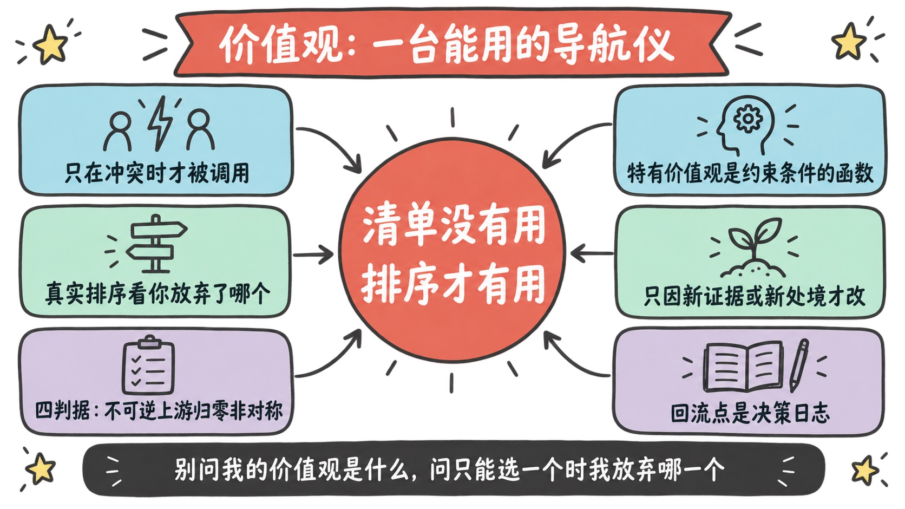
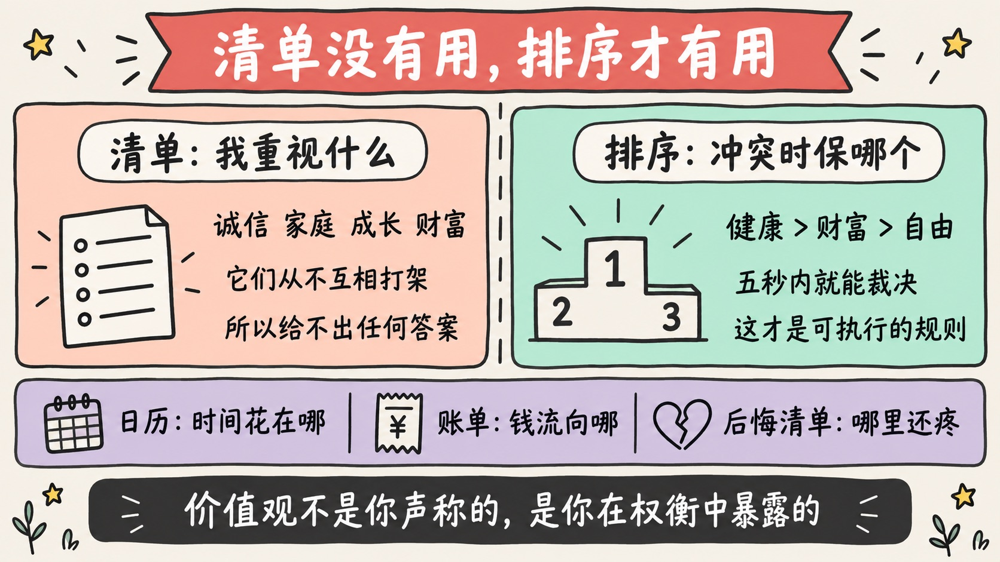
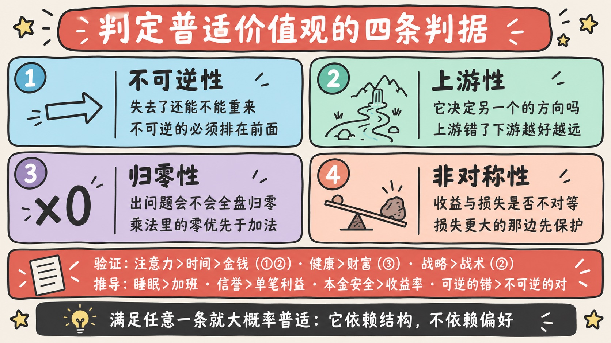
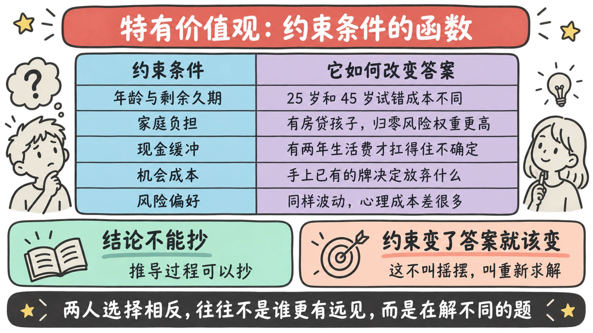
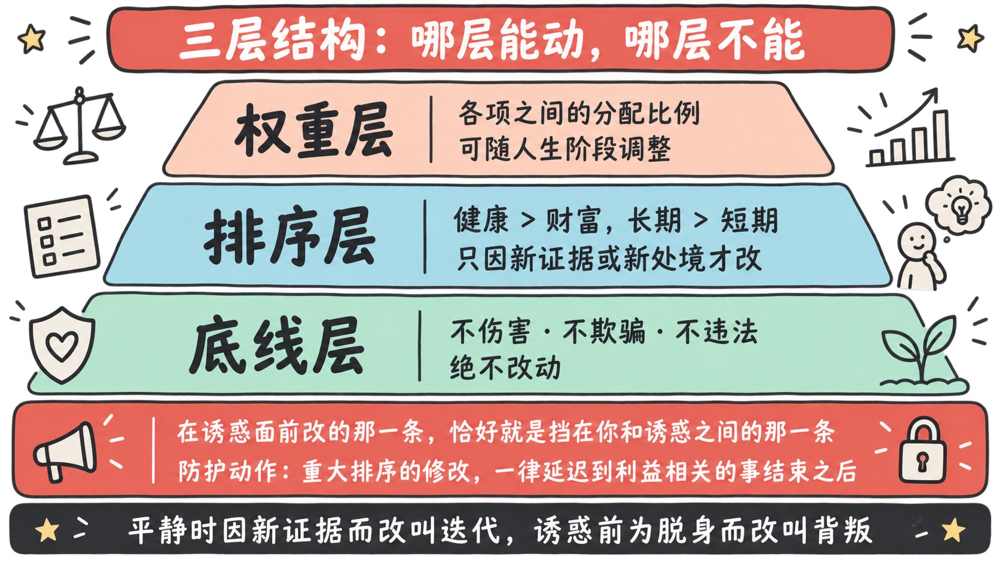
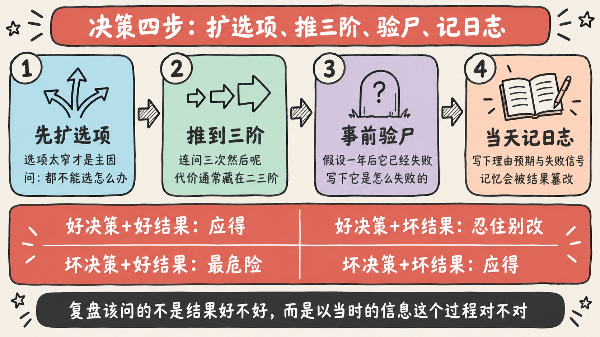
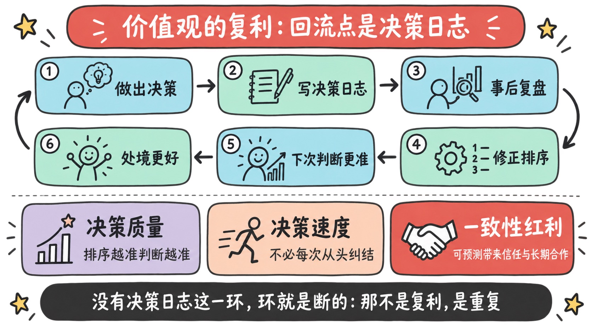

> 「什么重要？什么更重要？什么最重要？」——价值观的全部内容，就是这三个问题的答案。
>
> 但大多数人给出的答案是一份**清单**：诚信、家庭、成长、自由……这份清单几乎没有用。因为**清单里的东西从不互相打架，而价值观唯一的用途，恰恰是在它们打架时做裁决。**
>
> 价值观不是你重视什么，**是你在必须放弃一个的时候，放弃了哪一个。**

---

## 先讲结论

1. **价值观是排序，不是清单。** 不冲突的时候，你不需要价值观；只有在「两个都想要、但只能要一个」时，它才被调用。所以**没有排序的价值观等于没有价值观**。
2. **「普适价值观」之所以普适，不是因为多数人认同，而是因为它有结构性理由。** 我总结出四条判据——**不可逆、上游、归零、非对称**——满足任意一条，那个排序就大概率对所有人成立。有了判据，你不仅能验证别人给的结论，**还能自己推导出新的**。
3. **价值观要稳定，但必须留一个合法的修改入口。** 允许改动的唯一理由是**新证据或新处境**；因为当下的诱惑或痛苦而改，那不叫迭代，叫背叛。**而让价值观真正复利的，是决策日志——没有它，你只是在重复，不是在精进。**

---

## 一、价值观是排序，不是清单

先说一个很多人没意识到的事实：

> **在不需要取舍的时候，价值观是不存在的。**

你说你重视家庭，也重视事业——只要两者不冲突，这句话不包含任何信息量。它变得有意义，只发生在某个具体的下午：孩子的活动和一个重要的客户会议撞在同一时间，你只能去一个。

**那一刻你选的那个，才是你真正的价值观。**

所以价值观的正确形态不是：

> ~~我重视健康、家庭、成长、财富、自由。~~

而是：

> **健康 > 家庭 > 成长 > 财富 > 自由**（每个人的排序不同，这只是举例）

前者是一份愿望清单，后者是一个**可执行的裁决规则**。差别在于：**后者能在五秒内给出答案，前者只会让你继续纠结。**

### 检验真伪的唯一标准：代价

嘴上的排序和真实的排序常常是两回事，而区分它们的方法极其简单：

> **看你在付出代价时，保住了哪一个。**

- 说「健康 > 财富」，却连续三个月熬夜赶项目——**你的真实排序是财富 > 健康**；
- 说「家庭 > 工作」，却每次都是家庭活动为工作让路——**你的真实排序是工作 > 家庭**；
- 说「长期 > 短期」，却总在市场波动时改变计划——**你的真实排序是短期 > 长期**。

这不是道德指控，而是一个诊断工具。因为**自我认知的最大障碍，就是把「我希望我是什么样的人」当成「我是什么样的人」。**

> **价值观不是你声称的，是你在权衡中暴露的。**

### 三面照出真实排序的镜子

想知道自己真正的排序，不要靠内省——内省会撒谎。看这三样：

| 镜子 | 怎么看 | 它暴露什么 |
|------|--------|-----------|
| **你的日历** | 过去三个月，时间实际花在哪 | 时间不会说谎，它精确反映优先级 |
| **你的账单** | 大额支出与长期订阅 | 钱流向你真正在乎的东西 |
| **你的后悔清单** | 哪些决定至今仍不舒服 | 后悔是「真实排序」和「声称排序」冲突时留下的伤口 |

第三面镜子最有用。**每一次后悔，都是一次免费的价值观体检**——它在告诉你，某个你以为排在前面的东西，其实被你排在了后面。

---

## 二、普适价值观：四条判据，把列举变成可判定

很多人提过「普适价值观」的例子。李笑来的 **注意力 > 时间 > 金钱**，还有 **健康 > 财富**、**战略 > 战术**、**脑力思考 > 体力拼杀**。

这些结论我都同意。但只给结论有一个问题：**下次你遇到一个新的排序问题，还是不知道它算不算普适。**

所以真正值钱的不是这几条结论，而是**它们为什么成立**。把理由抽出来，我得到四条判据：

| 判据 | 含义 | 为什么它能决定排序 |
|------|------|------------------|
| **① 不可逆性** | 失去之后能不能重来 | 不可逆的东西没有第二次机会，必须排在可逆的前面 |
| **② 上游性** | 它是否决定了另一个的方向 | 上游错了，下游做得越好，偏得越远 |
| **③ 归零性** | 它出问题会不会让全盘归零 | 乘法里的 0 项，优先级高于所有加法项 |
| **④ 非对称性** | 收益与损失是否不对等 | 损失远大于收益的那一边，必须优先保护 |

**满足其中任意一条，这个排序就大概率对所有人成立**——因为它依赖的是结构，不是偏好。

### 用判据验证那几条经典结论

**注意力 > 时间 > 金钱** —— 靠的是①不可逆性的递增：

> 钱可以再赚（可逆）→ 时间花掉就没了（不可逆）→ **注意力是时间的质量系数**：同样一小时，专注和涣散的产出差十倍。

所以严格说，注意力排在最前不是因为它比时间「更宝贵」，而是因为**它决定了时间的兑换率**。这其实同时满足了②上游性。

**健康 > 财富** —— 靠的是③归零性：

> 健康是乘法里的那个 1，后面跟多少个 0 都取决于它还在不在。

我在[《复利：一个有前提的结构》](../compounding-preconditions/)里写过同一件事：连乘结构里，任何一项归零，整体归零。**所以「为了赚钱熬垮身体」在数学上是一笔必亏的交易**——它用一个乘数换了几个加数。

**战略 > 战术** —— 靠的是②上游性：

> 方向错了，效率就是负资产：**你只是更快地跑向一个不该去的地方。**

这也是[《战略与战术》](../strategy-vs-tactics/)那篇的主旨。

**脑力思考 > 体力拼杀** —— 同时满足②和④：

> 思考决定了体力用在哪（上游），而且思考的产出可以复制、体力的产出不能（非对称）。

### 判据真正的用处：自己推导新的

有了判据，你就不必依赖任何人给你列清单了。遇到一个新排序，逐条问一遍：

> **谁更不可逆？谁在上游？谁会让全盘归零？谁的损失更不对称？**

试几个：

- **睡眠 > 加班**：睡眠债有③归零性（长期透支会突然崩塌），且损害④不对称。**成立。**
- **信誉 > 单笔利益**：信誉①不可逆（毁掉几乎无法重建）、④极不对称（积累要十年，归零要一天）。**成立。**
- **本金安全 > 收益率**：③归零性（本金归零就出局）、④非对称（跌 50% 要涨 100% 才回本）。**成立。**
- **选对赛道 > 在赛道里努力**：②上游性。**成立。**
- **可逆的错误 > 不可逆的正确**：在不确定环境下，①决定了应该优先选择能撤回的选项。**成立。**

注意最后一条——它不是任何人告诉我的，是判据推出来的。**这就是把「列举」升级成「可判定」的价值。**

> 反过来，**如果一个排序四条判据都不满足，那它多半就不是普适的，而是你的个人偏好**——而个人偏好没有对错，这正是下一章的内容。

---

## 三、特有价值观：不是随意，是约束条件的函数

家庭与工作、友情与财富、技术路线与管理路线、安逸与挑战——这些排序因人而异，**没有对错**。

但「没有对错」常常被误读成「随便怎样都行」。我不这么看：

> **特有价值观不是随意的，它是你的「约束条件」和「目标函数」共同决定的解。**

### 为什么两个人的答案不同

同样面对「稳定的大厂 vs 早期创业公司」，两个人选择相反，通常不是因为谁更有远见，而是因为**他们在解不同的题**：

| 约束条件 | 它如何改变答案 |
|---------|--------------|
| **年龄与剩余久期** | 25 岁和 45 岁的试错成本完全不同 |
| **家庭负担** | 有房贷和两个孩子的人，归零风险的权重天然更高 |
| **现金缓冲** | 有两年生活费的人，可以承受更长的不确定期 |
| **机会成本** | 手上已有的牌决定了放弃什么 |
| **风险偏好** | 同样的波动，对不同的人心理成本差很多 |

理解这一点会带来两个很实际的推论：

**推论一：别人的结论不能抄，但别人的推导过程可以抄。**

看到某个你敬佩的人选择了 A，不要直接学他选 A——**要去看他在什么约束下、为了什么目标、放弃了什么才选的 A。** 如果你的约束和他不同，同一个选择对你可能是灾难。

**这也是「读书能少走弯路」的正确用法**：从书里萃取的不该是结论，而是**产生结论的那套推理**。我在[《透过现象看本质》](../phenomenon-and-essence/)里写过这个判据——**能迁移的才是本质**。别人的结论不可迁移，别人的推导可以。

**推论二：约束变了，答案就该变——这不算摇摆。**

三十岁时「挑战 > 安逸」，四十岁上有老下有小时变成「稳定 > 挑战」，这不是背叛自己，而是**约束条件变了之后的重新求解**。真正该警惕的是另一种情况：约束没变，只是遇到了诱惑或困难就改排序——这一点第四章会展开。

### 把隐性的特有价值观显性化

特有价值观往往是隐性的，你能感觉到但说不清。有两个笨办法特别有效：

**方法一：两两对决。**

把你在乎的事情列出来（8~10 个就够），然后强制两两比较：「如果只能保一个，保哪个？」比完一轮，排序自然浮现。

**强制**这个词是关键——**允许「都重要」的选项，这个练习就失效了。**

**方法二：100 分预算法。**

给自己 100 分，分配到这些事情上，总和必须正好是 100。**预算约束会逼出真实权重**，因为加分必须伴随减分——这恰恰模拟了现实中的取舍。

做完后把它和第一章那三面镜子（日历、账单、后悔清单）对照。**差距最大的那一项，就是你最该处理的地方。**

---

## 四、稳定与迭代：什么时候才允许修改价值观

「价值观经过深思熟虑后，就不要轻易改动」——这个判断是对的，但需要更精确，否则它会滑向另一个极端：固执。

我的做法是把价值观分成三层，**不同层有不同的稳定性要求**：

| 层级 | 内容 | 稳定性 | 修改条件 |
|------|------|--------|---------|
| **底线层** | 不可交易项：不伤害他人、不欺骗、不做违法的事 | **绝不改动** | 无 |
| **排序层** | 核心排序：健康 > 财富、长期 > 短期 | **高度稳定** | 只有新证据或新处境 |
| **权重层** | 各项之间的分配比例 | **可随阶段调整** | 人生阶段变化即可 |

大多数人的混乱，来自**把这三层混在一起**：该稳的排序天天变，该调的权重又死守不放。

### 唯一合法的修改理由

这是我认为这一章最重要的一条：

> **允许你修改价值观的，只有两样东西：新的证据，或新的处境。**
>
> **不包括：当下的诱惑、眼前的痛苦、他人的压力。**

区别在于**修改发生的时点**：

- 在一个平静的、没有具体利益牵扯的时刻，因为读到新证据或人生阶段改变而重新排序——**这是迭代**；
- 在一个具体诱惑面前、为了让自己能心安理得地选择那个诱惑而临时调整排序——**这是背叛**。

后者有一个非常好认的特征：**你修改的恰好就是挡在你和那个诱惑之间的那一条。**

所以有一个很实用的防护动作：

> **重大排序的修改，一律延迟到「利益相关的事情结束之后」再做。**

如果一个月后你仍然认为该改，那大概率是真的该改；如果那时你已经不想改了，说明刚才那次只是欲望在伪装成成长。

### 反过来：警惕僵化

价值观清晰的另一面是僵化的风险。**在稳定环境里它是导航仪，在剧变环境里它可能是枷锁。**

所以除了「不许随便改」，还要主动设置**重审的触发条件**——以下情况出现时，应当认真重新检视排序：

1. **反复在同一类决策上后悔** —— 说明某条排序和现实持续不符；
2. **人生阶段发生结构性变化** —— 结婚、生子、健康变故、行业剧变；
3. **发现自己在系统性回避某类事情** —— 回避往往指向一条你嘴上不承认的真实排序；
4. **外部环境的底层规则变了** —— 比如 AI 让「生产」变便宜、「判断」变贵，那么「执行力 vs 判断力」的排序就该重排。

第四条尤其值得一提：我在[《元技能》](../meta-skills/)里写过这次重新定价。**当世界的规则变了，不改排序才是真正的不理性。**

---

## 五、决策三件套：推演、事前验尸、事后复盘

价值观的价值，最终要兑现在具体决策上。这一章讲怎么兑现。

### 5.1 先扩选项，再做选择

这是最容易被跳过、却最关键的一步。

> **绝大多数糟糕的决策，不是「在几个选项里选错了」，而是「选项集本身太窄」。**

「要不要接受这个 offer」是一个典型的**窄框架**——它把一个开放问题压成了是非题。研究决策的人把这种「要不要做 X」的单选题列为最常见的决策缺陷之一。

三个扩选项的动作，都很便宜：

- **消失选项测试**：「如果这两个选项都不能选，我会怎么办？」——这一问几乎总能逼出第三条路；
- **找已经解决过的人**：这个问题大概率有人遇到过，他们当时有哪些选项是你没想到的；
- **把非此即彼变成「能不能两个都要一点」**：先小规模试，而不是一次性全押。

这正好对应原始思考里那句：「为什么这个选项当初不在我的选项里？」——**这个问题不该等到复盘才问，应该在决策当天就问。**

### 5.2 推演：把每个选项推到三阶后果

不要只问「选 A 会怎样」，要连问三次**「然后呢？」**：

| 层级 | 问法 | 它暴露什么 |
|------|------|-----------|
| **一阶后果** | 马上会发生什么 | 通常很明显，也最诱人 |
| **二阶后果** | 然后呢？ | 代价往往藏在这一层 |
| **三阶后果** | 再然后呢？ | 结构性的改变出现在这里 |

**大多数糟糕的选择，都是一阶后果很爽、二三阶后果很痛。** 加杠杆、熬夜赶工、为了短期业绩牺牲口碑，全都是这个形状。

还有一个补充问法很好用：**这个决定，10 分钟后、10 个月后、10 年后，我分别会怎么看它？** 它能快速暴露「当下的情绪」在多大程度上主导了判断。

### 5.3 事前验尸：假设它已经失败了

**事前验尸（pre-mortem）** 由心理学家 Gary Klein 提出，做法只有一句话：

> **在做决定之前，假设一年后这个决定已经彻底失败了。现在写下：它是怎么失败的？**

它之所以有效，是因为把「这可能会出问题吗」（容易被乐观情绪压下去）换成了「它已经出问题了，说说为什么」——**后者是一道记忆题，不是一道预测题，人回答得诚实得多。**

写完那份失败清单之后，做两件事：

1. 挑出**最可能的两三条**，为它们提前准备应对；
2. 看有没有哪条是**你根本无法承受的**——如果有，这个方案要么改，要么放弃。**这一步在做的，就是第二章说的「归零判据」。**

### 5.4 决策日志：这是整套方法的枢纽

如果这一章只能留一件事，我留这个。

> **在做完决定的当天，写下：我选了什么、当时掌握了哪些信息、我的理由、我预期会发生什么、以及我认为的失败信号是什么。**

为什么必须**当天**写？因为人的记忆会被结果篡改。等到半年后结果出来，你会真诚地相信「我当时就觉得会这样」——这叫**后见之明偏差**。没有当天的白纸黑字，你复盘的其实是一段被结果改写过的记忆，**那种复盘学不到任何东西。**

### 5.5 事后复盘：分开「决策质量」和「结果质量」

这是复盘最容易做错的地方。人天然用结果反推决策好坏，但这在概率世界里是错的：

| | 好结果 | 坏结果 |
|---|-------|-------|
| **好决策** | 应得的成功 | **好决策 + 坏运气**（最需要忍住不改） |
| **坏决策** | **坏决策 + 好运气**（最危险，会强化坏习惯） | 应得的失败 |

两个对角线格子才是重点：

- **好决策 + 坏结果**：不该推翻决策方法。原始思考里那句「不符合预期也不后悔」，理论依据就在这里——**在不确定的世界里，正确的做法也会输，只是输的概率更低。**
- **坏决策 + 好运气**：最危险的一格。它会让你误以为某个糟糕习惯是有效的，直到某次运气没来。

所以复盘该问的不是「结果好不好」，而是：

> **以我当时掌握的信息，这个决策过程是不是对的？**
> **如果对，重来一百次我还这么选吗？**
> **如果不对，问题出在信息、推演、还是排序？**

最后那个三分法很关键，因为三种问题的修法完全不同：**信息不足要改调研方式，推演不足要改推演深度，而排序错了——那才需要动价值观。**

---

## 六、价值观的复利：回流点在哪

原始思考里有一句很对的话：**价值观也是可以产生复利的。** 我想把它的机制说清楚，因为**复利是有前提的，不是自动发生的**。

在[《复利：一个有前提的结构》](../compounding-preconditions/)里我写过，复利的关键词是**回流**——这次的产出要变成下次的起点。套到价值观上，那个回流点非常具体：

> **决策 → 决策日志 → 复盘 → 修正排序 → 下一次决策更准 → 更好的处境 → 更好的决策环境**

**没有决策日志这一环，这个环就是断的。** 你只是在不断做决定、不断承受结果，然后凭感觉往前走——**那不是复利，那是重复。**

价值观复利体现在三个层面：

| 层面 | 怎么积累 |
|------|---------|
| **决策质量** | 排序越准 → 判断越准 → 处境越好 → 能做的选择越好 |
| **决策速度** | 排序清晰的人不必每次从头纠结，**省下的认知带宽本身就是收益** |
| **一致性红利** | 长期一致的人是**可预测**的，而可预测带来信任，信任带来长期合作 |

第三条最被低估。**一个行为可预测的人，别人愿意和他玩重复博弈**——这正是[《〈纳瓦尔宝典〉读后感》](../naval-almanack/)里说的「和长期的人玩长期的游戏」。用[《未来现金流折现》](../discounted-cash-flow/)的话说：**稳定的价值观不增加你的分子，它降低你的分母。**

反过来，**一个排序随时变的人，别人无法预测，于是只敢和他做一次性交易**——而一次性交易里没有复利。

---

## 七、三个常见误区

**误区一：把价值观当口号。**

写在纸上、贴在墙上，但从未在付出代价时被检验过。**没有经过取舍检验的价值观，只是自我形象管理。** 检验方法还是第一章那句：看你在必须放弃一个时，放弃了哪一个。

**误区二：只有普适价值观，没有特有价值观。**

把「健康 > 财富、长期 > 短期」这类公共答案照搬一遍，就以为自己有价值观系统了。**但普适价值观只能保证你不掉进坑里，它不能告诉你该走哪条路。** 路是由特有价值观决定的——**只有普适的部分，等于活成一个模板。**

**误区三：用价值观逃避思考。**

「我就是这样的人」是一句非常好用的挡箭牌，它能让你跳过所有具体分析。**但价值观是用来在信息充分之后做裁决的，不是用来替代调研和推演的。** 真正清晰的价值观会让你**更愿意面对具体问题**，因为你知道结论最终会落在哪把尺子上。

---

## 总结

1. **价值观是排序，不是清单。** 它只在冲突时被调用，所以没有排序就等于没有价值观；而真实的排序，只能从你付出代价时的选择里读出来。
2. **普适价值观有判据，不用背清单**：不可逆、上游、归零、非对称——满足任意一条，那个排序就大概率对所有人成立。**有了判据，你能自己推导，而不只是接受别人的结论。**
3. **特有价值观由约束条件决定**，所以别人的结论不能抄，**推导过程可以抄**；约束变了答案就该变，那不叫摇摆。
4. **稳定要有合法的修改入口**：只因新证据或新处境而改；在诱惑面前改的，不是迭代是背叛。而**让它复利的唯一回流点，是决策日志**。

最后，把整篇压成一句：

> **别再问「我的价值观是什么」，去问「当两个我都想要的东西只能选一个时，我放弃哪一个——以及为什么」。**
>
> **前一个问题会得到一份漂亮的清单，后一个问题会得到一台真正能用的导航仪。**

---

**参考阅读**：

- [《复利：一个有前提的结构，而不是一句励志的话》](../compounding-preconditions/)
- [《透过现象看本质：一句正确的废话，除非你有方法》](../phenomenon-and-essence/)
- [《〈纳瓦尔宝典〉读后感：财富是一个方程，幸福是一项技能》](../naval-almanack/)
- [《战略与战术：做对的事，还是把事情做对？》](../strategy-vs-tactics/)
- [《模型思维：用少数框架，理解世界的大多数问题》](../mental-models/)
- [《元技能：那些让你学得更快的技能，才是最该先学的》](../meta-skills/)
- [《站在未来看现在：个人发展和投资，其实是同一道题》](../view-from-the-future/)
- Gary Klein 提出的 pre-mortem（事前验尸）方法
- Chip Heath & Dan Heath, *Decisive*（关于窄框架与扩选项）
- Annie Duke, *Thinking in Bets*（关于区分决策质量与结果质量）
