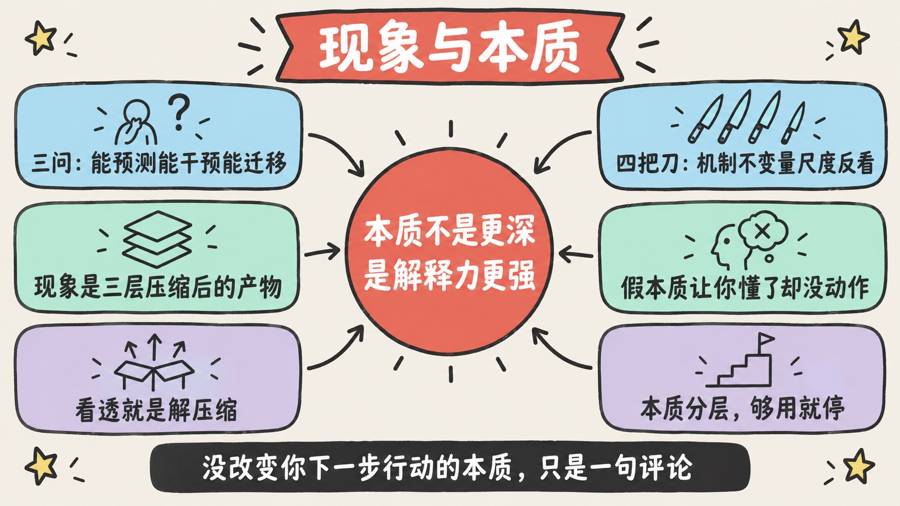
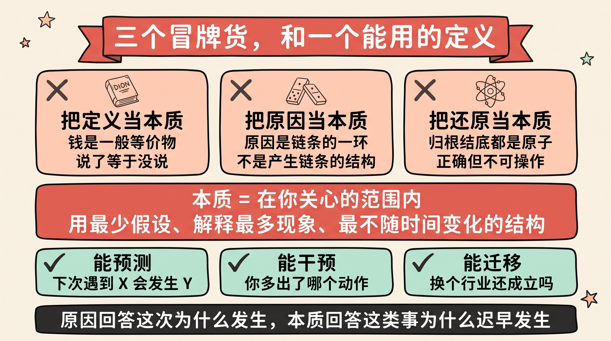
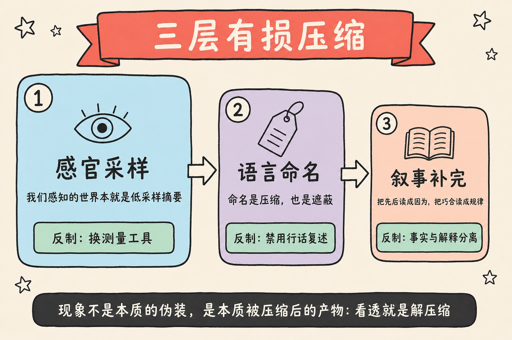
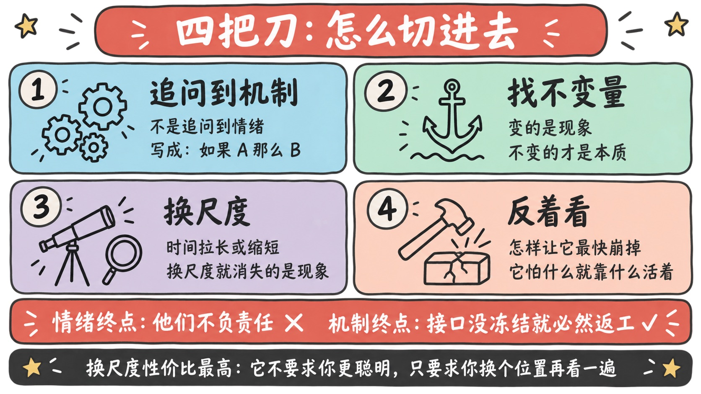
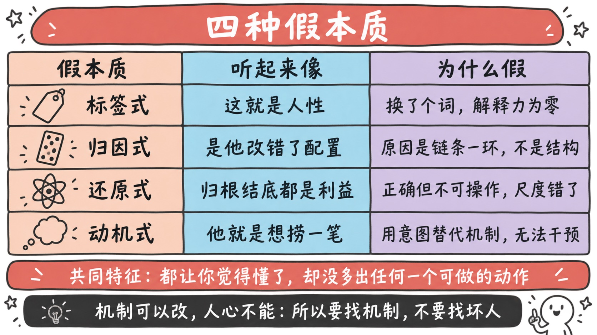
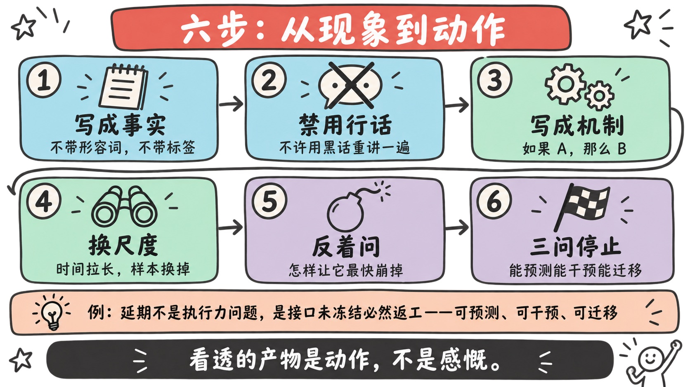

> 「透过现象看本质」——这句话我们从小听到大。
>
> 它的问题不是不对，而是**它没有告诉你任何可以执行的东西**。它像在说「你要变得更聪明」：正确、无法反驳、且完全用不上。
>
> 这篇文章想做的是把这句废话拆开：**本质到底是什么、我们为什么看不见它、有哪几把刀能真的切进去，以及——什么时候该停下来。**

---

## 先讲结论

1. **本质不是「更深的东西」，而是「解释力更强的结构」。** 判断一个说法是不是本质，不看它听起来多深刻，而看它能不能**预测**、能不能**干预**、能不能**迁移**。三样都做不到的，只是换了个说法的现象。
2. **我们看不见本质，不是因为不够聪明，而是因为认知系统在三个地方做了压缩**：感官只采样、语言只命名、叙事只补完因果。**现象不是本质的伪装，现象是本质经过三层有损压缩之后的产物。** 所以「看透」的正确动作不是看得更用力，而是**解压缩**。
3. **没有「终极本质」，只有「在你要解决的问题上够用的那一层」。** 把一切还原到原子运动，在逻辑上无懈可击，在实践上毫无用处。**知道在哪一层停下来，才是这件事真正的功夫。**

---

## 一、先给「本质」下一个能用的定义

在讲方法之前，必须先排掉三个最常见的冒牌货。因为大多数「我看到本质了」的时刻，其实是踩进了它们中的一个。

### 误解一：把定义当本质

> 「什么是钱？钱是一般等价物。」

这句话没错，但它是**定义**，不是本质。区别在于：定义只是告诉你这个词指什么，**它不能让你预测任何事**。知道「钱是一般等价物」，并不能帮你判断一种新的支付方式会不会成立。

### 误解二：把原因当本质

「这次事故的本质是运维手滑改错了配置。」

手滑是**原因**，是因果链条上的一环。而本质是**产生这条链条的结构**——为什么一次手滑就能引发全局故障？没有灰度、没有回滚、没有权限隔离，这才是那个结构。

> **原因回答「这次为什么发生」，本质回答「为什么这类事迟早会发生」。**

### 误解三：把还原当本质

「归根结底，一切都是原子在运动。」

这句话在物理上正确，在实践上等于没说。**还原不等于洞察**——把一场经济危机还原到神经元放电，你既无法预测它，也无法阻止它。**尺度错了，正确也是一种无用。**

### 我用的定义

排掉这三个之后，剩下的定义其实很朴素：

> **本质 = 在你关心的问题范围内，用最少的假设、解释最多的现象、并且最不随时间变化的那个结构。**

三个关键词：**假设少**（奥卡姆剃刀）、**解释多**（解释力）、**稳定**（不变性）。

而它有一个完全可操作的检验——**三问**：

| 检验 | 问法 | 不通过意味着 |
|------|------|-------------|
| **能预测吗** | 它能说出「下次遇到 X，会发生 Y」吗？ | 你只是在事后描述 |
| **能干预吗** | 知道它之后，你多出了哪个可做的动作？ | 你只是发了一句评论 |
| **能迁移吗** | 换一个行业、换一批人，它还成立吗？ | 你抓到的是个案，不是结构 |

### 举个例子：内卷

同一件事，三种深度的解释：

- **现象层**：「大家都在加班，越来越累。」——描述。
- **标签层**：「这是人性贪婪 / 大环境不好。」——听起来像本质，但既不能预测（哪些场景会卷？说不清），也不能干预（怎么办？没有动作）。**这是最常见的假本质。**
- **结构层**：「在一个**总量有上限、且按相对排名分配**的系统里，个体加码是理性的，而所有人加码之后相对排名不变、成本全体上升。」

第三种就通过了三问：它**能预测**（凡是按相对排名分配的场景——学区房、论文、职级、流量——都会出现同一现象）、**能干预**（改变分配规则，或者退出这个系统去开一局正和游戏）、**能迁移**（它在完全不同的领域反复成立）。

这一层，才叫本质。我在[《反内卷的同一套逻辑》](../anti-involution-same-logic/)里写的那套解法，之所以能同时用在「挣钱」和「养孩子」两件毫不相干的事上，正是因为它站在这一层。

---

## 二、为什么我们只看得见现象：三层有损压缩

这一章想说明一件事：**看不见本质，不是智力问题，是系统设计问题。** 你的认知系统在三个环节上，主动丢掉了信息。

### 第一层：感官采样

人眼只接收可见光，人耳只听得见 20Hz 到 20kHz，人对概率、大数、指数增长的直觉全都是坏的。

**我们感知到的世界，从一开始就是一份低采样率的摘要。** 而摘要最擅长丢掉的，恰恰是缓慢的、长周期的、没有戏剧性的东西——**也就是结构本身**。

### 第二层：语言命名

这是最危险的一层，因为它**伪装成理解**。

> **命名是压缩，也是遮蔽。**

一旦你说出「哦，这是内卷」「这是执行力问题」「这是产品思维不行」，你的大脑就收到了一个信号：**这件事已经处理完了。** 于是观察停止，追问停止。

名字给了你一个把手（我在[《论专有名词的重要性》](../on-the-importance-of-proper-terms/)里写过这个把手的价值），但把手的代价是：**你握住了把手，就不再看箱子里面。**

### 第三层：叙事补完

人脑无法忍受一串没有因果的事件，它会自动补上。于是：

- 把**先后**读成**因为**；
- 把**巧合**读成**规律**；
- 把**结果**倒推成**当初的英明决策**。

大部分商业复盘、个人成长故事、事后分析，都是这一层的产物：**它们不是在解释发生了什么，而是在给已经发生的事编一个能讲得通的故事。**

### 所以「看透」的正确动作是解压缩

把三层合起来看，结论就很清楚了：

> **现象不是本质的伪装，现象是本质经过三层有损压缩之后的产物。**

那么「看透」就不该是「盯得更用力」，而应该是**针对性地把每一层丢掉的东西补回来**：

| 被压缩的环节 | 反制动作 | 具体怎么做 |
|-------------|---------|-----------|
| 感官采样 | **换测量工具** | 用数据代替印象，用长周期代替当下感受 |
| 语言命名 | **禁用行话复述** | 不许用那个名词，把这件事重讲一遍 |
| 叙事补完 | **事实与解释分离** | 先列纯事实，再列解释，并强制写出第二种解释 |

中间那条最值得单独说，因为它是我用过**性价比最高的一个动作**：

> **如果你不能在不使用「内卷」「赋能」「闭环」「抓手」这些词的情况下，把一件事讲清楚——那你大概率并不理解它。**

行话的功能是让沟通更快，副作用是让思考提前停止。**强制把行话拆开重讲，被压缩掉的细节会自己冒出来。**

---

## 三、四把刀：怎么真的切进去

方法论部分。这四把刀我按「好用程度」排了序。

### 刀一：追问到机制，而不是追问到情绪

「连问五个为什么」几乎人人听过，但它有一个非常普遍的失败模式：**问到第三层就滑进了情绪。**

> 为什么延期？→ 因为联调出了问题 → 为什么？→ 因为对接方改了接口 → 为什么？→ **因为他们不负责任 / 公司文化有问题。**

到这里追问就死了。因为「不负责任」是一个**情绪终点**，不是**机制终点**——它无法被检验，也无法被干预（你能怎么办？开会骂一顿？）。

判别标准很硬：

> **一个机制必须能被写成「如果 A，那么 B」，并且可以被验证或证伪。**

「如果接口在开发启动时仍未冻结，那么联调阶段必然出现返工」——这是机制。它能预测、能验证、能干预。**把每一次追问都逼成这个句式，追问就不会死在情绪上。**

### 刀二：找不变量

**变的是现象，不变的是本质。**

把同一类事情跨时间、跨地域、跨行业地摆在一起，然后问：**剩下哪个东西没变？**

比如支付：贝壳、金银、银票、纸币、信用卡、二维码——形式全变了，没变的是「**陌生人之间需要一个可验证的信任凭证**」。抓住这句话，你就能判断一种新支付方式成不成立：它有没有降低信任的验证成本。

> **不变量之所以珍贵，是因为它自带迁移能力——而迁移正是三问之一。**

### 刀三：换尺度（我最常用的一把）

把时间或空间的尺度拉大、缩小，然后看什么东西消失了、什么东西还在。

- **时间放大**：把一天的股价波动拉成十年，噪声消失，趋势显形；
- **时间缩小**：把一年的战略拆到某一天的具体动作，口号消失，真实优先级显形；
- **空间缩小**：把整个行业缩到一笔交易，看一块钱具体怎么流动——大部分商业模式的真相都藏在这里。

由此得到一条极其好用的判据：

> **凡是换个尺度就消失的，都是现象；换了尺度依然成立的，才可能是本质。**

这把刀好用在于它不需要你聪明，只需要你**换个视角再看一遍**。[《点、线、面、体》](../point-line-plane-body/)讲的其实就是尺度：在点上想不明白的事，放到面上常常一眼就清楚了。

### 刀四：反着看——如果我要摧毁它

芒格那句「反过来想，总是反过来想」在这里有一个特别具体的用法：

> **问「要让这件事最快失败，最有效的做法是什么？」**

答案会直接指向它真正依赖的那个支点——**而那个支点，就是本质。**

一家公司最怕什么？一段关系最怕什么？一个系统最怕什么？**怕什么，说明它靠什么活着。** 正着找本质要穷举，反着找只需要找最脆弱的那一处，难度低一个量级。

---

## 四、四种假本质

比「找不到本质」更麻烦的，是**以为自己找到了**。以下四种冒牌货，覆盖了我见过的绝大多数情况：

| 假本质 | 长什么样 | 为什么假 |
|--------|---------|---------|
| **标签式** | 「这就是人性」「这是文化问题」 | 换了个词而已，解释力为零 |
| **归因式** | 把最近的那个原因当本质 | 原因是链条的一环，不是产生链条的结构 |
| **还原式** | 「归根结底都是原子 / 都是利益」 | 正确但不可操作，尺度错了 |
| **动机式** | 「他就是想捞一笔」 | 用意图替代机制，既不能预测也不能干预 |

它们有一个**共同特征**，这也是最好用的识别信号：

> **它们都让你产生了「我懂了」的舒适感，但都没有让你多出任何一个可以做的动作。**

所以我给自己定了一条判据，非常粗暴但很管用：

> **如果一个「本质」没有改变你下一步的行动，它就还不是本质，只是一句评论。**

「动机式」尤其值得警惕，因为它最像洞察。把一件事归因到某人的坏动机，会带来强烈的解释快感，但它有两个致命问题：**你无法验证别人的动机**，而且**就算你猜对了也改变不了什么**。相比之下，「这个激励机制会让任何人都做出这个选择」才是可干预的——**因为机制可以改，人心不能。**

---

## 五、本质是分层的：别追终极

这一章想化解一个执念：**很多人把「找本质」当成一场向下的无限挖掘，仿佛挖得越深越接近真理。**

实际上结构是洋葱式的：

> **每一层，都是它下一层的现象，同时是它上一层的本质。**

「用户不续费」← 现象
「产品没有解决他的核心场景」← 上一层
「我们对核心场景的定义来自老板的直觉，没有验证机制」← 再上一层
「公司缺少把假设变成实验的流程」← 再上一层
……一直可以挖到「人类组织天然厌恶否定自己」——**正确，但你今天什么也做不了。**

### 停止条件

所以要有一个明确的停止规则。我用的就是前面那三问：

> **当一个解释同时满足「能预测、能干预、能迁移」时，就够用了，停。**

这不是偷懒，而是承认一件事：**本质的价值在于它让你能做事，而不在于它有多深。**

### 两个失败方向

- **停太早**：停在标签上（「执行力问题」），于是每次复盘都得到同一句话，什么也没改变；
- **挖太深**：挖到不可操作的层（「人性如此」），于是产生一种深刻的无力感——**这其实是另一种形式的放弃。**

> 一个经验法则：**你要解决的问题在哪一层，就在它的上一层找本质。** 再往上，就是别人的问题了。

---

## 六、落到操作：一套可复用的六步流程

把前面所有东西收敛成一个能照着做的流程：

1. **把现象写成事实**——不带形容词、不带名词标签，只写能被第三方核对的东西；
2. **禁用行话复述一遍**——不许用那几个行业黑话，重新讲一遍这件事；
3. **把解释写成「如果 A，那么 B」**——逼自己给出机制，而不是情绪；
4. **换一个尺度验证**——时间拉长 / 缩短，或者换个样本、换个行业；
5. **反着问**——要让这件事最快崩掉，最有效的做法是什么？
6. **三问停止**——能预测吗？能干预吗？能迁移吗？三个都是，就停。

### 走一遍完整的例子

**问题：某个团队交付总是延期。**

| 步骤 | 实际做了什么 |
|------|-------------|
| ① 写成事实 | 过去 6 次迭代平均延期 40%；**每一次的延期都发生在联调阶段** |
| ② 禁用行话 | 不许说「执行力不行」「流程不规范」，只能描述具体发生了什么 |
| ③ 写成机制 | 「**如果接口定义在开发启动时仍未冻结，那么联调阶段必然出现返工**」 |
| ④ 换尺度 | 缩小：单次迭代的每日提交曲线显示返工集中在最后三天。放大：接口冻结早的兄弟团队没有这个问题 |
| ⑤ 反着问 | 要让延期最严重？——让接口可以随时改。**支点确认：接口冻结时点** |
| ⑥ 三问 | 能预测（接口未冻结的迭代都会延）、能干预（设冻结节点 + 变更走正式流程）、能迁移（任何跨模块协作）→ **停** |

注意这个流程的产出：它不是一句「我们的本质问题是协作不畅」这样的感慨，而是**一个可以明天就执行的动作，和一条可以用来预测下次的规则。**

> **这才是「看透」应有的样子——它的产物是动作，不是感慨。**

---

## 总结

1. **本质不是更深，是解释力更强。** 三问定生死：能预测、能干预、能迁移。
2. **看不见本质是系统性的**：感官采样、语言命名、叙事补完，三层有损压缩。对应三个反制：换测量工具、禁用行话、事实与解释分离。
3. **四把刀**：追问到机制（而非情绪）、找不变量、换尺度、反着摧毁它。其中「换尺度」性价比最高——它不要求你更聪明，只要求你换个位置再看一遍。
4. **警惕四种假本质**，判据只有一条：**没有改变你下一步行动的「本质」，只是一句评论。**

最后，我想把开头那句废话改写成一个可以真正执行的版本：

> **不要问「这件事的本质是什么」。**
>
> **要问：在我要解决的这个问题上，哪一层结构能让我预测它、干预它、并且把它迁移到别处？**

前一句让人陷入沉思，后一句让人开始动手。**而「看透」从来不是一种天赋，它只是一套可以执行的解压缩流程。**

---

**参考阅读**：

- [《模型思维：用少数框架，理解世界的大多数问题》](../mental-models/)
- [《点、线、面、体：决定一个点命运的，从来不是这个点本身》](../point-line-plane-body/)
- [《反内卷的同一套逻辑：不卷怎么挣钱，不逼怎么成才》](../anti-involution-same-logic/)
- [《论专有名词的重要性：给一样东西命名，就是给思想装一个把手》](../on-the-importance-of-proper-terms/)
- [《元技能：那些让你学得更快的技能，才是最该先学的》](../meta-skills/)
- [《〈纳瓦尔宝典〉读后感：财富是一个方程，幸福是一项技能》](../naval-almanack/)
