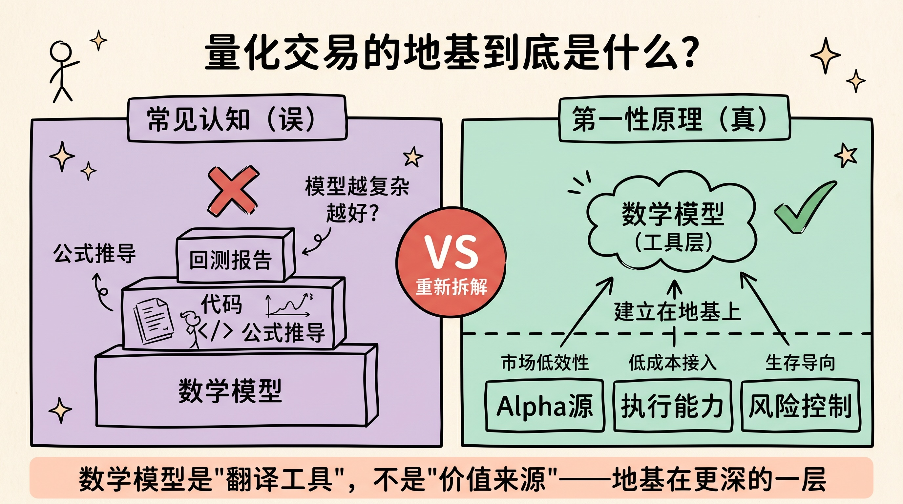
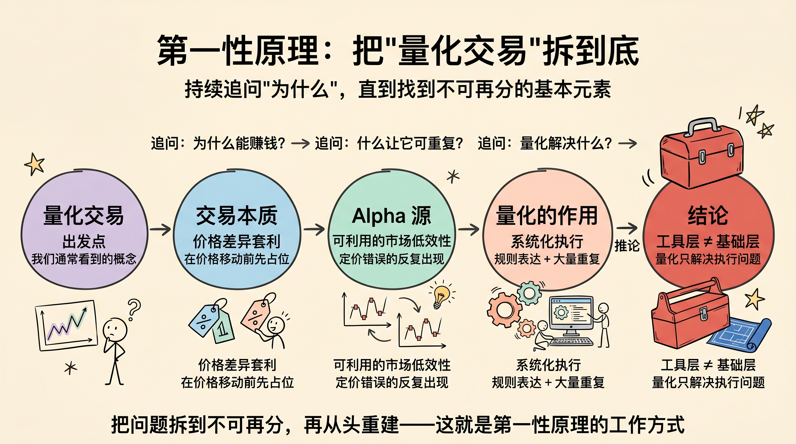
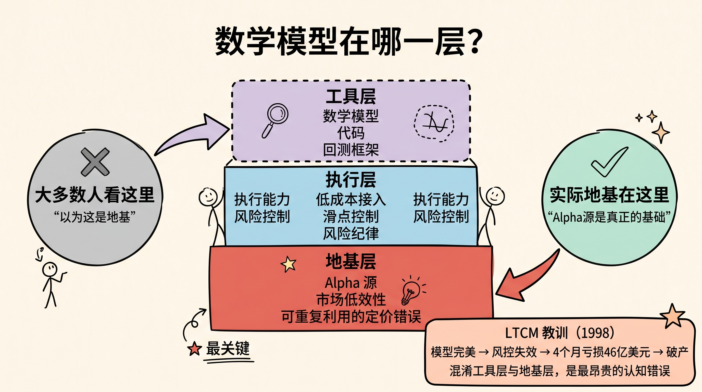
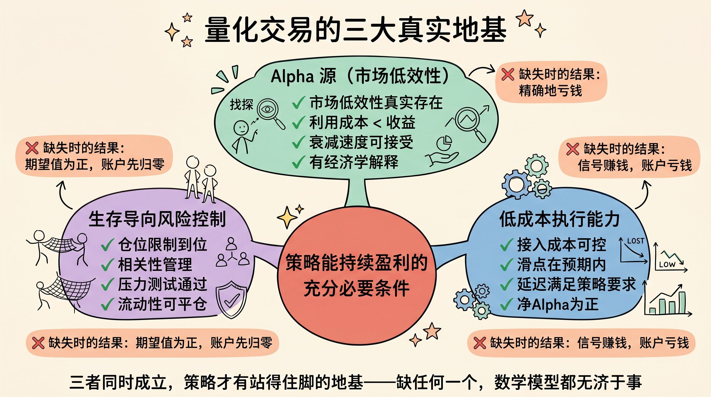
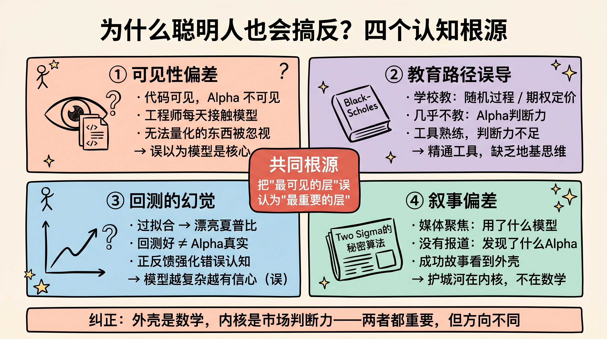
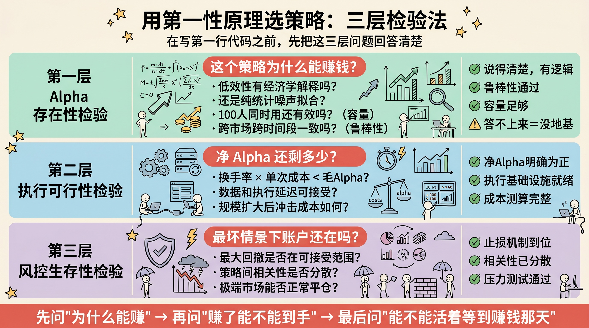

> 聪明人在量化交易里最容易犯的错误，不是模型写错了，而是根本搞错了什么是地基。

---

## 先讲结论

量化交易的基础**不是**数学模型。

这个说法听起来反直觉。量化交易行业里有大量复杂的数学——随机过程、线性代数、机器学习——难道这些不是核心吗？

不是。数学模型是**工具**，解决的是"如何精确描述和执行判断"的问题。但它无法解决一个更根本的问题：**这个判断本身是否正确**。

量化交易真正的三大地基是：

1. **可被利用的 Alpha 源**（市场存在可重复利用的定价低效性）
2. **低成本、可靠的执行能力**（将信号转化为实际成交的完整能力）
3. **让你活过亏损期的风险控制**（保证期望值有机会实现的约束机制）

这三者缺一不可，且没有先后顺序——它们同时构成地基。数学模型在这三者之上，帮助你把每一层做得更精确，但它替代不了任何一层。

搞清楚这一点，才能判断一个策略值不值得做，以及做烂了问题出在哪里。

---

## 一、第一性原理：把"量化交易"拆到最小单元

第一性原理要求我们把一个概念剥到不能再剥为止，然后从这个最小单元重新往上建。那么，"量化交易"最底层是什么？

### 交易是什么？

**一句话定义**：在两个时间点之间，以不同价格买卖同一标的，赚取差价。

**人话解释**：交易的本质是"价格在你预期的方向移动之前，你先站在那个方向"。没有价格差异，就没有收益来源。不管策略多复杂，追根溯源都是这一句话。

**类比理解**：就像倒票。你判断某场演唱会票值 2000 元，但现在可以 1200 元买到，你买入并等待——这就是交易的原型。判断对了赚差价，判断错了亏损。

### 什么让交易可以持续盈利？

**一句话定义**：市场中存在可以被重复利用的定价错误（market inefficiency）。

**人话解释**：如果市场永远是完全有效的，价格随时反映所有信息，那么任何人都不可能持续盈利。能持续盈利，必然意味着有某个地方、某个时间段、某类标的，存在可以被系统性发现和利用的规律性错误。这叫做 **Alpha 源**。

**类比理解**：某个菜市场摊主每天早上 8 点前的番茄价格总是偏低，因为他想快速出货。你每天 8 点前去买，这个定价规律就是你的 Alpha 源。如果所有人都知道这件事，摊主会调整策略，Alpha 就消失了。

### "量化"加了什么？

**一句话定义**：把对市场低效性的判断，系统化、规则化、可重复执行。

**人话解释**：量化不是让你"更数学"，而是让你的判断变得可以被规则表达、被计算机执行、被历史数据验证、被大量次数重复。量化的对立面不是"感性"，而是"不可扩展"。

**一个关键推论**：**"量化"本身解决的是执行层的问题，不是"有没有东西可以赚"的问题。** 把交易系统化，能让你在有 Alpha 的时候赚得更稳、更多；但如果根本没有 Alpha，把随机噪声系统化，只会更稳定地亏钱。

---

## 二、数学模型在哪一层？为什么它是工具而非地基

理解了上面的分解，我们就能把量化策略的层级结构画清楚：

**最底层（地基）**：市场低效性是否存在（Alpha 源）

**中间层（结构）**：能否低成本地捕获它（执行能力 + 风险控制）

**工具层（仪器）**：如何精确描述和执行它（数学模型 + 代码）

### 数学模型做了什么

数学模型的实际工作是：将"我认为 X 时市场会向 Y 方向移动"这一判断，翻译成精确的信号和仓位规则；允许对历史数据做回测，量化策略的期望收益和风险；让策略可以被计算机在毫秒级执行，消除人为情绪干扰。

这些工作很重要，但注意：它们都是在"假设 Alpha 存在、执行可行、风控到位"的前提下才有意义的。

### 为什么它是工具层而非地基

**第一个理由**：模型再精确，如果它描述的 Alpha 不存在（或已经消失），结果是——精确地亏钱。

**第二个理由**：交易成本过高，模型信号再好也无法转化为实际利润。一个净 Alpha 为 3% 的策略，如果总执行成本达到 4%，你是在持续性地亏损，而且每一笔都做得很"精确"。

**第三个理由**：模型没有内置风险约束，一次黑天鹅就可以让账户归零，没有机会让期望值在足够多的次数后实现。

### LTCM 的教训

Long-Term Capital Management（LTCM）是量化金融史上最著名的失败案例。它的团队包括两位诺贝尔经济学奖得主（Merton 和 Scholes），模型基于无懈可击的套利逻辑。

结果：1998 年，因为极度杠杆（风险控制失效）和 1998 年俄罗斯危机引发的流动性枯竭（执行能力失效），4 个月内损失 46 亿美元，最终由美联储协调 14 家金融机构联合救助。

**模型本身并没有错。地基塌了。**

> 建筑类比：数学模型是建筑图纸和施工工具。再精密的图纸，也无法让建在沙地上（没有 Alpha）的楼站稳。再好的工具，也无法解决承重墙不够强（风控不足）的问题。

---

## 三、真正的三大基础：Alpha 源 + 执行能力 + 风险控制

### 地基一：可利用的 Alpha 源

**一句话定义**：市场中存在可以被重复利用的定价低效性，且这个低效性的消失速度慢于你利用它的速度。

**人话解释**：Alpha 源不是"找到一个规律"这么简单。它需要同时满足两个条件：第一，这个低效性真实存在，不是过拟合出来的统计幻觉；第二，利用它的总成本（包括时间、金钱、执行摩擦）低于它带来的收益，且在足够长的时间内持续。

常见的 Alpha 源类型：

| Alpha 类型 | 来源 | 典型策略 |
|---|---|---|
| 信息优势 | 更快获取或更好解读公开信息 | 另类数据、NLP 情绪策略 |
| 行为偏差 | 市场参与者的系统性非理性 | 动量效应、反转效应 |
| 结构性压力 | 被迫交易方产生的可预测价格压力 | 指数套利、期权做市 |
| 流动性溢价 | 持有低流动性资产获得补偿 | 小盘股策略、illiquid 期权 |

**关键判断问题**：这个 Alpha 的"衰减速度"是多少？它会被竞争者发现并套利掉吗？在你的资金规模下，它还有多少容量？

**没有 Alpha 源时数学模型的命运**：用越来越复杂的模型去拟合随机噪声。回测漂亮，实盘必亏。这是量化行业里最常见的死亡路径。

### 地基二：低成本、可靠的执行能力

**一句话定义**：将模型信号转化为实际成交的完整基础设施，且总成本低于策略期望收益。

**人话解释**：执行能力包含三个分层：

1. **接入成本**：佣金 + 席位费 + 数据订阅费，这是每一笔交易的固定摩擦
2. **滑点成本**：信号价格与实际成交价格的差距，在订单执行延迟时扩大
3. **市场冲击**：大额订单本身改变价格，资金规模越大，这一项越关键

**实际意义**：一个年化预期毛收益 8% 的策略，如果总执行成本达到 6%，净 Alpha 只剩 2%，扣除税费后几乎没有意义。高频交易（HFT）之所以需要极低延迟，本质上是在把滑点成本压缩到接近零，以便在极低毛 Alpha 的机会上仍然盈利。

**判断标准**：策略的换手率 × 单次执行成本 < 策略的毛 Alpha。在实际下单前把这个等式算清楚。

### 地基三：让你活下去的风险控制

**一句话定义**：设计让策略在最坏情景下仍然能够继续运作的约束机制，而不是最大化单次收益。

**人话解释**：风险控制不是"减少损失"，而是"保证你有机会让期望值实现"。一个期望值为正的策略，只要你的资金在期望值实现之前耗尽，它对你来说就是亏损的。

Kelly Criterion 的本质正是这个：不是最大化每次收益，而是最大化**复利增长率**——即在足够多次交易之后的长期结果。下注过重会导致资金曲线方差过大，在某次运气不好时提前出局。

风控的三个层次：

1. **仓位控制**：单策略、单标的的最大暴露，防止一次错误判断摧毁整个账户
2. **相关性管理**：避免所有策略在同一个市场事件下同时亏损，分散要真分散
3. **流动性压力测试**：极端市场中你是否能以合理价格平仓，还是会被迫在最差的时刻斩仓

**LTCM 再次登场**：模型正确，风控失效，结果是破产。这不是特例，这是缺失地基三的标准结局。

---

## 四、为什么聪明人也会搞反？（误区的成因）

理解了正确答案之后，我们需要理解：为什么这个误区如此普遍，连聪明人也难以避免？

### 原因一：可见性偏差（Visibility Bias）

数学模型是量化交易中最"看得见"的部分。代码文件、公式推导、回测报告——这些是工程师和研究员每天接触的具体产出物。

相比之下，"Alpha 源是否真实存在"是一个需要市场洞察力和经验判断的问题，"风险控制是否足够"需要对极端情景的想象力。这些判断更接近直觉和经验，远比写代码难量化、难展示。

人类天然倾向于把注意力放在可见的、可量化的部分，误以为它就是核心。**这是"最显眼的层"被误认为"最重要的层"的认知机制。**

### 原因二：教育路径的误导

量化金融的学术训练——随机过程、Black-Scholes 期权定价、因子模型——大量时间花在数学工具上。这些课程教你怎么用数学描述金融现象，但很少有课程教：

- 如何判断一个 Alpha 是否真实，而不是过拟合的幻觉？
- 如何设计能让策略活过熊市的风控架构？
- 在什么条件下，复杂模型反而比简单规则更危险？

结果：大量从业者对数学工具极度熟练，但对底层逻辑的判断能力不足。他们用精密的工具建造，却没有想清楚建在哪里。

### 原因三：回测的幻觉

数学模型配合历史数据回测，可以生成让人信服的漂亮曲线。一个没有任何真实 Alpha 的策略，通过充分的参数调优和特征选择（即过拟合），也能在历史数据上展现出极好的夏普比。

这种"模型越复杂，回测越漂亮"的正反馈，强化了"数学模型是核心"的错误认知。

**一句核心判断**：回测能告诉你"在过去，这套规则是否赚钱"，但它无法告诉你"这背后的 Alpha 是否真实且持续"。两者之间的差距，正是量化交易的核心难题所在。

### 原因四：成功案例的叙事偏差

当我们讲述 Two Sigma、Renaissance Technologies、D.E. Shaw 的成功故事时，叙述往往聚焦在他们用了哪些复杂数学、雇了多少顶级数学家和物理学家。

**实际上，这些机构的真正护城河是**：他们发现了竞争者没有发现的 Alpha 源，同时用极其精密的风控让这些 Alpha 可以在很长时间内持续释放。数学复杂性是实现这两件事的工具，而不是护城河本身。

媒体和大众看到的是外壳（数学的可见性），看不到内核（Alpha 判断力 + 风险纪律）。于是叙事强化了错误认知。

---

## 五、实践启示：用第一性原理选策略

有了上面的分析框架，我们就能把"如何评估一个量化策略"这个问题转化成三层具体的检验标准。

### 三层检验法

**第一层：Alpha 存在性检验**

在写任何一行代码之前，先回答这些问题：

- 这个策略赚钱的理由是什么？背后的市场低效性是什么？
- 这个低效性有没有经济学上合理的解释？（还是只是统计上的噪声拟合？）
- 如果有 100 个人同时使用这个策略，它还会有效吗？（容量检验）
- 它在不同市场、不同时间段的表现是否一致？（鲁棒性检验）
- 这个 Alpha 的衰减速度是多少？是否已经被套利掉了？

答不上来，或者答案依赖于"我感觉这个规律在未来会继续"——这个策略没有站得住脚的地基。

**第二层：执行可行性检验**

- 策略的换手率和持仓规模，在当前市场流动性下，实际执行成本是多少？
- 总执行成本之后，策略的净 Alpha 还剩多少？是否仍然值得做？
- 数据获取、信号计算到订单执行的延迟，是否在策略的容忍范围内？
- 资金规模增大后，市场冲击是否会吃掉净 Alpha？

**第三层：风控生存检验**

- 历史上最坏的连续亏损期（最大回撤）是多少？以这个规模，账户是否会面临强制平仓或心理崩溃？
- 这个策略的亏损与其他策略的相关性如何？在同一个市场事件下会同时亏损吗？
- 极端市场（流动性危机、价格跳空）下，止损机制是否有效？是否会因为无法成交而损失放大？

### 一个判断口诀

> 先问"为什么能赚"，再问"赚了能不能到手"，最后问"最坏情景下能不能活着等到赚钱的那天"。这三个问题全部回答清楚，再谈数学模型。

这三个问题，对应的正是 Alpha 源、执行能力、风险控制——量化交易真正的三大地基。

---

## 总结

**三点核心要点：**

1. **数学模型是工具，不是地基**。它解决的是"如何精确表达和执行判断"的问题，无法解决"判断本身是否正确"的问题。用再复杂的模型追逐不存在的 Alpha，只会精确地亏钱。

2. **量化交易真正的三大基础**是：可持续的 Alpha 源（市场低效性）、低成本的执行能力、让你活过亏损期的风险控制。三者缺一不可，且同时构成地基——没有先后顺序。

3. **判断一个量化策略时，先问第一性原理层的问题**：这个策略为什么能赚钱？背后的市场低效性是什么、能持续多久？模型做得再漂亮，这个问题答不上来，策略就没有地基。

从第一性原理出发，量化交易的本质很清晰：找到真实存在的市场低效性，用足够低的成本捕获它，并且活得足够长以让期望值实现。数学和代码，是完成这三件事的精密工具——非常重要，但不是基础。

---

**参考阅读**：

- Pedersen, Lasse Heje. *Efficiently Inefficient: How Smart Money Invests and Market Prices Are Determined*. Princeton University Press, 2015.
- Ilmanen, Antti. *Expected Returns: An Investor's Guide to Harvesting Market Rewards*. Wiley, 2011.
- Kelly, J. L. "A New Interpretation of Information Rate." *Bell System Technical Journal*, 1956.
- Lowenstein, Roger. *When Genius Failed: The Rise and Fall of Long-Term Capital Management*. Random House, 2000.
- Lopez de Prado, Marcos. *Advances in Financial Machine Learning*. Wiley, 2018.
- Fama, Eugene F. "Efficient Capital Markets: A Review of Theory and Empirical Evidence." *Journal of Finance*, 1970.
