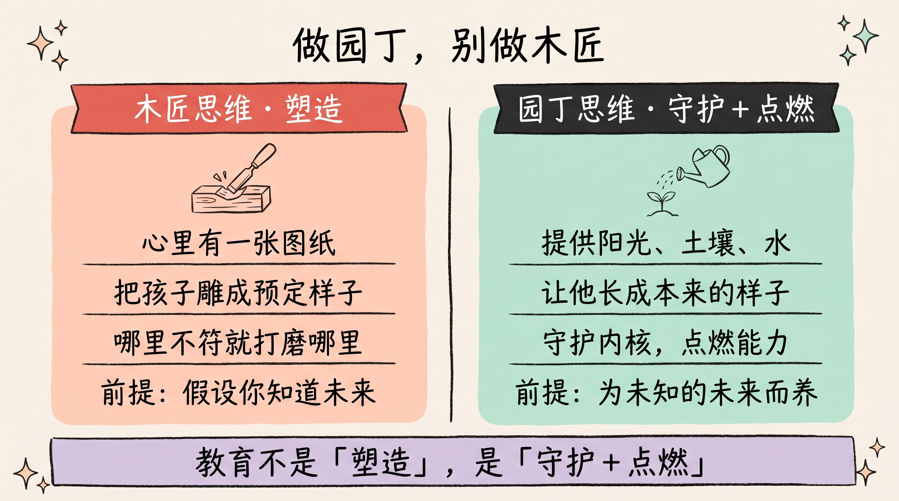
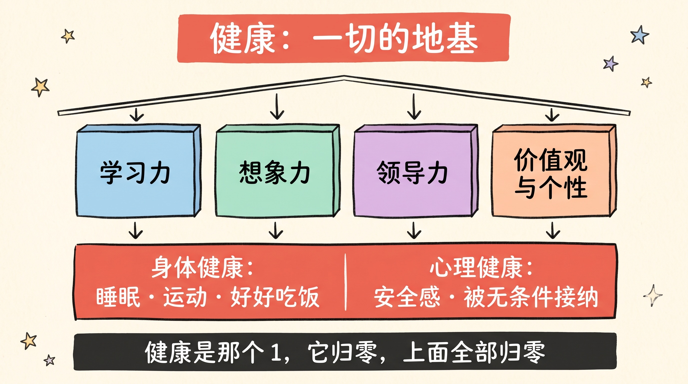
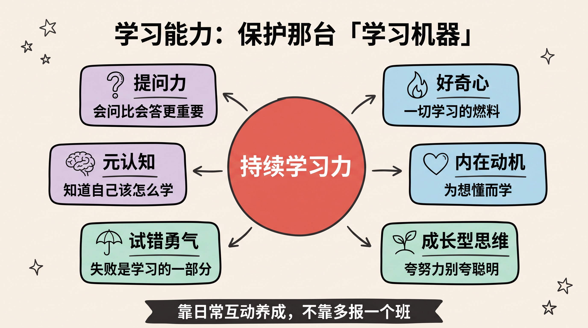
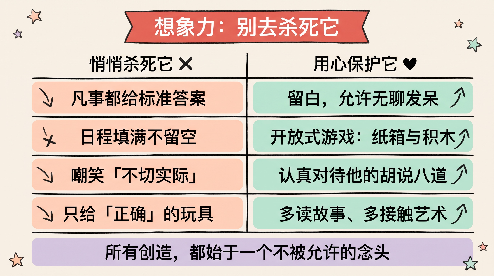
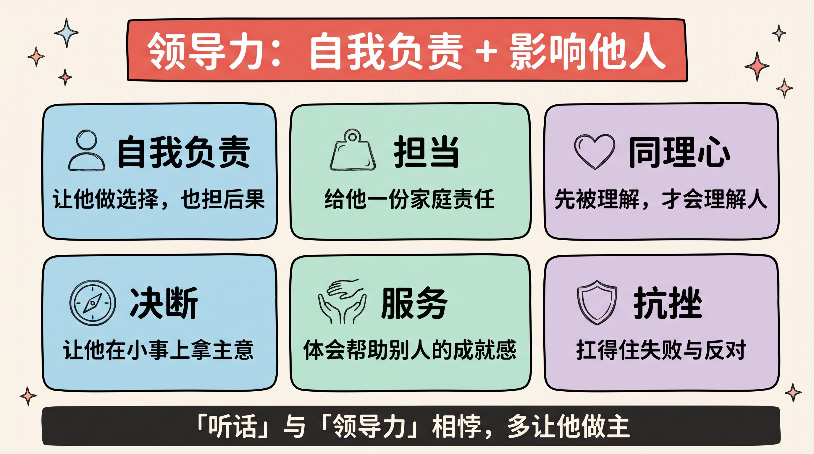
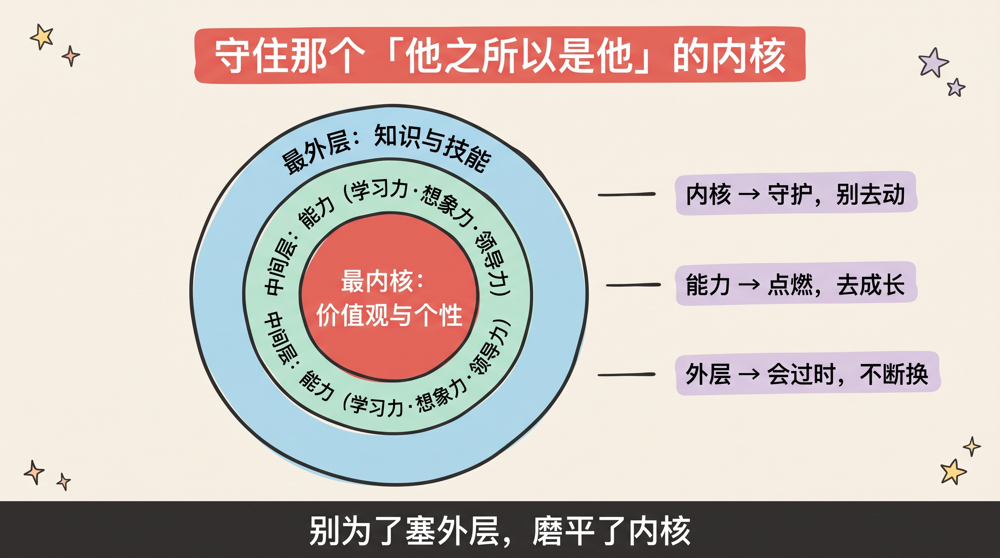

> 我们没法给一个自己都看不清的未来，定制一个「标准答案」式的孩子。
>
> 所以教育真正该做的，不是把他雕成我们想要的形状，而是**守护好他的内核，点燃他应对任何未来的能力**。这篇文章，是我理解的五个不会过时的核心。

---

## 先讲结论

1. **做园丁，别做木匠**。木匠按图纸把木头雕成预定的样子；园丁只负责提供阳光、土壤和水，让种子长成它本来该有的样子。教育的目标不是「塑造」，而是「守护 + 点燃」。
2. **五个核心分两层**：**守护地基**——健康（身体+心理）、价值观与个性，这些不能被破坏；**点燃能力**——学习力、想象力、领导力，这些需要被激发。地基与能力是乘法关系：**健康一旦归零，其他全部归零。**
3. **家长最大的风险不是「做得不够」，而是「用力过猛做反了」**：用分数换掉了心理健康、用刷题杀死了想象力、用「听话」压住了领导力和个性。**很多时候，不伤害，就是最好的教育。**

---

## 一、总览：做园丁，别做木匠

在谈五个具体的点之前，得先回答一个元问题：**教育到底是在干什么？**

大多数人默认的答案是「木匠思维」：孩子是一块木头，我心里有一张图纸（考上名校、进大厂、成为医生律师），我的任务就是拿着刻刀，把他雕成图纸上的样子。哪里不符合图纸，就打磨哪里。

这个思路有一个致命的前提错误：**它假设你知道未来长什么样。**

可你不知道。认知科学家 Alison Gopnik 在《园丁与木匠》里说得很透彻：我们正在为一个**根本无法预测**的世界养育孩子。二十年前没人能想到今天最赚钱的职业；今天我们同样猜不到二十年后。在这种不确定性下，**把孩子雕成一个「为已知的过去优化」的形状，恰恰是最危险的。**

正确的隐喻是「园丁思维」：

> 园丁不决定一朵花开成什么样，他只负责让土壤足够肥沃、阳光足够充足。他提供的是一个**能让生命自己茁壮的环境**，而不是一个必须长成的模具。

顺着这个思路，五个核心自然地分成了两层——这是理解全文的骨架：

| 层次 | 包含 | 家长的动作 | 本质 |
|------|------|-----------|------|
| **地基层（守护）** | 健康、价值观与个性 | 不破坏、保护好 | 这些一旦被伤害，很难修复 |
| **能力层（点燃）** | 学习力、想象力、领导力 | 创造环境去激发 | 这些是应对任何未来的通用能力 |

还有一个更深的视角。我在[另一篇文章](../view-from-the-future/)里写过，最值得投资的是那些「十年后还值钱」的复利资产。放到教育上同样成立：**具体的知识、某次考试的分数、某个当下热门的技能，都会过时；而健康、学习力、想象力、内核，是十年、二十年后依然增值的东西。** 聪明的教育，是把有限的精力，投在这些不会贬值的地方。

---

## 二、健康：身体与心理，是一切的地基

五个核心里，健康必须排第一。不是因为它最重要（虽然它确实最重要），而是因为它和其他四个的关系是**乘法**：

> 学习力、想象力、领导力、价值观……无论后面这串数字多大，**只要健康这一位是 0，乘出来就是 0。**

一个长期睡眠不足、被焦虑笼罩、或身体垮掉的孩子，你跟他谈什么学习力和领导力，都是奢谈。所以健康是地基——地基塌了，上面盖多高的楼都会一起塌。

健康有两半，而我们的社会习惯性地只看见一半。

### 身体健康：被严重低估的「学习成绩」

充足的睡眠、规律的运动、好好吃饭——这些听起来朴素到不像「教育」，但它们是大脑发育和情绪稳定的物质基础。运动不只是强身体，它直接提升专注力、记忆力和情绪调节能力。**那些为了多刷两套题而牺牲的睡眠和运动，是拿地基去换装修，是亏本买卖。**

### 心理健康：那个不能用分数去换的东西

这是最容易被牺牲、代价却最惨重的一块。心理健康的核心，是**安全感**和**被无条件接纳的感觉**——他知道，无论考砸了、闯祸了、失败了，家永远是接住他的地方，而不是又一个审判他的考场。

> 一个残酷的等式：**你用分数换来的名次，可能正在用孩子的心理健康去支付。** 而心理的裂缝，往往要用一生去修补。

家长能做的最重要的一件事，或许是把「你考得好我才爱你」这个隐含的条件，换成「无论怎样我都爱你，但我希望你尽力」。**无条件的爱是地基，对具体行为的要求是装修——别把两者搞反。**

---

## 三、学习能力：教的不是知识，是「持续学习」本身

工业时代的教育，目标是把人变成「知识的容器」——记住尽可能多的标准答案。但在一个知识半年就迭代一轮、AI 随时能调出任何事实的时代，**「记住了多少」几乎不再是竞争力，「能不能持续学会新东西」才是。**

所以这一章的核心是一个转变：

> 别执着于教孩子**具体的知识**，要保护和点燃他**持续学习的能力**——那台"学习机器"本身。

一台好的「学习机器」由几个零件构成，每一个都比某道题的答案重要得多：

- **好奇心**：一切学习的燃料。孩子天生带着它，问十万个为什么。**保护它的方式，常常只是别嫌他烦、认真对待他的每一个「为什么」。**
- **内在动机**：他为「想弄懂」而学，而不是为「怕被罚 / 想要奖励」而学。心理学的自我决定论反复证明：**外部奖惩会侵蚀内在动机**——用金钱奖励阅读，孩子反而在奖励停止后更不爱读了。
- **成长型思维**：Carol Dweck 的经典发现——相信「能力可以通过努力增长」的孩子，比相信「能力天生固定」的孩子走得远得多。**所以夸孩子要夸「你很努力」，而不是夸「你真聪明」**——后者会让他为了维持「聪明」的人设，不敢挑战难题、害怕失败。
- **试错的勇气**：把失败重新定义为「学习的一部分」，而不是「能力的判决」。一个不敢犯错的孩子，等于关闭了学习最重要的那条通道。
- **元认知**：知道自己「会什么、不会什么、该怎么学」的能力。这是能自我驱动、终身学习的人和普通人最大的分水岭。

看出来了吗？这些没有一个是靠「多报一个补习班」能获得的。它们靠的是**日常的互动方式**——你如何回应他的提问、如何评价他的成败、允不允许他犯错。

---

## 四、想象力：教育最容易杀死的，恰恰是它

有一个令人不安的观察：**几乎每个孩子生下来都拥有惊人的想象力，而很多人在受完教育之后，把它弄丢了。**

教育家 Ken Robinson 有一个著名的论断：学校在系统性地扼杀创造力。因为标准化教育天然偏爱「有唯一正确答案」的东西——它好评分、好排名、好管理。而想象力恰恰相反：它是发散的、没有标准答案的、甚至常常是「错」的。于是在追求效率和分数的过程中，想象力成了第一个被牺牲的。

这一章我想换个角度：想象力这东西，**它不太需要你去「培养」，它需要的是你「别去杀死」。** 因为孩子本就自带它。

### 那些悄悄杀死想象力的事

- 凡事都给标准答案，不给他自己瞎想的空间。
- 把所有时间填满（补习、兴趣班、被安排好的活动），不留一点「无聊」的余地——**而无聊，恰恰是想象力的温床。**
- 嘲笑他「不切实际」的念头，用成年人的现实感去碾压他的天马行空。
- 只提供「正确」的玩具和「有教育意义」的内容，不给开放式、可以自己定义玩法的东西。

### 那些保护想象力的事

- **留白**：允许发呆、允许无所事事。别害怕孩子「无聊」。
- **开放式游戏**：一堆积木、一个纸箱，胜过一个只有单一玩法的电子玩具。
- **认真对待他的「胡说八道」**：当他说「云是棉花糖做的」，先别急着纠正，问一句「那它是什么味道的？」
- **多读故事、多接触艺术**：给想象力提供素材和养分。

> 保护想象力的心法只有一句：**在急着把他塞进「正确」之前，先给他留一点「乱想」的自由。** 因为所有的创造，都始于一个不被允许的、不切实际的念头。

---

## 五、领导力：不是管人，是自我负责与影响他人

一提「领导力」，很多人想到的是「当官」「管人」「发号施令」，然后觉得这离孩子太远。这是最大的误解。

真正的领导力，第一性地看，根本不是关于「管别人」，而是关于两件事：

> **第一，能对自己负责（自我领导）；第二，能正向地影响他人（利他影响）。**

一个连自己的时间、情绪、选择都管不好的人，给他权力也带不好团队。所以领导力的起点，是**自我负责**——而这恰恰要从小、从很具体的小事开始长。

领导力的内核，拆开是这样几样东西，每一样都能在童年种下：

| 内核 | 是什么 | 怎么从小种下 |
|------|--------|------------|
| **自我负责** | 为自己的选择和后果负责 | 让他做选择，也让他承担自然结果 |
| **担当** | 愿意扛事，而不是甩锅 | 给他一份「属于他」的家庭责任 |
| **同理心** | 能理解并顾及他人的感受 | 被无条件理解过的孩子，才会去理解别人 |
| **决断** | 在信息不全时敢做决定 | 允许他做「小事」上的决定并复盘 |
| **服务** | 领导是服务，不是特权 | 让他体会「帮助别人」的成就感 |
| **抗挫** | 扛得住失败与反对 | 见过 [四] 里说的「试错的勇气」 |

注意最反直觉的一点：**「听话」和「领导力」在很大程度上是相悖的。** 一个被要求绝对服从、从不被允许有自己主张的孩子，长大后很难成为一个有担当、敢决断的人——因为他从小被训练的是「等指令」，而不是「自己拿主意」。所以，**在安全的边界内，多让他做主、多让他为自己的决定负责，就是在养领导力。**

---

## 六、价值观与个性：守住那个「他之所以是他」的内核

最后一个，也是最像「地基」的一个：守护孩子的价值观和个性——那个让他区别于所有其他人的**内核**。

这里有一个必须想清楚的层次结构。一个人身上的东西，可以按「能不能变、该不该变」分成三层：

> - **最内层：价值观与个性**——他相信什么、是个什么样的人。这是内核，应该被守护，尽量别去动它。
> - **中间层：能力**——学习力、想象力、领导力。这是要点燃、要成长的。
> - **最外层：具体的知识与技能**——会随时代不断更新替换。

很多教育的悲剧，源于把这个顺序搞反了：**为了往最外层多塞点知识技能，去磨平了最内层的个性和价值观。** 比如为了「合群」「听话」「别太特别」，硬生生把一个内向的孩子改造成外向、把一个爱画画的孩子按进奥数班、把所有的棱角都打磨成一个标准件。

这是拿最珍贵的、最不可再生的东西（内核），去换最廉价的、最容易过时的东西（外层技能）。**亏得离谱。**

### 守护内核，具体意味着什么

- **接纳他的天性**：内向不是缺点，敏感不是毛病，好动不是多动症。先接纳，再引导。
- **允许他和你不一样**：他不是你的复制品，也不是你未完成梦想的续集。他有权成为一个你可能不完全理解的人。
- **言传不如身教**：价值观不是靠说教灌进去的，是靠孩子**看着你怎么做**长出来的。你如何对待失败、如何对待弱者、如何对待诱惑，才是他真正的价值观教材。
- **给他「选择」的练习**：价值观是在一次次「选什么、放弃什么」中长出来的。从小让他做有取舍的选择，他才会慢慢知道自己看重什么。

> 教育的终点，不是把孩子变成一个「更好的别人」，而是让他成为「最好的自己」。**守住那个内核，其余的都好说。**

---

## 总结

把这篇文章收进四句话：

1. **做园丁，别做木匠**：你养育的是一个要走进未知未来的人，守护他的内核、点燃他的能力，而不是把他雕成一张过时的图纸。
2. **健康是乘法里的那个 1**：身体和心理的健康是地基，地基塌了，学习力、想象力、领导力全部归零。别用分数去换它。
3. **点燃三种元能力**：学习力（那台学习机器本身）、想象力（别去杀死它）、领导力（自我负责与影响他人）——它们比任何一门具体知识都更不会过时。
4. **守住内核，别搞反顺序**：价值观与个性是最内层、最该守护的东西；别为了往外层塞知识技能，去磨平了那个「他之所以是他」的内核。

最后，作为一个提醒，也作为一句心里话：

> 我们总怕给孩子的不够多，却很少意识到，**很多伤害恰恰来自「给得太用力」**——用力过猛的期待、填得太满的日程、无处不在的比较。
>
> 有时候，蹲下来，少一点雕刻，多一点阳光和耐心，**让他自己长**，就是最高级的教育。

---

**参考阅读**：

- Alison Gopnik《园丁与木匠》（The Gardener and the Carpenter）——为不可预测的世界养育孩子
- Carol Dweck《终身成长》（Mindset）——成长型思维与「夸努力而非夸聪明」
- Ken Robinson《学校扼杀创造力吗？》（TED）——标准化教育与想象力
- Edward Deci & Richard Ryan，自我决定论——内在动机为何比奖惩更持久
- 本站相关：[站在未来看现在](../view-from-the-future/)——投资「十年后还值钱」的复利资产
- 本站相关：[熵增定律与人生选择](../entropy-law-life-choices/)——好习惯为什么需要主动建立
