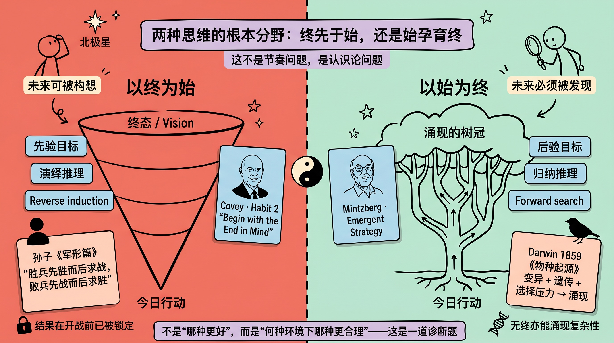
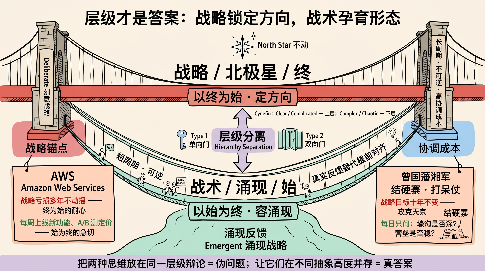
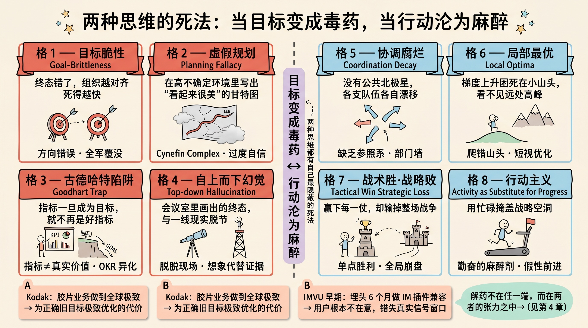
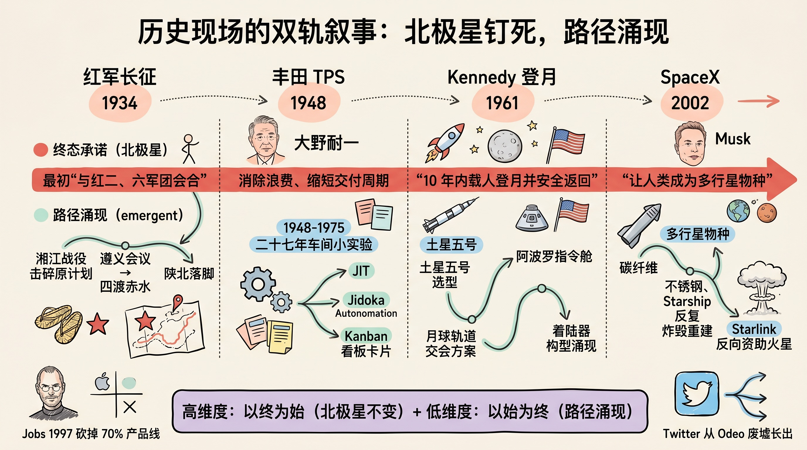
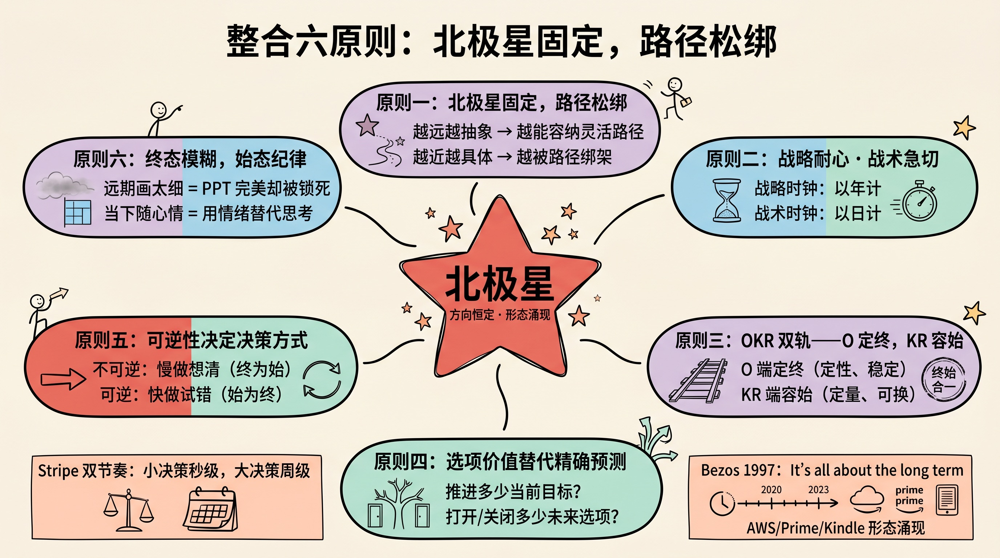
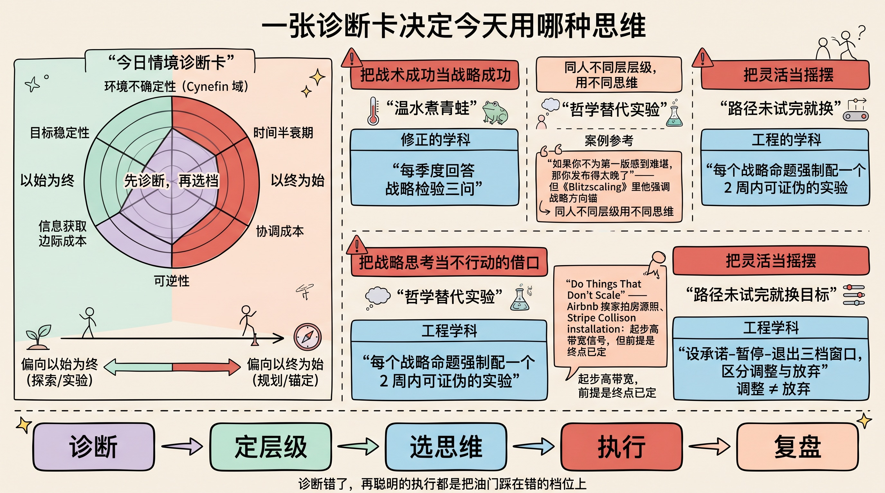

> 战略锁方向，战术认形态——两者不在同一时钟上。

---

## 先讲结论

1. 以终为始与以始为终不是节奏快慢之争，而是认识论之争——前者认为未来的某些维度可被先验构想，后者认为另一些维度必须在交互中被发现；混用同一层级辩论是伪问题，按维度分层使用才是真答案。

2. 战略层面偏以终为始（长周期、不可逆、高协调成本下，没有公共终态人就会发散），战术层面偏以始为终（短周期、可逆、信息便宜时，真实反馈比规划更可靠）——把这两条混在同一时钟上，是个人与组织最常见的低效来源。

3. 真正的解法不是二选一，而是六条整合原则，核心是：北极星固定结果、路径松绑形态、节奏分层管理。

---

## 一、Kennedy 和达尔文在打架：未来该被构想还是被发现

把"以终为始"和"以始为终"理解成节奏快慢之争，是对它们最深的误读。两者真正的分歧在认识论：**未来的哪些方面可以被先验构想，哪些必须在交互中被发现？**

以终为始的内核是先验目标 + 演绎推理 + reverse induction。它假设一个尚不存在的终态可以在头脑中被清晰建模，然后反向推出今天该做什么。这种思维最纯粹的表达，是孙子《军形篇》那句几乎刺骨的判断：

> 是故胜兵先胜而后求战，败兵先战而后求胜。

胜负不在战场，在开战前的庙堂筹算；交战只是去"兑现"已经被锁定的结果。Stephen Covey 1989 年提出的 Habit 2"Begin with the End in Mind"是其现代翻版——先在心智中创造，再在物理世界兑现。Kennedy 1961 年那句"before this decade is out, of landing a man on the moon"是同一形态：先把终点钉死在一个具体年份上，再让 40 万人反推工程路径。

以始为终的内核则是后验目标 + 归纳推理 + forward search。它承认未来的形态不可被提前充分描述，只能在与现实的反复交互中浮现。最极致的版本是达尔文 1859 年《物种起源》提出的自然选择——没有预设的终点，仅靠变异、遗传、选择压力的反复迭代，就能涌现出极其精巧的生物形态。Mintzberg 与 Waters 1985 年提出的 emergent strategy 是其管理学版本：

> For a strategy to be perfectly emergent, there must be order—consistency in action over time—in the absence of intention about it.

行动先于意图，模式从一系列局部决策中被事后识别出来。

真实的决策往往同时包含两种维度：客户支付意愿的物理上限是可构想的，哪种产品形态会被接受则必须被发现。问题不是选阵营，而是判断手里这件事的哪部分属于哪一类——这是一个诊断问题，不是品味问题。

---

## 二、分层而治：把两种思维放进不同抽象高度

把"以终为始"和"以始为终"放在同一层级辩论，是伪问题。它们不互斥，而是应当分配到不同的抽象高度：战略层用前者锁定方向，战术层用后者容纳涌现。

Mintzberg 和 Waters 在 1985 年的 *Strategic Management Journal* 里就把战略劈成两半：**Deliberate**（刻意）与 **Emergent**（涌现）。前者要求"precise intentions"提前存在、被组织共同接受、并被精确实现；后者是"order—consistency in action over time—in the absence of intention about it"。他们的结论很直白：真正的战略"walks on two feet, one deliberate, the other emergent"。

Jeff Bezos 在 2016 年致股东信里把这条结构工程化为 **Type 1 / Type 2 决策**——核心区分是"可逆性"，而非认识论：

| 维度 | Type 1（单向门） | Type 2（双向门） |
|------|------------------|------------------|
| 可逆性 | 不可逆 | 可逆 |
| 节奏 | 慢做、想清、对齐 | 快做、试错、复盘 |
| 决策风格 | 高层小圈深思 | 一线快速判断 |
| 典型 | 卖业务、上市、核心架构 | 功能上线、定价 A/B、文案改动 |
| 常见误判 | 招高管按 Type 2 试错心态招、按 Type 1 解雇成本承担 | 一个两小时可回滚的 feature flag 被反复评审 |

Bezos 的警告是：把 Type 2 当 Type 1 处理的组织会被自身流程绞死，而把 Type 1 当 Type 2 处理的组织会因一次不可逆错误送命。可逆性维度与认识论不完全同构——一个不可逆决策也可能由市场反馈被动触发，但作为决策风格指南它足够锋利。

Dave Snowden 的 **Cynefin** 框架在元层级回答了"什么时候用哪一种"：Clear / Complicated 域，因果可追溯，"以终为始"是正确的；Complex 域因果只能事后被讲述，必须 **probe-sense-respond**，让 emergent practice 浮现；Chaotic 域连"始"都来不及想，先 act 稳住局面。

AWS 长期亏损的耐心是 Bezos 公开承认的 Type 1 决策样本——一旦决定不撤，连续二十年用现金流补贴基础设施投入；但 AWS 启动本身、Prime、Kindle 都是 Bezos 自己定性为可低调收掉的 Type 2 实验。**同一个名字下，启动是 Type 2，长期承诺是 Type 1，两件事必须分开记账。**层级一旦分对，至少能消除一半的伪冲突——剩下一半是真实的资源约束，那是另一个问题。

---

## 三、Kodak 不是死于胶片，而是死于把胶片写进了北极星

两种思维都有自己最隐蔽的死法。以终为始死于"为已被时代证伪的旧目标做到极致"，以始为终死于"用忙碌掩盖方向"。

**以终为始的四种失效**——

| 失效 | 病理 | 典型 |
|------|------|------|
| Goal-Brittleness | 终态把技术形态绑死，工艺被证伪即全盘崩塌 | Kodak 1975 年内部已发明数码相机原型，因威胁胶片利润被搁置约 20 年 |
| Planning Fallacy | 在高不确定下捏造精确终态 | IMVU 2004 年埋头 6 个月做 IM 插件兼容性，上线后无人下载 |
| Top-down Hallucination | 信息最缺时由最远离一线者拍板 | 完美 PPT 配上从未启动的项目 |
| Sunk-Path Lock-in | 投入越大越不敢调整方向 | 诺基亚 2007 年仍占全球手机市场 49.4%，Symbian 团队内部承认架构无法竞争，管理层仍继续投入约 18 个月 |

Goal-Brittleness 与目标抽象层级直接相关——可操作判据是：**终态描述若提到具体技术或产品形态，而非客户结果，就是把路径绑死在工艺里**。Kennedy 钉死的是"人 / 月球 / 十年"三个结果指标，对发动机、轨道方案、舱体构型全部开放；Kodak 的问题是把"胶片"本身写进了北极星，而不是"帮人留住瞬间"。同样高度具体的终态，前者锁的是结果，后者锁的是手段。

至于 Goodhart Trap（指标替代真实目标），它并不是 end-first 专属失效——任何 KPI/OKR 管理的系统都可能踩到。它的真正生成机制是：**可见的近端反馈（指标达成）压过不可见的远端信号（市场转向、复利缺失），人脑天然贴现远端**。

**以始为终的四种失效**——

- **Coordination Decay**：缺乏公共参照系，局部最优互相冲突；
- **Local Optima**：梯度上升只能爬到当前山头，一个赚钱的小生意挡住了一个更大的可能；
- **Tactical Win, Strategic Loss**：赢下每一仗却输掉整场战争；
- **Activity as Substitute for Progress**：行动主义掩盖战略空洞，"我们一直在做事"用来回避"我们在做什么"。

最后一种最阴。战术成功提供即时反馈——发布、奖金、客户表扬——这些信号会被大脑当作"方向正确"的证据，反向强化对错误战略的承诺。个人版本是"什么都学一点、什么都没成"：英语、Python、剪辑、写作各自小有进展，五年后没有任何一项构成复利。

老子早就预警过两端：

> 民之从事，常于几成而败之。慎终如始，则无败事。——《道德经》六十四章

只盯终点的人在临门一脚松懈；只顾足下的人，几成时才发现自己根本没在朝那个终点走。

---

## 四、历史现场：被宣告的终态与被涌现重塑的终态

翻开真正改变格局的历史现场，会看到三种结构而非一种：**预承诺型**（终态 ex ante 公开宣告）、**涌现型**（连战略终态都在过程中浮现）、**混合型**（结果指标稳定、技术路径涌现）。把这三种混为一谈，正是事后讲故事最大的陷阱。

1961 年 5 月 25 日，Kennedy 在国会演讲里把终态钉成一句话：

> "this nation should commit itself to achieving the goal, before this decade is out, of landing a man on the moon and returning him safely to the Earth."

十年、载人、安全返回——三个**结果**变量全部锁死，对发动机、轨道方案、舱体构型全部开放。土星五号的五台 F-1 引擎、月球轨道交会方案（LOR）击败直接登月方案，全是 40 万人在八年里吵出来的工程涌现物。这是预承诺型。

SpaceX 同型。"让人类成为多行星物种"二十年不变，但 Musk 2019 年 5 月在 Starlink 发布会上明说："We believe we can use the revenue from Starlink to fund Starship." 不锈钢替代碳纤维、Starship 一次次炸毁重造，每一个具体形态都是 emergent，唯独北极星不动。

长征是另一种结构。1934 年 10 月出发时，明面终态是与红二、六军团在湘西会合；湘江一役 8 万锐减至 3 万，原终态被物理摧毁。落脚点从川黔边、川西北换到陕北吴起镇，"保存革命力量、北上抗日"作为统一叙事是 1935 年遵义会议之后才被结构化表达的——**这其实是 Mintzberg 意义上的 emergent strategy 在战略层的成功，而不是"高维度被 ex ante 锁死"的案例**。把它讲成北极星不动，是事后追溯。

丰田 TPS 同样属于涌现型。大野耐一 1948 年起任机加工车间主任，1948-1975 这二十七年里从未写过一份顶层蓝图。JIT、Jidoka、Kanban、Andon Cord 都从车间内数千次小实验里长出来；TPS 作为"体系"的结构化表达是 1970 年代后由 Ohno、藤本隆宏等人事后归纳的。

| 案例 | 结构类型 | 终态来源 | 路径形态 |
|---|---|---|---|
| 阿波罗 | 预承诺 | 1961 年 Kennedy 公开宣告 | 工程方案涌现 |
| SpaceX | 预承诺 | 2002 年 Musk 立项即宣告 | Starlink 反哺 Starship、不锈钢机身 |
| 1997 苹果 | 混合 | 2×2 矩阵四款机型先定 | iMac → iBook → Power Mac → PowerBook 涌现；iPod、iPhone 是矩阵外另立的新北极星 |
| 长征 | 涌现 | 遵义会议后才结构化 | 落脚点四易其址 |
| 丰田 TPS | 涌现 | 1970s 才被归纳 | 车间内数千次小实验 |
| Twitter | 战略级 pivot | Odeo 终态被 iTunes 4.9 击穿，2006 年才出现新终态 | 一线 hackathon 涌现 |

这张表的反讽是：**所谓"不变的终"至少一半是事后被叙事者锚定的**。这反过来给出一个判据——今天写下的北极星越具体，越可能在十年后被重新讲述。SpaceX 与阿波罗的可贵之处不在"终态高度具体"，而在终态被**公开预承诺**：白纸黑字、年份明确、撤回成本极高，使得事后讲故事的空间被压窄。这是区分"真北极星"与"事后叙事"的唯一外部锚。

---

## 五、Bezos 写过一句话，把这个问题工程化了

终与始不是要二选一的哲学立场，而是要同时装进一个系统的工程参数。下面六条原则把它们拼成可执行的操作面板。

**原则一·北极星固定结果，路径松绑形态。** 越远的终态越要抽象到客户结果层（"帮人留住瞬间"），越近的动作越要具体到可观测形态（"本周这版上线"）。Kodak 的问题是把"胶片"本身写进了北极星，而不是"帮人留住瞬间"——终态描述若提到具体技术或产品形态，就是把路径绑死在工艺里。

**原则二·对战略有耐心，对战术急切。** Bezos 把两种心态分配到两个时钟：AWS 早期连年亏损战略不变，同时每周上线新功能、每月调一次定价。混淆这两条，就会得到"战略上每年摇摆、战术上小事开大会"的双重病。

**原则三·OKR 的双轨结构。** 好的 OKR 是双层模型。Andy Grove 在 *High Output Management*（1983）写道：

> "Where do I want to go? ... How will I pace myself to see if I am getting there?"

前者是定性、稳定的 Objective（终），后者是定量、可换的 Key Results（始）。**KR 的可替换性正是避免 Goodhart Trap 的设计点**——任何单个 KR 都可以在不动 Objective 的前提下被替换，从而压低"指标本身被优化"的代价。

**原则四·选项价值替代精确预测。** 高手不追求更准的预测，而是构建对错误鲁棒的选项组合。每个决策同时记账两件事：推进了多少当前目标、打开或关闭了多少未来选项。Taleb 的杠铃策略（90% 极保守 + 10% 极激进）、研究组织的探索预算，本质都是用 optionality 替代 forecasting。

**原则五·可逆性决定决策方式。** Bezos 的 Type 1 / Type 2：不可逆决策慢做想清，可逆决策快做试错。Stripe 长期保持"小决策秒级、大决策周级"：API 字段命名当天 ship 当天回滚，但收单网络合作伙伴的选择要走数周内部辩论。

**原则六·终态保留模糊，始态保留纪律。** 反直觉但关键：终态画得过细等于 PPT 完美却被锁死，当下行动随心情等于用情绪替代思考。Bezos 1997 年那封致股东信只把"It's all about the long term"和客户至上写死，AWS、Prime、Kindle 这些具体形态是后来二十年里逐一长出来的——其中 AWS 启动本身是 Type 2 实验，AWS 长期亏损投资才是 Type 1 承诺。

这六条不必一次性全用上——挑团队最常出错的一条，先做三个月。

---

## 六、落到工作日：一张诊断卡决定今天用哪种思维

整合不是哲学命题，而是每个具体决策前的诊断动作。在按 Enter 之前，先回答六个工程化维度，再决定向哪一端侧重。

| 维度 | 偏 end-first | 中间地带 | 偏 start-first |
|---|---|---|---|
| **环境不确定性** | Clear / Complicated | 有公共终态但路径未明 | Complex / Chaotic |
| **决策半衰期** | 5 年以上 | 半年到 2 年 | 季度以内 |
| **协调成本** | 跨部门 30+ 人 | 8-30 人 | ≤7 人高带宽小组 |
| **可逆性** | 不可回退 | 回退代价高但可承受 | 两小时可下线 |
| **信息边际成本** | 信号需昂贵前置投入 | 需要数周用户访谈 | landing page 测试即可 |
| **目标稳定性** | 客户问题已被验证 | 客户已知、方案未知 | 连"该追求什么"都在被问号包围 |

**怎么用这张表**：先看可逆性——不可逆直接走 end-first 流程，不必再走其他维度；可逆则看协调成本——超过 30 人加 end-first 比例，小于 7 人加 start-first 比例；中间地带按其余四个维度多数决。举个例子：「该不该重构核心模块」——可逆性中（重写代价高但可分阶段回滚）、协调成本中（涉及 10 人左右）、决策半衰期约 3-5 年、目标稳定性高（已知系统瓶颈）——结论：偏 end-first，需先写 RFC 对齐结果指标，再分阶段提交可回滚的小步。「该不该转岗」——可逆性高（一年内可换回类似岗位）、协调成本低（个人决策）、半衰期 1-3 年——结论：偏 start-first，先用兼职、shadow、内部 rotation 等低成本方式试。

三种最常见的混淆陷阱与对应纪律：

**陷阱一：把战术成功当战略成功。** 发布、KPI、季度奖金提供即时多巴胺，让组织相信自己在前进，直到财报突然崩塌。**纠偏**：每季度回答战略检验三问——若赢下所有当下战术目标，五年后位置会更好吗？正在投入的事，五年后是否仍然重要？外部观察者会看到一致的战略意图，还是一串忙碌？

**陷阱二：把战略思考当不行动的借口。** PPT 与 Notion 文档制造"已经在做事"的幻觉，规划永远完美因为它从未被执行。**纠偏**：每个战略命题强制配一个 2 周内可证伪的实验。Reid Hoffman 的"If you're not embarrassed by the first version of your product, you've launched too late"与他在《Blitzscaling》里强调的战略方向锚并不矛盾——同一个人在不同层级用不同思维，正是诊断的产物。

**陷阱三：把灵活当摇摆。** 真正灵活是目标稳定、路径调整；摇摆是路径未试完就换目标。**纠偏**：显式区分"调整"和"放弃"，并设承诺-暂停-退出三档窗口——承诺窗口内不讨论退出，只有预设触发条件才进入暂停期评估。

Paul Graham 那篇《Do Things That Don't Scale》是这套诊断的活样本：Airbnb 创始人 2008 年在纽约挨家敲门拍房源照，Stripe Collison 兄弟当面把笔记本拿过来现场装好账号——起步阶段高带宽用户信号的边际收益远高于规模化，但**前提是终点方向已定**。

---

## 总结

1. 六条原则可以压缩成一句话：**对结果有耐心、对形态没耐心；不可逆慢做、可逆快做；远抽象、近具体**。

2. 今天就可以做的最小行动：拿手头最近三个决策，逐一打分——可逆吗？半衰期多长？协调几个人？哪一个被你按错了节奏？错配最严重的那个，明天会上重新分类。

3. 一个反直觉的判断作为延伸思考：**个人决策几乎从不需要 end-first**，因为个人的不可逆决策极少（婚姻、生育、移民是少数）；**组织决策几乎从不需要纯 start-first**，因为协调成本永远存在。所以"两者平衡"主要是对组织的建议，对个人则应 80% 偏 start-first。组织文化默认偏哪一端，往往比方法论更决定结果。

> 明天开会前先问一句：这件事是 Type 1 还是 Type 2？错答这个问题的代价，比答错具体方案大十倍。

---

**参考阅读**：

- The 7 Habits of Highly Effective People (Habit 2: Begin with the End in Mind) —— Stephen R. Covey, Free Press, 1989
- Of Strategies, Deliberate and Emergent —— Henry Mintzberg & James A. Waters, Strategic Management Journal, Vol. 6, No. 3, 1985
- 2016 Letter to Amazon Shareholders（Day 1 与 Disagree-and-Commit） —— Jeff Bezos, Amazon, April 12, 2017
- High Output Management（OKR 与 iMBO 原型） —— Andrew S. Grove, Random House, 1983
- The Lean Startup: How Today's Entrepreneurs Use Continuous Innovation —— Eric Ries, Crown Business, 2011
- A Leader's Framework for Decision Making（Cynefin 框架） —— David J. Snowden & Mary E. Boone, Harvard Business Review, November 2007
- Antifragile: Things That Gain from Disorder —— Nassim Nicholas Taleb, Random House, 2012
- Special Message to Congress on Urgent National Needs（登月演讲） —— John F. Kennedy, U.S. Congress, May 25, 1961
- 《孙子兵法·军形篇 / 始计篇》 —— 孙武，约公元前 5 世纪
- 《道德经》第六十三章、第六十四章 —— 老子，传世通行本
- Do Things That Don't Scale —— Paul Graham, paulgraham.com, July 2013
