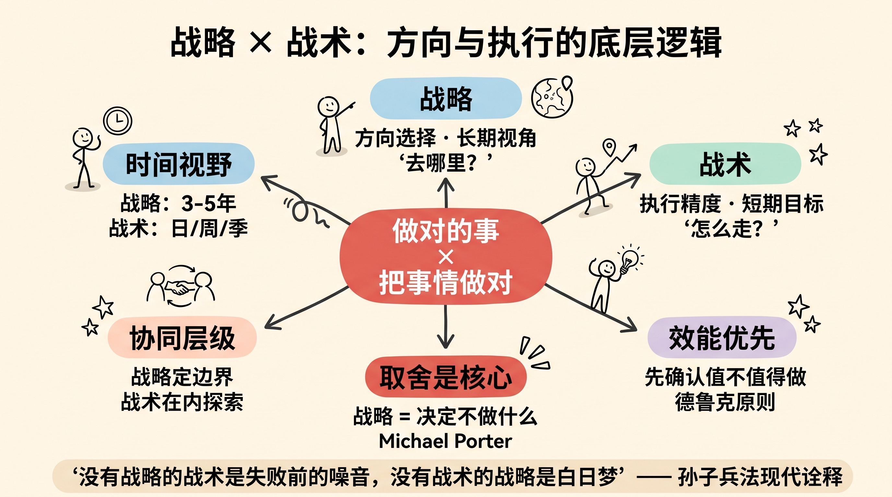
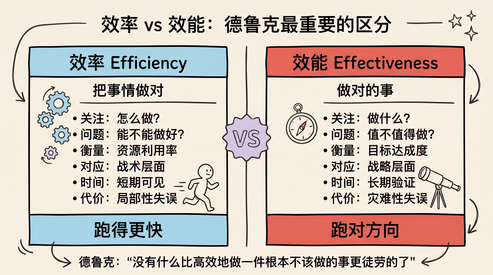
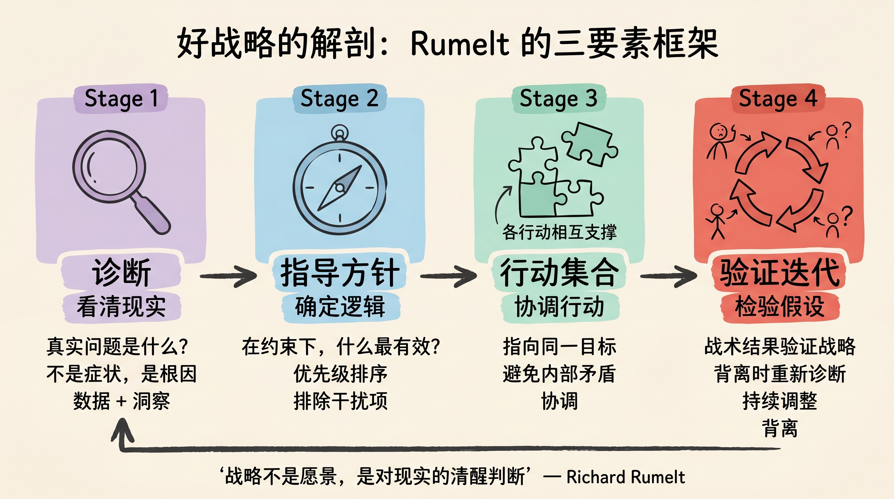
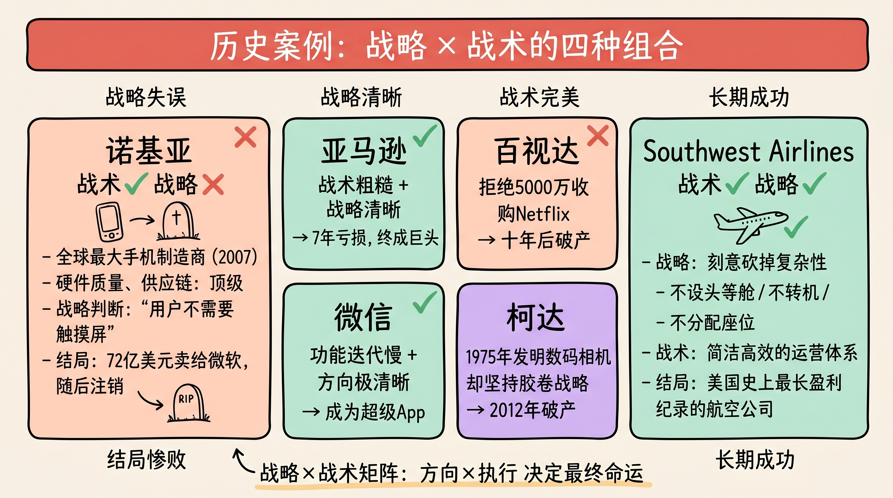
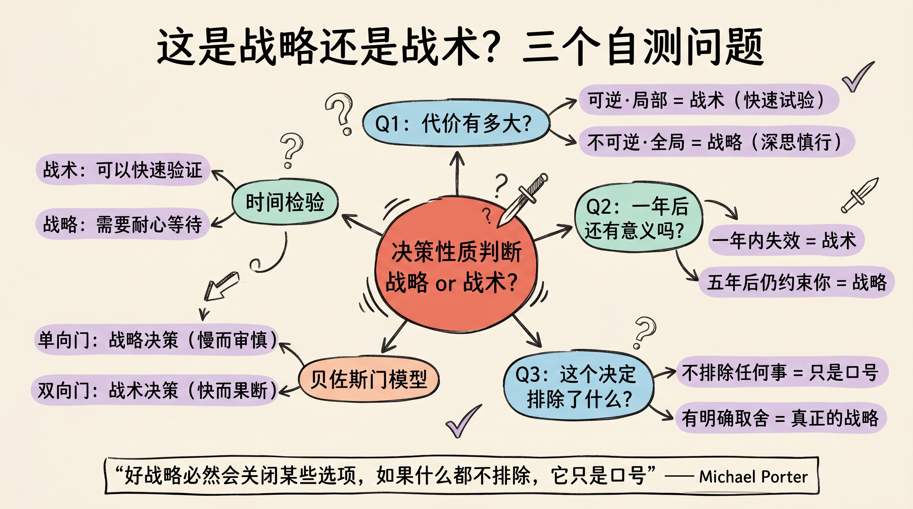
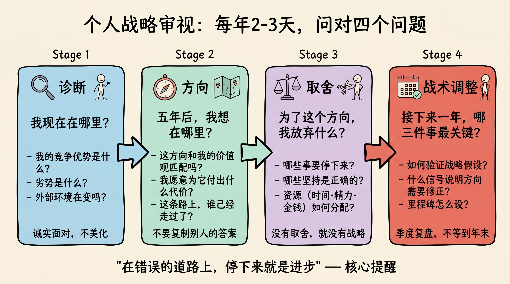

> 效率是把事情做对，效能是做对的事。没有什么比高效地做一件根本不该做的事更徒劳的了。
>
> ——彼得·德鲁克（Peter Drucker）

---

## 先讲结论

战略与战术，从来不是非此即彼的选择，而是有严格的优先级顺序：

1. **方向比速度重要**：方向错误，跑得越快，离目标越远
2. **战略失败，战术无法拯救**；战术粗糙，战略仍可胜出
3. **两者都需要**，但顺序不能颠倒——先确认方向，再谈执行

这两个词被滥用得很厉害。开会时人人都在谈"战略"，但大多数时候讲的是战术。真正的战略，是一种关于"不做什么"的决定。

---

## 一、德鲁克的区分

1967 年，德鲁克在《有效的管理者》中写下了那句被引用了半个世纪的话：

> **效率（efficiency）是把事情做对，效能（effectiveness）是做对的事。**

这两个词，中文翻译往往混用，但含义截然不同：

| | 效能（Effectiveness） | 效率（Efficiency）|
|--|--|--|
| **关注** | 做什么 | 怎么做 |
| **问题** | 这件事值不值得做？ | 这件事能不能做好？|
| **衡量** | 目标达成度 | 资源利用率 |
| **对应** | 战略 | 战术 |
| **失败代价** | 灾难性（方向全错） | 局部性（执行有缺陷）|

德鲁克的判断很清楚：效能优先于效率。但他也说，这不是说效率不重要——而是说，效率只有在效能的前提下才有意义。

用更直白的话说：**你得先确认这件事值得做，再去想怎么做好它。**

---

## 二、什么是战略？

战略（Strategy）这个词来自希腊语 *strategos*，本义是"将军的艺术"。它处理的是一个根本性问题：**我们要去哪里，为什么要去那里？**

战略有几个核心特征：

**1. 战略是关于取舍的**

迈克尔·波特（Michael Porter）在《什么是战略》中写道：

> 战略的本质是选择不做什么。

Southwest Airlines 选择不提供头等舱、不转机、不分配座位——这些"不做"，恰恰构成了它的竞争优势。它不是一家功能残缺的航空公司，而是一家刻意砍掉复杂性的低成本航空公司。

每一个"选择做"背后，都隐含着无数个"选择不做"。战略的清晰度，往往体现在"拒绝"的清晰度上。

**2. 战略必须面对现实**

好的战略不是愿景，不是口号，而是对现实的清醒判断。

Richard Rumelt 在《好战略，坏战略》中提出了战略的三要素：**诊断（diagnosis）、指导方针（guiding policy）、行动集合（coherent actions）**。

- **诊断**：当前局面的真实问题是什么？
- **指导方针**：在这个约束下，什么逻辑最有效？
- **行动集合**：哪些具体行动相互协调、指向同一目标？

缺少诊断的战略，只是美好的意愿。

**3. 战略需要时间才能验证**

战略的结果，往往在几年之后才能显现。这是它的难点：当下的判断，要等很久才能知道对不对。亚马逊在电商市场亏损了整整七年，才开始盈利——那七年的"战略"，当时在外界看来完全是在烧钱。

---

## 三、什么是战术？

战术（Tactics）处理的是另一个问题：**在既定的方向下，如何以最小的代价达到当前目标？**

战术是战略的执行层。它的特点：

- **时间跨度短**：天、周、季度
- **可测量、可迭代**：做了就有反馈，反馈之后可以调整
- **聚焦具体动作**：发这篇邮件、用这个渠道、定这个价格

战术的天然优势是**可见性**。你能看到战术是否奏效，能快速调整，能精细优化。这也是为什么大多数组织讨论战术比讨论战略更起劲——战术有明确的对错，战略往往只有"事后看来"。

但战术有一个致命的陷阱：**战术优化可以让人忘记战略问题**。

柯达（Kodak）的销售团队是一流的，分销网络覆盖全球，营销策略精准——在胶卷这个生意上，他们把每一个战术都做到了极致。但数码相机颠覆了整个行业，战术上的完美无法弥补战略上的失误：他们没有早早转向数码（尽管柯达工程师早在 1975 年就发明了数码相机）。

战术的极致是"高效地走错路"。

---

## 四、战略失败，战术不能拯救

让我们看几个典型案例，理解"方向错了，执行再好也没用"：

### 诺基亚：执行完美，方向全错

2007 年苹果发布第一代 iPhone 时，诺基亚是全球最大的手机制造商，市场份额接近 40%。它拥有全球最完善的手机供应链，最强的硬件研发团队，最广的分销网络。

但诺基亚的战略判断是：**手机是通话设备，用户不需要触摸屏**。

它的战术执行无懈可击——硬件质量、出货量、渠道铺货，都做到了顶级水准。然而战略假设从根本上就错了。2013 年，诺基亚以 72 亿美元将手机业务卖给微软，微软随后注销了这笔资产。

### 百视达：门店遍天下，互联网视而不见

2000 年，Netflix 创始人里德·哈斯廷斯拜访百视达 CEO 约翰·安蒂奥科，提议以 5000 万美元出售公司，希望合作拓展线上业务。安蒂奥科当场拒绝，甚至笑场了。

百视达的战术无可挑剔：门店选址精准，库存周转高效，会员体系完善。但它的战略判断是：**实体租碟会长期存在，网络只是补充**。

十年后，Netflix 市值超过千亿，百视达申请破产。

### 对比：亚马逊的战略正确，战术"够用即可"

亚马逊早期的网站丑陋、体验粗糙、物流缓慢。但贝索斯的战略判断极其清醒：互联网会改变零售，客户需要最广的选择和最低的价格，其他一切都是次要的。

战术可以后补，战略不能等。

---

## 五、战略正确，战术可以弥补

反过来，战略方向对了，战术的粗糙是可以修正的。

早期的 Google 界面极其简陋，Sergey Brin 和 Larry Page 对于商业化完全没有清晰计划。但他们的战略判断正确：**搜索质量是核心，信息组织是未来**。当广告模式（战术）找到之后，战略已经建立了护城河。

早期的微信也在战术上摇摆——红包功能是偶然发现的（春节前两周决定做），朋友圈最初只支持图片。但张小龙的战略判断非常清晰：**手机上的"通讯录 + 时间轴"是未来的社交核心**。战术在验证中迭代，战略始终稳定。

战术粗糙，可以迭代；战略错误，只能推倒重来。

---

## 六、如何判断自己在做战略还是战术？

实际工作中，很多人把战术问题包装成战略问题，也有人在战略层面犹豫不决，却用战术细节来逃避大问题。

一个简单的自测框架：

**问自己这三个问题：**

**Q1：如果这件事做错了，代价有多大？**
- 代价可逆、局部 → 可能是战术问题，快速试验
- 代价不可逆、全局 → 可能是战略问题，需要深思

**Q2：这个决定，一年后还有意义吗？五年后呢？**
- 一年内失效的决定 → 多数是战术
- 五年后仍然约束你的决定 → 往往是战略

**Q3：这个决定影响什么被排除在外？**
- 好战略必然会关闭某些选项
- 如果一个"战略"不排除任何事，它只是口号

贝佐斯有一个著名的"可逆/不可逆决策"框架：**单向门（one-way door）和双向门（two-way door）**。不可逆的决定像单向门，要慢而审慎；可逆的决定像双向门，要快而果断。大多数战术是双向门，大多数战略是单向门。

---

## 七、个人层面：你的生活有战略吗？

这不只是企业管理问题，它和每个人的生活紧密相关。

我们每天的忙碌，大多数是战术层面的：回邮件、开会、完成任务、解决问题。这些都是把事情做对（doing things right）。

但很少有人花时间问：**这些事情值不值得做？（doing the right things）**

一些常见的个人"战略失误"：

- **选择了一条没有出口的跑道**：行业在萎缩，技能在贬值，但每天仍在努力提升"跑得更快"的能力
- **用战术填满了战略思考的时间**：会议塞满了日历，从来没有时间想"我为什么要做这些"
- **把别人的战略当成自己的战略**：社会告诉你"好工作→存钱→买房→晋升"，但这条路未必适合你

**个人战略，本质上是回答：**

> 考虑到我拥有的资源和能力，在我能预见的未来，什么是值得长期投入的事？

这个问题没有标准答案，但必须认真想过。不想这个问题，就意味着默认接受了别人为你设定的答案。

一个实用的方法：每年花 2-3 天，做一次"个人战略审视"：

1. **诊断**：我现在在哪里？我的竞争优势是什么，劣势是什么？
2. **方向**：五年后，我想在哪里？这个方向和我的价值观匹配吗？
3. **取舍**：为了这个方向，我要放弃什么、坚守什么？
4. **战术调整**：接下来一年，哪三件事最关键？

---

## 八、战略与战术的协同

最后，一个重要的补充：战略与战术不是对立的，而是需要协同的层级系统。

好的执行者，能在战术层面发现战略盲点。前线的销售人员往往最先感知市场变化，这些信号需要向上传递，影响战略调整。

好的战略家，能把战略分解成可执行的战术。一个只存在于 PPT 里的战略等于零，必须落到具体的行动节点上。

两者协同的关键在于：

| 层面 | 核心问题 | 频率 |
|------|---------|------|
| 战略 | 我们在做正确的事吗？ | 年度/季度回顾 |
| 战术 | 我们把事情做对了吗？ | 日常执行与复盘 |
| 连接 | 战术结果是否验证了战略假设？ | 月度对齐 |

战略定义边界，战术在边界内探索最优解。当战术结果持续与战略预期背离时，要分清楚：是战术出了问题，还是战略假设本身需要修正？

---

## 总结

四个核心要点：

1. **效能优先于效率**：先确认这件事值得做，再想怎么做好。德鲁克说"高效地做不该做的事，是最大的浪费"——这句话值得反复回味。

2. **战略错误是结构性失败**：柯达、诺基亚、百视达都是"战术完美、战略失误"的经典案例。战术可以迭代，战略错了只能推倒重来。

3. **方向正确有容错空间**：亚马逊、微信早期战术粗糙，但战略清晰，给了他们足够的迭代空间。好的战略像一块磁铁，把分散的战术行动吸附成合力。

4. **个人生活同样需要战略**：每年花时间想"我在做对的事吗"，而不只是"我怎么把事情做得更好"。这个问题，大多数人逃避了一辈子。

> 在错误的道路上，停下来就是进步。

---

## 参考阅读

- 彼得·德鲁克，《有效的管理者》（The Effective Executive, 1967）
- 迈克尔·波特，[《什么是战略》](https://hbr.org/1996/11/what-is-strategy)（What Is Strategy?, HBR 1996）
- Richard Rumelt，《好战略，坏战略》（Good Strategy Bad Strategy, 2011）
- 杰夫·贝索斯，[亚马逊股东信合集](https://ir.aboutamazon.com/annual-reports-proxies-and-shareholder-letters/)（1997–2020）
- Roger Martin，《整合性思维》（The Opposable Mind, 2007）

---

> 本文是个人对战略与战术这对概念的梳理与延伸思考，结合商业案例和个人成长视角，欢迎讨论。
