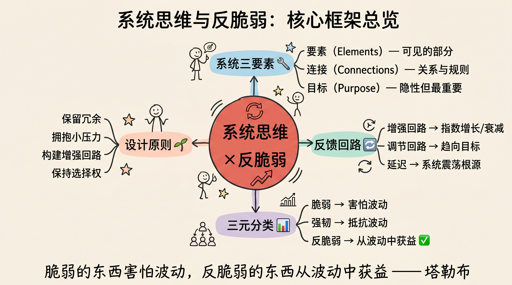
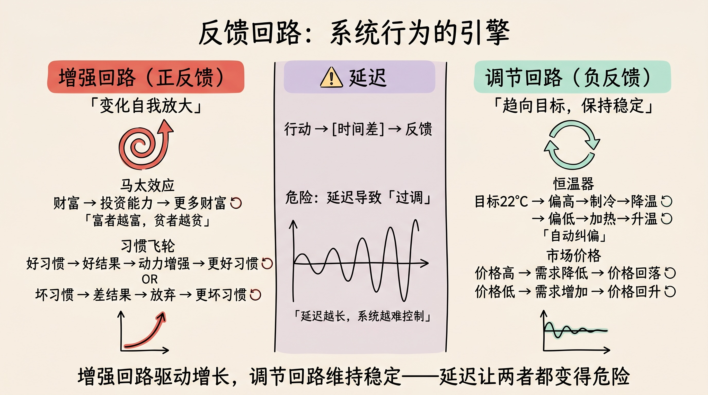
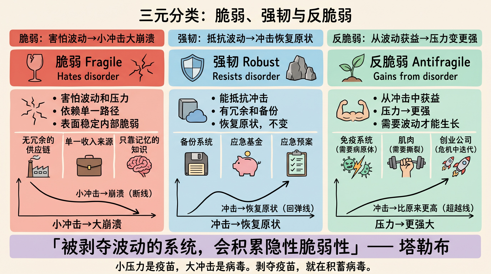
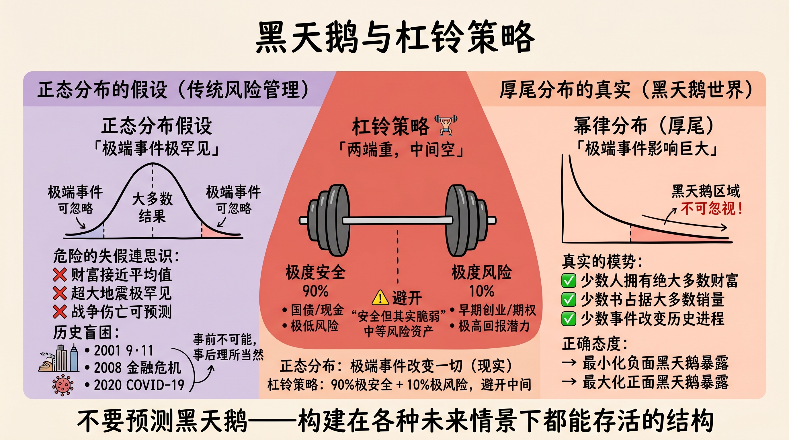
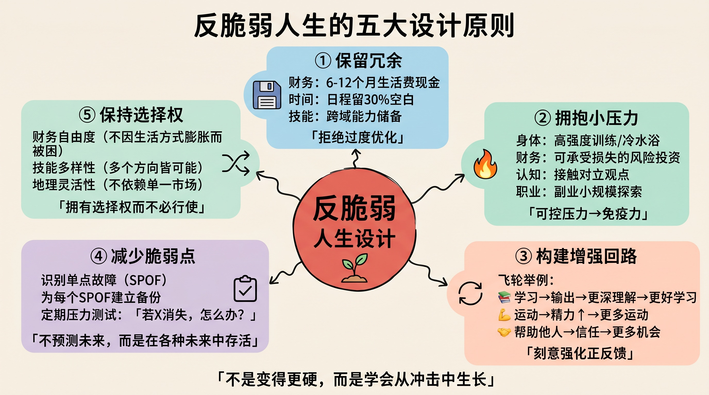
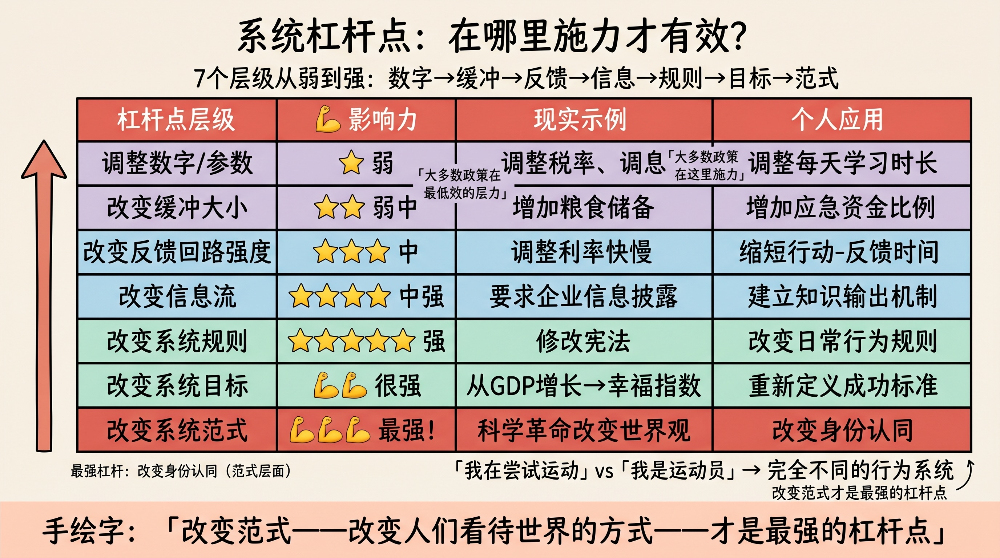

> 风不会折断柔韧的芦苇，却能摧毁坚硬的橡树。反脆弱，不是变得更硬，而是学会从冲击中生长。
>
> —— 纳西姆·尼古拉斯·塔勒布《反脆弱》

---

## 先讲结论

大多数人的目标是"稳定"——避免波动，规避风险，追求确定性。但这恰恰是最危险的状态。

纳西姆·塔勒布在《反脆弱》中提出了一个颠覆性洞见：

> **世界上的事物分为三类：脆弱（Fragile）、强韧（Robust）、反脆弱（Antifragile）。脆弱的东西害怕波动，强韧的东西不受波动影响，而反脆弱的东西从波动中获益。**

但仅有"反脆弱"的概念还不够——你需要**系统思维**来理解为什么某些系统会脆弱、为什么另一些能从混乱中涌现出新的秩序。

两者结合，才能回答那个最关键的问题：**如何设计一个在不确定性中越来越强大的人生？**

---

## 一、什么是系统思维

### 系统的三要素

系统思维的核心，是把世界看作**相互连接的整体**，而非孤立的部分。

任何系统都由三个要素构成：

1. **要素（Elements）**：系统中可见的部分——树木、员工、器官
2. **连接（Connections）**：要素之间的关系——信息流、物质流、规则
3. **功能/目标（Function/Purpose）**：系统存在的目的——往往是隐性的，也是最重要的

**关键洞见**：改变要素，对系统影响最小；改变连接和目标，才能真正改变系统行为。

举个例子：一家公司换掉全部员工（改变要素），但保留原有的激励机制和文化（保留连接和目标），公司行为几乎不会改变。反过来，改变激励结构（改变连接），即使人没变，行为也会彻底不同。

### 整体大于部分之和

系统最重要的特性，是**涌现（Emergence）**——系统整体表现出的性质，是各部分单独所没有的。

- 单个神经元不会思考，但 860 亿个神经元连接在一起，产生了意识
- 单个蚂蚁没有智能，但蚁群能解决复杂的优化问题
- 单个音符没有意义，但音符的序列产生了音乐

这意味着：**你无法通过研究部分来完全理解整体**。这正是还原论（Reductionism）的局限——它擅长分析，但不擅长理解复杂性。

### 线性思维 vs 系统思维

| 线性思维 | 系统思维 |
|---------|---------|
| 原因 → 结果 | 原因 ⇄ 结果（互为因果）|
| 孤立看问题 | 看关系和结构 |
| 短期最优 | 长期动态 |
| 寻找单一原因 | 理解多重反馈 |
| 预测和控制 | 适应和引导 |

---

## 二、反馈回路：系统行为的引擎

系统思维中最关键的概念，是**反馈回路（Feedback Loop）**。它解释了为什么系统会自我强化或自我调节。

### 增强回路（Reinforcing Loop）

增强回路是系统中的**正反馈**——变化会自我放大。

**经典案例：马太效应**

> 富者越富，贫者越贫。

这不是道德判断，而是系统结构：

- 财富 → 投资能力 → 更多财富 → 更强投资能力 → ……

增强回路的特征：**指数增长或指数衰减**。它解释了：
- 为什么好公司越来越强（品牌、用户、数据的飞轮效应）
- 为什么坏习惯越来越深（负面情绪 → 放弃努力 → 更差结果 → 更负面情绪）
- 为什么人口爆炸，也解释了人口崩溃

### 调节回路（Balancing Loop）

调节回路是**负反馈**——系统趋向某个目标，偏离时自动纠正。

**经典案例：恒温器**

- 目标温度：22°C
- 实际温度高于 22°C → 制冷启动 → 温度降低 → 制冷停止
- 实际温度低于 22°C → 加热启动 → 温度升高 → 加热停止

调节回路让系统保持稳定。人体体温调节、市场价格机制、生态系统捕食者-猎物关系，都是调节回路。

**关键：延迟（Delay）**

调节回路中最危险的因素是**延迟**——从行动到反馈的时间差。

延迟导致"过调"（Overshoot）：
- 你觉得冷，把暖气开到最大 → 等到暖气效果出来，已经太热了
- 公司扩张 → 大量招聘 → 市场饱和 → 裁员 → 能力不足 → 再招聘

**延迟越长，系统越难控制，越容易震荡。**

---

## 三、脆弱、强韧与反脆弱

### 三种系统的本质差异

现在我们可以用系统思维来理解塔勒布的三元分类：

**脆弱（Fragile）**：系统对波动极度敏感，小冲击可能导致崩溃。

特征：
- 高度依赖单一路径
- 反馈回路被抑制（人为"维稳"）
- 表面稳定，内部脆弱

案例：过度优化的供应链（只为效率，无冗余）、单一收入来源的个人财务、只靠记忆的知识体系

**强韧（Robust）**：能抵抗冲击，恢复原状。

特征：
- 有冗余设计
- 对小波动免疫
- 但不能从波动中获益

案例：备份系统、保险、应急预案

**反脆弱（Antifragile）**：从冲击和波动中**获益**，变得更强。

特征：
- 有增强回路将压力转化为成长
- 在不确定性下表现更好
- 需要波动才能茁壮生长

案例：免疫系统（需要病原体才能变强）、肌肉（需要撕裂才能生长）、创业公司（危机中的快速迭代）

### 塔勒布的核心命题

> **被剥夺波动的系统，会积累隐性脆弱性。**

这是最反直觉的洞见：过于稳定的系统，反而最危险。

- 森林中人为禁止小规模山火 → 可燃物积累 → 最终一场大火毁灭一切
- 央行平滑经济波动 → 风险积累在金融系统深处 → 2008 年金融危机
- 过度保护孩子不受挫折 → 成年后完全无法应对失败

**小压力是疫苗，大冲击是病毒。剥夺疫苗，就在积蓄病毒。**

---

## 四、黑天鹅与厚尾分布

### 为什么我们总是被意外击中

传统风险管理假设世界服从**正态分布**（高斯分布）：极端事件概率极低，可以忽略。

但现实世界中，许多重要现象服从**幂律分布（厚尾分布）**：

| 现象 | 正态分布假设 | 真实分布 |
|------|------------|---------|
| 财富分布 | 大多数人接近平均值 | 少数人拥有绝大多数财富 |
| 地震频率 | 极大地震极罕见 | 8级地震比预测频繁得多 |
| 战争伤亡 | 没有"超级战争" | 二战改变了所有统计 |
| 图书销量 | 销量接近平均 | 极少数书占据大多数销量 |

**黑天鹅事件**（Black Swan）：极度罕见、影响巨大、事后可以解释但事前无法预测的事件。

1. 2001 年 9·11
2. 2008 年金融危机
3. 2020 年 COVID-19

这些事件有一个共同点：事前被认为"不可能发生"，事后被认为"理所当然"。

### 对黑天鹅的正确态度

塔勒布的答案不是"预测黑天鹅"——这几乎不可能。而是：

> **构建对负面黑天鹅的暴露最小化，同时对正面黑天鹅的暴露最大化。**

实操：**杠铃策略（Barbell Strategy）**

- 90% 资源放在极度安全的地方（国债、现金）
- 10% 资源放在极度高风险/高回报的地方（早期创业、期权）
- 避开中间地带（"安全但其实脆弱"的资产）

---

## 五、如何设计反脆弱的人生

系统思维告诉我们结构决定行为；反脆弱告诉我们好的结构应该从压力中获益。两者合一，给出了设计人生的五个原则：

### 原则一：保留冗余，拒绝过度优化

效率的对立面不是浪费，而是**韧性**。

- 财务：保留 6-12 个月生活费的现金，即便"低效"
- 时间：日程不要排满，留出空白用于意外和机会
- 技能：不要只深耕一个专业，保留跨域能力

> 冗余看起来低效，却是系统对抗不确定性的最基本武器。

### 原则二：拥抱小压力，避免大冲击

主动暴露在可控的小压力下，积累抗脆弱能力：

- 身体：间歇性断食、高强度训练、冷水浴——通过可控压力激活修复机制
- 财务：用能承受损失的金额投资高风险资产
- 认知：主动接触与自己观点相反的论点
- 职业：在稳定工作的同时，做小规模副业探索

### 原则三：构建增强回路，利用复利

识别生活中的正反馈结构，刻意强化它：

- **学习飞轮**：学习 → 输出（写作/教学）→ 更深理解 → 更好学习
- **健康飞轮**：运动 → 精力提升 → 更多运动能力 → 更规律运动
- **人脉飞轮**：真诚帮助他人 → 信任积累 → 更多机会 → 更有能力帮助

### 原则四：减少脆弱点，不追求完美预测

不需要预测未来，只需要让自己在各种未来情景下都能存活：

- 识别"单点故障"（Single Point of Failure）：收入来源、关键人脉、核心技能
- 为每个单点故障建立备份或替代方案
- 定期进行"压力测试"：如果 X 消失了，我怎么办？

### 原则五：保持选择权（Optionality）

> **拥有选择权而不必行使，远好过被迫行使某个选择。**

- 保持财务自由度：不要因为生活方式膨胀而失去离开不满工作的能力
- 保持技能多样性：让多个方向都成为可能，而不是把所有赌注押在一条路
- 保持地理灵活性：不依赖单一城市、单一市场

---

## 六、系统思维在实践中的应用

### 识别杠杆点：改变系统的关键位置

系统学家唐内拉·梅多斯（Donella Meadows）在《系统之美》中列出了干预系统的**杠杆点**，从低到高：

| 杠杆点 | 影响力 | 示例 |
|-------|-------|------|
| 调整数字（税率、参数） | 弱 | 提高最低工资 |
| 改变缓冲大小 | 中弱 | 增加粮食储备 |
| 改变反馈回路强度 | 中 | 调整利率 |
| 改变信息流 | 中强 | 要求企业信息披露 |
| 改变系统规则 | 强 | 修改宪法 |
| 改变系统目标 | 很强 | 从 GDP 增长转向幸福指数 |
| 改变系统范式 | 最强 | 改变人们的基本信念 |

**实践含义**：大多数政策干预在最低效的杠杆点（调整数字）上使力，而真正的变革来自改变范式——改变人们看待世界的方式。

对个人同样如此：调整习惯（数字层面），不如改变身份认同（范式层面）。

> "我在尝试运动"和"我是一个运动员"，会驱动完全不同的行为系统。

### 避免系统陷阱

梅多斯还描述了系统中常见的"陷阱"：

**公地悲剧（Tragedy of the Commons）**
- 共享资源在个人短期利益驱动下被耗尽
- 应对：建立产权或社区规则

**政策阻力（Policy Resistance）**
- 系统中各方利益相互抵消，政策效果归零
- 应对：找到系统各方的共同目标

**竞争升级（Escalation）**
- 两方互相响应对方的行动，螺旋式升级
- 应对：单方面降级，打破增强回路

---

## 总结：成为系统的设计者，而非受害者

1. **用系统眼光看世界**：寻找连接和反馈回路，而非孤立的因果
2. **理解脆弱的根源**：过度优化、人为稳定、延迟反馈——这些让系统脆弱
3. **主动设计反脆弱**：冗余、小压力暴露、增强回路、选择权
4. **在杠杆点施力**：改变目标和范式，比调整参数有效 100 倍

> 世界不是一台可以预测和控制的机器，而是一个充满反馈、延迟和涌现的复杂系统。系统思维不给你确定性，但给你在不确定中生存和繁荣的能力。

---

**参考阅读**：

- Taleb, N. N. (2012). *Antifragile: Things That Gain from Disorder*
- Meadows, D. H. (2008). *Thinking in Systems: A Primer*
- Taleb, N. N. (2007). *The Black Swan*
- Senge, P. (1990). *The Fifth Discipline*
