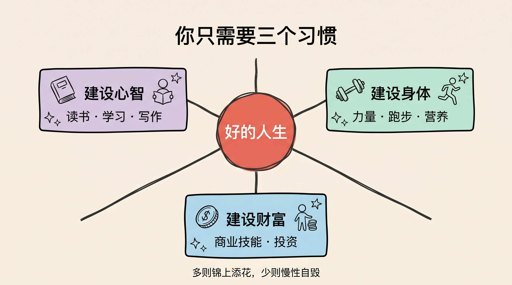
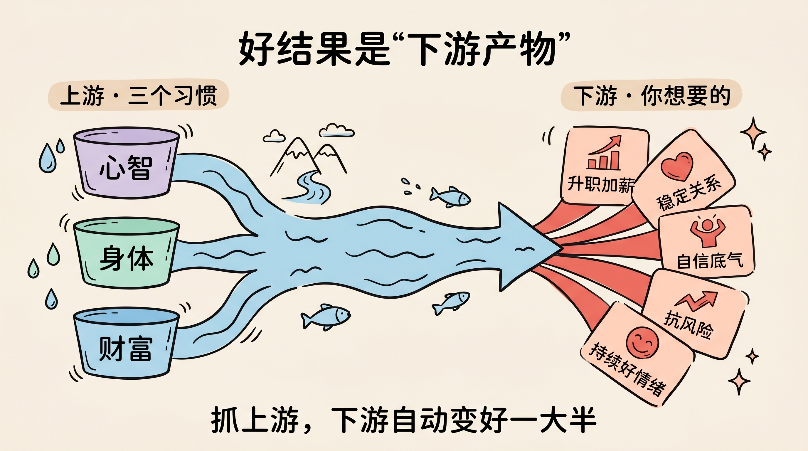
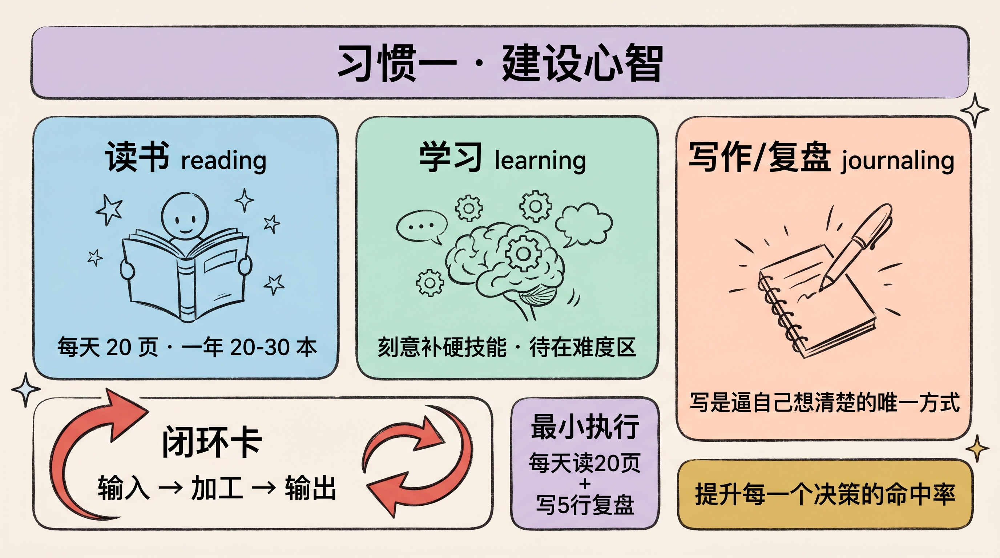
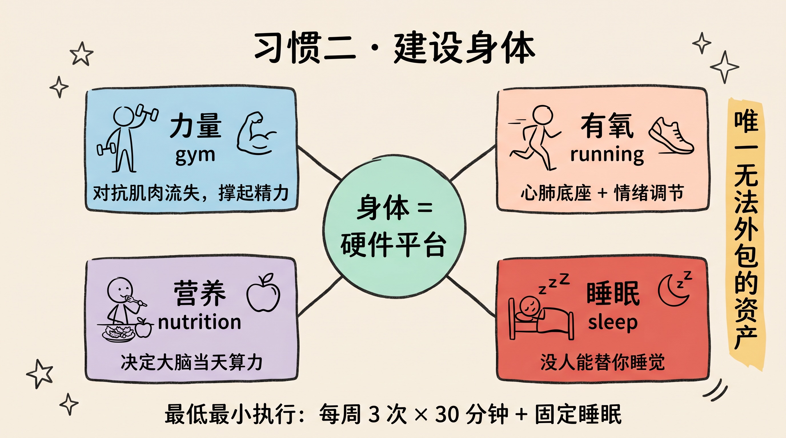
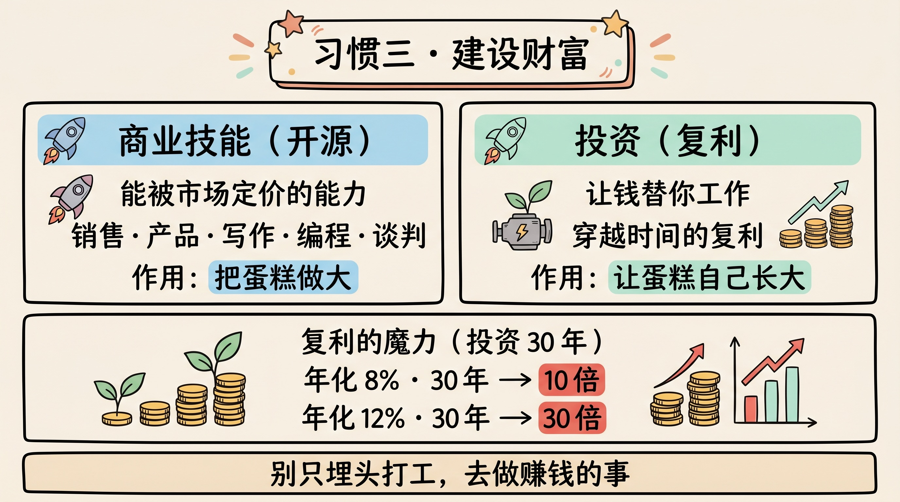
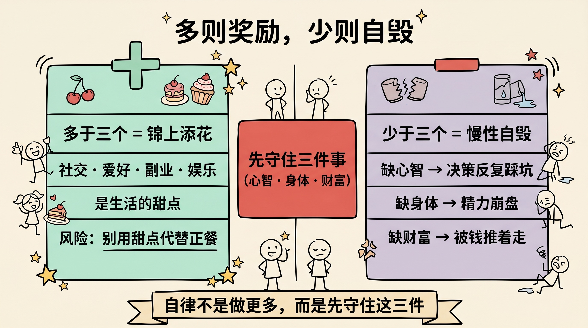

> 你其实只需要三个习惯：一个建设心智，一个建设身体，一个建设财富。人生大部分美好，都是这三件事的下游。多出来的是 bonus，缺失的是自毁。

---

## 先讲结论

1. **人生的好结果是"下游产物"**——事业、关系、自信、安全感，几乎都流淌自三个上游：心智、身体、财富。
2. **只需要三个习惯，各守一个上游**：建设心智（读书、学习、写作）、建设身体（运动、跑步、营养）、建设财富（商业技能、投资）。
3. **多则锦上添花，少则慢性自毁**。超出这三个的努力是奖励；连这三个都缺，损耗会沿着下游蔓延到一切。

---

## 一、为什么是三个：上游与下游

我们常常在"下游"焦虑：升不了职、关系紧张、对未来没底、提不起劲。然后我们试图直接修理这些下游结果——换工作、读情感攻略、刷成功学。但下游的浑浊，往往源自上游的污染。

> 一条河的下游是否清澈，取决于它的几个源头。

人生的"源头"其实就三个：

- **心智**：你怎么思考、怎么学习、怎么理解世界——决定了你做决策的质量。
- **身体**：你的精力、情绪、专注力的物理基础——决定了你能不能持续输出。
- **财富**：你的选择权和抗风险能力——决定了你能不能不被生活推着走。

几乎所有"好东西"都是这三者的下游产物：

| 你想要的（下游） | 真正的上游 |
|----------------|-----------|
| 升职、加薪、被尊重 | 心智 + 财富技能 |
| 稳定的亲密关系 | 身体状态 + 情绪 + 安全感 |
| 自信、底气 | 三者皆备 |
| 抵御黑天鹅 | 财富 + 身体 |
| 持续的好情绪 | 身体（睡眠/运动）打底 |

抓住三个上游，下游会**自动**变好一大半；死磕某个下游，常常是在污染的水里反复打捞。

---

## 二、建设心智：reading / learning / journaling

心智习惯，是把"输入—消化—输出"跑成一个闭环。

- **读书（reading）**：用低成本接入人类最好的头脑。每天 20 页，一年就是 7000 多页，约 20–30 本书。
- **学习（learning）**：刻意补齐你领域里的硬技能，主动制造"不舒服"的难度区。
- **写作 / 复盘（journaling）**：写是逼自己想清楚的唯一方式。没写下来的"想通了"，大多是错觉。

> 读书是输入，学习是加工，写作是输出与固化。三者缺一，闭环就漏。

心智的复利最隐蔽也最巨大：它不直接产出金钱，却**提升你每一个决策的命中率**。而人生是由决策串起来的——决策质量提高 10%，长期结果可能是数量级的差距。

**最小执行**：每天读 20 页 + 每天写 5 行复盘（今天学到什么、哪里做错了）。

---

## 三、建设身体：gym / running / nutrition

身体是你所有事业的"硬件平台"。CPU 再好，电源不稳，照样宕机。

- **力量（gym）**：对抗年龄带来的肌肉流失，撑起一天的精力与代谢。
- **有氧（running）**：心肺是耐力的底座，也是最快的情绪调节器之一。
- **营养与睡眠（nutrition + sleep）**：吃什么、睡多久，直接决定你大脑当天的算力。

很多人把健康当成"等有空再说"的事，但身体是**唯一会持续贬值、且无法外包**的资产。心智和财富可以借助工具、团队放大，身体不行——没人能替你睡觉、替你扛病。

> 身体不是三件事里的一件，它是另外两件能否兑现的前提。

**最小执行**：每周 3 次、每次 30 分钟的运动 + 固定睡眠时间。先求"不断"，再求强度。

---

## 四、建设财富：business skill / investing

这里要先纠一个常见误区：**建设财富 ≠ 拼命打工**。

财富习惯有两条腿：

1. **商业技能（business skill development）**：能创造价值并被市场定价的能力——销售、产品、写作、编程、运营、谈判。这是你的"赚钱发动机"。
2. **投资（investing）**：让已有的钱替你工作，靠复利穿越时间。这是你的"睡后收入管道"。

注意两者的分工：商业技能负责**把蛋糕做大**（开源），投资负责**让蛋糕自己长大**（复利）。只会打工不发展技能，收入天花板很低；只存钱不投资，通胀会慢慢吃掉购买力。

> 为了赚钱，就去做那件直接产生财富的事；把全部精力押在一份低天花板的工作上，是舍本逐末。

复利的魔力在于时间：

| 年化 | 10 年 | 20 年 | 30 年 |
|------|-------|-------|-------|
| 8% | 2.16× | 4.66× | 10.06× |
| 12% | 3.11× | 9.65× | 29.96× |

**最小执行**：每月固定投入一项可复利资产 + 每季度精进一个可被定价的硬技能。

---

## 五、多则奖励，少则自毁

原话里最锋利的一句是：

> anything more than them is a bonus, and anything less is self-destructive.

这句话给了我们一把"做减法"的尺子。

**少于三个 = 慢性自毁。** 缺了任意一个上游，损耗会顺流而下：

- 缺心智 → 决策反复踩坑，努力被低质量选择抵消。
- 缺身体 → 精力崩盘，再好的计划也执行不下去。
- 缺财富 → 被钱推着走，丧失对人生的选择权。

**多于三个 = 锦上添花。** 社交、爱好、副业、娱乐……它们是 bonus，是生活的甜点。问题不在于享受甜点，而在于**用甜点代替正餐**：当你把刷手机、无效社交、为焦虑而焦虑放在三件正事之前，本末就倒了。

所以真正的自律不是"做更多"，而是**先守住这三件，再谈其它**。把有限的意志力优先浇灌三个上游，剩下的精力随意挥霍也无妨。

---

## 总结

1. **好结果是下游产物**：抓住心智、身体、财富三个上游，人生大半会自动顺起来。
2. **三个习惯，各守一源**：读书学习写作建心智，运动跑步营养建身体，商业技能加投资建财富。
3. **身体是前提**：它是唯一无法外包、持续贬值的资产，是另两件能否兑现的硬件。
4. **先守底线，再谈加法**：少于三件是慢性自毁，多于三件才是奖励——别用甜点代替正餐。

> 不必追求一百个习惯。守住这三个，你已经赢过了大多数在下游打捞的人。

---

**参考阅读**：

- 詹姆斯·克利尔《掌控习惯》（Atomic Habits）——习惯如何复利
- 纳瓦尔《纳瓦尔宝典》——关于财富、健康与心智的杠杆
- 安德斯·艾利克森《刻意练习》——心智与技能的成长机制
