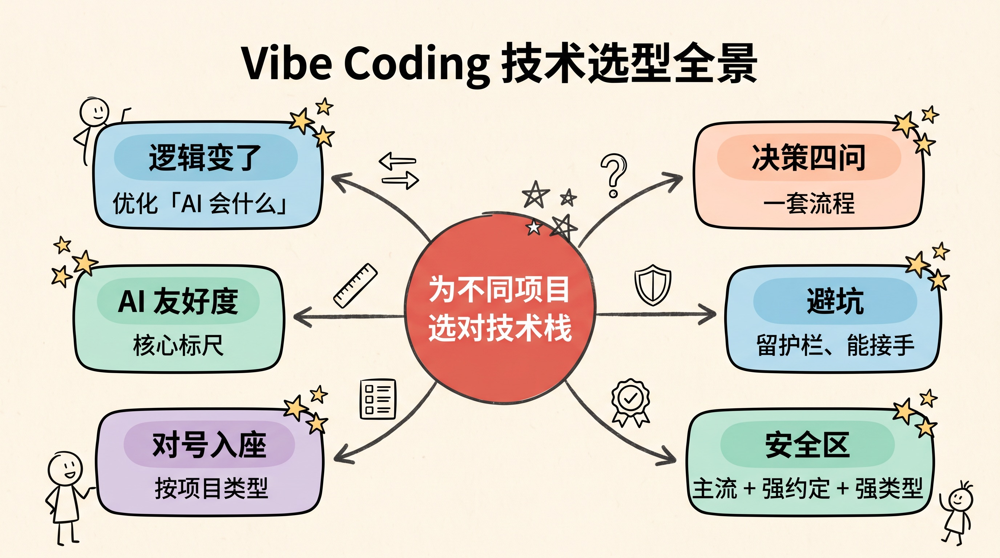
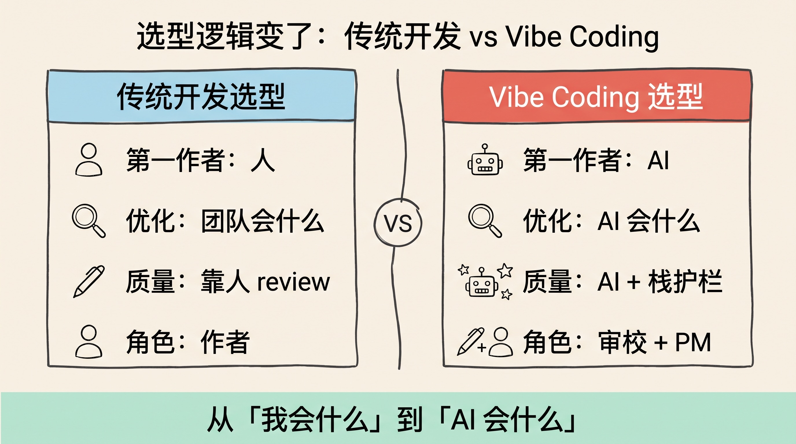
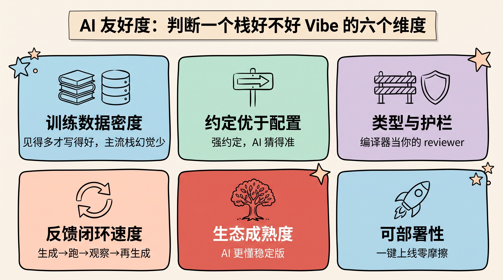
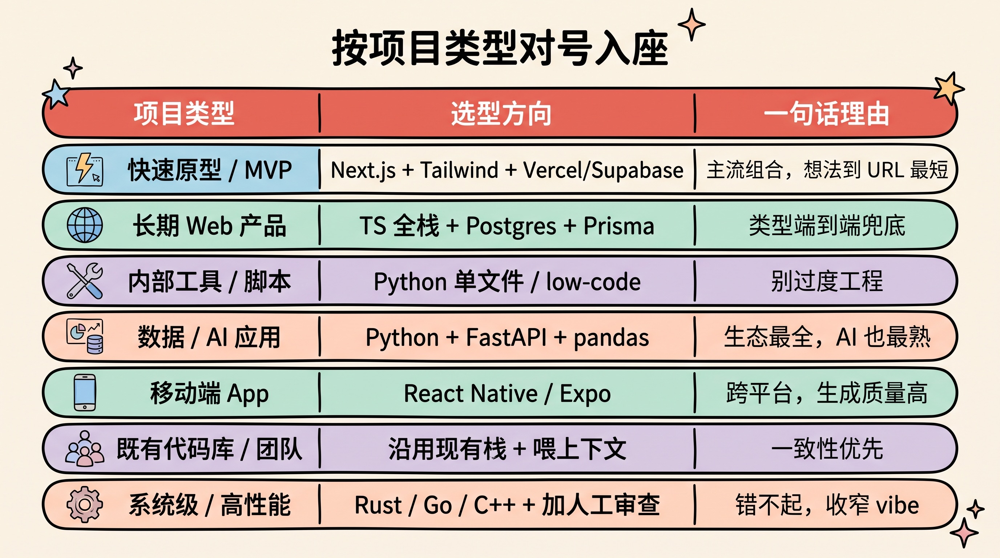
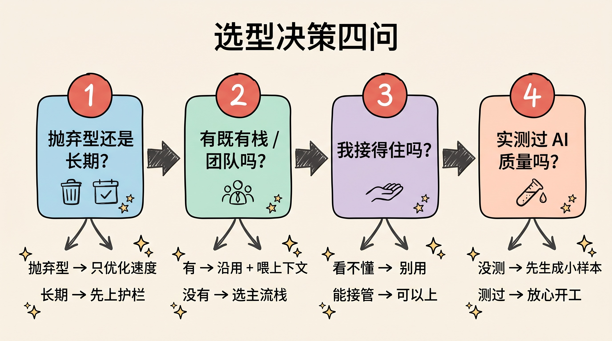
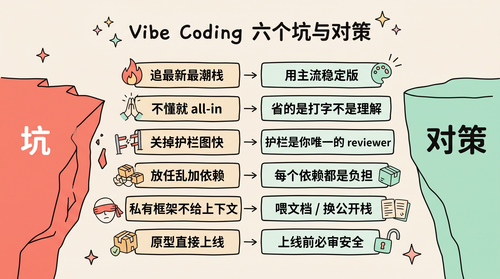

> 传统选型问的是"我会什么"，vibe coding 选型还要问"AI 会什么、栈能替我兜住什么"。当代码的第一作者变成 AI，选栈的逻辑就变了。

---

## 先讲结论

1. **Vibe coding 让"AI 友好度"成了选型的第一约束。** 你把逐行 review 换成了信任 vibe，那栈本身就得替你兜底——AI 在这个栈上写得好不好、错了谁来接住，直接决定你要返多少工。
2. **没有万能栈，只有匹配项目诉求的栈。** 抛弃型原型、长期产品、内部脚本、数据/AI 应用、移动端、既有系统，六类项目对"速度、护栏、生态"的权重完全不同，不能一套栈打天下。
3. **主流 + 强约定 + 强类型 = vibe coding 的安全区。** 训练数据越密、约定越强、类型护栏越硬，AI 生成的质量下限就越高，你需要人工兜底的部分就越少。

---

## 一、Vibe coding 为什么改变了选型逻辑

Andrej Karpathy 提出 vibe coding 时描述的状态是：用自然语言说出意图，让 AI 把代码生成出来，"give in to the vibes"，很多时候甚至不逐行去读它写了什么。这在快速原型里非常爽——但它悄悄改了一件事：**代码的第一生产者，从你变成了 AI。**

传统选型基本围绕"人"来问三个问题：

- 团队会不会这个栈？
- 好不好招到人？
- 长期好不好维护？

这些问题依然重要。但当第一个写代码的"人"是 AI 时，选型就多出了两条以前不存在的约束：

- **AI 在这个栈上生成的质量如何？** 这决定了你要返多少工、来回多少轮。
- **当你不逐行看时，谁来接住 AI 的错？** 这决定了 bug 会不会悄悄溜进生产环境。

你的角色也从"作者"变成了"审校 + 产品经理"。既然你放弃了逐行把关，就必须让别的东西来把关——要么是 AI 生成质量本身足够高（训练数据密、约定强），要么是栈的护栏足够硬（类型、编译器、测试）。

| 维度 | 传统开发选型 | Vibe coding 选型 |
|------|-------------|-----------------|
| 第一作者 | 人 | AI |
| 优化目标 | 团队会什么、好不好招人 | AI 会什么、栈能兜住什么 |
| 质量来源 | 人逐行 review | AI 生成质量 + 栈的护栏 |
| 冷门栈代价 | 招人难、文档少 | AI 幻觉多、错还没人接住 |
| 你的角色 | 作者 | 审校 + 产品经理 |

一句话总结：**传统选型优化"我会什么"，vibe coding 选型还要优化"AI 会什么、栈能替我兜住什么"。**

---

## 二、AI 友好度：vibe coding 选型的核心标尺

既然多了"AI 会什么、栈能兜住什么"这条约束，就需要一把尺子来量。我把它拆成六个可判断的维度——**AI 友好度**。

**1. 训练数据密度。** AI 本质是概率模型，见得多才写得好。React、Next.js、Python、Postgres、Tailwind 这类"GitHub 上有海量代码"的主流栈，AI 生成质量高、幻觉少；冷门框架或上周才发布的库，AI 容易编造不存在的 API、用上过时的写法。

**2. 约定优于配置。** 强约定的框架（Next.js、Rails、Django）往往"只有一种正确写法"，AI 猜得准，产出也一致；极度灵活、什么都能自定义的栈会给 AI 太多自由度，同一个项目里冒出五种风格，越写越乱。

**3. 类型与护栏。** 你不逐行读代码，就得让编译器、类型系统、lint、schema 校验来当你的 reviewer。TypeScript 明显优于 JavaScript；带类型和数据校验的栈能在 AI 犯错的当场就报红，而不是等到线上炸了才发现。

**4. 反馈闭环速度。** Vibe coding 是"生成 → 跑 → 观察 → 再生成"的循环。热重载、快测试、清晰报错，让这个循环转得越快越顺；报错信息清晰的栈还有个隐藏好处——AI 能读着错误信息自己把 bug 修了。

**5. 生态成熟度。** 稳定的 API、少 breaking change、完善的文档。别忘了 AI 有知识截止日期，它更懂"去年的稳定版"，而不是"上周的 beta"。选成熟栈，等于选一个 AI 已经学透了的对象。

**6. 可部署性。** 一键部署（Vercel、Netlify、Railway、Cloudflare）让"能在本地跑"到"挂上公网"几乎零摩擦。对原型和 MVP 来说，这一条常常比什么都重要。

> 记住这六个词：**数据密、约定强、护栏硬、反馈快、生态稳、部署易。** 越靠近这六个词的栈，越是 vibe coding 的安全区。

---

## 三、按项目类型对号入座

AI 友好度是通用标尺，但不同项目对它各个维度的权重差别极大。下面这张表是我常用的"对号入座"清单——先认清你在做哪一类项目，再往里套栈。

| 项目类型 | 首要诉求 | 选型方向 | 一句话理由 |
|---------|---------|---------|-----------|
| 快速原型 / MVP / Demo | 速度 + 一键上线 | Next.js + Tailwind + Supabase/Vercel（或 v0、Bolt 这类） | 全是 AI 最熟的主流组合，想法到 URL 路径最短 |
| 面向用户的长期 Web 产品 | 可维护 + 类型安全 | TypeScript 全栈（Next.js / Remix）+ Postgres + Prisma/Drizzle | 类型端到端兜底，AI 改一处不容易连累别处 |
| 内部工具 / 自动化脚本 | 写得快 + 依赖少 | Python 单文件 / 小脚本，或直接 low-code | 一次性的东西别过度工程，能跑就行 |
| 数据 / AI 应用 | 库生态丰富 | Python（FastAPI + pandas + 你的 LLM SDK） | 数据与 AI 的轮子几乎都在 Python，AI 也最熟这套 |
| 移动端 App | 跨平台 + AI 熟悉度 | React Native / Expo（Flutter 次之） | Expo 一套代码双端、社区样例多，生成质量比原生高 |
| 有既有代码库 / 团队 | 一致性 | 沿用团队现有栈，别为讨好 AI 换栈 | 一致性 > AI 友好度，喂上下文比换栈划算 |
| 系统级 / 高性能 | 正确性 + 性能 | Rust / Go / C++，但大幅提高人工审查比例 | 错了代价高，vibe 的部分要收窄，回到"AI 辅助"而非"AI 主导" |

这张表最想传达的一点是：**"抛弃型原型"和"长期产品"是两个物种。** 前者只需要跑得起来、能演示，选最主流的组合、把速度拉满就行，代码丑一点无所谓；后者要活好几年、要被后人接手，护栏和可维护性必须提到第一位。用做原型的心态选长期产品的栈，或者反过来，都会很痛。

---

## 四、一个可复用的四问决策框架

把上面的判断固化成流程，我每次开新项目都会顺序问自己四个问题：

**第一问：这是抛弃型原型，还是要长期维护的东西？**
抛弃型 → 只优化速度，随便挑一套主流栈配一键部署即可。长期 → 立刻把护栏（类型、测试）和可维护性提到第一优先级，慢一点也值。

**第二问：有没有既有代码库或团队约定？**
有 → 沿用，别换栈。给 AI 喂上下文（rules 文件、把关键文档拖进对话、用 MCP 接入内部知识），比为了讨好 AI 而换栈划算得多。没有 → 在"AI 最熟的主流栈"里选。

**第三问：AI 卡住时，我能不能接手这个栈？**
Vibe coding 有个著名的"最后 30% 问题"——AI 能带你飞快地完成前 70%，但收尾、调诡异的 bug、性能优化、上线，往往需要人接管。如果你完全看不懂它写了什么，这个项目就会卡死在 90%。**看不懂的栈，别用。**

**第四问：这个栈的 AI 生成质量，我实测过吗？**
没实测过 → 先花十分钟让 AI 在这个栈上生成一个小样本，亲眼看看幻觉多不多、写法新不新。别在一个大项目里，去赌一个你从没验证过 AI 表现的栈。

> 这四问是有顺序的：先定"抛弃还是长期"，再看"有没有既有栈"，然后确认"我接得住吗"，最后"实测一下"。前一问的答案会直接收窄后一问的选项。

---

## 五、避坑指南

最后是几个我踩过或见过别人踩的坑，每个都配一条对策。

**坑 1：追最新最潮的栈。**
→ 对策：让 AI 写它知识截止日期之后才发布的东西，它会一本正经地编 API。主流稳定版才是安全区，尝鲜留给你自己手写的部分。

**坑 2：完全不懂就 all-in，把 vibe coding 当成"不用学习"。**
→ 对策：Vibe coding 省的是打字，不是理解。你至少要能读懂产出、能在 AI 卡住时接管。否则你不是在开发，是在祈祷。

**坑 3：为图快关掉护栏（用 JS 不用 TS、不写测试）。**
→ 对策：你已经放弃逐行 review 了，护栏就是你唯一的 reviewer。越是 vibe，越要把类型和测试留着——这时候删护栏，等于把最后一道防线也拆了。

**坑 4：放任 AI 疯狂加依赖。**
→ 对策：每个依赖都是维护负担和潜在攻击面。让 AI 加包之前先说清楚"为什么需要它、有没有更轻的办法"。

**坑 5：让 AI 用它不懂的私有/内部框架，还不给上下文。**
→ 对策：喂文档、用 rules 文件或 MCP 把内部约定灌进去；实在喂不动，就换成它熟的公开栈。别让它对着空气瞎猜。

**坑 6：原型直接上线，不审安全。**
→ 对策：Vibe coded 应用最常见的问题就是硬编码 key、缺鉴权、SQL 注入。上线前务必人工过一遍安全——这部分永远不能 vibe。

---

## 总结

1. **Vibe coding 多了一条选型第一约束：AI 友好度。** 传统看"我会什么"，现在还要看"AI 会什么、栈能替我兜住什么"。
2. **AI 友好度 = 数据密 + 约定强 + 护栏硬 + 反馈快 + 生态稳 + 部署易。** 主流 + 强约定 + 强类型，就是安全区。
3. **没有万能栈，只有匹配项目的栈。** 先分清抛弃型原型还是长期产品，两者诉求天差地别。
4. **有既有栈就沿用，别为讨好 AI 换栈。** 一致性加喂上下文，几乎总比换栈划算。
5. **越是 vibe，越要留护栏、越要能接手。** 省下的是打字，不是理解与把关。

> 选栈这件事，底层逻辑其实没变——你依然在为"能不能把它长期维护好"做选择。只是现在，维护它的第一个"人"是 AI。于是问题从"我用起来顺不顺手"，变成了"我和 AI 一起，用起来顺不顺手"。

---

**参考阅读**：

- Andrej Karpathy 提出 "vibe coding" 的原始推文（2025.02）——概念的源头
- Simon Willison, *"Not all AI-assisted programming is vibe coding"*——厘清 vibe coding 与常规 AI 辅助的边界
- Addy Osmani, *"The 70% problem: Hard truths about AI-assisted coding"*——关于"最后 30%"与接管问题
- 各栈官方文档（Next.js / Django / Expo 等）——给 AI 喂最新、最准上下文的第一来源
