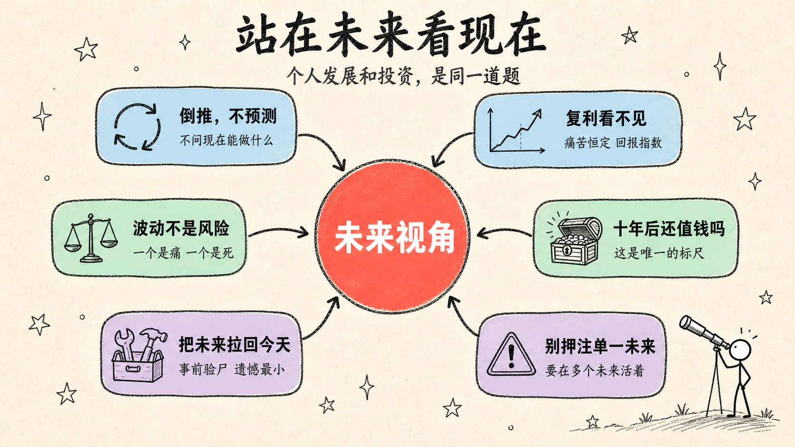
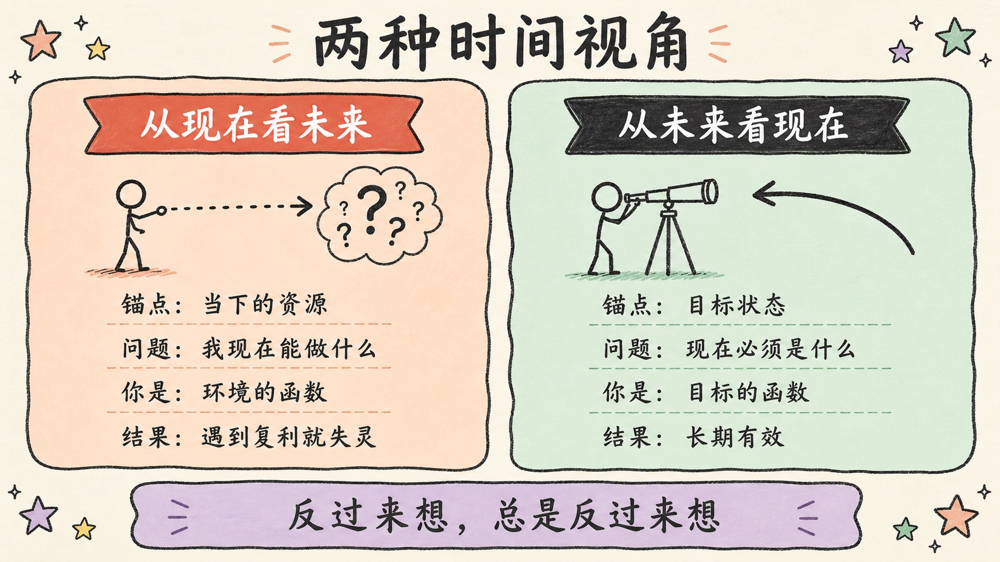
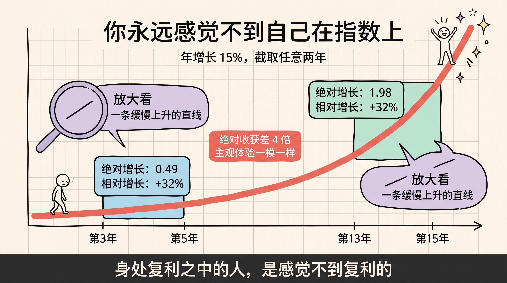
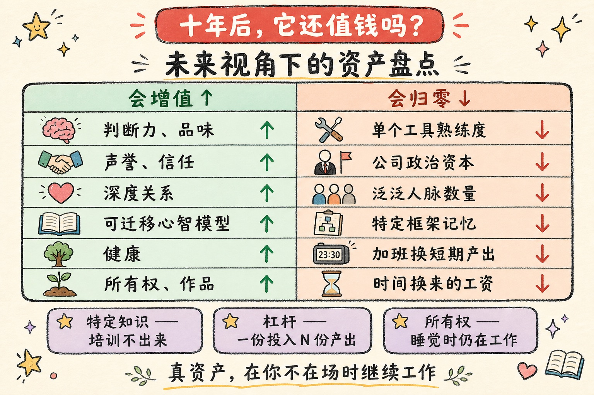
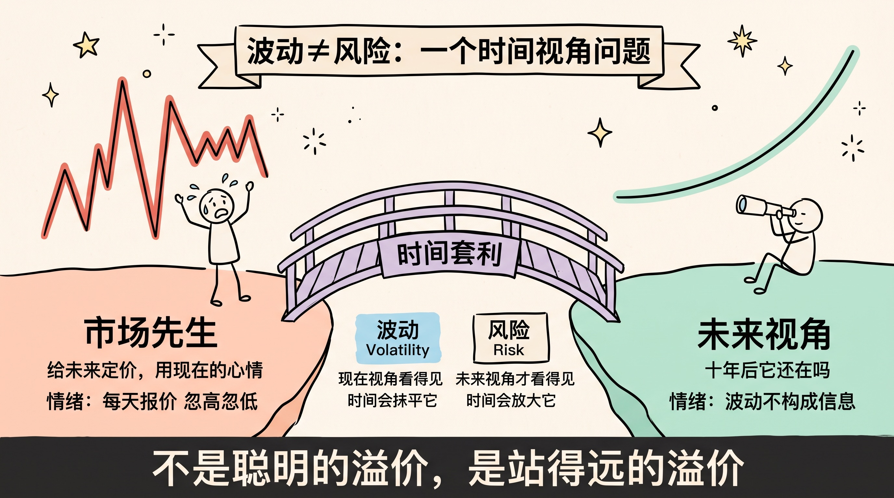
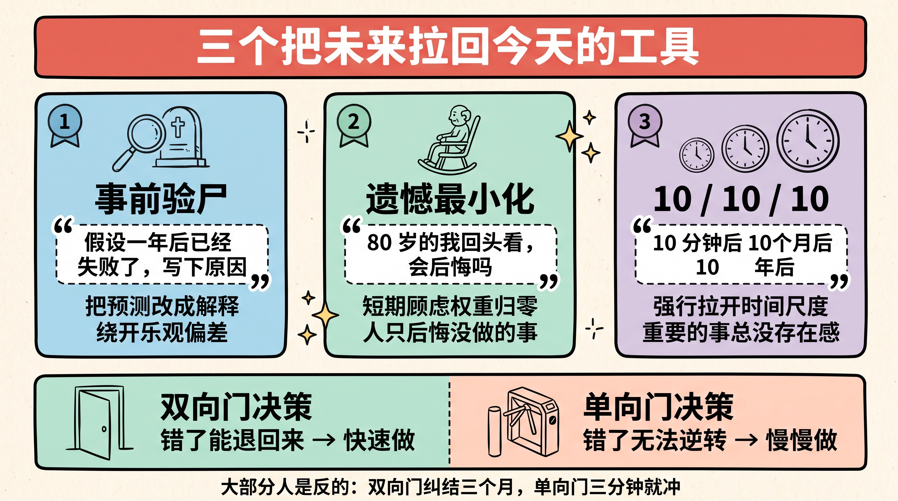

> 我们高估了一年能做成的事，低估了十年能做成的事。
>
> 这句话常被归于比尔·盖茨。但它真正的意思不是「要有耐心」，而是：**你用来看时间的那个坐标系，一开始就装错了。**

---

## 先讲结论

1. **个人发展和投资是同一道题**——都是「跨时间的资本配置」。一个配置的是人力资本，一个配置的是金融资本，但底层的数学完全一样：都由复利主导，都被时间放大，都在早期看不出差别。
2. **人类默认的时间视角，恰好是这道题的最差解**。我们习惯「从现在看未来」——以当下为锚点向外推。这套模式对线性世界有效，对复利世界系统性失效。
3. **「站在未来看现在」不是励志口号，而是一次坐标变换**。它把「我现在有什么，能做什么」换成「要到那里，现在必须是什么」。但它也有三个致命陷阱——不避开，它就退化成空想。



---

## 一、两种时间视角：预测，还是倒推

绝大多数人做决定时，用的是同一个动作：**站在现在，向未来外推**。

我现在会 Python，那三年后我大概是个更熟练的 Python 工程师；我现在月薪两万，那五年后大概三万；我现在有十万块，那按理财收益算，十年后大概二十万。

这个动作太自然了，自然到我们从来没意识到它是一个「选择」。它有一个专业名字：**预测（forecast）**——以现状为初始条件，让时间往前跑。

还有另一个动作，方向完全相反：**站在未来的某个点，回头看现在**。

十年后我想成为一个能独立判断技术方向的人——那么现在的我，必须开始做什么、停止做什么？这个动作叫**倒推（backcasting）**。亚马逊把它做成了制度：任何新项目动工前，先写一份产品发布后的新闻稿和 FAQ——**先把未来写出来，再倒推现在该造什么**。这就是著名的 Working Backwards。

这两个动作看起来只是顺序不同，实际上差别是根本性的：

| 维度 | 从现在看未来（预测） | 从未来看现在（倒推） |
|------|---------------------|---------------------|
| 锚点 | 当下的资源、身份、情绪 | 目标状态 |
| 核心问题 | 「我现在能做什么？」 | 「要到那里，现在必须是什么？」 |
| 现在的角色 | 起点，一切的约束条件 | 路径上的一个点，可被改写 |
| 你是谁的函数 | **环境的函数** | **目标的函数** |
| 擅长的世界 | 线性、短期、可外推 | 复利、长期、非线性 |
| 失败模式 | 被当下绑架，永远差一点 | 空想未来，不落地 |

最关键的是倒数第二行。**从现在看未来，你是环境的函数**——你的上限由你此刻的处境决定，环境变差你就变差。**从未来看现在，你是目标的函数**——现在的处境只是一个待解决的差距，不是判决书。

芒格把这个动作总结成一句话：**反过来想，总是反过来想。**（这话其实来自数学家雅可比，芒格把它用成了思维习惯。）他的用法很朴素：想知道怎么幸福？先研究怎么把日子过得一团糟，然后避开。想知道怎么投资成功？先搞清楚人们是怎么亏光的。

> 正着想，你在无穷多种可能里找一条路。反着想，你在有限的死法里划掉几条。后者的信息密度高得多。



---

## 二、复利的形状，决定了你必须站在未来

上一节说「预测对复利世界失效」。这一节讲为什么——这可能是整篇文章里最反直觉的部分。

### 你永远感觉不到自己在指数上

先做一个计算。假设你以每年 15% 的速度成长（无论是能力还是资产）：

```python
# 起点 = 1，年增长 15%
第 3 年:  1.15 ** 3  = 1.52
第 5 年:  1.15 ** 5  = 2.01     # 这两年，绝对增长 0.49

第 13 年: 1.15 ** 13 = 6.15
第 15 年: 1.15 ** 15 = 8.14     # 这两年，绝对增长 1.98
```

同样是两年，第 13→15 年的绝对收获，是第 3→5 年的 **4 倍**。

但现在看关键的地方——**这两段的相对增长，一模一样**：

```
2.01 / 1.52 = 1.32   →  +32%
8.14 / 6.15 = 1.32   →  +32%
```

都是 `1.15² = 1.32`。分毫不差。

这意味着什么？**你的主观体验，在复利的任何位置上都是相同的。**

因为你衡量进步的参照系，永远是「当下的自己」——而当下的自己，已经吃掉了此前所有的积累。所以无论你在曲线的哪一段，回头看最近两年，感觉都是「大概进步了三成」。不多不少，永远那么平淡。

这就是**指数函数的自相似性**：把曲线的任何一段放大，它看起来都和别的段一样。你截取最近 N 天，无论你身处曲线的哪个位置，看到的都是一条**近乎笔直、缓慢上升的线**。

> **身处复利之中的人，是感觉不到复利的。**
>
> 你的痛苦恒定，你的回报却在指数级放大。而「从现在看未来」这个视角，只能读到那个恒定的痛苦。

这就是为什么「坚持」如此反直觉：它要求你在**感觉不到回报**的时候，继续做那件正在给你巨大回报的事。而唯一能让你看见那份回报的，是把视角挪到未来去。

### 一个例证：巴菲特的财富形状

据摩根·豪泽尔在《金钱心理学》中的统计：巴菲特 845 亿美元的净资产里，有 842 亿是在他 50 岁之后获得的；其中 815 亿是在他 65 岁之后。

也就是说——**他一生 99% 以上的财富，来自后 1/3 的人生。**

关键在于：巴菲特 50 岁后并没有突然变聪明。他的年化收益率在后半程甚至不如早期。变的不是他，是**曲线的形状**。他真正做对的事只有一件：**他从 10 岁就开始，并且没有中断。**

豪泽尔的结论很扎心：巴菲特的核心技能不是投资，是**活得久，并且一直在场**。

### 个人发展里的复利资产

同样的形状，在个人发展里同样成立。区别只在于——**大多数人把时间投给了不复利的东西。**

| 复利的（曲线是指数） | 不复利的（曲线是直线，甚至向下） |
|---------------------|------------------------------|
| 判断力、品味 | 单个工具的熟练度 |
| 声誉、信任 | 公司内部的政治资本 |
| 深度关系 | 泛泛的人脉数量 |
| 可迁移的心智模型 | 特定框架的 API 记忆 |
| 健康 | 加班换来的短期产出 |
| 所有权（股权、版权、作品） | 时间换来的工资 |

这张表右边的每一项，都能在**短期**给你即时反馈——这正是它们如此诱人的原因。而左边的每一项，都要熬过一段「看起来毫无回报」的平台期。

从现在看未来，右边永远赢。从未来看现在，右边一项都不剩。



---

## 三、未来视角下的资产盘点：什么在增值，什么在归零

既然复利决定一切，那么最重要的问题就变成了：**你手上的东西，哪些会被时间增值，哪些会被时间清零？**

这里有一个极其简单、但几乎没人认真用过的测试：

> **十年后，这个东西还值钱吗？**

就这一句。但你把它套到自己当前的时间和金钱流向上，结论往往相当难看。

- 花三个月精通一个前端框架 → 十年后，这个框架大概率已经没人用了。**归零。**
- 花三个月搞懂浏览器渲染原理 → 十年后，框架换了五轮，这套原理还在。**增值。**
- 花两年在公司里经营关系、争取一个 title → 换家公司，清零。**归零。**
- 花两年做出一个能拿出手的作品 → 它会替你说话十年。**增值。**

纳瓦尔（Naval Ravikant）把「什么才是真资产」拆成了三个词，我认为是这个话题上最锋利的表述：

| 概念 | 含义 | 未来视角下的判断 |
|------|------|-----------------|
| **特定知识**（Specific Knowledge） | 无法被培训出来、只能靠真实经历长出来的东西 | 不可复制 → 不会被通胀稀释 |
| **杠杆**（Leverage） | 代码、内容、资本——让一份投入产生 N 份产出 | 边际成本为零 → 会被时间放大 |
| **所有权**（Equity） | 拥有产出的一部分，而不是出租时间换工资 | 睡觉时仍在工作 → 可复利 |

三者的共同点是：**它们都在你不在场的时候继续工作。**

而工资的本质是「时间的租金」——你停止出租的那一秒，收入归零。它是这个世界上最不复利的资产形式：**你无法把昨天的八小时，存进今天。**

> 这不是说不该打工。而是说：如果你打工，那份工资的**用途**必须是去购买复利资产（无论是买入股权，还是买回时间用于构建作品）。
>
> **把工资花掉，你就完成了一次「把不复利的东西，换成更不复利的东西」。**



---

## 四、投资：一场针对「现在视角」的套利

现在把这套框架挪到投资上，你会发现一件很有意思的事——**投资的超额收益，本质上就是「未来视角」对「现在视角」的套利。**

### 市场先生，就是「现在视角」的化身

格雷厄姆在《聪明的投资者》里造了一个人物：**市场先生**。他每天来敲你的门，给你报一个价。他心情好时报天价，心情差时报地板价。他从不思考十年后，他只反映此刻的情绪。

市场先生就是「从现在看未来」这个视角的人格化：**被当下主导、情绪化、线性外推、对复利视而不见。**

而这里恰恰是机会所在：**市场先生给未来定价，用的却是现在的心情。** 只要你能站到未来去看，你就能买到他错误定价的东西。

这就是**时间套利**——它不需要你比别人聪明，只需要你比别人**站得远**。

### 波动 ≠ 风险：这是一个时间视角问题

大多数人把「波动」和「风险」当成同义词。霍华德·马克斯在《投资最重要的事》里反复强调，这是根本性的混淆。而我想补一句：**这两者的区别，本质上就是时间视角的区别。**

| | 波动（Volatility） | 风险（Risk） |
|---|-------------------|-------------|
| 是什么 | 价格的上下起伏 | **本金的永久性损失** |
| 谁看得见 | 现在视角 | 未来视角 |
| 感受 | 痛苦、焦虑、想跑 | 迟钝、无感、直到爆掉 |
| 时间的作用 | 时间会抹平它 | 时间会放大它 |
| 典型误判 | 把波动当风险 → 在底部割肉 | 把风险当波动 → 加杠杆硬扛 |

这张表解释了散户亏钱的两种死法，而且**两种死法方向相反**：

- 把**波动**误当成风险 → 每次下跌都是「危险」→ 在最该买的时候卖出。
- 把**风险**误当成波动 → 每次暴雷都是「暂时的」→ 在该跑的时候加仓。

区分它们的唯一办法，就是问一个未来视角的问题：

> **这家公司/这个资产，十年后还在吗？**
>
> 如果答案是「在」，那么眼前的下跌是**波动**——它是噪音，甚至是折扣。
> 如果答案是「不确定」，那么眼前的平静就是**风险**——它正在积累，只是还没结账。

而定投、长期持有这些策略之所以有效，根本不是因为「纪律性强」或者「心态好」。而是因为——**当你已经站在未来了，现在的波动对你根本不构成信息。** 它不是你需要克服的东西，它是你根本不该接收的信号。



---

## 五、三个把未来拉回今天的工具

讲到这里，都还是视角。视角不落到今天的具体动作上，就是幻想。下面是三个我认为真正有效的工具——它们的共同点是：**把「未来」变成一个可以现在就查询的东西。**

### 1. 事前验尸（Pre-mortem）

心理学家 Gary Klein 提出的方法，用法极简单：

> 假设一年后，这件事**已经彻底失败了**。现在，写下它失败的原因。

注意措辞——不是「可能会失败吗」，而是「**已经失败了，为什么**」。

这个微小的改动，效果惊人。因为人脑对「预测风险」很迟钝（乐观偏差会自动过滤掉坏消息），但对「解释既成事实」极其擅长。你把时态从将来时改成完成时，就把一个自我辩护的大脑，变成了一个尽职调查的大脑。

实测下来，你会写出一堆平时打死也想不到的东西。

### 2. 遗憾最小化框架（Regret Minimization）

贝索斯在离开华尔街去创办亚马逊时，用的就是这个：**想象 80 岁的自己回头看这个决定，会后悔吗？**

他的原话大意是：80 岁的我，不会后悔试过却失败了；但一定会后悔从来没试过。

这个框架的威力在于，它自动过滤掉了那些「只在现在视角下才成立」的顾虑：年终奖、面子、别人怎么看、短期收入的波动——这些东西在 80 岁的坐标系里，权重直接归零。

> 补充一个心理学上的实证：人们长期后悔的，几乎全是**没做的事**，而不是做错的事。
>
> 做错的事，大脑会给它编一个故事，然后和解。没做的事，永远停在「本来可以」——那是一个不会关闭的循环。

### 3. 10 / 10 / 10 法则

Suzy Welch 的方法，用来对付日常小决定：这个选择在 **10 分钟后**、**10 个月后**、**10 年后**，分别意味着什么？

它的价值在于**强行拉开时间尺度**。绝大多数让你焦虑的事，在 10 分钟的尺度上是天大的事，在 10 年的尺度上根本不存在。反过来，绝大多数真正重要的事（健康、学习、关系），在 10 分钟的尺度上毫无存在感——**这正是它们总被牺牲掉的原因。**

再叠加一个贝索斯的分类，效果更好：

- **双向门决策**：做错了可以退回来。→ 快速做，别开会，别纠结。
- **单向门决策**：做错了无法逆转（换行业、结婚、卖掉公司、身体透支）。→ **必须用未来视角，慢慢做。**

大部分人的问题恰好是反的：**在双向门前纠结三个月，在单向门前三分钟就冲了。**



---

## 六、未来视角的三个陷阱

到这里都是好话。但如果文章停在这，它就是一碗鸡汤。我必须把「未来视角」最容易翻车的地方讲清楚——**这三个陷阱我全都掉进去过。**

### 陷阱一：用未来逃避现在

最常见的一种。沉浸在「五年后的我」的美好图景里，反复规划、反复调整，就是不动手。

因为想象未来会分泌多巴胺，而做今天的事会消耗意志力。**规划未来是最舒服的一种拖延**——它甚至看起来很上进。

判据很简单：

> 任何未来视角，如果不能倒推出**今天下午就能开始的一个具体动作**，它就不是战略，是幻想。

### 陷阱二：押注一个具体的未来

倒推有个隐含前提：你得知道未来是什么样。可你不知道。没人知道。

这就是「目标倒推」的危险：目标越具体，错得越彻底。2015 年你倒推出「要成为最好的 iOS 工程师」，路径清晰，执行完美——然后行业变了。你把所有筹码押在一个没到来的未来上。

解法是区分两个东西：

| | 具体目标 | 方向 |
|---|---------|------|
| 例子 | 「三年内做到 P8」 | 「持续积累不可替代的判断力」 |
| 依赖外部条件 | 高（组织、行业、运气） | 低 |
| 猜错的代价 | 沉没成本巨大 | 几乎为零 |
| 未来变了怎么办 | 全盘作废 | 照样成立 |

**倒推方向，别倒推坐标。**

### 陷阱三：幸存者偏差——你看到的都是猜对的人

所有「站在未来看现在」的经典案例，都有一个共同点：**他们猜对了。**

猜错的人不写书，不上台演讲，你根本看不见他们。所以「未来视角」这个方法论本身，就是幸存者偏差的重灾区。

这引出我认为整篇文章最重要的一句话：

> **未来视角的正确用法，不是押注一个未来，而是构建一个在多个未来里都不亏的仓位。**

这就是塔勒布的**杠铃策略**：一端极度保守（保证在任何未来里都活着），一端小额押注高不确定性（保证任何未来来了你都在场）。中间那些「看起来稳健的中庸选择」，才是真正的危险区。

落到实处：

- **投资**：大部分放在宽基指数（不预测未来），小部分放在高赔率的机会（不错过未来）。
- **个人发展**：主业保证现金流和生存（活着），业余做高可选性的事——写作、开源、副业（在场）。

**你不需要预测对。你只需要保证：无论哪个未来来了，你都还在牌桌上，并且手里有筹码。**

---

## 总结

1. **个人发展和投资是同一道题**：跨时间的资本配置。人力资本和金融资本遵循同一套复利数学，因此也共享同一个正确视角。
2. **你感觉不到复利，是数学决定的，不是你意志薄弱**。指数曲线的自相似性，让你在任何位置都只能读到「最近进步了三成」。痛苦恒定，回报却在指数放大——所以必须把视角挪到未来，才能看见回报。
3. **只有一个盘点标准：十年后它还值钱吗**。判断力、声誉、作品、健康、所有权在增值；工具熟练度、政治资本、工资在归零。区别在于——**真资产在你不在场时继续工作。**
4. **波动是现在视角的痛苦，风险是未来视角的损失**。分不清这两个，就会在最该买的时候卖出，在该跑的时候加仓。投资的超额收益，从来不是聪明的溢价，是**站得远**的溢价。
5. **别押注一个未来，构建一个在多个未来里都不亏的仓位**。倒推方向，别倒推坐标；保证活着，并且在场。

最后回到开头那句话。我们高估一年、低估十年，不是因为我们不够有耐心。而是因为我们一直站在**现在**这个位置上，去看一条只有从**未来**才看得清形状的曲线。

换个站位，那条线的样子就完全变了。

> **你不会在某个未来的清晨醒来，突然变成另一个人。**
>
> **你只会在今天，成为那个人的第一天。**

---

**参考阅读**：

- 摩根·豪泽尔《金钱心理学》（The Psychology of Money）——复利、活得久、巴菲特财富形状
- 霍华德·马克斯《投资最重要的事》——波动与风险的区分、第二层思维
- 本杰明·格雷厄姆《聪明的投资者》——市场先生
- 纳西姆·塔勒布《反脆弱》——杠铃策略、可选性
- 查理·芒格《穷查理宝典》——逆向思维、多元思维模型
- 纳瓦尔《纳瓦尔宝典》——特定知识、杠杆、所有权
- Gary Klein, *Performing a Project Premortem*, Harvard Business Review (2007)
- 本站相关：[把赚钱当成工程问题](../money-as-engineering-problem/)、[熵增定律](../entropy-law-life-choices/)
